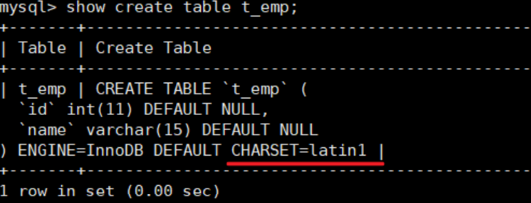
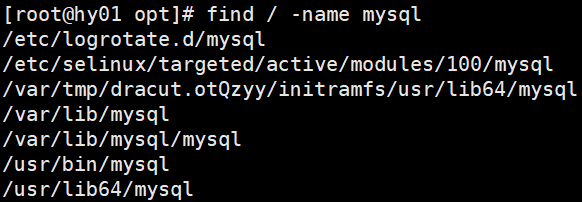

# 一、MySQL 架构篇

## 第 01 章：Linux 下 MySQL 安装与使用


### 1. 安装前说明

#### 1.1 Linux 系统及工具的准备

- 安装并启动好两台虚拟机：==CentOS 7==
  - 掌握克隆虚拟机的操作
    - mac 地址
    - 主机名
    - ip 地址
    - UUID
- 安装有 ==Xshell== 和 ==Xftp== 等访问 CentOS 系统的工具
- CentOS6 和 CentOS7 在 MySQL 的使用中的区别

> 1. 防火墙：6是iptables，7是firewalld 
> 2. 启动服务的命令：6是service，7是systemctl

#### 1.2 查看是否安装过 MySQL

- 如果使用 rpm 安装，检查 RPM PACKAGE:

  `rpm -qa | grep -i mysql # -i 忽略大小写`

  

- 检查 mysql service:

  `systemctl status mysqld.service`

- 如果存在mysql-libs的旧版本包，显示如下:

- 如果不存在mysql-lib的版本，显示如下:

  

#### 1.3 MySQL 的卸载

1. 关闭 MySQL 服务

   `systemctl stop mysqld.service`

2. 查看当前 mysql 安装状况

   `rpm -qa | grep -i mysql`

   或

   `yum list installed | grep mysql`

3. 卸载上述命令查询出的已安装程序

   `yum remove mysql-xxx mysql-xxx mysql-xxx mysql-xxx`

   务必删除干净，反复执行`rpm -qa | grep -i mysql`确认是否有卸载残留

4. 删除 mysql 相关文件

   - 查找相关文件

     `find / -name mysql`

   - 删除上述命令查找出来的相关文件

     `rm -rf xxx`

5. 删除 my.cnf

   `rm -rf /etc/my.cnf`

### 2. MySQL 的 Linux 版安装

#### 2.1 MySQL 的 4 大版本

> - **MySQL Community Server 社区版本**，开源免费，自由下载，但不提供官方技术支持，适用于 大多数普通用户。 
> - **MySQL Enterprise Edition 企业版本**，需付费，不能在线下载，可以试用30天。提供了更多的 功能和更完备的技术支持，更适合于对数据库的功能和可靠性要求较高的企业客户。 
> - **MySQL Cluster 集群版**，开源免费。用于架设集群服务器，可将几个MySQL Server封装成一个 Server。需要在社区版或企业版的基础上使用。 
> - **MySQL Cluster CGE 高级集群版**，需付费。

- 截止目前，官方最新版本为 **8.0.27** 。此前，8.0.0 在 2016.9.12日就发布了。 
- 在此主要使用 **8.0.25** 版本 。同时为了更好的说明 MySQL8.0 新特性，还会安装 **MySQL5.7** 版 本，作为对比。

此外，官方还提供了 **MySQL Workbench** （GUITOOL）一款专为 MySQL 设计的 **ER/数据库建模工具** 。它是著名的数据库设计工具DBDesigner4 的继任者。MySQLWorkbench 又分为两个版本，分别是 **社区版** （MySQL Workbench OSS）、 **商用版** （MySQL WorkbenchSE）。

#### 2.2 下载 MySQL 指定版本

1. 下载地址

   [MySQL](https://www.mysql.com/)

2. 打开官网，点击 DOWNLOADS

   

3. 点击 MySQL Community Server

   

4. 在General Availability(GA) Releases中选择适合的版本

   - 如果安装 Windows 系统下 MySQL ，推荐下载 **MSI安装程序** ；点击 **Go to Download Page** 进行下载即可

     

   - Windows下的MySQL安装有两种安装程序

     - **mysql-installer-web-community-8.0.25.0.msi** 下载程序大小：2.4M；安装时需要联网安装组件。 
     - **mysql-installer-community-8.0.25.0.msi** 下载程序大小：435.7M；安装时离线安装即可。**推荐。**

5. Linux系统下安装MySQL的几种方式

   1.  Linux系统下安装软件的常用三种方式：

      **方式1：rpm 命令**

      使用rpm命令安装扩展名为".rpm"的软件包。

      .rpm 包的一般格式

      

      **方式2：yum 命令**

      需联网，从 **互联网获取** 的 yum 源，直接使用 yum 命令安装。

      **方式3：编译安装源码包**

      针对 **tar.gz** 这样的压缩格式，要用 tar 命令来解压；如果是其它压缩格式，就使用其它命令。

   2. Linux 系统下安装 MySQL，官方给出多种安装方式

      | 安装方式       | 特点                                                 |
      | -------------- | ---------------------------------------------------- |
      | rpm            | 安装简单，灵活性差，无法灵活选择版本、升级           |
      | rpm repository | 安装包极小，版本安装简单灵活，升级方便，需要联网安装 |
      | 通用二进制包   | 安装比较复杂，灵活性高，平台通用性好                 |
      | 源码包         | 安装最复杂，时间长，参数设置灵活，性能好             |

      - 这里不能直接选择CentOS 7系统的版本，所以选择与之对应的 Red Hat Enterprise Linux 

      - https://downloads.mysql.com/archives/community/ 直接点 Download 下载 RPM Bundle 全量包。包括了所有下面的组件。不需要一个一个下载了。

        

6. 下载的 tar 包，用压缩工具打开

   

   - 解压后的 rpm 安装包（红框为抽取出来的安装包）

     

#### 2.3 CentOS7 下检查 MySQL 依赖

1. 检查 /tmp 临时目录权限（必不可少）

   由于mysql安装过程中，会通过mysql用户在/tmp目录下新建tmp_db文件，所以请给 /tmp 较大的权限。执行：

   `chmod -R 777 /tmp`

   

2. 安装前，检查依赖

   `rpm -qa | grep libaio`

   - 如果存在 libaio 包如下：

   

   `rpm -qa | grep net-tools`

   - 如果存在 net-tools 包如下：

   

#### 2.4 CentOS7 下 MySQL 安装过程

1. 将安装程序拷贝到 /opt 目录下

   在 mysql 的安装文件目录下执行：（必须安装顺序执行）

   ```shell
   rpm -ivh mysql-community-common-8.0.25-1.el7.x86_64.rpm
   
   rpm -ivh mysql-community-client-plugins-8.0.25-1.el7.x86_64.rpm
   
   rpm -ivh mysql-community-libs-8.0.25-1.el7.x86_64.rpm
   
   rpm -ivh mysql-community-client-8.0.25-1.el7.x86_64.rpm
   
   rpm -ivh mysql-community-server-8.0.25-1.el7.x86_64.rpm
   ```

   - 注意: 如在检查工作时，没有检查mysql依赖环境在安装mysql-community-server会报错 
   - **rpm** 是 Redhat Package Manage 缩写，通过 RPM 的管理，用户可以把源代码包装成以 rpm 为扩展名的 文件形式，易于安装。 
   - **-i** , --install 安装软件包 
   - **-v** , --verbose 提供更多的详细信息输出 
   - **-h** , --hash 软件包安装的时候列出哈希标记 (和 -v 一起使用效果更好)，展示进度条


2. 安装过程

   **安装过程中可能的报错信息**

   

> 一个命令：`yum remove mysql-libs` 解决，清楚之前安装过的依赖即可

3. 查看 MySQL 版本

   执行如下命令，如果成功表示安装 mysql 成功。类似 java -version 如果打出版本等信息

   ```shell
   mysql --version
   #或
   mysqladmin --version
   ```

   

4. 服务的初始化

   为了保证数据库目录与文件的所有者为 mysql 登录用户，如果你是以 root 身份运行 mysql 服务，需要执行下面的命令初始化：

   `mysqld --initialize --user=mysql`

   说明： --initialize 选项默认以“安全”模式来初始化，则会为 root 用户生成一个密码并将 **该密码标记为过期** ，登录后你需要设置一个新的密码。生成的 **临时密码** 会往日志中记录一份。

   查看密码：

   `cat /var/log/mysqld.log`

   

   root@localhost: 后面就是初始化的密码

5. 启动 MySQL，查看状态

   ```shell
   #加不加.service后缀都可以
   
   启动：systemctl start mysqld.service
   
   关闭：systemctl stop mysqld.service
   
   重启：systemctl restart mysqld.service
   
   查看状态：systemctl status mysqld.service
   ```

   > **mysqld** 这个可执行文件就代表着 **MySQL** 服务器程序，运行这个可执行文件就可以直接启动一个 服务器进程。

​		

查看进程：

`ps -ef | grep -i mysql`


6. 查看 MySQL 服务是否自启动

   `systemctl list-unit-files | grep mysqld.service`

   

   默认是 enabled

   - 如果不是 enabled 可以运行如下命令设置自启动

     `systemctl enable mysqld.service`

   - 如果希望不进行自启动，运行如下设置

     `systemctl disable mysqld.service`

### 3. MySQL 登录

#### 3.1 首次登录

通过 `mysql -uroot -p ` 进行登录，在 Enter password：录入初始化密码


#### 3.2 修改密码

- 因为初始化密码默认是过期的，所以查看数据库会报错

- 修改密码：

  `ALTER USER 'root'@'localhost' IDENTIFIED BY 'new_password';`

  

#### 3.3 设置远程登录

1. 当前问题

   在用 SQLyog 或 Navicat 中配置远程连接 Mysql 数据库时遇到如下报错信息，这是由于Mysql配置了不支持远程连接引起的。

   

   

2. 确认网络

   1. 在远程机器上使用 ping ip地址 **保证网络畅通**

   2. 在远程机器上使用 telnet 命令 **保证端口号开放** 访问

      `telnet ip地址 端口号`

      

      拓展：telnet 命令开启

      

3. 关闭防火墙或开放端口

   **方式一：关闭防火墙**

   - CentOS6：

     `service iptables stop`

   - CentOS7：

     ```shell
     systemctl start firewalld.service
     
     systemctl status firewalld.service
     
     systemctl stop firewalld.service
     
     #设置开机启用防火墙
     systemctl enable firewalld.service
     
     #设置开机禁用防火墙
     systemctl disable firewalld.service
     ```

   **方式二：开放端口**

   - 查看开放的端口号

     ```shell
     firewall-cmd --list-all
     ```

   - 设置开放的端口号

     ```shell
     firewall-cmd --add-service=http --permanent
     
     firewall-cmd --add-port=3306/tcp --permanent
     ```

   - 重启防火墙

     ```shell
     firewall-cmd --reload
     ```

4. Linux 下修改配置

   在 Linux 系统 MySQL 下测试：

   ```mysql
   use mysql;
   
   select Host,User from user;
   ```

   

   可以看到root用户的当前主机配置信息为localhost。

   - **修改 host 为通配符 %**

     Host 列指定了允许用户登录所使用的 IP，比如 user=root Host=192.168.1.1。这里的意思就是说 root 用户只能通过192.168.1.1 的客户端去访问。 user=root Host=localhost，表示只能通过本机客户端去访问。而 **%** 是个 **通配符** ，如果Host=192.168.1.%，那么就表示只要是IP地址前缀为 “192.168.1.” 的客户端都可以连接。如果 **Host=%** ，表示所有IP都有连接权限。 

     注意：在生产环境下不能为了省事将 host 设置为 %，这样做会存在安全问题，具体的设置可以根据生产环境的 IP 进行设置。

     ```sql
     update user set host = '%' where user ='root';
     ```

     Host 设置了 “%” 后便可以允许远程访问。

     

     Host 修改完成后记得执行 flush privileges 使配置立即生效：

     ```mysql
     flush privileges;
     ```

5. 测试

   - 如果是 MySQL5.7 版本，接下来就可以使用SQLyog或者Navicat成功连接至MySQL了。 
   - 如果是 MySQL8 版本，连接时还肯会出现如下问题：

   

   配置新连接报错：错误号码 2058，分析是 mysql 密码加密方法变了。 

   **解决方法**：Linux下 mysql -u root -p 登录你的 mysql 数据库，然后执行这条SQL：

   ```mysql
   ALTER USER 'root'@'%' IDENTIFIED WITH mysql_native_password BY 'abc123';
   ```

   然后在重新配置SQLyog的连接，则可连接成功了，OK。	

### 4. MySQL8 的密码强度评估（了解）

#### 4.1 MySQL 不同版本设置密码（可能出现）

- MySQL5.7 中：成功

  ```mysql
  mysql> alter user 'root' identified by 'abcd1234';
  Query OK, 0 rows affected (0.00 sec)
  ```

- MySQL8.0 中：失败

  ```mysql
  mysql> alter user 'root' identified by 'abcd1234'; # HelloWorld_123
  ERROR 1819 (HY000): Your password does not satisfy the current policy requirements
  ```

#### 4.2 MySQL8 之前的安全策略

在MySQL 8.0之前，MySQL 使用的是 validate_password 插件检测、验证账号密码强度，保障账号的安全性。

**安装/启用插件方式1：在参数文件 my.cnf 中添加参数**

```shell
[mysqld]

plugin-load-add=validate_password.so

\#ON/OFF/FORCE/FORCE_PLUS_PERMANENT: 是否使用该插件(及强制/永久强制使用)

validate-password=FORCE_PLUS_PERMANENT
```

> 说明1： plugin library中的validate_password文件名的后缀名根据平台不同有所差异。 对于Unix和 Unix-like系统而言，它的文件后缀名是.so，对于Windows系统而言，它的文件后缀名是.dll。 
>
> 说明2： 修改参数后必须重启MySQL服务才能生效。 
>
> 说明3： 参数FORCE_PLUS_PERMANENT是为了防止插件在MySQL运行时的时候被卸载。当你卸载插 件时就会报错。如下所示。

```mysql
mysql> SELECT PLUGIN_NAME, PLUGIN_LIBRARY, PLUGIN_STATUS, LOAD_OPTION
-> FROM INFORMATION_SCHEMA.PLUGINS
-> WHERE PLUGIN_NAME = 'validate_password';
+-------------------+----------------------+---------------+----------------------+
| PLUGIN_NAME | PLUGIN_LIBRARY | PLUGIN_STATUS | LOAD_OPTION |
+-------------------+----------------------+---------------+----------------------+
| validate_password | validate_password.so | ACTIVE | FORCE_PLUS_PERMANENT |
+-------------------+----------------------+---------------+----------------------+
1 row in set (0.00 sec)
mysql> UNINSTALL PLUGIN validate_password;
ERROR 1702 (HY000): Plugin 'validate_password' is force_plus_permanent and can not be
unloaded
mysql>
```

**安装/启用插件方式2：运行时命令安装（推荐）**

```mysql
mysql> INSTALL PLUGIN validate_password SONAME 'validate_password.so';
Query OK, 0 rows affected, 1 warning (0.11 sec)
```

此方法也会注册到元数据，也就是mysql.plugin表中，所以不用担心MySQL重启后插件会失效。

#### 4.3 MySQL8 的安全策略

1. validate_password说明

   MySQL 8.0，引入了服务器组件（Components）这个特性，validate_password插件已用服务器组件重新实现。8.0.25版本的数据库中，默认自动安装 validate_password 组件。

   **未安装插件前，执行如下两个指令** ，执行效果：

   ```mysql
   mysql> show variables like 'validate_password%';
   Empty set (0.04 sec)
   
   mysql> SELECT * FROM mysql.component;
   ERROR 1146 (42S02): Table 'mysql.component' doesn't exist
   ```

   **安装插件后，执行如下两个指令** ，执行效果：

   ```mysql
   mysql> SELECT * FROM mysql.component;
   +--------------+--------------------+------------------------------------+
   | component_id | component_group_id | component_urn |
   +--------------+--------------------+------------------------------------+
   | 1 | 1 | file://component_validate_password |
   +--------------+--------------------+------------------------------------+
   1 row in set (0.00 sec)
   mysql> show variables like 'validate_password%';
   +--------------------------------------+--------+
   | Variable_name | Value |
   +--------------------------------------+--------+
   | validate_password.check_user_name | ON |
   | validate_password.dictionary_file | |
   | validate_password.length | 8 |
   | validate_password.mixed_case_count | 1 |
   | validate_password.number_count | 1 |
   | validate_password.policy | MEDIUM |
   | validate_password.special_char_count | 1 |
   +--------------------------------------+--------+
   7 rows in set (0.01 sec)
   ```

   关于 **validate_password** 组件对应的系统变量说明：

   | **选项**                             | **默认值** | **参数描述**                                                 |
   | ------------------------------------ | ---------- | ------------------------------------------------------------ |
   | validate_password_check_user_name    | ON         | 设置为ON的时候表示能将密码设置成当前用户名。                 |
   | validate_password_dictionary_file    |            | 用于检查密码的字典文件的路径名，默认为空                     |
   | **validate_password_length**         | 8          | 密码的最小长度，也就是说密码长度必须大于或等于8              |
   | validate_password_mixed_case_count   | 1          | 如果密码策略是中等或更强的，validate_password要求密码具有的小写和大写字符的最小数量。对于给定的这个值密码必须有那么多小写字符和那么多大写字符。 |
   | validate_password_number_count       | 1          | 密码必须包含的数字个数                                       |
   | **validate_password_policy**         | MEDIUM     | 密码强度检验等级，可以使用数值0、1、2 或相应的符号值LOW、MEDIUM、STRONG来 指定。 **0/LOW** ：只检查长度。 **1/MEDIUM** ：检查长度、数字、大小写、特殊字符。 **2/STRONG** ：检查长度、数字、大小写、特殊字符、字典文件。 |
   | validate_password_special_char_count | 1          | 密码必须包含的特殊字符个数                                   |

> 提示： 
>
> 组件和插件的默认值可能有所不同。例如，MySQL 5.7. validate_password_check_user_name的默认 值为OFF。

2. 修改安全策略

   修改密码验证安全强度

   ```mysql
   SET GLOBAL validate_password_policy=LOW;
   
   SET GLOBAL validate_password_policy=MEDIUM;
   
   SET GLOBAL validate_password_policy=STRONG;
   
   SET GLOBAL validate_password_policy=0; # For LOW
   
   SET GLOBAL validate_password_policy=1; # For MEDIUM
   
   SET GLOBAL validate_password_policy=2; # For HIGH
   
   #注意，如果是插件的话,SQL为set global validate_password_policy=LOW
   ```

   此外，还可以修改密码中字符的长度

   ```mysql
   set global validate_password_length=1;
   ```

3. 密码强度测试

   如果你创建密码是遇到“Your password does not satisfy the current policy requirements”，可以通过函数组件去检测密码是否满足条件：0-100。当评估在100时就是说明使用上了最基本的规则：大写+小写+特殊 字符+数字组成的8位以上密码

   ```mysql
   mysql> SELECT VALIDATE_PASSWORD_STRENGTH('medium');
   +--------------------------------------+
   | VALIDATE_PASSWORD_STRENGTH('medium') |
   +--------------------------------------+
   | 25 |
   +--------------------------------------+
   1 row in set (0.00 sec)
   ```

   ```mysql
   mysql> SELECT VALIDATE_PASSWORD_STRENGTH('K354*45jKd5');
   +-------------------------------------------+
   | VALIDATE_PASSWORD_STRENGTH('K354*45jKd5') |
   +-------------------------------------------+
   | 100 |
   +-------------------------------------------+
   1 row in set (0.00 sec)
   ```

   注意：如果没有安装validate_password组件或插件的话，那么这个函数永远都返回0。 关于密码复杂度对应的密码复杂度策略。如下表格所示：

   | Password Test                             | Return Value |
   | ----------------------------------------- | ------------ |
   | Length < 4                                | 0            |
   | Length ≥ 4 and < validate_password.length | 25           |
   | Satisfies policy 1 (LOW)                  | 50           |
   | Satisfies policy 2 (MEDIUM)               | 75           |
   | Satisfies policy 3 (STRONG)               | 100          |

#### 4.4 卸载插件、组件（了解）

**卸载插件**

```mysql
mysql> UNINSTALL PLUGIN validate_password;
Query OK, 0 rows affected, 1 warning (0.01 sec)
```

**卸载组件**

```mysql
mysql> UNINSTALL COMPONENT 'file://component_validate_password';
Query OK, 0 rows affected (0.02 sec)
```

### 5. 字符集的相关操作

#### 5.1 修改 MySQL5.7 字符集

1. 修改步骤

   在 MySQL 8.0版本之前，默认字符集为 **latin1** ，utf8字符集指向的是 **utf8mb3** 。网站开发人员在数据库设计的时候往往会将编码修改为 utf8 字符集。如果遗忘修改默认的编码，就会出现乱码的问题。从MySQL 8.0开始，数据库的默认编码将改为 **utf8mb4** ，从而避免上述乱码的问题。

   **操作1：查看默认使用的字符集**

   ```mysql
   show variables like 'character%';
   
   # 或者
   
   show variables like '%char%';
   ```

   - MySQL8.0 中执行

     

   - MySQL5.7 中执行：

     MySQL 5.7 默认的客户端和服务器都用了 latin1 ，不支持中文，保存中文会报错。MySQL5.7截图如下： 

     

     在MySQL5.7 中添加中文数据时，报错：

     

     因为默认情况下，创建表使用的是 **latin1** 。如下：

     

   **操作2：修改字符集**

   ```shell
   vim /etc/my.cnf
   ```

   在MySQL5.7 或之前的版本中，在文件最后加上中文字符集配置：

   ```shell
   character_set_server=utf8
   ```

   

   **操作3：重新启动 MySQL 服务**

   ```shell
   systemctl restart mysqld
   ```

   > 但是原库、原表的设定不会发生变化，参数修改只对新建的数据库生效。

2. 已有库&表字符集的变更

   MySQL5.7版本中，以前创建的库，创建的表字符集还是latin1。

   

   修改已创建数据库的字符集

   ```mysql
   alter database dbtest1 character set 'utf8';
   ```

   修改已创建数据表的字符集

   ```mysql
   alter table t_emp convert to character set 'utf8';
   ```

   

   > 注意：但是原有的数据如果是用非'utf8'编码的话，数据本身编码不会发生改变。已有数据需要导 出或删除，然后重新插入。

#### 5.2 各级别的字符集

MySQL有4个级别的字符集和比较规则，分别是：

- 服务器级别
- 数据库级别
- 表级别
- 列级别

执行如下 SQL 语句：

```mysql
show variables like 'character%';
```


- character_set_server：服务器级别的字符集 
- character_set_database：当前数据库的字符集 
- character_set_client：服务器解码请求时使用的字符集 
- character_set_connection：服务器处理请求时会把请求字符串从 character_set_client 转为 character_set_connection 
- character_set_results：服务器向客户端返回数据时使用的字符集

1. 服务器级别

   - **character_set_server**：服务器级别的字符集

   我们可以在启动服务器程序时通过启动选项或者在服务器程序运行过程中使用 **SET** 语句修改这两个变量的值。比如我们可以在配置文件中这样写：

   ```mysql
   [server]
   character_set_server=gbk # 默认字符串
   collation_server=gbk_chinese_ci # 对应的默认的比较规则
   ```

   当服务器启动的时候读取这个配置文件后这两个系统变量的值便修改了。

2. 数据库级别

   - **character_set_database**：当前数据库的字符集

   我们在创建和修改数据库的时候可以指定该数据库的字符集和比较规则，具体语法如下：

   ```mysql
   CREATE DATABASE 数据库名
   	[[DEFAULT] CHARACTER SET 字符集名称]
   	[[DEFAULT] COLLATE 比较规则名称];
   	
   ALTER DATABASE 数据库名
   	[[DEFAULT] CHARACTER SET 字符集名称]
   	[[DEFAULT] COLLATE 比较规则名称];
   ```

   其中的 **DEFAULT** 可以省略，并不影响语义。比如：

   ```mysql
   mysql> CREATE DATABASE charset_demo_db
       -> CHARACTER SET gb2312
       -> COLLATE gb2312_chinese_ci;
   Query OK, 1 row affected (0.01 sec)
   ```

   数据库的创建语句中也可以不指定字符集和比较规则，比如这样：

   ```mysql
   CREATE DATABASE 数据库名;
   ```

   **这样的话将使用服务器级别的字符集和比较规则作为数据库的字符集和比较规则。**

3. 表级别

   我们也可以在创建和修改表的时候指定表的字符集和比较规则，语法如下：

   ```mysql
   CREATE TABLE 表名 (列的信息)
   	[[DEFAULT] CHARACTER SET 字符集名称]
   	[COLLATE 比较规则名称];
   	
   ALTER TABLE 表名
   	[[DEFAULT] CHARACTER SET 字符集名称]
   	[COLLATE 比较规则名称];
   ```

   比如说我们在刚刚创建的 **charset_demo_db** 数据库中创建一个名为 **t** 的表，并指定这个表的字符集和比较规则：

   ```mysql
   mysql> CREATE TABLE t(
       -> col VARCHAR(10))
       -> CHARACTER SET utf8
       -> COLLATE utf8_general_ci;
   Query OK, 0 rows affected, 2 warnings (0.02 sec)
   ```

   **如果创建和修改表的语句中没有指明字符集和比较规则，将使用该表所在数据库的字符集和比较规则作为该表的字符集和比较规则。**

4. 列级别

   对于存储字符串的列，同一个表中的不同的列也可以有不同的字符集和比较规则。我们在创建和修改列定义的时候可以指定该列的字符集和比较规则，语法如下：

   ```mysql
   CREATE TABLE 表名(
   	列名 字符串类型 [CHARACTER SET 字符集名称] [COLLATE	比较规则名称],
   	其他列...
   );
   
   ALTER TABLE 表名 MODIFY 列名 字符串类型 [CHARACTER SET 字符集名称] [COLLATE 比较规则名称];
   ```

   **对于某个列来说，如果在创建和修改的语句中没有指明字符集和比较规则，将使用该列所在表的字符集和比较规则作为改列的字符集和比较规则。**

   > 提示：
   >
   > 在转换列的字符集时需要注意，如果转换前列中存储的数据不能用转换后的字符集进行表示会发生错误。比如说原先列使用的字符集是 utf8 ，列中存储了一些汉字，现在把列的字符集转换成 ASCII 的话就会出错，因为 ASCII 字符集并不能表示汉字字符。

5. 小结

   我们介绍的这 4 个级别字符集和比较规则的联系如下：

   - 如果 **创建或修改列** 时没有显式的指定字符集和比较规则，则该列 **默认用表的** 字符集和比较规则
   - 如果 **创建表** 时没有显示的指定字符集和比较规则，则该表 **默认用数据库的** 字符集和比较规则
   - 如果 **创建数据库** 时没有显示的指定字符集和比较规则，则该表 **默认用服务器的** 字符集和比较规则

   知道了这些规则之后，对于给定的表，我们应该知道它的各个列的字符集和比较规则是什么，从而根据这个列的类型来确定存储数据时每个列的实际数据占用的存储空间太小了，比如说我们向表 **t** 中插入一条记录：

   ```MYSQL
   mysql> INSERT INTO t(col) VALUES("我们");
   Query OK, 1 row affected (0.00 sec)
   
   mysql> SELECT * FROM t;
   +--------+
   | col    |
   +--------+
   | 我们   |
   +--------+
   1 row in set (0.00 sec)
   ```

   首先列 **col** 使用的字符集是 **gbk**，一个字符 **'我'** 在 **gbk** 中的编码为 **0xCED2**，占用两个字节，两个字节的实际数据就占用 4 个字节。如果把改列的字符集修改为 **utf8** 的话，这两个字符就实际占用 6 个字节。

#### 5.3 字符集与比较规则（了解）

1. utf8 与 utf8mb4

   **utf8** 字符集表示一个字符需要使用 1~4 个字节，但是我们常用的一些字符使用 1~3 个字节就可以表示了。而字符集表示一个字符所用的最大字节长度，在某些方面会影响系统的存储和性能，所有设计 MySQL 的设计者偷偷的定义了两个概念：

   - **utf8mb3**：阉割过的 **utf8** 字符集，只使用 1~3 个字节表示字符。
   - **utf8mb4**：正宗的 **utf8** 字符集，使用 1~4 个字节表示字符。

   在 MySQL 中 **utf8** 是 **utf8mb3** 的别名，所以之后在 MySQL 中提到 **utf8** 就意味着使用 1~3 个字节来表示一个字符。如果大家有使用 4 字节编码的一个字符的情况，比如存储一些 **emoji表情**，那请使用 **utf8mb4**。

   此外，通过如下指令可以查看 MySQL 支持的字符集：

   ```mysql
   SHOW CHARSET;
   #或者
   SHOW CHARACTER SET;
   ```

   

2. 比较规则

   上表中，MySQL 版本一共支持 41 种字符集，其中 **Default collation** 列表示这种字符集是一种默认的比较规则，里面包含着该比较规则主要作用于哪种语言，比如 **utf8_polish_ci** 表示以波兰语的规则比较，**utf8_spanish_ci** 是以西班牙语的规则比较，**utf8_general_ci** 是一种通用的比较规则。

   后缀表示该比较规则是否区分语言中的重音、大小写。具体如下：

   | 后缀 | 英语释义           | 描述             |
   | ---- | ------------------ | ---------------- |
   | _ai  | accent insensitive | 不分区重音       |
   | _as  | accent sensitive   | 区分重音         |
   | _ci  | case insensitive   | 不区分大小写     |
   | _cs  | case sensitive     | 区分大小写       |
   | _bin | binary             | 以二进制方式比较 |

   最后一列 **Maxlen** ，它表示该种字符集表示一个字符最多需要几个字节。

   这里把常见的字符集和对应的 Maxlen 显式如下：

   | 字符集名称 | Maxlen |
   | ---------- | ------ |
   | ascii      | 1      |
   | latin1     | 1      |
   | gb2312     | 2      |
   | gbk        | 2      |
   | utf8       | 3      |
   | utf8mb4    | 4      |

   **常用操作1：**

   ```mysql
   #查看GBK字符集的比较规则
   SHOW COLLATION LIKE 'gbk%';
   	
   #查看UTF-8字符集的比较规则
   SHOW COLLATION LIKE 'utf8';
   ```

   **常用操作2：**

   ```mysql
   #查看服务器的字符集和比较规则
   SHOW VARIABLES LIKE '%_server';
   
   #查看数据库的字符集和比较规则
   SHOW VARIABLES LIKE '%_database';
   
   #查看具体数据库的字符集
   SHOW CREATE DATABASE dbtest1;
   
   #修改具体数据库的字符集
   ALTER DATABASE dbtest1 DEFAULT CHARACTER SET 'utf8' COLLATE 'utf8_general_ci';
   ```

   说明1：

   > utf8_unicode_ci 和 utf8_general_ci 对中、英文来说没有实质的差别。
   >
   > utf8_general_ci 校对速度快，但准确率稍差。
   >
   > utf8_unicode_ci 准确率高，但校对速度稍慢。
   >
   > 一般情况，用 utf_general_ci 就够了，但如果你的应用有德语、法语或者俄语，请一定使用 utf8_unicode_ci。

   说明2：

   >修改了数据库额度默认字符集和比较规则后，原来已经创建的表格的字符集和比较规则并不会改变，如果需要，那么需单独修改。

   **常用操作3：**

   ```mysql
   #查看表的字符集
   SHOW CREATE TABLE employee;
   
   #查看表的比较规则
   SHOW TABLE STATUS FROM dbtest1 LIKE 'employee';
   
   #修改表的字符集和比较规则
   ALTER TABLE emp1 DEFAULT CHARACTER SET 'utf8' COLLATE 'utf8_general_ci';
   ```

#### 5.4 请求到响应过程中字符集的变化

| 系统变量                 | 描述                                                         |
| ------------------------ | ------------------------------------------------------------ |
| character_set_client     | 服务器解码请求时使用的字符集                                 |
| character_set_connection | 服务器处理请求时会把请求字符串从 character_set_client 转为 character_set_connection |
| character_set_results    | 服务器向客户端返回数据时使用的字符集                         |

这几个系统变量在我的计算机上的默认值如下（不同操作系统的默认值可能不同）：


为了体现出字符集在请求处理过程中的变化，我们这里特意修改一个系统变量的值：

```mysql
mysql> SET character_set_connection = gbk;
Query OK, 0 rows affected (0.00 sec)
```

现在假设我们客户端发送的请求是下边这个字符串：

```mysql
SELECT * FROM t WHERE s = '我';
```

为了方便理解这个过程，只分析字符 **'我'** 在这个过程中字符集的转换。

现在看一下在请求从发送到结果返回过程中字符集的变化：

1. 客户端发送请求所使用的字符集

   一般情况下客户端所使用的字符集和当前操作系统一致，不同操作系统使用的字符集可能不一样，如下：

   - 类 **Unix** 系统使用的是 **utf8**
   - **Windows** 使用的是 **gbk**

   当客户端使用的是 **utf8** 字符集，字符 **’我‘** 在发送给服务器的请求中的字节形式就是： **0xE68891**

   > 提示
   >
   > 如果你使用的是可视化工具，比如 Navicat 之类的，这些工具可能会使用自定义的字符集来编码发送到服务器的字符串，而不是采用操作系统默认的字符集（所以在学习的时候还是尽量用命令行窗口）。

2. 服务器接收到客户端发来的请求其实就是一串二进制的字节，它会认为这串字节采用的字符集是 **character_set_client**，然后把这串字节转换为 **character_set_connection** 字符集编码的字符。

   由于我的计算机上 **character_set_client** 的值是 **utf8**，首先会按照 **utf8** 字符集对字节串 **0xE688991** 进行解码，得到的字符串就是 **'我'**，然后按照 **character_set_connection** 代表的字符集，也就是 **gbk** 进行编码，得到的结果就是字节串 **0xCED2**。

3. 因为表 **t** 的列 **col** 采用的是 **gbk** 字符集，与 **character_set_connection** 一致，所以直接到列中找字节值为 **0xCED2** 的记录，最后找到了一条记录。

   > 提示
   >
   > 如果某个列使用的字符集和 character_set_connection 代表的字符集不一致的话，还需要进行一次字符集转换。

4. 上一步骤找到的记录中的 **col** 列其实是一个字节串 **0xCED2**，**col** 列采用 **gbk** 进行编码的，所以首先会将这个字节串进行 **gbk** 编码，得到字符串 **'我'**，然后再把这个字符串使用 **character_set_results** 代表的字符集，也就是 **utf8** 进行编码，得到了新的字符串： **0xE68891**，然后发送给客户端。

5. 由于客户端用的字符集是 **utf8**，所以可以顺利的将 **0xE68891** 解释成字符 **'我'**，从而显示到我们的显示器上，所以我们人类也读懂了返回的结果。

总结图示如下：


从这个分析中我们可以得到这么几点需要注意的地方：

- 服务器认为客户端发送过来的请求是用 **character_set_client** 编码的。

  假设你的客户端采用的字符集和 **character_set_client** 不一样的话，就会出现识别不准确的情况。比如我的客户端使用的是 **utf8** 字符集，如果把系统变量 **character_set_client** 的值设置为 **ascii** 的话，服务器可能无法理解我们发送的请求，更别谈处理这个请求了。

- 服务器将得到的结果集使用 **character_set_results** 编码后发送给客户端。

  假设你的客户端采用的字符集和 **character_set_results** 不一样的话，这就可能会出现客户单无法解码结果集的情况，如果就是在你的屏幕上出现乱码。比如我的客户端使用的是 **utf8** 字符集，如果把系统变量 **character_set_results** 的值设置为 **ascii** 的话，可能会出现乱码。

-  **character_set_connection** 只是服务器在将请求的字符串从 **character_set_client** 转换为 **character_set_connection** 时使用，一定要注意，该字符集包含的字符范围一定涵盖请求中的字符，要不然会导致有的字符无法使用 **character_set_connection** 代表的字符集进行编码。

**经验：**

开发者通常把 **character_set_client、character_set_connection、character_set_results** 这三个系统变量设置成和客户端使用的字符集一致的情况，这样减少了很多无谓的字符集转换。为了方便我们设置，MySQL 提供了一条非常简便的语句：

```mysql
SET NAMES 字符集名;
```

 这一条语句产生的效果和我们执行这 3 条的效果是一样的：

```mysql
SET character_set_client = 字符集名;
SET character_set_connection = 字符集名;
SET character_set_results = 字符集名;
```

比如说我的客户端使用的是 **utf8** 字符集，所以需要把这几个系统变量的值都设置为 **utf8**：

```mysql
mysql> SET NAMES utf8;
Query OK, 0 rows affected (0.00 sec)
```

另外，如果你想在启动客户端的时候就把 **character_set_client、character_set_connection、character_set_results** 这三个系统变量的值设置成一样的，那我们可以在启动客户端的时候指定一个叫 **default-character-set** 的启动选项，比如在配置文件里可以这样写：

```mysql
[client]
default-character-set=utf8
```

它起到的效果和执行一遍 **SET NAMES utf8** 是一样的，都会将三个系统变量的值设置为 **utf8**。

### 6. SQL 大小写规范

#### 6.1 Windows 和 Linux 平台区别

在 SQL 中，关键字和函数名是不用区分字母大小写的，比如 SELECT、WHERE、ORDER、GROUP BY 等关键字，以及 ABS、MOD、ROUND、MAX 等函数名。 

不过在 SQL 中，你还是要确定大小写的规范，因为在 Linux 和 Windows 环境下，你可能会遇到不同的大小写问题。 **windows系统默认大小写不敏感** ，但是 **linux系统是大小写敏感的** 。

通过如下命令查看：

```mysql
SHOW VARIABLES LIKE '%lower_case_table_names%'
```

- 在 Windows 系统下：

  

- 在 Linux 系统下：

  

- lower_case_table_names 参数值的设置：

  - **默认为0，大小写敏感 。** 
  - 设置1，大小写不敏感。创建的表，数据库都是以小写形式存放在磁盘上，对于 sql 语句都是转换为小写对表和数据库进行查找。 
  - 设置2，创建的表和数据库依据语句上格式存放，凡是查找都是转换为小写进行。

- 两个平台上SQL大小写的区别具体来说：

> MySQL 在 Linux 下数据库名、表名、列名、别名大小写规则是这样的： 
>
> 1、**数据库名**、**表名**、**表的别名**、**变量名**是严格区分大小写的； 
>
> 2、关键字、函数名称在 SQL 中不区分大小写； (select、from)
>
> 3、列名（或字段名）与列的别名（或字段别名）在所有的情况下均是忽略大小写的；
>
>  
>
> **MySQL在Windows的环境下全部不区分大小写**

#### 6.2 Linux 下大小写规则设置

当想设置为大小写不敏感时，要在 **my.cnf** 这个配置文件 [mysqld] 中加入 **lower_case_table_names=1** ，然后重启服务器。

- 但是要在重启数据库实例之前就需要将原来的数据库和表转换为小写，否则将找不到数据库名。

- 此参数适用于MySQL5.7。在MySQL 8下禁止在重新启动 MySQL 服务时将 **lower_case_table_names** 设置成不同于初始化 MySQL 服务时设置的 **lower_case_table_names** 值。如果非要将MySQL8设置为大小写不敏感，具体步骤为：

  ```
  1、停止MySQL服务
  2、删除数据目录，即删除 /var/lib/mysql 目录
  3、在MySQL配置文件（ /etc/my.cnf ）中添加 lower_case_table_names=1
  4、启动MySQL服务
  ```

#### 6.3 SQL 编写建议

如果你的变量名命名规范没有统一，就可能产生错误。这里有一个有关命名规范的建议：

> 1. 关键字和函数名称全部大写； 
> 2. 数据库名、表名、表别名、字段名、字段别名等全部小写； 
> 3. SQL 语句必须以分号结尾。

数据库名、表名和字段名在 Linux MySQL 环境下是区分大小写的，因此建议你统一这些字段的命名规则，比如全部采用小写的方式。 

虽然关键字和函数名称在 SQL 中不区分大小写，也就是如果小写的话同样可以执行。但是同时将关键词和函数名称全部大写，以便于区分数据库名、表名、字段名。

### 7. sql_mode 的合理设置

#### 7.1 介绍

sql_mode 会影响 MySQL 支持的 SQL 语法以及它执行的 **数据验证检查**。通过设置 sql_mode，可以完成不同严格程度的数据校验，有效的保障数据准确性。

MySQL 服务器可以在不同的 SQL 模式下运行，并且可以针对不同的客户端以不同的方式应用这些模式，具体取决于 sql_mode 系统变量的值。

MySQL5.6 和 MySQL5.7 默认的 sql_mode 模式参数是不一样的：

- 5.6 的 mode 默认值为空（即：**NO_ENGLISH_SUBSTITUTION**），其实表示的是一个空值，相当于没有什么模式设置，可以理解为 **宽松模式** 。在这种设置下是允许一些非法操作的，比如允许一些非法数据的插入。
- 5.7 的 mode 是 **STRICT_TRANS_TABLES**，也就是 **严格模式**。用于进行数据的严格校验，错误数据不能插入，报 error（错误），并且事务回滚。

#### 7.2 宽松模式 vs 严格模式

**宽松模式：**

如果设置的是宽松模式，那么我们在插入数据的时候，即便是给了一个错误的数据，也可能会被接受， 并且不报错。 

**举例** ：我在创建一个表时，该表中有一个字段为name，给name设置的字段类型时 **char(10)** ，如果我在插入数据的时候，其中 name 这个字段对应的有一条数据的 **长度超过了10** ，例如 '1234567890abc'，超过了设定的字段长度 10，那么不会报错，并且取前 10 个字符存上，也就是说你这个数据被存为 了 '1234567890'，而 'abc' 就没有了。但是，我们给的这条数据是错误的，因为超过了字段长度，但是并没有报错，并且mysql自行处理并接受了，这就是宽松模式的效果。 

应用场景 ：通过设置 sql mode 为宽松模式，来保证大多数 sql 符合标准的 sql 语法，这样应用在不同数据库之间进行 **迁移** 时，则不需要对业务 sql 进行较大的修改。

**严格模式：**

出现上面宽松模式的错误，应该报错才对，所以 MySQL5.7 版本就将 sql_mode 默认值改为了严格模式。所以在 **生产等环境** 中，我们必须采用的是严格模式，进而 **开发、测试环境** 的数据库也必须要设置，这样在开发测试阶段就可以发现问题。并且我们即便是用的MySQL5.6，也应该自行将其改为严格模式。 

**开发经验** ：MySQL 等数据库总想把关于数据的所有操作都自己包揽下来，包括数据的校验，其实开发中，我们应该在自己 **开发的项目程序级别将这些校验给做了** ，虽然写项目的时候麻烦了一些步骤，但是这样做之后，我们在进行数据库迁移或者在项目的迁移时，就会方便很多。 

改为严格模式后可能会存在的问题： 

若设置模式中包含了 **NO_ZERO_DATE** ，那么 MySQL 数据库不允许插入零日期，插入零日期会抛出错误而不是警告。例如，表中含字段TIMESTAMP 列（如果未声明为 NULL 或显示 DEFAULT 子句）将自动分配 DEFAULT '0000-00-00 00:00:00'（零时间戳），这显然是不满足 sql_mode 中的 NO_ZERO_DATE 而报错。

#### 7.3 模式查看和设置

- 查看当前的 sql_mode

```mysql
select @@session.sql_mode

select @@global.sql_mode

#或者

show variables like 'sql_mode';
```


- 临时设置方式：设置当前窗口中设置 sql_mode

```mysql
SET GLOBAL sql_mode = 'modes...'; #全局

SET SESSION sql_mode = 'modes...'; #当前会话
```

举例：

```mysql
#改为严格模式。此方法只在当前会话中生效，关闭当前会话就不生效了。
set SESSION sql_mode='STRICT_TRANS_TABLES';
```

```sql
#改为严格模式。此方法在当前服务中生效，重启MySQL服务后失效。
set GLOBAL sql_mode='STRICT_TRANS_TABLES';
```

- 永久设置方式：在 /etc/my.cnf 中配置 sql_mode

在my.cnf文件(windows系统是my.ini文件)，新增：

```properties
[mysqld]
sql_mode=ONLY_FULL_GROUP_BY,STRICT_TRANS_TABLES,NO_ZERO_IN_DATE,NO_ZERO_DATE,ERROR_FOR_DIVISION_BY_ZERO,NO_ENGINE_SUBSTITUTION
```

然后 **重启MySQL** 。 

当然生产环境上是禁止重启 MySQL 服务的，所以采用 **临时设置方式 + 永久设置方式** 来解决线上的问题， 那么即便是有一天真的重启了MySQL服务，也会永久生效了。

## 第 02 章：MySQL 的数据目录

### 1. MySQL8 的主要目录结构

```shell
[root@hy01 opt]# find / -name mysql
```

安装好 MySQL 8 之后，我们查看如下的目录结构：



#### 1.1 数据库文件的存放路径

**MySQL 数据库的存放路径：/var/lib/mysql**

MySQL 服务器程序在启动时会到文件系统的某个目录下加载一些文件，之后在运行过程中产生的数据也都会存储到这个目录下的某些文件，这个目录就是 **数据目录**。

MySQL 把数据都存到哪个路径下呢？其实 **数据目录** 对应着一个系统变量 **datadir**，我们在使用客户端与服务器建立连接之后查看这个系统变量的值就可以了：


从结果中可以看出，在我的计算机上MySQL的数据目录就是 **/var/lib/mysql/** 。

#### 1.2 相关命令目录

**相关命令目录：/usr/bin（mysqladmin、mysqlbinlog、mysqldump等命令）和/usr/sbin。**


**安装目录** 下非常重要的 **bin** 目录，它里面存储了许多关于客户端程序和服务器程序的命令（许多可执行文件，比如 **mysql**、**mysqld**、**mysql_safe**等）。而 **数据目录** 是用来存储 MySQL 在运行过程中产生的数据，注意区分开二者。

#### 1.3 配置文件目录

**配置文件目录：/usr/share/mysql-8.0（命令及配置文件），/etc/mysql（如my.cnf）**


### 2. 数据库和文件系统的关系

向 **InnoDB、MyISAM** 这样的存储引擎都是把表存储在磁盘上的，操作系统用来管理磁盘的结构被称为 **文件系统**，所以用专业一点的话来表述就是：像 **InnoDB、MyISAM** 这样的存储引擎都是把 **表存储在文件系统上** 的。当我们想读取数据的时候，这些存储引擎会从文件系统中把数据读出来返回给我们，当我们想写入数据的时候，这些存储引擎会把这些数据又写回文件系统。

#### 2.1 查看默认数据库

查看一下在我的计算机上当前有哪些数据库：

```mysql
mysql> SHOW DATABASES;
```

可以看到有4个数据库是属于 MySQL 自带的系统数据库。


- **mysql** 

  MySQL 系统自带的核心数据库，它存储了 MySQL 的用户账户和权限信息，一些存储过程、事件的定义信息，一些运行过程中产生的日志信息，一些帮助信息以及时区信息等。 

- **information_schema** 

  MySQL 系统自带的数据库，这个数据库保存着 MySQL 服务器 **维护的所有其他数据库的信息** ，比如有哪些表、哪些视图、哪些触发器、哪些列、哪些索引。这些信息并不是真实的用户数据，而是一些描述性信息，有时候也称之为 **元数据** 。在系统数据库 **information_schema** 中提供了一些以 **innodb_sys** 开头的表，用于表示内部系统表。

- **performance_schema** 

  MySQL 系统自带的数据库，这个数据库里主要保存 MySQL 服务器运行过程中的一些状态信息，可以用来 **监控 MySQL 服务的各类性能指标** 。包括统计最近执行了哪些语句，在执行过程的每个阶段都花费了多长时间，内存的使用情况等信息。

- **sys**

  MySQL 系统自带的数据库，这个数据库主要是通过 **视图** 的形式把 **information_schema** 和 **performance_schema** 结合起来，帮助系统管理员和开发人员监控 MySQL 的技术性能。

#### 2.2 数据库在文件系统中的表示

看一下我的计算机上的数据目录下的内容：

```shell
[root@atguigu01 mysql]# cd /var/lib/mysql
[root@atguigu01 mysql]# ll
总用量 189980
-rw-r-----. 1 mysql mysql 56 7月 28 00:27 auto.cnf
-rw-r-----. 1 mysql mysql 179 7月 28 00:27 binlog.000001
-rw-r-----. 1 mysql mysql 820 7月 28 01:00 binlog.000002
-rw-r-----. 1 mysql mysql 179 7月 29 14:08 binlog.000003
-rw-r-----. 1 mysql mysql 582 7月 29 16:47 binlog.000004
-rw-r-----. 1 mysql mysql 179 7月 29 16:51 binlog.000005
-rw-r-----. 1 mysql mysql 179 7月 29 16:56 binlog.000006
-rw-r-----. 1 mysql mysql 179 7月 29 17:37 binlog.000007
-rw-r-----. 1 mysql mysql 24555 7月 30 00:28 binlog.000008
-rw-r-----. 1 mysql mysql 179 8月 1 11:57 binlog.000009
-rw-r-----. 1 mysql mysql 156 8月 1 23:21 binlog.000010
-rw-r-----. 1 mysql mysql 156 8月 2 09:25 binlog.000011
-rw-r-----. 1 mysql mysql 1469 8月 4 01:40 binlog.000012
-rw-r-----. 1 mysql mysql 156 8月 6 00:24 binlog.000013
-rw-r-----. 1 mysql mysql 179 8月 6 08:43 binlog.000014
-rw-r-----. 1 mysql mysql 156 8月 6 10:56 binlog.000015
-rw-r-----. 1 mysql mysql 240 8月 6 10:56 binlog.index
-rw-------. 1 mysql mysql 1676 7月 28 00:27 ca-key.pem
-rw-r--r--. 1 mysql mysql 1112 7月 28 00:27 ca.pem
-rw-r--r--. 1 mysql mysql 1112 7月 28 00:27 client-cert.pem
-rw-------. 1 mysql mysql 1676 7月 28 00:27 client-key.pem
drwxr-x---. 2 mysql mysql 4096 7月 29 16:34 dbtest
-rw-r-----. 1 mysql mysql 196608 8月 6 10:58 #ib_16384_0.dblwr
-rw-r-----. 1 mysql mysql 8585216 7月 28 00:27 #ib_16384_1.dblwr
-rw-r-----. 1 mysql mysql 3486 8月 6 08:43 ib_buffer_pool
-rw-r-----. 1 mysql mysql 12582912 8月 6 10:56 ibdata1
-rw-r-----. 1 mysql mysql 50331648 8月 6 10:58 ib_logfile0
-rw-r-----. 1 mysql mysql 50331648 7月 28 00:27 ib_logfile1
-rw-r-----. 1 mysql mysql 12582912 8月 6 10:56 ibtmp1
drwxr-x---. 2 mysql mysql 4096 8月 6 10:56 #innodb_temp
drwxr-x---. 2 mysql mysql 4096 7月 28 00:27 mysql
-rw-r-----. 1 mysql mysql 26214400 8月 6 10:56 mysql.ibd
srwxrwxrwx. 1 mysql mysql 0 8月 6 10:56 mysql.sock
-rw-------. 1 mysql mysql 5 8月 6 10:56 mysql.sock.lock
drwxr-x---. 2 mysql mysql 4096 7月 28 00:27 performance_schema
-rw-------. 1 mysql mysql 1680 7月 28 00:27 private_key.pem
-rw-r--r--. 1 mysql mysql 452 7月 28 00:27 public_key.pem
-rw-r--r--. 1 mysql mysql 1112 7月 28 00:27 server-cert.pem
-rw-------. 1 mysql mysql 1680 7月 28 00:27 server-key.pem
drwxr-x---. 2 mysql mysql 4096 7月 28 00:27 sys
drwxr-x---. 2 mysql mysql 4096 7月 29 23:10 temp
-rw-r-----. 1 mysql mysql 16777216 8月 6 10:58 undo_001
-rw-r-----. 1 mysql mysql 16777216 8月 6 10:58 undo_002
```

这个数据目录下的文件和子目录比较多，除了 **information_schema** 这个系统数据库外，其他的数据库在 **数据目录** 下都有对应的子目录。 

以我的 **temp** 数据库为例，在MySQL5.7 中打开：

```shell
[root@atguigu02 mysql]# cd ./temp
[root@atguigu02 temp]# ll
总用量 1144
-rw-r-----. 1 mysql mysql 8658 8月 18 11:32 countries.frm
-rw-r-----. 1 mysql mysql 114688 8月 18 11:32 countries.ibd
-rw-r-----. 1 mysql mysql 61 8月 18 11:32 db.opt
-rw-r-----. 1 mysql mysql 8716 8月 18 11:32 departments.frm
-rw-r-----. 1 mysql mysql 147456 8月 18 11:32 departments.ibd
-rw-r-----. 1 mysql mysql 3017 8月 18 11:32 emp_details_view.frm
-rw-r-----. 1 mysql mysql 8982 8月 18 11:32 employees.frm
-rw-r-----. 1 mysql mysql 180224 8月 18 11:32 employees.ibd
-rw-r-----. 1 mysql mysql 8660 8月 18 11:32 job_grades.frm
-rw-r-----. 1 mysql mysql 98304 8月 18 11:32 job_grades.ibd
-rw-r-----. 1 mysql mysql 8736 8月 18 11:32 job_history.frm
-rw-r-----. 1 mysql mysql 147456 8月 18 11:32 job_history.ibd
-rw-r-----. 1 mysql mysql 8688 8月 18 11:32 jobs.frm
-rw-r-----. 1 mysql mysql 114688 8月 18 11:32 jobs.ibd
-rw-r-----. 1 mysql mysql 8790 8月 18 11:32 locations.frm
-rw-r-----. 1 mysql mysql 131072 8月 18 11:32 locations.ibd
-rw-r-----. 1 mysql mysql 8614 8月 18 11:32 regions.frm
-rw-r-----. 1 mysql mysql 114688 8月 18 11:32 regions.ibd
```

**ibdata1** 系统表空间 默认 12 M，会自动增长，在家目录下

**.ibd** 独立表空间 在对应数据库文件下

在 MySQL8.0 中打开

```shell
[root@hy01 ~]# cd /var/lib/mysql
[root@hy01 mysql]# ls
auto.cnf       ca-key.pem       client-key.pem     ib_buffer_pool  ibtmp1        mysql.sock          public_key.pem   undo_001
binlog.000001  ca.pem           dbtest1            ibdata1         #innodb_temp  mysql.sock.lock     server-cert.pem  undo_002
binlog.000002  charset_demo_db  #ib_16384_0.dblwr  ib_logfile0     mysql         performance_schema  server-key.pem
binlog.index   client-cert.pem  #ib_16384_1.dblwr  ib_logfile1     mysql.ibd     private_key.pem     sys
[root@hy01 mysql]# cd dbtest1/
[root@hy01 dbtest1]# ll
总用量 80
-rw-r-----. 1 mysql mysql 114688 5月  11 16:47 emp1.ibd
```

**.frm** 没有了，因为表结构和表数据合二为一，放在 **.ibd** 文件中。

### 3. 表在文件系统中的表示

#### 3.1 InnoDB 存储引擎模式

1. **表结构**

   为了保存表结构， InnoDB 在 **数据目录** 下对应的数据库子目录下创建了一个专门用于 **描述表结构的文件** ，文件名是这样：

   ```
   表名.frm
   ```

   比方说我们在 dbtest1 数据库下创建一个名为 emp1 的表：

   ```mysql
   mysql> USE dbtest1; 
   Database changed 
   
   mysql> CREATE TABLE emp1 (
   	-> c1 INT
   	-> ); 
   Query OK, 0 rows affected (0.03 sec)
   ```

   那在数据库 **dbtest1** 对应的子目录下就会创建一个名为 **emp1.frm** 的用于描述表结构的文件。.frm文件的格式在不同的平台上都是相同的。这个后缀名为 .frm 是以 **二进制格式** 存储的，我们直接打开是乱码的。

2. **表中数据和索引**

   1. 系统表空间（system tablespace）

      默认情况下，InnoDB会在数据目录下创建一个名为 **ibdata1** 、大小为 **12M** 的文件，这个文件就是对应的 **系统表空间** 在文件系统上的表示。怎么才12M？注意这个文件是 **自扩展文件** ，当不够用的时候它会自己增加文件大小。

      当然，如果你想让系统表空间对应文件系统上多个实际文件，或者仅仅觉得原来的 **ibdata1** 这个文件名难听，那可以在MySQL启动时配置对应的文件路径以及它们的大小，比如我们这样修改一下my.cnf 配置文件:

      ```shell
      [server] 
      innodb_data_file_path=data1:512M;data2:512M:autoextend
      ```

   2. 独立表空间（file-per-table tablespace）

      在 MySQL5.6.6 以及之后的版本中，InnoDB 并不会默认的把各个表的数据存储到系统表空间中，而是为 每 **一个表建立一个独立表空间** ，也就是说我们创建了多少个表，就有多少个独立表空间。使用 **独立表空间** 来存储表数据的话，会在该表所属数据库对应的子目录下创建一个表示该独立表空间的文件，文件名和表名相同，只不过添加了一个 **.ibd** 的扩展名而已，所以完整的文件名称长这样：

      ```
      表名.ibd
      ```

      比如：我们使用了 **独立表空间** 去存储 **dbtest1** 数据库下的 **emp1** 表的话，那么在该表所在数据库对应的 **dbtest1** 目录下会为 **emp1** 表创建这两个文件：

      ```
      emp1.frm
      emp1.ibd
      ```

      其中 **emp1.ibd** 文件就用来存储 **emp1** 表中的数据和索引。

   3.  系统表空间与独立表空间的设置

      我们可以自己指定使用 **系统表空间** 还是 **独立表空间** 来存储数据，这个功能由启动参数 **innodb_file_per_table** 控制，比如说我们想刻意将表数据都存储到 **系统表空间** 时，可以在启动 MySQL 服务器的时候这样配置：

      ```shell
      [server] 
      innodb_file_per_table=0 # 0：代表使用系统表空间； 1：代表使用独立表空间
      ```

      默认情况：

      ```mysql
      mysql> show variables like 'innodb_file_per_table'; 
      +-----------------------+-------+
      | Variable_name 		| Value | 
      +-----------------------+-------+
      | innodb_file_per_table | ON | 
      +-----------------------+-------+
      1 row in set (0.01 sec)
      ```

   4. 其他类型的表空间

      随着 MySQL 的发展，除了上述两种老牌表空间之外，现在还新提出了一些不同类型的表空间，比如通用表空间（general tablespace）、临时表空间（temporary tablespace）等。

3. **疑问： .frm 在 MySQL8 中不存在，那去哪里了？**

   这就需要解析 ibd 文件。Oracle 官方将 frm 文件的信息及更多信息移动到叫做序列化字典信息（Serialized Dictionary Information，SDI），SDI 被写在 ibd 文件内部。MySQL 8.0 属于 Oracle 旗下，同理。

   为了从 IBD 文件中提取 SDI 信息，Oracle 提供了一个应用程序 ibd2sdi。

   ==ibd2sdi 官方文档==

   这个工具不需要下载，MySQL8 自带，只要配好环境变量就能用。

   1. 查看表结构

      到存储 ibd 文件的目录下，执行下面的命令：

      ```shell
      [root@hy01 dbtest1]# ibd2sdi --dump-file=emp1.txt emp1.ibd
      [root@hy01 dbtest1]# ll
      总用量 92
      -rw-r-----. 1 mysql mysql 114688 5月  11 16:47 emp1.ibd
      -rw-------. 1 root  root   11111 5月  15 14:37 emp1.txt
      ```

      这样 idb2sdi 就会把 emp1.idb 里存储的表结构以 json 的格式保存在 emp1.txt 中。

#### 3.2 MyISAM 存储引擎模式

1. **表结构**

   在存储表结构方面， **MyISAM** 和 **InnoDB** 一样，也是在 **数据目录** 下对应的数据库子目录下创建了一个专门用于描述表结构的文件：

   ```
   .frm
   ```

2. **表中数据和索引**

   在MyISAM中的索引全部都是 **二级索引** ，该存储引擎的 **数据和索引是分开存放** 的。所以在文件系统中也是使用不同的文件来存储数据文件和索引文件，同时表数据都存放在对应的数据库子目录下。假如 **emp1** 表使用 MyISAM 存储引擎的话，那么在它所在数据库对应的 **dbtest1** 目录下会为 **emp1** 表创建这三个文件：

   ```
   emp1.frm 存储表结构
   emp1.MYD 存储数据(MyData)
   emp1.MYI 存储索引(MyIndex)
   ```

   举例：创建一个 **MyISAM** 表，使用 **ENGINE** 选项显式指定引擎。因为 **InnoDB** 是默认引擎。

   ```mysql
   CREATE TABLE `student_myisam` ( 
   	`id` bigint NOT NULL AUTO_INCREMENT, 
   	`name` varchar(64) DEFAULT NULL, 
   	`age` int DEFAULT NULL, 
   	`sex` varchar(2) DEFAULT NULL, 
   	PRIMARY KEY (`id`) 
   )ENGINE=MYISAM AUTO_INCREMENT=0 DEFAULT CHARSET=utf8mb3;
   ```

   **MySQL8 版本中：**

   1. 进入数据库目录

      ```shell
      [root@hy01 dbtest1]# ll
      总用量 104
      -rw-r-----. 1 mysql mysql 114688 5月  11 16:47 emp1.ibd
      -rw-------. 1 root  root   11111 5月  15 14:37 emp1.txt
      -rw-r-----. 1 mysql mysql   4330 5月  15 14:57 student_myisam_363.sdi
      -rw-r-----. 1 mysql mysql      0 5月  15 14:57 student_myisam.MYD
      -rw-r-----. 1 mysql mysql   1024 5月  15 14:57 student_myisam.MYI
      ```

      包含三个文件：

      ```
      student_myisam_363.sdi	-- 存储元数据
      student_myisam.MYD		-- 存储数据
      student_myisam.MYI		-- 存储索引
      ```

      对于 InnoDB 表，SDI 与 InnoDB 用户表空间的数据一起存储。对于 MyISAM 和其他存储引擎，它被写入数据目录中的 .sdi 文件。

      在 MySQL8.0 中，**MyISAM** 存储引擎不提供分区支持，在以前版本的 MySQL 中创建的分区 **MyISAM** 表不能在 MySQL8.0 中使用。

   **MySQL5.7 版本中：**

   1. 查看文件目录

      ```shell
      [root@hy01 dbtest1]# ll
      总用量 104
      -rw-r-----. 1 mysql mysql   4330 5月  15 14:57 student_myisam.frm
      -rw-r-----. 1 mysql mysql      0 5月  15 14:57 student_myisam.MYD
      -rw-r-----. 1 mysql mysql   1024 5月  15 14:57 student_myisam.MYI
      ```

      包含三个文件：

      ```
      student_myisam.frm	-- 存储表结构
      student_myisam.MYD	-- 存储数据
      student_myisam.MYI	-- 存储索引
      ```

      可以发现，在之前的数据库版本中，MyISAM 引擎已存在 frm 文件，但是在 MySQL8.0 之后也和 InnoDB 引擎一样去掉了，放在了 .sdi 文件中。

### 4. 小结

举例： **数据库a** ， **表b** 。 

1. 如果表b采用 **InnoDB** ，data\a 中会产生1个或者2个文件：

   - **b.frm** ：描述表结构文件，字段长度等

   - 如果采用 **系统表空间** 模式的，数据信息和索引信息都存储在 **ibdata1** 中

   - 如果采用 **独立表空间** 存储模式，data\a 中还会产生 **b.ibd** 文件（存储数据信息和索引信息）

此外：

① MySQL5.7 中会在 data/a 的目录下生成 **db.opt** 文件用于保存数据库的相关配置。比如：字符集、比较

规则。而 MySQL8.0 不再提供 db.opt 文件。

② MySQL8.0 中不再单独提供 b.frm，而是合并在 b.ibd 文件中。

2. 如果表b采用 **MyISAM** ，data\a中会产生3个文件：

   - MySQL5.7 中： **b.frm** ：描述表结构文件，字段长度等。

     MySQL8.0 中 b.xxx.sdi ：描述表结构文件，字段长度等

   - **b.MYD** (MYData)：数据信息文件，存储数据信息(如果采用独立表存储模式) 

   - **b.MYI** (MYIndex)：存放索引信息文件

### 5. 视图在文件系统中的表示

我们指定 MySQL 中的 **视图** 其实是 **虚拟的表**，也就是某个查询语句的一个别名而已，所以在存储视图的时候不需要存储真实的数据，只需要把它的结构存储起来就行了。和表一样，描述视图结构的文件会被存储到所属数据库对应的子目录下边，只会存储一个 **视图名.frm** 的文件。

### 6. 其他的文件

除了上边这些用户自己存储的数据以外， **数据目录** 下还包括为了更好运行程序的一些额外文件，主要包括这几种类型的文件：

- **服务器进程文件**

  我们知道每运行一个 MySQL 服务器程序，都意味着启动一个进程。MySQL 服务器会把自己的进程 ID 写入到一个文件中。

- **服务器日志文件**

  在服务器运行过程中，会产生各种各样的日志，比如常规的查询日志、错误日志、二进制日志、redo 日志等。这些日志各有各的用途，后面讲解。

- **默认/自动生成的SSL和RSA证书和密钥文件**

  主要是为了客户端和服务器安全通信而创建的一些文件。

## 第 03 章：用户与权限管理

### 1. 用户管理:star:

MySQL 用户可以分为 **普通用户** 和 **root用户**。root 用户是超级管理员，拥有所有权限，包括创建用户、删除用户和修改用户的密码等管理权限；普通用户只拥有被授予的各种权限。

**MySQL 提供了许多语句用来管理用户账号**，这些语句可以用来管理包括登录和退出 MySQL 服务器、创建用户、删除用户、密码管理和权限管理等内容。

**MySQL 数据库的安全性需要通过账户管理来保证。** 

#### 1.1 登录 MySQL 服务器

启动 MySQL 服务后，可以通过 mysql 命令来登录 MySQL 服务器，命令如下：

```shell
mysql -h hostname|hostIP -P port -u username -p DatabaseName -e "SQL语句"
```

下面详细介绍命令中的参数：

- **-h参数** 后面接主机名或者主机IP，hostname为主机，hostIP为主机IP。 

- **-P参数** 后面接MySQL服务的端口，通过该参数连接到指定的端口。MySQL服务的默认端口是3306，不使用该参数时自动连接到3306端口，port为连接的端口号。

- **-u参数** 后面接用户名，username为用户名。

- **-p参数** 会提示输入密码。

- **DatabaseName参数** 指明登录到哪一个数据库中。如果没有该参数，就会直接登录到MySQL数据库中，然后可以使用USE命令来选择数据库。

- **-e参数** 后面可以直接加SQL语句。登录MySQL服务器以后即可执行这个SQL语句，然后退出MySQL服务器。

举例：

```mysql
[root@hy01 ~]# mysql -h localhost -P 3306 -u root -p dbtest1 -e "select * from emp1"
Enter password: 
+------+--------+
| id   | lname  |
+------+--------+
|    1 | Tom    |
|    2 | 小明   |
+------+--------+
```

#### 1.2 创建用户

在 MySQL 数据库中，官方推荐使用 **CREATE USER** 语句创建新用户。MySQL8 版本移除了 PASSWORD 加密方法，因此不再推荐使用 INSERT 语句直接操作 MySQL 中的 user 表来增加用户。

使用 CREATE USER 语句来创建新用户时，**必须拥有 CREATE USER 权限**。每添加一个用户，CREATE USER 语句会在 MySQL.user 表中增加一条新记录，但是 **新创建的账户没有任何权限**。如果添加的账户已经存在，CREATE USER 语句就会返回一个错误。

CREATE USER 语句的基本语法形式如下：

```mysql
CREATE USER 用户名 [IDENTIFIED BY '密码'] [,用户名 [IDENTIFIED BY '密码']];
```

- 用户名参数表示新建用户的账户，由 **用户（User）** 和 **主机名（Host）** 构成；
- “[ ]”表示可选，也就是说，可以指定用户登录时需要密码验证，也可以不指定密码验证，这样用户可以直接登录。不过，不指定密码的方式不安全，不推荐使用。如果指定密码值，这里需要使用IDENTIFIED BY指定明文密码值。
- CREATE USER语句可以同时创建多个用户。

举例：

```mysql
CREATE USER zhang3 IDENTIFIED BY '123123'; # 默认host是 %
```

```mysql
CREATE USER 'kangshifu'@'localhost' IDENTIFIED BY '123456';
```


主键为联合主键：host + user

user不同，host 不同也可创建

#### 1.3 修改用户

修改用户名：

```mysql
UPDATE mysql.user SET USER='li4' WHERE USER='wang5'; 

FLUSH PRIVILEGES;
```


修改完后一定要 **FLUSH PRIVILEGES** 进行权限刷新。

#### 1.4 删除用户

在 MySQL 数据库中，可以使用 **DROP USER** 语句来删除普通用户，也可以直接在 mysql.user 表中删除用户。

**方式1：使用 DROP 方式删除（推荐）**

使用DROP USER语句来删除用户时，必须用于DROP USER权限。DROP USER语句的基本语法形式如下：

```mysql
DROP USER user[,user]…;
```

举例：

```mysql
DROP USER li4 ; # 默认删除host为%的用户
```

```mysql
DROP USER 'kangshifu'@'localhost';
```


不需要 **flush**

**方式2：使用 DELETE 方式删除**

```mysql
DELETE FROM mysql.user WHERE Host=’hostname’ AND User=’username’;
```

执行完DELETE命令后要使用FLUSH命令来使用户生效，命令如下：

```mysql
FLUSH PRIVILEGES;
```

举例：

```mysql
DELETE FROM mysql.user WHERE Host='localhost' AND User='Emily'; 

FLUSH PRIVILEGES;
```

> 注意：不推荐通过 **DELETE FROM USER u WHERE USER='li4'** 进行删除，系统会有残留信息保留。而drop user命令会删除用户以及对应的权限，执行命令后你会发现mysql.user表和mysql.db表的相应记录都消失了。

#### 1.5 设置当前用户密码

使用于 root 用户修改自己的密码，以及普通用户登录后修改自己的密码。

root 用户拥有很高的权限，因此必须保证 root 用户的密码安全。root 用户可以通过多种方式来修改密码，使用 **ALTER USER** 修改用户面是 MySQL **官方推荐** 的方式。此外，也可以通过 **SET语句** 修改密码。由于 MySQL8 中已移除了 PASSWORD() 函数，因此不再使用 UPDATE 语句直接操作用户表修改密码。

**旧的写法如下：**

```mysql
# 修改当前用户的密码：（MySQL5.7测试有效） 
SET PASSWORD = PASSWORD('123456');
```

这里介绍**推荐的写法**：

**1.** **使用ALTER USER命令来修改当前用户密码** 用户可以使用ALTER命令来修改自身密码，如下语句代表修改当前登录用户的密码。基本语法如下：

```mysql
ALTER USER USER() IDENTIFIED BY 'new_password';
```

**2.** **使用SET语句来修改当前用户密码** 使用root用户登录MySQL后，可以使用SET语句来修改密码，具体SQL语句如下：

```mysql
SET PASSWORD='new_password';
```

该语句会自动将密码加密后再赋给当前用户。

#### 1.6 修改其它用户密码

root 用户不仅可以修改自己的密码，还可以修改其它普通用户的密码。root 用户登录 MySQL 服务器后，可以通过 **ALTER语句** 和 **SET语句** 来修改普通用户的密码。由于 PASSWORD() 函数已移除，因此使用 UPDATE 直接操作用户表的方式已不再使用。

**1.** **使用ALTER语句来修改普通用户的密码** 

可以使用ALTER USER语句来修改普通用户的密码。基本语法形式如下：

```mysql
ALTER USER user [IDENTIFIED BY '新密码'] 
[,user[IDENTIFIED BY '新密码']]…;
```

其中，user 参数表示新用户的账号，右用户名和主机名构成；"IDENTIFIED BY" 关键字用来设置密码。


**2.** **使用SET命令来修改普通用户的密码** 

使用root用户登录到MySQL服务器后，可以使用SET语句来修改普通用户的密码。SET语句的代码如下：

```mysql
SET PASSWORD FOR 'username'@'hostname'='new_password';
```

其中，username参数是普通用户的用户名；hostname参数是普通用户的主机名；new_password是新密码。


**3.** **使用UPDATE语句修改普通用户的密码（不推荐）**

```mysql
UPDATE MySQL.user SET authentication_string=PASSWORD("123456") 
WHERE User = "username" AND Host = "hostname";
```

PASSWORD() 函数用于加密用户密码。执行 UPDATE 语句后，需要执行 **FLUSH PRIVILEGES** 语句重新加载用户权限。

#### 1.7 MySQL8 密码管理（了解）

MySQL 中记录使用过的历史密码，目前包含如下密码管理功能：

- 密码过期：要求定期修改密码
- 密码重用限制：不允许使用旧密码
- 密码强度评估：要求使用高强度的密码

> 提示
>
> MySQL 密码管理功能只针对使用基于 MySQL 授权插件的账号，这些插件有 mysql_native_password、sha256_password和caching_sha2_password。

1. **密码过期策略**

   - 在MySQL中，数据库管理员可以 **手动设置** 账号密码过期，也可以建立一个 **自动** 密码过期策略。
   - 过期策略可以是 **全局的** ，也可以为 **每个账号** 设置单独的过期策略。

   **手动设置立马过期**

   手动设置账号密码过期，可使用如下语句：

   ```mysql
   ALTER USER user PASSWORD EXPIRE;
   ```

   该语句将用户的密码设置为过期，用户仍然可以登录进入数据库，但无法进行查询。密码过期后，只有重新设置了新密码，才能正常使用。

   **手动设置指定时间过期方式1：全局**

   如果密码使用的时间大于允许的时间，服务器会自动设置为过期，不需要手动设置。

   MySQL 使用 **default_password_lifetime** 系统变量建立全局密码过期策略。

   - 它的默认值是0，表示禁用自动密码过期。
   - 它允许的值是正整数N，表示允许的密码生存期。密码必须 **每隔N天** 进行修改。

   两种方式实现分别如图所示：

   - **方式①：使用SQL语句更改该变量的值并持久化**

     ```mysql
     SET PERSIST default_password_lifetime = 180; # 建立全局策略，设置密码每隔180天过期
     ```

   - **方式②：配置文件 my.cnf 中进行维护**

     ```shell
     [mysqld] 
     default_password_lifetime=180 #建立全局策略，设置密码每隔180天过期
     ```

   **手动设置指定时间过期方式2：单独设置**

   每个账号既可延用全局密码过期策略，也可单独设置策略。在 **CREATE** **USER** 和 ALTER **USER** 语句上加入 **PASSWORD** **EXPIRE** 选项可实现单独设置策略。下面是一些语句示例。

   ```mysql
   #设置kangshifu账号密码每90天过期： 
   CREATE USER 'kangshifu'@'localhost' PASSWORD EXPIRE INTERVAL 90 DAY; 
   ALTER USER 'kangshifu'@'localhost' PASSWORD EXPIRE INTERVAL 90 DAY; 
   
   #设置密码永不过期： 
   CREATE USER 'kangshifu'@'localhost' PASSWORD EXPIRE NEVER; 
   ALTER USER 'kangshifu'@'localhost' PASSWORD EXPIRE NEVER; 
   
   #延用全局密码过期策略： 
   CREATE USER 'kangshifu'@'localhost' PASSWORD EXPIRE DEFAULT; 
   ALTER USER 'kangshifu'@'localhost' PASSWORD EXPIRE DEFAULT;
   ```

2. **密码重用策略**

   MySQL 现在使用已用过的密码。重用限制策略基于 **密码更改的数量** 和 **使用的时间**。重用策略可以是 **全局** 的，也可以为每个账号设置 **单独的策略**。

   - 账号的历史密码包含过去该账号所使用的密码。MySQL 基于以下规则来限制密码重用：

     - 如果账号的密码限制 **基于密码更改的数量**，那么新密码不能从最近限制的密码数量中选择。例如，如果密码更改的最小值为 3，那么新密码不能与最近 3 个密码中任何一个相同。
     - 如果账号密码 **基于时间**，那么新密码不能从规定时间内选择。例如，如果密码重用周期为 60 天，那么新密码不能从最近 60 天内使用的密码中选择。

   - MySQL 使用 password_history 和 password_reuse_interval 系统变量设置密码重用策略。

     - **password_history**：规定密码重用的数量
     - **password_reuse_interval**：规定密码重用的周期

   - 这两个值可在 **服务器的配置文件中** 进行维护，也可在运行期间 **使用SQL语句更改** 该变量的值并持久化。

   - **手动设置密码重用方式1：全局**

     - **方式①：使用SQL**

       ```mysql
       SET PERSIST password_history = 6; #设置不能选择最近使用过的6个密码 
       
       SET PERSIST password_reuse_interval = 365; #设置不能选择最近一年内的密码
       ```

     - **方式②：my.cnf 配置文件**

       ```shell
       [mysqld] 
       password_history=6 
       password_reuse_interval=365
       ```

   - **手动设置密码重用方式2：单独设置**

     每个账号可以沿用全局密码重用策略，也可单独设置策略。这两个选项可以单独使用，也可以结合在一起使用。

     下面是一些语句实例：

     ```mysql
     #不能使用最近5个密码： 
     CREATE USER 'kangshifu'@'localhost' PASSWORD HISTORY 5; 
     ALTER USER 'kangshifu'@'localhost' PASSWORD HISTORY 5; 
     
     #不能使用最近365天内的密码： 
     CREATE USER 'kangshifu'@'localhost' PASSWORD REUSE INTERVAL 365 DAY; 
     ALTER USER 'kangshifu'@'localhost' PASSWORD REUSE INTERVAL 365 DAY; 
     
     #既不能使用最近5个密码，也不能使用365天内的密码
     CREATE USER 'kangshifu'@'localhost' 
     PASSWORD HISTORY 5 
     PASSWORD REUSE INTERVAL 365 DAY; 
     
     ALTER USER 'kangshifu'@'localhost'
     PASSWORD HISTORY 5 
     PASSWORD REUSE INTERVAL 365 DAY;
     ```

### 2. 权限管理:star:

关于 MySQL 的权限简单的理解就是 MySQL 允许你做你权利以内的事情，不可以越界。比如只允许你执行 SELECT 操作，那么你就不能执行 UPDATE 操作。只允许你从某台机器上连接 MySQL，那么你就不能从除那台机器以外的其他机器连接 MySQL。

#### 2.1 权限列表

MySQL 到低都有哪些权限？

```mysql
mysql> SHOW PRIVILEGES;
```

GRANT 和 REVOKE 语句中可以使用的权限如下：


（1）**CREATE和DROP权限** ，可以创建新的数据库和表，或删除（移掉）已有的数据库和表。如果将 MySQL 数据库中的 DROP 权限授予某用户，用户就可以删除 MySQL 访问权限保存的数据库。 

（2）**SELECT、INSERT、UPDATE和DELETE权限** 允许在一个数据库现有的表上实施操作。 

（3）**SELECT权限** 只有在它们真正从一个表中检索行时才被用到。 

（4）**INDEX权限** 允许创建或删除索引，INDEX 适用于已有的表。如果具有某个表的 CREATE 权限，就可以在 CREATE TABLE 语句中包括索引定义。 

（5）**ALTER权限** 可以使用 ALTER TABLE 来更改表的结构和重新命名表。 

（6）**CREATE ROUTINE权限** 用来创建保存的程序（函数和程序），ALTER ROUTINE 权限用来更改和删除保存的程序， **EXECUTE** 权限 用来执行保存的程序。 

（7）**GRANT权限** 允许授权给其他用户，可用于数据库、表和保存的程序。 

（8）**FILE权限** 使用户可以使用 LOAD DATA INFILE 和 SELECT ... INTO OUTFILE 语句读或写服务器上的文件，任何被授予 FILE 权限的用户都能读或写 MySQL 服务器上的任何文件（说明用户可以读任何数据库目录下的文件，因为服务器可以访问这些文件）。

**MySQL 的权限如何分布：**

| 权限分布 | 可能设置的权限                                               |
| -------- | ------------------------------------------------------------ |
| 表权限   | Select,Insert,Update,Delete,Create,Drop,Grant,References,Index,Alter |
| 列权限   | Select,Insert,Update,References                              |
| 过程权限 | Execute,Alter Routine,Grant                                  |

#### 2.2 授予权限的原则

权限控制主要是出于安全因素，因此需要遵循以下几个 **经验原则** ： 

1、只授予能 **满足需要的最小权限** ，防止用户干坏事。比如用户只是需要查询，那就只给 select 权限就可以了，不要给用户赋予 update、insert 或者 delete 权限。

2、创建用户的时候 **限制用户的登录主机** ，一般是限制成指定IP或者内网IP段。

3、为每个用户 **设置满足密码复杂度的密码** 。 

4、 **定期清理不需要的用户** ，回收权限或者删除用户。

#### 2.3 授予权限

给用户授权的方式有 2 种，分别是通过把 **角色赋予用户给用户授权** 和 **直接给用户授权** 。用户是数据库的使用者，我们可以通过给用户授予访问数据库中资源的权限，来控制使用者对数据库的访问，消除安全隐患。

授权命令：

```mysql
GRANT 权限1,权限2,…权限n ON 数据库名称.表名称 TO 用户名@用户地址 [IDENTIFIED BY ‘密码口令’];
```

- 该权限如果发现没有该用户，则会直接新建一个用户。

比如：

- 给 zhang3 用户用本地命令行方式，授予 dbtest1 这个库下的所有表的改查的权限。

  ```mysql
  mysql> GRANT SELECT,UPDATE ON dbtest1.* TO 'zhang3'@'%';
  Query OK, 0 rows affected (0.00 sec)
  ```

- 授予所有库所有权限给 li4 用户，**注意，唯独不包括 GRANT 权限**。

  ```mysql
  mysql> GRANT ALL PRIVILEGES ON *.* TO li4@'%';
  Query OK, 0 rows affected (0.01 sec)
  ```

  - ALL PRIVILEGES 是表示所有权限，也可以使用 SELECT、UPDATE 等权限。
  - ON 用来指定权限针对的库和表。
  - .中前面的 ***** 号用来指定数据库名，后面的 ***** 号用来指定表名。这里的 ***** 表示所有的。
  - TO 表示将权限授予某个用户。
  - li4@'%' 表示 li4 用户，@后面接限制的主机，可以是 IP、IP段、域名以及%，%表示任何地方。注意：这里 % 有的版本不包括本地，以前碰到过给某个用户设置了 % 允许任何地方登录，但是在本地登录不了，这个和版本有关系，遇到这个问题再加一个 localhost 用户就可以了。
  - IDENTIFIED BY 指定用户的登录密码

- 如果需要授予包括 GRANT 的权限，添加参数 **“WITH GRANT OPTION”** 这个选项即可，表示该用户可以将自己拥有的权限授权给别人。经常有人在创建操作用户的时候不指定 WITH GRANT OPTION 选项导致后来该用户不能使用 GRANT 命令创建用户或者给其他用户授权。

- 可以使用 GRANT 重复给用户添加权限，**权限叠加**，比如你先给用户添加一个 SELECT 权限，然后又给用户添加一个 INSERT 权限，那么该用户就同时拥有了 SELECT 和 INSERT 权限。

> 我们在开发应用的时候，经常会遇到一种需求，就是要根据用户的不同，对数据进行横向和纵向的分组。
>
> - 所谓横向的分组，就是指用户可以接触到的数据的范围，比如可以看到哪些表的数据；
>
> - 所谓纵向的分组，就是指用户对接触到的数据能访问到什么程度，比如能看、能改，甚至是删除。

#### 2.4 查看权限

- 查看当前用户权限

```mysql
SHOW GRANTS; 
# 或 
SHOW GRANTS FOR CURRENT_USER; 
# 或 
SHOW GRANTS FOR CURRENT_USER();
```

- 查看某用户的全局权限

```mysql
SHOW GRANTS FOR 'user'@'主机地址' ;
```

#### 2.5 收回权限

收回权限就是取消已经赋予用户的某些权限。**收回用户不必要的权限可以在一定程度上保证系统的安全性。**MySQL 中使用 `REVOKE语句` 取消用户的某些权限。使用REVOKE收回权限之后，用户账户的记录将从 db、host、tables_priv和columns_priv 表中删除，但是用户账户记录仍然在user表中保存（删除user表中的账户记录使用 DROP USER 语句）。

**注意：在将用户账户从 user 表删除之前，应该收回相应用户的所有权限。**

- 收回权限命令

```mysql
REVOKE 权限1,权限2,…权限n ON 数据库名称.表名称 FROM 用户名@用户地址;
```

- 举例

```mysql
# 收回zhang3用户dbtest1库下所有表的查权限
REVOKE SELECT ON dbtest1.* FROM zhang3@'%';

# 收回li4用户所有库所有表的所有权限
REVOKE ALL PRIVILEGES ON *.* FROM li4@'%';
```

- 注意：`需重新登录后才能生效`

> 总结
>
> 有一些程序员喜欢使用 Root 超级用户来访问数据库，完全把 **权限控制** 放在 **应用层面** 实现。这样当然也是可以的。但建议大家，尽量使用数据库自己的角色和用户机制来控制访问权限，不要轻易用 Root 账号。因为 Root 账号密码放在代码里面不安全，一旦泄露，数据库就会完全 **失去保护**。
>
> 而且，MySQL 的权限控制功能十分完善，应该尽量利用，可以提高效率，而且安全可靠。

### 3. 权限表

MySQL 服务器通过 `权限表`来 **控制用户对数据库的访问**，权限表存放在 `mysql数据库` 中。MySQL 数据库系统会根据这些权限表的内容为每个用户赋予相应的权限。这些权限表中最重要的是 `user表`、`db表`。除此之外，还有 `table_priv表`、`column_priv表` 和 `proc_priv表` 等。**在 MySQL 启动时，服务器将这些数据库表中权限信息的内容读入内存。**

#### 3.1 user表

user表是MySQL中最重要的一个权限表， `记录用户账号和权限信息` ，有49个字段。如下图：


这些字段可以分成4类，分别是范围列（或用户列）、权限列、安全列和资源控制列。

1. **范围列（或用户列）**

   - host ： 表示连接类型

     - `%` 表示所有远程通过 TCP方式的连接

     - `IP 地址` 如 (192.168.1.2、127.0.0.1) 通过制定ip地址进行的TCP方式的连接

     - `机器名` 通过制定网络中的机器名进行的TCP方式的连接

     - `::1` IPv6的本地ip地址，等同于IPv4的 127.0.0.1 

     - `localhost` 本地方式通过命令行方式的连接 ，比如mysql -u xxx -p xxx 方式的连接。

   - user ： 表示用户名，同一用户通过不同方式链接的权限是不一样的。

   - password ： 密码

     - 所有密码串通过 password(明文字符串) 生成的密文字符串。MySQL 8.0 在用户管理方面增加了角色管理，默认的密码加密方式也做了调整，由之前的 `SHA1` 改为了 `SHA2` ，不可逆 。同时加上 MySQL 5.7 的禁用用户和用户过期的功能，MySQL 在用户管理方面的功能和安全性都较之前版本大大的增强了。
     - mysql 5.7 及之后版本的密码保存到 `authentication_string` 字段中不再使用password 字段。

2. **权限列**

   - Grant_priv 字段
     - 表示是否拥有 GRANT 权限
   - Shutdown_priv 字段
     - 表示是否拥有停止 MySQL 服务的权限
   - Super_priv 字段
     - 表示是否拥有超级权限
   - Execute_priv 字段
     - 表示是否拥有 EXECUTE 权限。拥有 EXECUTE 权限，可以执行存储过程和函数。
   - Select_priv , Insert_priv 等
     - 为该用户所拥有的权限。

3. **安全列** 安全列只有6个字段，其中两个是ssl相关的（ssl_type、ssl_cipher），用于 `加密` ；两个是x509相关的（x509_issuer、x509_subject），用于 `标识用户` ；另外两个Plugin字段用于 `验证用户身份` 的插件，该字段不能为空。如果该字段为空，服务器就使用内建授权验证机制验证用户身份。

4. **资源控制列** 资源控制列的字段用来 `限制用户使用的资源` ，包含4个字段，分别为：

   ①max_questions，用户每小时允许执行的查询操作次数； 

   ②max_updates，用户每小时允许执行的更新操作次数；

   ③max_connections，用户每小时允许执行的连接操作次数； 

   ④max_user_connections，用户允许同时建立的连接次数。

   查看字段：

   ```mysql
   DESC mysql.user;
   ```

   查看用户, 以列的方式显示数据：

   ```mysql
   SELECT * FROM mysql.user \G;
   ```

   查询特定字段：

   ```mysql
   SELECT host,user,authentication_string,select_priv,insert_priv,drop_priv 
   FROM mysql.user;
   ```

   

#### 3.2 db 表

使用 DESCRIBE 查看 db 表的基本结构：

```mysql
DESCRIBE mysql.db;
```

**1.** **用户列** db表用户列有3个字段，分别是Host、User、Db。这3个字段分别表示主机名、用户名和数据库名。表示从某个主机连接某个用户对某个数据库的操作权限，这3个字段的组合构成了db表的主键。

**2.** **权限列** Create_routine_priv和Alter_routine_priv这两个字段决定用户是否具有创建和修改存储过程的权限。

#### 3.3 tables_priv 表和 columns_priv 表

tables_priv表用来 `对表设置操作权限` ，columns_priv表用来对表的 `某一列设置权限` 。tables_priv表和columns_priv表的结构分别如图：

```mysql
desc mysql.tables_priv;
```

tables_priv表有8个字段，分别是Host、Db、User、Table_name、Grantor、Timestamp、Table_priv 和 Column_priv，各个字段说明如下：

- `Host` 、 `Db` 、 `User` 和 `Table_name` 四个字段分别表示主机名、数据库名、用户名和表名。
- Grantor 表示修改该记录的用户。
- Timestamp表示修改该记录的时间。
- `Table_priv` 表示对象的操作权限。包括Select、Insert、Update、Delete、Create、Drop、Grant、References、Index和Alter。 
- Column_priv字段表示对表中的列的操作权限，包括Select、Insert、Update 和 References。

```mysql
desc mysql.columns_priv;
```

#### 3.4 procs_priv 表

procs_priv表可以对 `存储过程和存储函数设置操作权限` ，表结构如图：

```mysql
desc mysql.procs_priv;
```


### 4. 访问控制(了解)

正常情况下，并不希望每个用户都可以执行所有的数据库操作。当 MySQL 允许一个用户各种操作时，它将首先核实该用户向 MySQL 服务器发送的连接请求，然后确认用户的操作请求是否被允许。这个过程成为 MySQL 中的 `访问控制过程`。MySQL 的访问控制分为两个阶段：`连接核实阶段` 和 `请求核实阶段`。

#### 4.1 连接核实阶段

当用户试图连接MySQL服务器时，服务器基于用户的身份以及用户是否能提供正确的密码验证身份来确定接受或者拒绝连接。即客户端用户会在连接请求中提供用户名、主机地址、用户密码，MySQL服务器接收到用户请求后，会**使用 user 表中的 host、user 和authentication_string 这 3 个字段匹配客户端提供信息**。

服务器只有在 user 表记录的 Host 和 User 字段匹配客户端主机名和用户名，并且提供正确的密码时才接受连接。**如果连接核实没有通过，服务器就完全拒绝访问；否则，服务器接受连接，然后进入阶段 2 等待用户请求。**

#### 4.2 请求核实阶段

一旦建立了连接，服务器就进入了访问控制的阶段 2，也就是请求核实阶段。对此连接上进来的每个请求，服务器检查该请求要执行什么操作、是否有足够的权限来执行它，这正是需要授权表中的权限列发挥作用的地方。这些权限可以来自user、db、table_priv和column_priv表。

确认权限时，MySQL首先 `检查user表` ，如果指定的权限没有在user表中被授予，那么MySQL就会继续 `检查db表` ，db表是下一安全层级，其中的权限限定于数据库层级，在该层级的 SELECT 权限允许用户查看指定数据库的所有表中的数据；如果在该层级没有找到限定的权限，则MySQL继续 `检查tables_priv表` 以及 `columns_priv表` ，如果所有权限表都检查完毕，但还是没有找到允许的权限操作，MySQL将 `返回错误信息` ，用户请求的操作不能执行，操作失败。

> 提示： MySQL 通过向下层级的顺序（从 user 表到 columns_priv 表）检查权限表，但并不是所有的权限都要执行该过程。例如，一个用户登录到 MySQL 服务器之后只执行对 MySQL 的管理操作，此时只涉及管理权限，因此 MySQL 只检查 user 表。另外，如果请求的权限操作不被允许，MySQL 也不会继续检查下一层级的表。

### 5. 角色管理:star:

#### 5.1 角色的理解

角色是在 MySQL8.0 中引入的新功能。在 MySQL 中，`角色是权限的集合`，可以为角色添加或移除权限。用户可以被赋予角色，同时也被赋予角色包含的权限。对角色进行操作需要较高的权限。并且像用户账户一样，角色可以拥有赋予和撤销的权限。

引入角色的目的是 `方便管理拥有相同权限的用户` 。**恰当的权限设定，可以确保数据的安全性，这是至关重要的**。


#### 5.2 创建角色

在实际应用中，为了安全性，需要给用户授予权限。当用户数量较多时，为了避免单独给每一个用户授予多个权限，可以先将权限集合放入角色中，再赋予用户相应的角色。

创建角色使用 `CREATE ROLE` 语句，语法如下：

```mysql
CREATE ROLE 'role_name'[@'host_name'] [,'role_name'[@'host_name']]...
```

角色名称的命名规则和用户名类似。如果 `host_name省略，默认为% ， role_name不可省略` ，不可为空。

练习：创建一个经理的角色和老板的角色。

```mysql
mysql> CREATE ROLE 'manager'@'%';
Query OK, 0 rows affected (0.00 sec)

mysql> CREATE ROLE 'boss'@'%';
Query OK, 0 rows affected (0.00 sec)
```

#### 5.3 给角色赋予权限

创建角色之后，默认这个角色是没有任何权限的，我们需要给角色授权。给角色授权的语法结构是：

```mysql
GRANT privileges ON table_name TO 'role_name'[@'host_name'];
```

上述语句中privileges代表权限的名称，多个权限以逗号隔开。可使用SHOW语句查询权限名称。

```mysql
SHOW PRIVILEGES\G;
```

练习：赋予经理角色对 dbtest1 数据库的查和改权限，赋予老板所有权限

```mysql
mysql> GRANT SELECT,UPDATE ON dbtest1.* TO 'manager';
Query OK, 0 rows affected (0.01 sec)

mysql> GRANT ALL PRIVILEGES ON *.* TO 'boss'@'%';
Query OK, 0 rows affected (0.01 sec)
```

#### 5.4 查看角色的权限

赋予角色权限之后，我们可以通过 SHOW GRANTS 语句，来查看权限是否创建成功了：

```mysql
mysql> SHOW GRANTS FOR 'manager'@'%';
+------------------------------------------------------+
| Grants for manager@%                                 |
+------------------------------------------------------+
| GRANT USAGE ON *.* TO `manager`@`%`                  |
| GRANT SELECT, UPDATE ON `dbtest1`.* TO `manager`@`%` |
+------------------------------------------------------+
2 rows in set (0.00 sec)
```

只要你创建了一个角色，系统就会自动给你一个“ `USAGE` ”权限，意思是 `连接登录数据库的权限` 。代码的最后一行代表了我们给角色“manager”赋予的权限，也就是对 dbtest1 数据库的查和改权限。

结果显示，经理角色拥有 dbtest1 数据库的改查权限。

#### 5.5 回收角色的权限

角色授权后，可以对角色的权限进行维护，对权限进行添加或撤销。添加权限使用 GRANT 语句，与角色授权相同。撤销角色或角色权限使用REVOKE语句。

修改了角色的权限，会影响拥有该角色的账户的权限。

撤销角色权限的SQL语法如下：

```mysql
REVOKE privileges ON tablename FROM 'rolename';
```

练习：撤销经理的对 dbtest1 数据库修改权限

```MYSQL
mysql> REVOKE UPDATE ON dbtest1.* FROM 'manager';
Query OK, 0 rows affected (0.00 sec)

mysql> SHOW GRANTS FOR 'manager'@'%';
+----------------------------------------------+
| Grants for manager@%                         |
+----------------------------------------------+
| GRANT USAGE ON *.* TO `manager`@`%`          |
| GRANT SELECT ON `dbtest1`.* TO `manager`@`%` |
+----------------------------------------------+
2 rows in set (0.00 sec)
```

#### 5.6 删除角色

当我们需要对业务重新整合的时候，可能就需要对之前创建的角色进行清理，删除一些不会再使用的角色。删除角色的操作很简单，你只要掌握语法结构就行了。

```mysql
DROP ROLE role [,role2]...
```

注意：`如果你删除了角色，那么用户也就失去了通过这个角色所获得的所有权限`。

练习：删除管理员角色

```mysql
mysql> DROP ROLE 'admin';
Query OK, 0 rows affected (0.00 sec)

mysql> SHOW GRANTS FOR 'admin'@'%';
ERROR 1141 (42000): There is no such grant defined for user 'admin' on host '%'
```

#### 5.7 给用户授予角色

角色创建并授权后，要赋给用户并处于 `激活状态` 才能发挥作用。给用户添加角色可使用GRANT语句，语法形式如下：

```mysql
GRANT role [,role2,...] TO user [,user2,...];
```

在上述语句中，role 代表角色，user 代表用户。可将多个角色同时赋予多个用户，用逗号隔开即可。

练习：赋予用户wang5经理角色

```mysql
mysql> GRANT manager TO wang5;
Query OK, 0 rows affected (0.00 sec)

mysql> SHOW GRANTS FOR 'wang5';
+------------------------------------+
| Grants for wang5@%                 |
+------------------------------------+
| GRANT USAGE ON *.* TO `wang5`@`%`  |
| GRANT `manager`@`%` TO `wang5`@`%` |
+------------------------------------+
2 rows in set (0.00 sec)
```

使用 wang5 用户登录，然后查询当前角色，如果角色未激活，结果将显示 NONE。SQL 语句如下：

```mysql
SELECT CURRENT_ROLE();

mysql> SELECT CURRENT_ROLE();
+----------------+
| CURRENT_ROLE() |
+----------------+
| NONE           |
+----------------+
1 row in set (0.00 sec)
```

上面结果是 NONE，说明用户未具备相应的角色。

或者，你用授予了角色的用户去登录、操作，你会发现，这个账号没有任何权限。这是因为，**MySQL 中创建了角色之后，默认都是没有被激活**，也就是不能用，必须要 `手动激活`，激活以后用户才能拥有角色对应的权限。

#### 5.8 激活角色

激活角色有两种方式：

**方式1：使用 set default role 命令激活角色**

举例：使用 `SET DEFAULT ROLE` 为wang5激活已拥有的权限

```mysql
mysql> SET DEFAULT ROLE 'manager' TO 'wang5'@'%';
Query OK, 0 rows affected (0.00 sec)

mysql> SELECT CURRENT_ROLE();
+----------------+
| CURRENT_ROLE() |
+----------------+
| `manager`@`%`  |
+----------------+
1 row in set (0.00 sec)
```

举例：使用 `SET DEFAULT ROLE` 为下面4个用户默认激活所有已拥有的角色如下：

```mysql
SET DEFAULT ROLE ALL TO 
	'dev1'@'localhost', 
	'read_user1'@'localhost', 
	'read_user2'@'localhost', 
	'rw_user1'@'localhost';
```

**方式2：将 activate_all_roles_on_login 设置为 on**

- 默认情况

  ```mysql
  mysql> SHOW VARIABLES LIKE 'activate_all_roles_on_login';
  +-----------------------------+-------+
  | Variable_name               | Value |
  +-----------------------------+-------+
  | activate_all_roles_on_login | OFF   |
  +-----------------------------+-------+
  1 row in set (0.01 sec)
  ```

- 设置

  ```mysql
  SET GLOBAL activate_all_roles_on_login=ON;
  ```

  这条 SQL 语句的意思是，对 `所有角色永久激活` 。运行这条语句之后，用户才真正拥有了赋予角色的所有权限。

#### 5.9 撤销用户的角色

撤销用户角色的 SQL 语法如下：

```mysql
REVOKE role FROM user;
```

练习：撤销wang5的经理角色

```mysql
mysql> REVOKE 'manager' FROM 'wang5'@'%';
Query OK, 0 rows affected (0.01 sec)

mysql> SHOW GRANTS FOR wang5;
+-----------------------------------+
| Grants for wang5@%                |
+-----------------------------------+
| GRANT USAGE ON *.* TO `wang5`@`%` |
+-----------------------------------+
1 row in set (0.00 sec)
```

#### 5.10 设置强制角色(mandatory role)

强制角色是给每个创建账户的默认角色，不需要手动设置。强制角色无法被 `REVOKE` 或者 `DROP`。

方式1：服务启动前设置

```shell
[mysqld] 
mandatory_roles='role1,role2@localhost,r3@%.atguigu.com'
```

方式2：运行时设置

```mysql
SET PERSIST mandatory_roles = 'role1,role2@localhost,r3@%.example.com'; #系统重启后仍然 有效
SET GLOBAL mandatory_roles = 'role1,role2@localhost,r3@%.example.com'; #系统重启后失效
```

#### 5.11 小结

MySQL 主要管理角色的语句如下：

|                          语句                           |                    作用                    |
| :-----------------------------------------------------: | :----------------------------------------: |
|                CREATE ROLE and DROP ROLE                |               创建和删除角色               |
|                    GRANT and REVOKE                     |           给角色或者账户分配权限           |
|                       SHOW GRANTS                       |    显示 账户/角色 所拥有的 权限或者角色    |
|                    SET DEFAULT ROLE                     |          设置账户默认使用什么角色          |
|                        SET ROLE                         |             改变当前会话的角色             |
|                   CURRENT_ROLE()函数                    |             显示当前会话的角色             |
| mandatory_roles 和 activate_all_roles_on_login 系统变量 | 允许定义用户登录时强制的或者激活授权的角色 |

### 6. 配置文件的使用

#### 6.1 配置文件格式

与在命令行中指定启动选项不同的是，配置文件中的启动选项被划分为若干个组，每个组有一个组名，用中括号 `[]` 括起来，像这样：

```properties
[server]
(具体的启动选项...)

[mysqld]
(具体的启动选项...)

[mysqld_safe]
(具体的启动选项...)

[client]
(具体的启动选项...)

[mysql]
(具体的启动选项...)

[mysqladmin]
(具体的启动选项...)
```

像这个配置文件就定义了许多个组，组名分别是 `server`、`mysqld`、`mysqld_safe`、`client`、`mysql`、`mysqladmin`。每个组下边可以定义若干个启动选项，我们以 `[server]` 组为例来看一下填写启动选项的形式（其他组中启动选项的形式是一样的）：

```properties
[server]
option1			#这是 option1，该选项不需要选项值
option2=value2 	#这是 option2，该选项需要选项值
```

在配置文件中指定启动选项的语法类似于命令行语法，但是配置文件中指定的启动选项不允许加 `--` 前缀，并且每行只指定一个选项，而且 `=` 周围可以有空白字符（命令行中选项名、`=`、选项值之间不允许有空白字符）。另外，在配置文件中，我们可以使用 `#` 来添加注释，从 `#` 出现直到行尾的内容都属于注释内容，读取配置文件时会忽略这些注释内容。

#### 6.2 启动命令与选项组

配置文件中不同的选项组是给不同的启动命令使用的。不过有两个选项组比较特别：

- `[server]` 组下边的启动选项作用于 `所有的服务器` 程序。
- `[client]` 组下边的启动选项作用域 `所有的客户端` 程序。

下面是启动命令能读取的选项组都有哪些：

| 启动命令       | 类别       | 能读取的组                               |
| -------------- | ---------- | ---------------------------------------- |
| `mysqld`       | 启动服务器 | `[mysqld]`、`[server]`                   |
| `mysqld_safe`  | 启动服务器 | `[mysqld]`、`[server]`、`[mysqld_safe]`  |
| `mysql_server` | 启动服务器 | `[mysqld]`、`[server]`、`[mysql_server]` |
| `mysql`        | 启动客户端 | `[mysql]`、`[client]`                    |
| `mysqladmin`   | 启动客户端 | `[mysqladmin]`、`[client]`               |
| `mysqldump`    | 启动客户端 | `[mysqldump]`、`[client]`                |

比如，在 `/etc/my.cnf`这个配置文件中添加一些内容：

```properties
[server]
skip-networking
default-storage-engine=MyISAM
```

然后直接用`mysqld`启动服务程序：

```shell
mysqld
```

虽然在命令行没有添加启动选项，但是在程序启动的时候，就会默认的到我们上边提到的配置文件路径下查找配置文件，其中就包括`/etc/my.cnf`。又由于 `mysqld`命令可以读取`[server]`选项组的内容，所以`skip-networking`和`default-storage-engine=MyISAM`这两个选项是生效的。你可以把这些启动选项放在`[client]`组再试试用`mysqld`启动服务器程序，就不生效。

#### 6.3 特点 MySQL 版本的专用选项组

我们可以在选项组的名称后加上特定的`MySQL`版本号，比如对于`[mysqld]`选项组来说，我们可以定义一个`[mysqld-5.7]`的选项组，它的含义和`[mysqld]`一样，只不过只有版本号为`5.7`的`mysqld`程序才能使用这个选项组中的选项。

#### 6.4 同一个配置文件中多个组的优先级

我们说同一个命令可以访问配置文件中的多个组，比如`mysqld`可以访问`[mysqld]`、`[server]`组，如果在同一个配置文件中，比如`~/.my.cnf`，在这些组里出现了同样的配置项，比如这样：

```properties
[server]
default-storage-engine=InnoDB

[mysqld]
default-storage-engine=MyISAM
```

那么，将以最后一个出现的组中的启动选项为准，比如说例子中`default-storage-engine`既出现在`[mysqld]`组也出现在`[server]`组，因为`[mysqld]`组在`[server]`组后边，就以`[mysqld]`组中的配置项为准。

#### 6.5 命令行和配置文件中启动选项的区别

在命令行上指定的绝大部分启动选项都可以放在配置文件中，但是有一些选项是专门为命令行设计的，比如说`default-extra-file`、`default-file`这样的选项本身就是为了指定配置文件路径的，再放在配置文件中使用就没啥意义了。

如果同一个启动选项既出现在命令行，又出现在配置文件中，那么以`命令行中的启动选项为准`！比如我们在配置文件中写了：

```properties
[server]
default-storage-engine=InnoDB
```

而我们的启动命令是：

```shell
mysql.server start --default-storage-engine=MyISAM
```

那最后`default-storage-engine`的值就是`MyISAM`。

### 7. 系统变量(复习)

#### 7.1 系统变量简介

MySQL 服务器程序运行过程中会用到许多影响程序行为的变量，它们被称为 MySQL 系统变量。比如：

`max_connections`：允许同时连入的客户端数量

`default_storage_engine`：表的默认存储引擎用系统变量

`query_cache_size`：查询缓存的大小

MySQL 服务器程序的系统变量有好几百条，就不一一列举了。

#### 7.2 查看系统变量

```mysql
#查看所有全局变量
SHOW GLOBAL VARIABLES;

#查看所有会话变量
SHOW SESSION VARIABLES;
或
SHOW VARIABLES;
```

```mysql
#查看满足条件的部分系统变量
SHOW GLOBAL VARIABLES LIKE '%标识符%';

#查看满足条件的部分会话变量
SHOW SESSION VARIABLES LIKE '%标识符%';
```

由于系统变量实在太多了，所以通常都会带一个`LIKE`过滤条件来查看我们需要的系统变量的值。

```mysql
mysql> SHOW VARIABLES LIKE 'default_storage_engine';
+------------------------+--------+
| Variable_name          | Value  |
+------------------------+--------+
| default_storage_engine | InnoDB |
+------------------------+--------+
1 row in set (0.01 sec)

mysql> SHOW VARIABLES LIKE 'max_connections';
+-----------------+-------+
| Variable_name   | Value |
+-----------------+-------+
| max_connections | 151   |
+-----------------+-------+
1 row in set (0.00 sec)
```

LIKE 表达式后边可以跟通配符来进行模糊查询，也就是说我们可以这么写：

```mysql
mysql> SHOW VARIABLES LIKE 'default%';
+-------------------------------+-----------------------+
| Variable_name                 | Value                 |
+-------------------------------+-----------------------+
| default_authentication_plugin | caching_sha2_password |
| default_collation_for_utf8mb4 | utf8mb4_0900_ai_ci    |
| default_password_lifetime     | 0                     |
| default_storage_engine        | InnoDB                |
| default_table_encryption      | OFF                   |
| default_tmp_storage_engine    | InnoDB                |
| default_week_format           | 0                     |
+-------------------------------+-----------------------+
7 rows in set (0.00 sec)
```

这样就查出了所有以 default 开头的系统变量的值。

#### 7.3 设置系统变量

1. 通过启动选项设置

   大部分的系统变量都可以通过启动服务器时传送启动选项的方式来进行设置。如何填写启动选项我们总结以下，主要有两种方式：

   - **通过命令行添加启动选项**

     比如我们在启动服务器程序时用这个命令：

     ```shell
     mysqld --default-storage-engine=MyISAM --max-connections=10
     ```

   - **通过配置文件添加启动选项**

     我们可以这样填写配置文件：

     ```properties
     [server]
     default-storage-engine=MyISAM 
     max-connections=10
     ```

   当使用上边两种方式中的任意一种启动服务器程序后，我们再来查看一下系统变量的值：

   ```mysql
   mysql> SHOW VARIABLES LIKE 'default_storage_engine';
   +------------------------+--------+
   | Variable_name          | Value  |
   +------------------------+--------+
   | default_storage_engine | MyISAM |
   +------------------------+--------+
   1 row in set (0.01 sec)
   
   mysql> SHOW VARIABLES LIKE 'max_connections';
   +-----------------+-------+
   | Variable_name   | Value |
   +-----------------+-------+
   | max_connections | 10   |
   +-----------------+-------+
   1 row in set (0.00 sec)
   ```

   可以看到`default_storage_engine`和`max_connections`这两个系统变量的值已经被修改了。有一点需要注意的是，对于启动选项来说，如果启动选项名由多个单词组成，各个单词之间用短划线`-`或者下划线`_`连接起来都可以，但是它对应系统变量的单词之间必须使用下划线`_`连接起来。

2. 服务器程序运行过程中设置

   对于大部分系统变量来说，它们的值可以在服务器程序运行过程中进行动态修改而无需停止并重启服务器。但是，系统变量有作用范围之分。

   **设置不同作用范围的系统变量**

   多个客户端程序可以同时连接到一个服务器程序。对于同一个系统变量，我们有时想让不同的客户端有不同的值。比方说客户端A，他想让当前客户端对应额度默认存储引擎为`InnoDB`，所以他可以把系统变量`default_storage_engine`的值设置为`InnoDB`；客户端B，想让当前客户端对应的默认存储引擎为`MyISAM`，所以他可以把系统变量`default_storage_engine`的值设置为`MyISAM`。这样两个客户端拥有不同的默认存储引擎，使用时互不影响，十分方便。但是这样各个客户端都私有一份系统变量会产生这么两个问题：

   - 有一些系统变量并不是针对单个客户端的，比如允许同时连接到服务器的客户端数量`max_connections`，查询缓存的大小`query_cache_size`，这些公有的系统变量让某个客户端私有显然不合适。
   - 一个新连接到服务器的客户端对应的系统变量的值该怎么设置？

   为了解决这两个问题，MySQL 提出了系统变量作用范围的概念，具体来说作用范围分为这两种：

   - `GOLBAL`：全局变量，影响服务器的整体操作
   - `SESSION`：会话变量，影响某个客户端连接的操作。（注：`SESSION`有个别名叫`LOCAL`）

   在服务器启动时，会将每个全局变量初始化为其默认值（可以通过命令行或选项文件中指定的选项更改这些默认值）。然后服务器还为每个连接的客户端维护一组会话变量，客户端的会话变量在连接时使用相应的全局变量的当前值初始化。

   以`default_storage_engine`举例，在服务器启动时会初始化一个名为`defaule_storage_engine`作用范围为`GLOBAL`的系统变量。之后每当有一个客户端连接到该服务器时，服务器都会单独为该客户端分配一个名为`default_storage_engine`，作用范围为`SESSION`的系统变量，该作用范围为`SESSION`的系统变量值按照当前作用范围为`GLOBAL`的同名系统变量值进行初始化。

   很显然，通过启动选项设置的系统变量的作用范围都是`GLOBAL`的，也就是对所有客户端都有效的，因为在系统启动的时候还没有客户端程序连接进来呢。了解了系统变量的`GLOBAL`和`SESSION`作用范围之后，我们再看一下在服务器程序运行期间通过客户端程序设置系统变量的语法：

   ```mysql
   SET [GLOBAL|SESSION] 系统变量名 = 值;
   ```

   或者写出这样也行：

   ```mysql
   SET [@@(GLOBAL|SESSION).]var_name = XXX;
   ```

   比如，服务器运行过程中把作用范围为`GLOBAL`的系统变量`default_storage_engine`的值修改为`MyISAM`，也就是想让之后新连接到服务器的客户端都用 MyISAM 作为默认的存储引擎，那我们可以选择下边两条语句中的任意一条来进行设置：

   ```mysql
   # 方式一：
   SET GLOBAL default_storage_engine = MyISAM;
   
   # 方式二：
   SET @@GLOABL.default_storage_engine = MyISAM;
   ```

   如果只想对本客户端生效，也可以选择下边三条语句中的任意一条来进行设置：

   ```mysql
   # 方式一：
   SET SESSION default_storage_engine = MyISAM;
   
   # 方式二：
   SET @@SESSION.default_storage_engine = MyISAM;
   
   # 方式三：
   SET default_storage_engine = MyISAM;
   ```

   从上边的方式三可以看出，如果在设置系统变量的语句中省略了作用范围，默认的作用范围就是`SESSION`。也就是说`SET 系统变量名 = 值`和`SET SESSION 系统变量名 = 值`是等价的。

   **查看不同作用范围的系统变量**

   既然系统变量有作用范围之分，那我们的`SHOW VARIABLES`语句查看的是什么作用范围的系统变量呢？

   答：默认查看的是`SESSION`作用范围的系统变量。

   我们也可以在查看系统变量的语句上加上要查看哪个`作用范围`的系统变量：

   ```mysql
   SHOW [GLOBAL|SESSION] VARIABLES [LIKE 匹配的模式];
   ```

   下边我们演示一下完整的设置并查看系统变量的过程：

   ```mysql
   mysql> SHOW SESSION VARIABLES LIKE 'default_storage_engine';
   +------------------------+--------+
   | Variable_name          | Value  |
   +------------------------+--------+
   | default_storage_engine | InnoDB |
   +------------------------+--------+
   1 row in set (0.00 sec)
   
   mysql> SHOW GLOBAL VARIABLES LIKE 'default_storage_engine';
   +------------------------+--------+
   | Variable_name          | Value  |
   +------------------------+--------+
   | default_storage_engine | InnoDB |
   +------------------------+--------+
   1 row in set (0.00 sec)
   
   mysql> SET SESSION default_storage_engine = MyISAM;
   Query OK, 0 rows affected (0.00 sec)
   
   mysql> SHOW SESSION VARIABLES LIKE 'default_storage_engine';
   +------------------------+--------+
   | Variable_name          | Value  |
   +------------------------+--------+
   | default_storage_engine | MyISAM |
   +------------------------+--------+
   1 row in set (0.00 sec)
   
   mysql> SHOW GLOBAL VARIABLES LIKE 'default_storage_engine';
   +------------------------+--------+
   | Variable_name          | Value  |
   +------------------------+--------+
   | default_storage_engine | InnoDB |
   +------------------------+--------+
   1 row in set (0.00 sec)
   ```

   可以看到，最初`default_storage_engine`的系统变量无论是在`GLOBAL`作用范围上还是在`SESSION`作用范围上的值都是`InnoDB`，我们在`SESSION`作用范围把它的值设置为`MyISAM`之后，可以看到`GLOBAL`作用范围的值并没有改变。

   > 小贴士：如果某个客户端改变了某个系统变量在`GLOBAL`作用范围的值，并不会影响该系统变量在当前已经连接的客户端作用范围为`SESSION`的值，只会影响后续连入的客户端在作用范围为`SESSION`的值。

   **注意事项**

   并不是所有系统变量都具有`GLOBAL`和`SESSION`的作用范围。

   - 有一些系统变量只具有`GLOBAL`作用范围，比方说`max_connections`,表示服务器程序支持同时最多有多少个客户端程序进行连接。

   - 有一些系统变量只具有`SESSION`作用范围，比如`insert_id`，表示在对某个包含`AUTO_INCREMENT`列的表进行插入时，该列初始的值。

   - 有一些系统变量的值即具有`GLOBAL`作用范围，也具有`SESSION`作用范围，比如我们前边用到的`default_storage_engine`，而且其实大部分的系统变量都是这样的。

   - 有些系统变量是只读的，并不能设置值。

     比方说`version`，表示当前`MySQL`的版本，我们客户端不能设置它的值，只能在`SHOW VARIABLES`语句里查看。

## 第 04 章：逻辑架构

### 1. 逻辑架构剖析

#### 1.1 服务器处理客户端请求

首先 MySQL 是典型的 C/S 架构，即 `Client/Server 架构`，服务器端程序使用的`mysqld`。

不论客户端进程和服务器进程是采用哪种方式进行通信，最后实现的效果都是：**客户端进程向服务器端进程发送一段文本(SQL语句)，服务器进程处理后再向客户端进程发送一段文本(处理结果)**。

那服务器进程对客户端进程发送的请求做了什么处理，才能产生最后的处理结果呢？这里以查询请求为例展示：


下面具体展开看一下（针对于 5.7 版本，8.0 已发生变化）：


- **Connectors**：MySQL 服务器之外的客户端程序（与具体编程语言相关） ①
- **Management Services & Utillties**：基础服务组件

- **Connection Pool**：连接池：提供了多个用于客户端与服务器端进行交互的线程 ②
- **SQL Interface**：SQL接口：接收SQL指令，返回查询结果 ③ ⑩
- **Parser**：解析器：语法解析、语义解析，生成语法树 ⑤
- **Optimizer**：优化器：核心组件，对SQL进行优化:star: ⑥
- **Caches & Buffers**：查询缓存：以 Key-Value 的方式缓存查询结果（在 8.0 版本去掉）④ ⑨
- **Pluggable Storage Engines**：插件式的存储引擎：与底层文件系统进行交互 ⑦
- **File System**：文件系统 ⑧
- **Files & Logs**：日志文件

#### 1.2 Connectors

Connectors，指的是不同语言中与 SQL 的交互。MySQL 首先是一个网络程序，在 TCP 之上定义了自己的应用层协议。所以要使用 MySQL，我们可以编写代码，跟 MySQL Server `建立TCP连接`，之后按照其定义好的协议进行交互。或者比较方便的方法是调用 SDK，比如 Native C API、JDBC、PHP 等各语言 MySQL Connector，或者通过 ODBC。但**通过 SDK 来访问 MySQL，本质上还是在 TCP 连接上通过 MySQL 协议跟 MySQL 进行交互。**

**接下来的 MySQL Server 结构可以分为如下的三层：**

#### 1.3 第 1 层：连接层

系统（客户端）访问`MySQL`服务器前，做的第一件事就是建立`TCP`连接。

经过三次握手建立连接成功后， `MySQL`服务器对 `TCP` 传输过来的账号密码做身份认证、权限获取。

- **用户名或密码不对，会收到一个Access denied for user错误，客户端程序结束执行** 
- **用户名密码认证通过，会从权限表查出账号拥有的权限与连接关联，之后的权限判断逻辑，都将依赖于此时读到的权限** 

接着我们来思考一个问题

一个系统只会和 MySQL 服务器建立一个连接吗？只能有一个系统和 MySQL 服务器建立连接吗？

当然不是，多个系统都可以和 MySQL 服务器建立连接，每个系统建立的连接肯定不止一个。所以，为了解决 TCP 无限创建与 TCP 频繁创建销毁带来的资源耗尽、性能下降问题。MySQL 服务器里有专门的 `TCP连接池` 限制连接数，采用 `长连接模式` 复用 TCP 连接，来解决上述问题。


`TCP` 连接收到请求后，必须要分配给一个线程专门与这个客户端的交互。所以还会有个线程池，去走后面的流程。每一个连接从线程池中获取线程，省去了创建和销毁线程的开销。

这些内容我们都归纳到 `MySQL` 的**连接管理**组件中。

所有**连接管理**的职责是负责认证、管理连接、获取权限信息。

#### 1.4 第 2 层：服务处

第二层架构主要完成大多数的核心服务功能，如 SQL 接口，并完成 `缓存的查询`，SQL 的分析和优化及部分内置函数的执行。所有跨存储引擎的功能也在这一层实现，如过程、函数等。

在该层，服务器会 `解析查询` 并创建相应的内部 `解析树`，并对其完成相应的 `优化`：如确定查询表的顺序，是否利用索引等，最后生成相应的执行操作。

如果是 SELECT 语句，服务器还会 `查询内部的缓存`。如果缓存空间足够大，这样在解决大量读操作的环境中能够很好的提升系统的性能。

- **SQL Interface：SQL 接口**

  - 接收用户的 SQL 命令，并且返回用户需要查询的结果。比如 SELECT ... FROM 就是调用 SQL Interface
  - MySQL 支持 DML (数据操作语言)、DDL (数据定义语言)、存储过程、视图、触发器、自定义函数等多种 SQL 语言接口

- **Parser：解析器**

  - 在解析器中对 SQL 语句进行语法分析、语义分析。将 SQL 语句分解成数据结构，并将这个结构传递到后续步骤，以后 SQL 语句的传递和处理就是基于这个结构的。如果在分解构成中遇到错误，那么就说明这个 SQL 语句是不合理的。 
  - 在 SQL 命令传递到解析器的时候会被解析器验证和解析，并为其创建 `语法树` ，并根据数据字典丰富查询语法树，会 `验证该客户端是否具有执行该查询的权限` 。创建好语法树后，MySQL 还会对 SQL 查询进行语法上的优化，进行查询重写。

- **Optimizer：查询优化器**

  - SQL语句在语法解析之后、查询之前会使用查询优化器确定 SQL 语句的执行路径，生成一个 `执行计划` 。

  - 这个执行计划表明应该 `使用哪些索引` 进行查询（全表检索还是使用索引检索），表之间的连接顺序如何，最后会按照执行计划中的步骤调用存储引擎提供的方法来真正的执行查询，并将查询结果返回给用户。 

  - 它使用“ `选取-投影-连接` ”策略进行查询。例如：

    ```mysql
    SELECT id,name FROM student WHERE gender = '女';
    ```

    这个 SELECT 查询先根据 WHERE 语句进行 `选取` ，而不是将表全部查询出来以后再进行 gender 过滤。 这个SELECT查询先根据 id 和 name 进行属性 `投影` ，而不是将属性全部取出以后再进行过滤，将这两个查询条件 `连接` 起来生成最终查询结果。

- **Caches & Buffers： 查询缓存组件** 

  - MySQL 内部维持着一些 Cache 和 Buffer，比如 Query Cache 用来缓存一条 SELECT 语句的执行结果，如果能够在其中找到对应的查询结果，那么就不必再进行查询解析、优化和执行的整个过程了，直接将结果反馈给客户端。 
  - 这个缓存机制是由一系列小缓存组成的。比如表缓存，记录缓存，key 缓存，权限缓存等 。 
  - 这个查询缓存可以在 `不同客户端之间共享` 。 
  - 从MySQL 5.7.20开始，不推荐使用查询缓存，并在 `MySQL 8.0 中删除` 。

  ```
  小故事：
  如果我问你9+8×16-3×2×17的值是多少，你可能会用计算器去算一下，最终结果35。如果再问你一遍9+8×16-
  3×2×17的值是多少，你还用再傻呵呵的再算一遍吗？我们刚刚已经算过了，直接说答案就好了。
  ```

#### 1.5 第 3 层：引擎层

和其它数据库相比，MySQL 有点与众不同，它的架构可以在多种不同场景中应用并发挥良好作用，主要体现在存储引擎的架构上，`插件式的存储引擎` 架构将查询处理和其它的系统任务以及数据的存储提取相分离。这种架构可以根据业务的需求和实际需要选择合适的存储引擎。同时开源的 MySQL 还允许 `开发人员设置自己的存储引擎`。

这种高效的模块化架构为那些希望专门针对特定应用程序需求(例如数据仓库、事务处理或高可用性情况)的人提供了巨大的好处，同时享受使用一组独立于任何接口和服务的优势存储引擎。

插件式存储引擎层（ Storage Engines），**真正的负责了 MySQL 中数据的存储和提取，对物理服务器级别维护的底层数据执行操作**，服务器通过 API 与存储引擎进行通信。不同的存储引擎具有的功能不同，这样我们可以根据自己的实际需要进行选取。

MySQL 8.0.25默认支持的存储引擎如下：


#### 1.6 存储层

所有的数据，数据库、表的定义，表的每一行的内容，索引，都是存在 `文件系统` 上，以 `文件` 的方式存在的，并完成与存储引擎的交互。当然有些存储引擎比如 InnoDB，也支持不使用文件系统直接管理裸设备，但现代文件系统的实现使得这样做没有必要了。在文件系统之下，可以使用本地磁盘，可以使用 DAS、NAS、SAN 等各种存储系统。

#### 1.7 小结

MySQL 架构图本节开篇所示。下面为了熟悉SQL执行流程方便，我们可以简化如下：


简化为三层结构：

1. 连接层：客户端和服务器端建立连接，客户端发送 SQL 至服务器端； 
2. SQL 层（服务层）：对 SQL 语句进行查询处理；与数据库文件的存储方式无关； 
3. 存储引擎层：与数据库文件打交道，负责数据的存储和读取。

### 2. SQL 执行流程

#### 2.1 MySQL 中的 SQL 执行流程:star:


**MySQL的查询流程：**

**1. 查询缓存**：Server 如果在查询缓存中发现了这条 SQL 语句，就会直接将结果返回给客户端；如果没有，就进入到解析器阶段。需要说明的是，因为查询缓存往往效率不高，所以在 MySQL8.0 之后就抛弃 了这个功能。


MtSQL 拿到一个查询请求后，会先到查询缓存看看，之前是不是执行过这条语句。`之前执行过的语句及其结果可能会以 key-value 对的形式，被直接缓存到内存中`。key 是查询的语句，value 是查询的结果。如果你的查询能够直接在这个缓存中找到 key，那么这个 value 就会被直接返回给客户端。如果语句不在查询缓存中，就会继续后面的执行阶段。`执行完成后，执行结果会被存入查询缓存中`。所以，如果查询命中缓存，MySQL 不需要执行后面的复杂操作，就可以直接返回结果，这个效率会很高。

**大多数情况查询缓存就是个鸡肋，为什么呢？**

```
SELECT employee_id,last_name FROM employees WHERE employee_id=101; 
```

查询缓存是提前把查询结果缓存起来，这样下次不需要执行就可以直接拿到结果。需要说明的是，在 MySQL 中的查询缓存，不是缓存查询计划，而是查询对应的结果。这就意味着查询匹配的 `鲁棒性大大降低` ，只有 `相同的查询操作才会命中查询缓存` 。两个查询请求在任何字符上的不同（例如：空格、注释、大小写），都会导致缓存不会命中。因此 MySQL 的 `查询缓存命中率不高` 。

同时，如果查询请求中包含某些系统函数、用户自定义变量和函数、一些系统表，如 mysql 、 information_schema、 performance_schema 数据库中的表，那这个请求就不会被缓存。以某些系统函数举例，可能同样的函数的两次调用会产生不一样的结果，比如函数 `NOW` ，每次调用都会产生最新的当前时间，如果在一个查询请求中调用了这个函数，那即使查询请求的文本信息都一样，那不同时间的两次查询也应该得到不同的结果，如果在第一次查询时就缓存了，那第二次查询的时候直接使用第一次查询的结果就是错误的！

此外，既然是缓存，那就有它 `缓存失效的时候` 。MySQL 的缓存系统会监测涉及到的每张表，只要该表的结构或者数据被修改，如对该表使用了 `INSERT` 、 `UPDATE` 、 `DELETE` 、 `TRUNCATE TABLE` 、 `ALTER TABLE` 、 `DROP TABLE` 或 `DROP DATABASE` 语句，那使用该表的所有高速缓存查询都将变为无效并从高速缓存中删除！对于 `更新压力大的数据库` 来说，查询缓存的命中率会非常低。

**总之，因为查询缓存往往弊大于利，查询缓存额度失效非常频繁。**

一般建议大家在静态表里使用查询缓存，什么叫 `静态表` 呢？就是一般我们极少更新的表。比如，一个系统配置表、字典表，这张表上的查询才适合使用查询缓存。好在 MySQL 也提供了这种 `按需使用` 的方式。你可以将 my.cnf 参数 query_cache_type 设置成 DEMAND，代表当 sql 语句中有 SQL_CACHE 关键词时才缓存。比如：

```properties
#query_cache_type 有3个值 0代表关闭查询缓存OFF，1代表开启ON，2(DEMAND)
query_cache_type=2
```

这样对于默认的 SQL 语句都不使用查询缓存。而对于你确定要使用查询缓存的语句，可以用 SQL_CACHE 显示指定，像下面这个语句一样：

```mysql
SELECT SQL_CACHE * FROM test WHERE ID=5;
```

查看当前 mysql 实例是否开启缓存机制

```MYSQL
# MySQL5.7 中：
mysql> SHOW VARIABLES LIKE '%query_cache_type%';
+--------------------------+-------+
| Variable_name            | Value |
+--------------------------+-------+
| query_cache_type         | OFF   |
+--------------------------+-------+
1 row in set (0.00 sec)

# MySQL8.0 中：
mysql> SHOW VARIABLES LIKE '%query_cache_type%';
Empty set (0.01 sec)
```

监控查询缓存的命中率：

```MYSQL
SHOW STATUS LIKE '%Qcache%';
```

运行结果解析：

`Qcache_free_blocks`：表示查询缓存中还有多少剩余的 blocks，如果该值显示较大，则说明查询缓存中的 `内存碎片` 过多了，可能在一定的时间进行整理。

`Qcache_free_memory`：查询缓存的内存大小，通过这个参数可以很清晰的知道当前系统的查询内存是否够用，是多了，还是不够用，DBA 可以根据实际情况做出调整。

`Qcache_hits`：表示有 `多少次命中缓存`。我们主要可以通过该值来验证我们的查询缓存的效果。数字越大，缓存效果越理想。

`Qcache_inserts`：表示 `多少次未命中然后插入`，意思是新来的 SQL 请求在缓存中未找到，不得不执行查询处理，执行查询处理后把结果 insert 到查询缓存中。这样的情况次数越多，表示查询缓存应用到的比较少，效果也就不理想。当然系统刚启动后，查询缓存是空的，这很正常。

`Qcache_lowmen_prunes`：这参数记录有 `多少条查询因为内存不足而被移除` 出查询缓存。通过这个值，用户可以适当的调整缓存大小。

`Qcache_not_cached`：表示因为 query_cache_type 的设置而没有被缓存的查询数量。

`Qcache_queries_in_cache`：当前缓存中 `缓存的查询数量`。

`Qcache_total_blocks`：当前缓存的block数量。

**2. 解析器**：在解析器中对 SQL 语句进行语法分析、语义分析。


如果没有命中查询缓存，就要开始真正执行语句了。首先，MySQL 需要知道你要做什么，因此需要对 SQL 语句做解析。SQL 语句的分析分为词法分析和语法分析。

分析器先做“ `词法分析` ”。你输入的是由多个字符串和空格组成的一条 SQL 语句，MySQL 需要识别出里面的字符串分别是什么，代表什么。 

MySQL 从你输入的 "select" 这个关键字识别出来，这是一个查询语句。它也要把字符串 “T” 识别成 “表名 T ”，把字符串 “ID” 识别成 “列 ID”。

接着，要做“ `语法分析` ”。根据词法分析的结果，语法分析器（比如：Bison）会根据语法规则，判断你输入的这个 SQL 语句是否 `满足 MySQL 语法`。

select department_id,job_id,avg(salary) from employees group by department_id;

如果你的语句不对，就会收到“Yous have an error in your SQL syntax”的错误提醒，比如下面这个语句 from 写成了 “fro”。

```sql
# 语句：
select * fro test where id=1;

# 错误：
ERROR 1064 (42000): You have an error in your SQL syntax; check the manual that corresponds to your MySQL server version for the right syntax to use near 'FRO emp1 where id=1' at line 1
```

如果SQL语句正确，则会生成一个这样的语法树：


下图是 SQL 词法分析的过程步骤：


至此我们解析器的工作任务也基本圆满了。接下来进入到优化器。

**3. 优化器**：在优化器中会确定 SQL 语句的执行路径，比如是根据 `全表检索` ，还是根据 `索引检索` 等。 

经过了解析器，MySQL 就知道你要做什么了。在开始执行之前，还要先经过优化器的处理。**一条查询可以有很多种执行方式，最后都返回相同的结果。优化器的作用就是找到这其中最好的执行计划。**


比如：优化器是在表里面有多个索引的时候，决定使用哪个索引；或者在一个语句有多表关联（join）的时候，决定各个表的连接顺序，还有表达式简化、子查询转为连接、外连接转为内连接等。

举例：如下语句是执行两个表的 join：

```mysql
select * from test1 join test2 using(ID)
where test1.name='zhangwei' and test2.name='mysql高级教程';
```

```
方案1：可以先从表 test1 里面取出 name='zhangwei' 的记录的 ID 值，再根据 ID 值关联到表 test2，再判断 test2 里面 name 的值是否等于 'mysql高级课程'。
方案2：可以先从表 test2 里面取出 name='mysql高级课程' 的记录的 ID 值，再根据 ID 值关联到 test1，再判断 test1 里面 name 的值是否等于 zhangwei。

这两种执行方法的逻辑结果是一样的，但是执行的效率会有不同，而优化器的作用就是决定选择使用哪一个方案。优化器阶段完成后，这个语句的执行方案就确定下来了，然后进入执行器阶段。

如果你还有一些疑问，比如优化器是怎么选择索引的，有没有可能选择错等。后面讲到索引我们再谈。
```

在查询优化器中，可以分为 `逻辑查询` 优化阶段和 `物理查询` 优化阶段。

逻辑查询优化就是通过改变 SQL 语句的内容来使得 SQL 查询更高效，同时为物理查询优化提供更多的候选执行计划。通常采用的方式使对 SQL 语句进行 `等价变换`，对查询进行 `重写`，而查询重写的数字基础就是关系代数，对条件表达式进行等价谓词重写、条件简化，对试图进行重写，对子查询进行优化，对连接语义进行了外连接消除、嵌套连接消除等。

物理查询优化是基于关系代数进行的查询重写，而关系代数的每一步都对应着物理计算，这些物理计算往往存在多种算法，因此需要计算各种物理路径的代价，从中选择代价最小的作为执行计划。在这个阶段里，对于单表和多表连接的操作，需要高效地 `使用索引`，提升查询效率。

**4. 执行器**：

截止到现在，还没有真正去读写真实的表，仅仅只是产出了一个执行计划。于是就进入了 `执行器阶段` 。


在执行之前需要判断该用户是否 `具备权限`。如果没有，就会返回权限错误。如果具备权限，就执行 SQL 查询并返回结果，在 MySQL8.0   以下的版本，如果设置了查询缓存，这时会将查询结果进行缓存。

```mysql
SELECT * FROM test WHERE id=1;
```

如果有权限，就打开表继续执行。打开表的时候，执行器就会根据表的引擎定义，调用存储引擎 `API` 对表进行读写。存储引擎 `API` 只是抽象接口，下面还有个**存储引擎层**，具体实现还是要看表选择的存储引擎。


比如：表 test 中，ID 字段没有索引，那么执行器的执行流程是这样的：

```
调用 InnoDB 引擎接口取这个表的第一行，判断 ID 值是不是1，如果不是则跳过，如果是则将这行存在结果集中；
调用引擎接口取“下一行”，重复相同的判断逻辑，直到取到这个表的最后一行。

执行器将上述遍历过程中所有满足条件的行组成的记录集作为结果集返回给客户端。
```

至此，这个语句就执行完成了。对于有索引的表，执行的逻辑也差不多。 

SQL 语句在 MySQL 中的流程是：`SQL语句→查询缓存→解析器→优化器→执行器` 。


#### 2.2 MySQL8 中 SQL 执行原理

前面的结构图很复杂，我们需要抓取最核心的部分：SQL 的执行原理。不同的 DBMS 的 SQL 的执行原理是相通的，只是在不同的软件中，各有各的实现路径。

既然一条 SQL 语句会经历不同的模块，那我们就来看下，在不同的模块中，SQL 执行所使用的资源（时间）是怎样的。如何在 MySQL 中对一条 SQL 语句的执行时间进行分析。

##### 1. 确认 profiling 是否开启

了解查询语句底层执行的过程：`select @@profiling;` 或者 `show variables like '%profiling%';` 查看是否开启计划。开启它可以让 MySQL 收集在 SQL 执行时所使用的资源情况，命令如下：

```mysql
mysql> select @@profiling;

mysql> show variables like 'profiling';
```


profiling=0 代表关闭，我们需要把 profiling 打开，即设置为 1：

```mysql
mysql> SET profiling=1;
Query OK, 0 rows affected, 1 warning (0.00 sec)
```

Profiling 功能由 MySQL 会话变量：profiling 控制。默认是 OFF（关闭状态）。

##### 2. 多次执行相同的 SQL 语句

然后我们执行一个 SQL 查询（你可以执行任何一个 SQL 查询）；

```mysql
mysql> SELECT * FROM employees;
```

##### 3. 查看 profiles

查看当前会话所产生的所有 profiles：

```mysql
mysql> SHOW PROFILES; # 显示最近的几次查询
```


##### 4. 查看 profile

显示执行计划，查看程序的执行步骤：

```mysql
mysql> SHOW PROFILE;
```


当然你也可以查询指定的 Query ID，比如：

```mysql
mysql> SHOW PROFILE FOR QUERY 6;
```

查询 SQL 的执行时间结果跟上面是一样的。

此外，还可以查询更丰富的内容：

```MYSQL
mysql> SHOW PROFILE cpu,block io FOR QUERY 6;
```


1. 除了查看 cpu、io 堵塞等参数情况，还可以查询下列参数的利用情况。

```mysql
Syntax:
SHOW PROFILE [type [, type] ...]
	[FOR QUERY n]
	[LIMIT row_count [OFFSET offset]]
	
type:{
		ALL 				-- 显示所有参数的开销信息
	|	BLOCK IO			-- 显示 IO 的相关开销
    |	CONTEXT SWITCHES	-- 上下文切换相关开销
    | 	CPU					-- 显示 CPU 相关开销信息
    |	IPC					-- 显示发送和接收相关开销信息
    |	MEMORY				-- 显示内存相关开销信息
    |	PAGE FAULTS			-- 显示页面错误相关开销信息
    |	SOURCE				-- 显示和 Source_function,Source_file,Source_line 相关的开销信息
    | 	SWAPS				-- 显示交换次数相关的开销信息
}
```

2. 发现两次查询当前情况都一致，说明没有缓存之说。

   `在 8.0 版本之后，MySQL 不再支持缓存的查询`。一旦数据表有更新，缓存都将清空，因此只有数据表是静态的时候，或者数据表很少发生变化时，使用缓存查询才有价值，否则如果数据表经常更新，反而增加了 SQL 的查询时间。

#### 2.3 MySQL5.7 中 SQL 执行原理

上述操作在 MySQL5.7 中测试，发现前后两次相同的 sql 语句，执行的查询过程仍然是相同的。不是会使用缓存吗？这里我们需要 `显式开启查询缓存模式` 。在 MySQL5.7 中如下设置：

##### 1. 配置文件中开启查询缓存

在 /etc/my.cnf 中新增一行：

```properties
query_cache_type=1
```

##### 2. 重启 mysql 服务

```shell
systemctl restart mysqld
```

##### 3. 开启查询执行计划

由于重启过服务，需要重新执行如下指令，开启 profiling。

```mysql
mysql> set profiling=1;
```

##### 4. 执行语句两次：

```mysql
mysql> select * from locations;

mysql> select * from locations;
```

##### 5. 查看profiles


##### 6. 查看prifile

显示执行计划，查看程序的执行步骤：

```mysql
mysql> show profile for query 1;
```


```mysql
mysql> show profile for query 2;
```


结论不言而喻。执行编号2时，比执行编号1时少了很多信息，从截图中可以看出查询语句直接从缓存中 获取数据。

- **注意1**：

  `SQL 必须是一致的，否则，不能命中缓存。`

  例如：

  ```mysql
  # 虽然查询结果一致，但并没有命中缓存。
  SELECT * FROM mydb.mytb1 WHERE id=2
  SELECT * FROM mydb.mytb1 WHERE id>1 AND id<3
  ```

- **注意2**：

  同样的开启缓存的配置信息如果在 MySQL 8.0 中添加。重启服务会报错

  ```shell
  [root@hy01 ~]# vim /etc/my.cnf
  [root@hy01 ~]# systemctl restart mysqld;
  Job for mysqld.service failed because the control process exited with error code. See "systemctl status mysqld.service" and "journalctl -xe" for details
  ```

分别在 MySQL5.7 和 MySQL8 中执行如下命令：

```mysql
mysql> SHOW VARIABLES LIKE '%query_cache%';
```

- MySQL5.7 中显示：


- MySQL8 中显示：

```mysql
mysql> SHOW VARIABLES LIKE '%query_cache%';
+------------------+-------+
| Variable_name    | Value |
+------------------+-------+
| have_query_cache | NO    |
+------------------+-------+
1 row in set (0.00 sec)
```

#### 2.4 SQL 语法顺序

随着Mysql版本的更新换代，其优化器也在不断的升级，优化器会分析不同执行顺序产生的性能消耗不同而动态调整执行顺序。 

需求：查询每个部门年龄高于 20 岁的人数且高于 20 岁人数不能少于 2 人，显示人数最多的第一名部门信息 

下面是经常出现的查询顺序：


#### 2.5 Oracle 中的 SQL 执行流程(了解)

Oracle 中采用了 `共享池` 来判断 SQL 语句是否存在缓存和执行计划，通过这一步骤我们可以知道应该采用硬解析还是软解析。 我们先来看下 SQL 在 Oracle 中的执行过程：


从上面这张图中可以看出，SQL 语句在 Oracle 中经历了以下的几个步骤。 

**1.语法检查**：检查 SQL 拼写是否正确，如果不正确，Oracle 会报语法错误。 

**2.语义检查**：检查 SQL 中的访问对象是否存在。比如我们在写 SELECT 语句的时候，列名写错了，系统 就会提示错误。语法检查和语义检查的作用是保证 SQL 语句没有错误。 

**3.权限检查**：看用户是否具备访问该数据的权限。

**4.共享池检查**：共享池（Shared Pool）是一块内存池，**最主要的作用是缓存 SQL 语句和该语句的执行计划**。Oracle 通过检查共享池是否存在 SQL 语句的执行计划，来判断进行软解析，还是硬解析。那软解析和硬解析又该怎么理解呢？ 

在共享池中，Oracle 首先对 SQL 语句进行 `Hash 运算` ，然后根据 Hash 值在库缓存（Library Cache）中查找，如果 `存在 SQL 语句的执行计划` ，就直接拿来执行，直接进入“执行器”的环节，这就是 `软解析` 。

如果没有找到 SQL 语句和执行计划，Oracle 就需要创建解析树进行解析，生成执行计划，进入“优化器” 这个步骤，这就是 `硬解析` 。

5. 优化器：优化器中就是要进行硬解析，也就是决定怎么做，比如创建解析树，生成执行计划。 

6. 执行器：当有了解析树和执行计划之后，就知道了 SQL 该怎么被执行，这样就可以在执行器中执行语句了。

共享池是 Oracle 中的术语，包括了库缓存，数据字典缓冲区等。我们上面已经讲到了库缓存区，它主要缓存 SQL 语句和执行计划。而 `数据字典缓冲区` 存储的是 Oracle 中的对象定义，比如表、视图、索引等对象。当对 SQL 语句进行解析的时候，如果需要相关的数据，会从数据字典缓冲区中提取。 

`库缓存` 这一个步骤，决定了 SQL 语句是否需要进行硬解析。为了提升 SQL 的执行效率，我们应该尽量避免硬解析，因为在 SQL 的执行过程中，创建解析树，生成执行计划是很消耗资源的。 

你可能会问，如何避免硬解析，尽量使用软解析呢？在 Oracle 中， `绑定变量` 是它的一大特色。绑定变量就是在 SQL 语句中使用变量，通过不同的变量取值来改变 SQL 的执行结果。这样做的好处是能 `提升软解析的可能性` ，不足之处在于可能会导致生成的执行计划不够优化，因此是否需要绑定变量还需要视情况而定。 

举个例子，我们可以使用下面的查询语句：

```mysql
SQL> select * from player where player_id = 10001;
```

你也可以使用绑定变量，如：

```mysql
SQL> select * from player where player_id = :player_id;
```

这两个查询语句的效率在 Oracle 中是完全不同的。如果你在查询 player_id = 10001 之后，还会查询 10002、10003 之类的数据，那么每一次查询都会创建一个新的查询解析。而第二种方式使用了绑定变量，那么在第一次查询之后，在共享池中就会存在这类查询的执行计划，也就是软解析。 

因此，**我们可以通过使用绑定变量来减少硬解析，减少 Oracle 的解析工作量**。但是这种方式也有缺点，使用动态 SQL 的方式，因为参数不同，会导致 SQL 的执行效率不同，同时 SQL 优化也会比较困难。 

**Oracle的架构图**：


**简图**：


小结： 

Oracle 和 MySQL 在进行 SQL 的查询上面有软件实现层面的差异。Oracle 提出了共享池的概念，通过共享池来判断是进行软解析，还是硬解析。

### 3. 数据库缓冲池(buffer pool)

`InnoDB` 存储引擎是以页为单位来管理存储空间的，我们进行的增删改查操作其实本质上都是在访问页面（包括读页面、写页面、创建新页面等操作）。而磁盘 I/O 需要消耗的时间很多，而在内存中进行操作，效率则会高很多，为了能让数据表或者索引中的数据随时被我们所用，DBMS 会申请 `占用内存来作为数据缓冲池` ，在真正访问页面之前，需要把在磁盘上的页缓存到内存中的 `Buffer Pool` 之后才可以访问。 

这样做的好处是可以让磁盘活动最小化，从而 `减少与磁盘直接进行 I/O 的时间` 。要知道，这种策略对提升 SQL 语句的查询性能来说至关重要。如果索引的数据在缓冲池里，那么访问的成本就会降低很多。

#### 3.1 缓冲池 vs 查询缓存

**缓冲池和查询缓存是一个东西吗？不是。**

##### 1. 缓冲池(Buffer Pool)

首先我们需要了解在 InnoDB 存储引擎中，缓冲池都包括了哪些。 

在 InnoDB 存储引擎中有一部分数据会放到内存中，缓冲池则占了这部分内存的大部分，它用来存储各种数据的缓存，如下图所示：


从图中，你能看到 InnoDB 缓冲池包括了数据页、索引页、插入缓冲、锁信息、自适应 Hash 和数据字典信息等。

**缓存池的重要性：**

对于使用 `InnoDB` 作为存储引擎的表来说，不管是用于存储用户数据的索引（包括聚簇索引和二级索引），还是各种系统数据，都是以 `页` 的形式存放在 `表空间` 中的，而所谓的表空间只不过是 InnoDB 对文件系统上一个或几个实际文件的抽象，也就是说我们的数据说到底还是存储在磁盘上的。但是各位也都知道，磁盘的速度慢的跟乌龟一样，怎么能配得上 `"快如风，疾如电"的CPU`呢？这里，缓冲池可以帮助我们消除CPU和磁盘之间的 `鸿沟`。所以 InnoDB 存储引擎在处理客户端的请求时，当需要访问某个页的数据时，就会把 `完整的页的数据全部加载到内存` 中，也就是说即使我们只需要访问一个页的一条记录，那也需要先把整个页的数据加载到内存中。将整个页加载到内存中后就可以进行读写访问了，在进行完读写访问之后并不着急把该页对应的内存空间释放掉，而是将其 `缓存` 起来，这样将来有请求再次访问该页面时，就可以 `省去磁盘IO` 的开销了。

**缓存原则：**

“ `位置 * 频次` ”这个原则，可以帮我们对 I/O 访问效率进行优化。 

首先，位置决定效率，提供缓冲池就是为了在内存中可以直接访问数据。

其次，频次决定优先级顺序。因为缓冲池的大小是有限的，比如磁盘有 200G，但是内存只有 16G，缓冲池大小只有 1G，就无法将所有数据都加载到缓冲池里，这时就涉及到优先级顺序，会 `优先对使用频次高的热数据进行加载` 。

**缓存池的预读特性：**

了解了缓冲池的作用之后，我们还需要了解缓冲池的另一个特性：`预读`。

缓冲池的作用就是提升 I/O 效率，而我们进行读取数据的时候存在一个”局部性原理“，也就是说我们使用了一些数据，`大概率还会使用它周围的一些数据`，因此采用“预读”的机制提前加载，可以减少未来可能的磁盘 I/O 操作。

##### 2. 查询缓存

那么什么是查询缓存呢？ 

查询缓存是提前把 `查询结果缓存` 起来，这样下次不需要执行就可以直接拿到结果。需要说明的是，在 MySQL 中的查询缓存，不是缓存查询计划，而是查询对应的结果。因为命中条件苛刻，而且只要数据表发生变化，查询缓存就会失效，因此命中率低。

缓冲池服务于数据库整体的 I/O 操作，它们的共同点都是通过缓存的机制来提升效率。

#### 3.2 缓冲池如何读取数据

缓冲池管理器会尽量将经常使用的数据保存起来，在数据库进行页面读操作的时候，首先会判断该页面是否在缓冲池中，如果存在就直接读取，如果不存在，就会通过内存或磁盘将页面存放到缓冲池中再进行读取。 

缓存在数据库中的结构和作用如下图所示：


**如果我们执行 SQL 语句的时候更新了缓存池中的数据，那么这些数据会马上同步到磁盘上吗？**

实际上，当我们对数据库中的记录进行修改的时候，首先会修改缓冲池中页里面的记录信息，然后数据库会 `以一定的频率刷新` 到磁盘上。注意并不是每次发生更新操作，都会立刻进行磁盘会写。缓冲池会采用一种叫做 `checkpoint 的机制` 将数据回写到磁盘上，这样做的好处就是提升了数据库的整体性能。

比如，当 `缓冲池不够用` 时，需要释放掉一些不常用的页，此时就可以强行采用 checkpoint 的方式，将不常用的脏页回写到磁盘上，然后再从缓冲池中将这些页释放掉。这里脏页(dirty page)指的是缓冲池中被修改过的页，于磁盘上的数据页不一致。

#### 3.3 查看/设置缓冲池的大小

如果你使用的是 MySQL MyISAM 存储引擎，它只缓存索引，不缓存数据，对应的键缓存参数为 `key_buffer_size`，你可以用它进行查看。

如果你使用的是 InnoDB 存储引擎，可以通过查看 `innodb_buffer_pool_size` 变量来查看缓冲池的大小。命令如下：

```mysql
show variables like 'innodb_buffer_pool_size';
```


你能看到此时 InnoDB 的缓冲池大小只有 134217728/1024/1024=128MB。我们可以修改缓冲池大小，比如改为256MB，方法如下：

```mysql
SET GLOBAL innodb_buffer_pool_size=268435456;
```


或者：

```properties
[server]
innodb_buffer_pool_size = 268435456
```

然后再来看下修改后的缓冲池大小，此时已成功修改成了 256 MB：


#### 3.4 多个 Buffer Pool 实例

Buffer Pool 本质是 InnoDB 向操作系统申请的一块 `连续的内存空间`，在多线程环境下，访问 Buffer Pool 中的数据都需要 `加锁` 处理。在 Buffer Pool 特别大而且多线程并发访问特别高的情况下，单一的 Buffer Pool 可能会影响请求的处理速度。所以在 Buffer Pool 特别大的时候，我们可以把它们 `拆分成若干个小的 Buffer Pool`，每个 Buffer Pool 都称为一个 `实例`，它们都是独立的，独立的去申请内存空间，独立的管理各种链表。所以在多线程并发访问时并不会相互影响，从而提高并发处理能力。

我们可以在服务器启动的时候通过设置 `innodb_buffer_pool_instances` 的值来修改 Buffer Pool 实例的个数，比方说这样：

```properties
[server]
innodb_buffer_pool_instances = 2
```

这样就表明我们要创建2个 Buffer Pool 实例。

我们看下如何查看缓冲池的个数，使用命令：

```mysql
show variables like 'innodb_buffer_pool_instances';
```


那每个 `Buffer Pool` 实例实际占多少内存空间呢？其实使用这个公式算出来的：

```
innodb_buffer_pool_size/innodb_buffer_pool_instances
```

也就是总共的大小除以实例的个数，结果就是每个 `Buffer Pool` 实例占用的大小。

#### 3.5 引申问题

Buffer Pool 是 MySQL 内存结构中十分核心的一个组成，你可以先把它想象成一个黑盒子。

**黑盒下的更新数据流程**

当我们查询数据的时候，会先去 Buffer Pool 中查询。如果 Buffer Pool 中不存在，存储引擎会先将数据从磁盘加载到 Buffer Pool 中，然后将数据返回给客户端；同理，当我们更新某个数据的时候，如果这个数据不存在于 Buffer Pool，同样会先数据加载进来，然后修改内存的数据，被修改过的数据在之后统一刷入磁盘。


这个过程看似没啥问题，实则是有问题的，假设我们修改 Buffer Pool 中的数据成功，但是还没来得及将数据刷入磁盘 MySQL 就挂了怎么办？按照上图的逻辑，此时更新之后的数据只存在于 Buffer Pool 中，如果此时 MySQL 宕机了，这部分数据将会永久地丢失；

再者，我更新到一半突然发生错误了，想要回滚到更新之前的版本，该怎么办？连数据持久化的保证、事务回滚都做不到还谈什么崩溃恢复？

答案：**Redo Log & Undo Log**

## 第 05 章：存储引擎

为了管理方便，人们把 `连接管理`、`查询缓存`、`语法解析`、`查询优化` 这些并不涉及真实数据存储的功能划分为 `MySQL server` 的功能，把真实存取数据的功能划分为 `存储引擎` 的功能。所有在 `MySQL server` 完成了查询优化之后，只需按照生成的 `执行计划` 调用底层存储引擎提供提供的 API，获取数据后返回给客户端就好了。

MySQL 值提高了存储引擎的概念。简而言之，`存储引擎就是指表的类型`。其实存储引擎以前叫做 `表处理器`，后来改名为 `存储引擎`，它的功能就是接收上层传下来的指令，然后对表中的数据进行提取或写入操作。

### 1. 查看存储引擎

- 查看 mysql 提供什么存储引擎：

```mysql
SHOW ENGINES;
```


```mysql
SHOW ENGINES \G;
```

显式如下：

```mysql
*************************** 1. row ***************************
      Engine: FEDERATED
     Support: NO
     Comment: Federated MySQL storage engine
Transactions: NULL
          XA: NULL
  Savepoints: NULL
*************************** 2. row ***************************
      Engine: MEMORY
     Support: YES
     Comment: Hash based, stored in memory, useful for temporary tables
Transactions: NO
          XA: NO
  Savepoints: NO
*************************** 3. row ***************************
      Engine: InnoDB
     Support: DEFAULT
     Comment: Supports transactions, row-level locking, and foreign keys
Transactions: YES
          XA: YES
  Savepoints: YES
*************************** 4. row ***************************
      Engine: PERFORMANCE_SCHEMA
     Support: YES
     Comment: Performance Schema
Transactions: NO
          XA: NO
  Savepoints: NO
*************************** 5. row ***************************
      Engine: MyISAM
     Support: YES
     Comment: MyISAM storage engine
Transactions: NO
          XA: NO
  Savepoints: NO
*************************** 6. row ***************************
      Engine: MRG_MYISAM
     Support: YES
     Comment: Collection of identical MyISAM tables
Transactions: NO
          XA: NO
  Savepoints: NO
*************************** 7. row ***************************
      Engine: BLACKHOLE
     Support: YES
     Comment: /dev/null storage engine (anything you write to it disappears)
Transactions: NO
          XA: NO
  Savepoints: NO
*************************** 8. row ***************************
      Engine: CSV
     Support: YES
     Comment: CSV storage engine
Transactions: NO
          XA: NO
  Savepoints: NO
*************************** 9. row ***************************
      Engine: ARCHIVE
     Support: YES
     Comment: Archive storage engine
Transactions: NO
          XA: NO
  Savepoints: NO
```

### 2. 设置系统默认的存储引擎

- 查看默认的存储引擎：

```mysql
show variables like '%storage_engine%';
#或
SELECT @@default_storage_engine;
```


- 修改默认的存储引擎

如果在创建表的语句中没有显式指定表的存储引擎的话，那就会默认使用 `InnoDB` 作为表的存储引擎。 如果我们想改变表的默认存储引擎的话，可以这样写启动服务器的命令行：

```mysql
SET DEFAULT_STORAGE_ENGINE=MyISAM;
```

或者修改 `my.cnf` 文件：

```properties
default-storage-engine=MyISAM

# 重启服务
systemctl restart mysqld.service
```

接着：

```mysql
mysql> CREATE TABLE emp2(id INT);
Query OK, 0 rows affected (0.01 sec)
```

这个定义语句中我们并没有明确指定表的存储引擎，创建成果后再看一下这个表的结构：

```mysql
mysql> SHOW CREATE TABLE emp2;
+-------+------------------------------------------------------------------------------------------------------------------+
| Table | Create Table                                                                                                     |
+-------+------------------------------------------------------------------------------------------------------------------+
| emp2  | CREATE TABLE `emp2` (
  `id` int DEFAULT NULL
) ENGINE=MyISAM DEFAULT CHARSET=utf8mb4 COLLATE=utf8mb4_0900_ai_ci |
+-------+------------------------------------------------------------------------------------------------------------------+
1 row in set (0.00 sec)
```

### 3. 设置表的存储引擎

存储引擎是负责对表中的数据进行提取和写入工作的，我们可以为 `不同的表设置不同的存储引擎` ，也就是说不同的表可以有不同的物理存储结构，不同的提取和写入方式。

#### 3.1 创建表时指定存储引擎

我们之前创建表的语句都没有指定表的存储引擎，那就会使用默认的存储引擎 InnoDB 。如果我们想显式的指定一下表的存储引擎，那可以这么写：

```mysql
CREATE TABLE 表名(
建表语句;
) ENGINE = 存储引擎名称;
```

比如我们想创建一个存储引擎为 `MyISAM` 的表可以这么写：

```mysql
mysql> CREATE TABLE engine_demo_table(i INT) ENGINE=MyISAM;
Query OK, 0 rows affected (0.02 sec)
```

#### 3.2 修改表的存储引擎

如果表已经建好了，我们也可以使用下边这个语句来修改表的存储引擎：

```mysql
ALTER TABLE 表名 ENGINE = 存储引擎名称;
```

比如我们修改一下 `engine_demo_table` 表的存储引擎：

```mysql
mysql> ALTER TABLE engine_demo_table ENGINE = InnoDB;
Query OK, 0 rows affected (0.05 sec)
Records: 0 Duplicates: 0 Warnings: 0
```

这时我们再查看一下 `engine_demo_table` 的表结构：

```mysql
mysql> SHOW CREATE TABLE engine_demo_table\G;
*************************** 1. row ***************************
Table: engine_demo_table
Create Table: CREATE TABLE `engine_demo_table` (
`i` int(11) DEFAULT NULL
) ENGINE=InnoDB DEFAULT CHARSET=utf8
1 row in set (0.01 sec)
```

可以看到该表的存储引擎已经改为 `InnoDB` 了。

### 4. 引擎介绍

#### 4.1 InnoDB 引擎：具备外键支持功能的事务存储引擎:star:

优点：

- MySQL 从 3.23.34a 开始就包含 InnoDB 存储引擎。 `大于等于5.5之后，默认采用InnoDB引擎` 。 
- InnoDB 是 MySQL 的 `默认事务型引擎` ，它被设计用来处理大量的短期(short-lived)事务。可以确保事务的完整提交(Commit)和回滚(Rollback)。 
- 除了增加和查询外，还需要更新、删除操作，那么，应优先选择 InnoDB 存储引擎。 
- **除非有非常特别的原因需要使用其他的存储引擎，否则应该优先考虑InnoDB引擎。** 
- 使用**行级锁**。
- 数据文件结构：（在《第 02 章：MySQL 的数据目录》章节已讲） 
  - 表名 .frm 存储表结构（MySQL8.0时，合并在表名.ibd中） 
  - 表名 .ibd 存储数据和索引 
- InnoDB是 `为处理巨大数据量的最大性能设计` 。 
  - 在以前的版本中，字典数据以元数据文件、非事务表等来存储。现在这些元数据文件被删除 了。比如： `.frm` ， `.par` ， `.trn` ， `.isl` ， `.db.opt` 等都在MySQL8.0中不存在了。 

缺点：

- 对比MyISAM的存储引擎， `InnoDB 写的处理效率差一些` ，并且会占用更多的磁盘空间以保存数据和 索引。 
- MyISAM只缓存索引，不缓存真实数据；InnoDB不仅缓存索引还要缓存真实数据， `对内存要求较高` ，而且内存大小对性能有决定性的影响。

#### 4.2 MyISAM 引擎：主要的非事务处理存储引擎:star:

- MyISAM提供了大量的特性，包括全文索引、压缩、空间函数(GIS)等，但MyISAM `不支持事务、行级锁、外键` ，有一个毫无疑问的缺陷就是 `崩溃后无法安全恢复` 。 
- `5.5 之前默认的存储引擎` 
- 优势是访问的 `速度快` ，对事务完整性没有要求或者以 SELECT、INSERT 为主的应用 
- 针对数据统计有额外的常数存储。故而 count(*) 的查询效率很高 
- 数据文件结构：（在《第 02 章：MySQL的数据目录》章节已讲） 
  - 表名.frm 存储表结构 
  - 表名.MYD 存储数据 (MYData) 
  - 表名.MYI 存储索引 (MYIndex) 
- 应用场景：只读应用或者以读为主的业务

#### 4.3 Archive 引擎：用于数据存档

- `archive` 是 `归档` 的意思，仅仅支持 `插入` 和 `查询` 两种功能（行被插入后不能再修改）。
- 在 MySQL5.5 以后 `支持索引` 功能。
- 拥有很好的压缩机制，使用 `zlib压缩库`，在记录请求的时候实时的进行压缩，经常被用来作为仓库使用。
- 创建 ARCHIVE 表时，存储引擎会创建名称以表名开头的文件。数据文件的扩展名为 `.ARZ`。
- 根据英文的测试结论来看，同样数据量下，`Archive 表比 MyISAM 表要小大约 75%，比支持事务处理的 InnoDB 表小大约 83%`。
- ARCHIVE 存储引擎采用了 `行级锁`。该 ARCHIVE 引擎支持 `AUTO_INCREMENT` 列属性。AUTO_INCREMENT 列可以具有唯一索引或非唯一索引。尝试在其他列上创建索引会导致错误。
- ARCHIVE 表 `适合日志和数据采集（档案）` 类应用；**适合存储大量的独立的作为历史记录的数据**。拥有 `很高的插入速度`，但是对查询的支持较差。
- **下表展示了 ARCHIVE 存储引擎功能**

| 特征                                                  | 支持         |
| ----------------------------------------------------- | ------------ |
| B树索引                                               | 不支持       |
| `备份/时间点恢复`(在服务器中实现，而不是在存储引擎中) | 支持         |
| 集群数据库支持                                        | 不支持       |
| 聚集索引                                              | 不支持       |
| `压缩数据`                                            | 支持         |
| 数据缓存                                              | 不支持       |
| 加密数据(加密功能在服务器中实现)                      | 支持         |
| 外键支持                                              | 不支持       |
| 全文检索索引                                          | 不支持       |
| 地理空间数据类型支持                                  | 支持         |
| 地理空间索引支持                                      | 不支持       |
| 哈希索引                                              | 不支持       |
| 索引缓存                                              | 不支持       |
| `锁粒度`                                              | 行锁         |
| MVCC                                                  | 不支持       |
| 存储限制                                              | 没有任何限制 |
| 交易                                                  | 不支持       |
| `更新数据字典的统计信息`                              | 支持         |

#### 4.4 Blackhole 引擎：丢弃写操作，读操作会返回空内容

- Blackhole 引擎没有实现任何存储机制，它会 `丢弃所有插入的数据`，不做任何保存。
- 但服务器会记录 Blackhole 表的日志，所有可以用来复制数据到备库，或者简单得记录到日志。但这种应用方式会碰到很多问题，因此并不推荐。

#### 4.5 CSV 引擎：存储数据时，以逗号分隔各个数据项

- CSV 引擎可以将 `普通的 CSV 文件作为 MySQL 的表来处理`，但不支持索引。
- CSV 引擎可以作为一种 `数据交换的机制`，非常有用。
- CSV 存储的数据直接可以在操作系统里，用文本编辑器或 Excel 读取。
- 对于数据的快速导入，导出是有明显优势的。

创建 CSV 表时，服务器会创建一个纯文本数据文件，其名称以表名开头并带有 `.CSV` 扩展名。当你将数据存储到表中时，存储引擎将其以逗号分隔值格式保存到数据文件中。

使用案例如下：

```mysql
mysql> CREATE TABLE csv_demo(id int NOT NULL, name char(20) NOT NULL) ENGINE=CSV;
Query OK, 0 rows affected (0.00 sec)

mysql> INSERT INTO csv_demo(id, name) VALUES(1,'hy01'),(2,'hy02');
Query OK, 2 rows affected (0.00 sec)
Records: 2  Duplicates: 0  Warnings: 0

mysql> SELECT * FROM csv_demo;
+----+------+
| id | name |
+----+------+
|  1 | hy01 |
|  2 | hy02 |
+----+------+
2 rows in set (0.00 sec)
```

创建 CSV 表还会创建相应的 `元文件` ，用于 `存储表的状态` 和 `表中存在的行数` 。此文件的名称与表的名称相 同，后缀为 `CSM` 。如图所示


如果检查 `csv_demo.CSV` 通过执行上述语句创建的数据库目录中的文件，其内容使用Notepad++打开如下：

```
1,"hy01"
2,"hy02"
```

这种格式可以被 Microsoft Excel 等电子表格应用程序读取，甚至写入。使用Microsoft Excel打开如图所示


#### 4.6 Memory 引擎：置于内存的表

**概述：**

Memory 采用的逻辑介质是 `内存`，`相应速度很快`，但是当 mysqld 守护进程崩溃的时候 `数据会丢失`。另外，要求存储的数据是数据长度不变的格式，比如，Blob 和 Text 类型的数据不可用(长度不固定的)。

**主要特征：**

- Memory 同时 `支持哈希（HASH）索引` 和 `B+ 树索引`。
  - 哈希索引相等的比较快，但是对于范围的比较慢很多。
  - `默认使用哈系（HASH）索引`，其速度要比使用 B 型树（BTREE）索引快。
  - 如果希望使用 B 树索引，可以在创建索引时选择使用。
- Memory 表至少比 MyISAM 表要 `快一个数据量值`。
- MEMORY `表的大小是受到限制` 的。表的大小主要取决于两个参数，分别是 `max_rows` 和 `max_heap_table_size`。其中，max_rows 可以在创建表时指定；max_heap_table_size 的大小默认为 16MB，可以按需要进行扩大。
- 数据文件与索引文件分开存储。
  - 每个基于 MEMORY 存储引擎的表实际对应一个磁盘文件，该文件的文件名与表名相同，类型为 `frm 类型`，该文件中只存储表的结构，而其 `数据文件都是存储在内存中的`。
  - 这样有利于数据的快速处理，提高整个表的处理效率。
- 缺点：其数据易丢失，生命周期短。基于这个缺陷，选择 MEMORY 存储引擎时需要特别小心。

**使用Memory存储引擎的场景：**

1. `目标数据比较小` ，而且非常 `频繁的进行访问` ，在内存中存放数据，如果太大的数据会造成 `内存溢出` 。可以通过参数 `max_heap_table_size` 控制 Memory 表的大小，限制 Memory 表的最大的大 小。 
2. 如果 `数据是临时的` ，而且 `必须立即可用` 得到，那么就可以放在内存中。
3. 存储在 Memory 表中的数据如果突然间 `丢失的话也没有太大的关系` 。

#### 4.7 Federated 引擎：访问远程表

- Federated 引擎时访问其他 MySQL 服务器的一个 `代理`，尽管该引擎看起来提供了一种很好的 `跨服务器的灵活性`，但也经常带来问题，因此 `默认是禁止的`。

#### 4.8 Merge 引擎：管理多个 MyISAM 表构成的表集合

#### 4.9 NDB 引擎：MySQL 集群专用存储引擎

#### 4.10 引擎对比

MySQL中同一个数据库，不同的表可以选择不同的存储引擎。如下表对常用存储引擎做出了对比。

| 特点           | MyISAM                                                   | InnoDB                                                       | MEMORY | MERGE | NDB  |
| -------------- | -------------------------------------------------------- | ------------------------------------------------------------ | ------ | ----- | ---- |
| 存储限制       | 有                                                       | 64TB                                                         | 有     | 没有  | 有   |
| `事务安全`     |                                                          | 支持                                                         |        |       |      |
| `锁机制`       | 表锁，即使操作一条记录也会锁住整个表，不适合高并发的操作 | 行锁，操作时只锁某一行，不对其它行有影响，适合高并发的操作   | 表锁   | 表锁  | 行锁 |
| B树索引        | 支持                                                     | 支持                                                         | 支持   | 支持  | 支持 |
| 哈希索引       |                                                          |                                                              | 支持   |       | 支持 |
| 全文索引       | 支持                                                     |                                                              |        |       |      |
| 集群索引       |                                                          | 支持                                                         |        |       |      |
| 数据缓存       |                                                          | 支持                                                         | 支持   |       | 支持 |
| `索引缓存`     | 只缓存索引，不缓存真实数据                               | 不仅缓存索引还要缓存真实数据，对内存要求较高，而且内存大小对性能有决定性影响 | 支持   | 支持  | 支持 |
| 数据可压缩     | 支持                                                     |                                                              |        |       |      |
| 空间使用       | 低                                                       | 高                                                           | N/A    | 低    | 低   |
| 内存使用       | 低                                                       | 高                                                           | 中等   | 低    | 高   |
| 批量插入的速度 | 高                                                       | 低                                                           | 高     | 高    | 高   |
| `支持外键`     |                                                          | 支持                                                         |        |       |      |

其实这些东西大家没必要立即就给记住，列出来的目的就是想让大家明白不同的存储引擎支持不同的功能。 

其实我们最常用的就是 `InnoDB` 和 `MyISAM` ，有时会提一下 `Memory` 。其中 `InnoDB` 是 `MySQL` 默认的存储引擎。

### 5. MyISAM 和 InnoDB

**很多人对 InnoDB 和 MyISAM 的取舍存在疑问，到底选择哪个比较好呢？**

MySQL5.5 之前的默认存储引擎是 MyISAM，5.5 之后改为了 InnoDB。

首先对于 InnoDB 存储引擎，提供了良好的事务管理、崩溃修复能力和并发控制。因为 InnoDB 存储引擎 `支持事务`，所以对于要求事务完整性的场合需要选择 InnoDB，比如数据操作除了插入和查询以外还包含有很多更新、删除操作，想财务系统等对数据准确性要求较高的系统。缺点是其 `读写效率差，占用的数据空间相对比较大`。

其次对于 MyISAM 存储系统，如果是 `小型应用`，系统以 `读操作和插入操作为主`，只有很少的更新、删除操作，并且对事务的要求没有那么高，则可以选这个存储引擎。MyISAM 存储引擎的优势在于 `占用空间小，处理速度快`；缺点是 `不支持事务` 的完整性和并发性。

这两种引擎各有特点，当然你也可以在 MySQL 中，针对不同的数据表，可以选择不同的存储引擎。

| **对比项**     | **MyISAM**                                             | **InnoDB**                                                   |
| -------------- | ------------------------------------------------------ | ------------------------------------------------------------ |
| 外键           | 不支持                                                 | 支持                                                         |
| 事务           | 不支持                                                 | 支持                                                         |
| 行表锁         | 表锁，即操作一条记录也会锁住整个表，不适合高并发的操作 | 行锁，操作时只锁某一行，不对其它行有影响，适合高并发的操作   |
| 缓存           | 只缓存索引，不缓存真实数据                             | 不仅缓存索引还要缓存真实数据，对内存要求较高，而且内存大小对性能有决定性的影响 |
| 自带系统表使用 | Y                                                      | N                                                            |
| 关注点         | 性能：节省资源、消耗少、简单业务                       | 事务：并发写、事务、更大资源                                 |
| 默认安装       | Y                                                      | Y                                                            |
| 默认使用       | N                                                      | Y                                                            |

### 6. 阿里巴巴、淘宝用哪个


- **Percona** 为 MySQL 数据库服务器进行了改进，在功能和性能上较 MySQL 有很显著的提升。 
- 该版本提升了在高负载情况下的 InnoDB 的性能、为 DBA 提供一些非常有用的性能诊断工具；另外有更多的参数和命令来控制服务器行为。 
- 该公司新建了一款存储引擎叫 `Xtradb` 完全可以替代 `Innodb` ，并且在性能和并发上做得更好 
- 阿里巴巴大部分 mysql 数据库其实使用的 percona 的原型加以修改。

### 课外补充

#### 1. InnoDB 表的优势

InnoDB存储引擎在实际应用中拥有诸多优势，比如操作便利、提高了数据库的性能、维护成本低等。如果由于硬件或软件的原因导致服务器崩溃，那么在重启服务器之后不需要进行额外的操作。InnoDB 崩溃恢复功能自动将之前提交的内容定型，然后撤销没有提交的进程，重启之后继续从崩溃点开始执行。 

InnoDB 存储引擎在主内存中维护缓冲池，高频率使用的数据将在内存中直接被处理。这种缓存方式应用于多种信息，加速了处理进程。

在专用服务器上，物理内存中高达 80% 的部分被应用于缓冲池。如果需要将数据插入不同的表中，可以设置外键加强数据的完整性。更新或者删除数据，关联数据将会被自动更新或删除。如果试图将数据插入从表，但在主表中没有对应的数据，插入的数据将被自动移除。如果磁盘或内存中的数据出现崩溃， 在使用脏数据之前，校验和机制会发出警告。当每个表的主键都设置合理时，与这些列有关的操作会被自动优化。插入、更新和删除操作通过做改变缓冲自动机制进行优化。 `InnoDB不仅支持当前读写，也会缓冲改变的数据到数据流磁盘`。

InnoDB 的性能优势不只存在于长时运行查询的大型表。在同一列多次被查询时，自适应哈希索引会提高查询的速度。使用 InnoDB 可以压缩表和相关的索引，可以 `在不影响性能和可用性的情况下创建或删除索引` 。对于大型文本和 BLOB 数据，使用动态行形式，这种存储布局更高效。通过查询 INFORMATION_SCHEMA 库中的表可以监控存储引擎的内部工作。在同一个语句中，InnoDB 表可以与其他存储引擎表混用。即使有些操作系统限制文件大小为 2GB，InnoDB 仍然可以处理。 `当处理大数据量时，InnoDB 兼顾 CPU，以达到最大性能` 。

#### 2. InnoDB 和 ACID 模型

ACID 模型是一系列数据库设计规则，这些规则着重强调可靠性，而可靠性对于商业数据和任务关键型应用非常重要。MySQL 包含类似InnoDB 存储引擎的组件，与 ACID 模型紧密相连，这样出现意外时，数据不会崩溃，结果不会失真。如果依赖 ACID 模型，可以不使用一致性检查和崩溃恢复机制。如果拥有额外的软件保护，极可靠的硬件或者应用可以容忍一小部分的数据丢失和不一致，可以将 MySQL设置调整为只依赖部分ACID特性，以达到更高的性能。下面讲解 InnoDB 存储引擎与 ACID 模型相同作用的四个方面。

**1. 原子方面** 

ACID 的原子方面主要涉及 InnoDB 事务，与 MySQL 相关的特性主要包括： 

- 自动提交设置。 
- COMMIT 语句。 
- ROLLBACK语句。 
- 操作 INFORMATION_SCHEMA 库中的表数据。 

**2. 一致性方面** 

ACID 模型的一致性主要涉及保护数据不崩溃的内部 InnoDB 处理过程，与 MySQL 相关的特性主要包括： 

- InnoDB 双写缓存。 
- InnoDB 崩溃恢复。 

**3. 隔离方面** 

隔离是应用于事务的级别，与 MySQL 相关的特性主要包括： 

- 自动提交设置。 
- SET ISOLATION LEVEL 语句。
- InnoDB 锁的低级别信息。 

**4. 耐久性方面** 

ACID 模型的耐久性主要涉及与硬件配置相互影响的 MySQL 软件特性。由于硬件复杂多样化，耐久性方面没有具体的规则可循。与MySQL 相关的特性有： 

- InnoDB 双写缓存，通过 innodb_doublewrite 配置项配置。 
- 配置项 innodb_flush_log_at_trx_commit。
- 配置项 sync_binlog。 
- 配置项 innodb_file_per_table。 
- 存储设备的写入缓存。 
- 存储设备的备用电池缓存。 
- 运行 MySQL 的操作系统。 
- 持续的电力供应。
- 备份策略。 
- 对分布式或托管的应用，最主要的在于硬件设备的地点以及网络情况。

#### 3. InnoDB 架构

**1. 缓冲池** 

缓冲池是主内存中的一部分空间，用来缓存已使用的表和索引数据。缓冲池使得经常被使用的数据能够直接在内存中获得，从而提高速度。 

**2. 更改缓存** 

更改缓存是一个特殊的数据结构，当受影响的索引页不在缓存中时，更改缓存会缓存辅助索引页的更改。索引页被其他读取操作时会加载到缓存池，缓存的更改内容就会被合并。不同于集群索引，辅助索引并非独一无二的。当系统大部分闲置时，清除操作会定期运行，将更新的索引页刷入磁盘。更新缓存合并期间，可能会大大降低查询的性能。在内存中，更新缓存占用一部分 InnoDB 缓冲池。 在磁盘中，更新缓存是系统表空间的一部分。更新缓存的数据类型由 innodb_change_buffering 配置项管理。 

**3. 自适应哈希索引** 

自适应哈希索引将负载和足够的内存结合起来，使得 InnoDB 像内存数据库一样运行， 不需要降低事务上的性能或可靠性。这个特性通过 innodb_adaptive_hash_index 选项配置，或者通过 --skip-innodb_adaptive_hash_index 命令行在服务启动时关闭。 

**4. 重做日志缓存** 

重做日志缓存存放要放入重做日志的数据。重做日志缓存大小通过 innodb_log_buffer_size 配置项配置。重做日志缓存会定期地将日志文件刷入磁盘。大型的重做日志缓存使得大型事务能够正常运行而不需要写入磁盘。 

**5. 系统表空间** 

系统表空间包括 InnoDB 数据字典、双写缓存、更新缓存和撤销日志，同时也包括表和索引数据。多表共享，系统表空间被视为共享表空间。 

**6. 双写缓存** 

双写缓存位于系统表空间中，用于写入从缓存池刷新的数据页。只有在刷新并写入双写缓存后，InnoDB 才会将数据页写入合适的位置。 

**7. 撤销日志** 

撤销日志是一系列与事务相关的撤销记录的集合，包含如何撤销事务最近的更改。如果其他事务要查询原始数据，可以从撤销日志记录中追溯未更改的数据。撤销日志存在于撤销日志片段中，这些片段包含于回滚片段中。 

**8. 每个表一个文件的表空间** 

每个表一个文件的表空间是指每个单独的表空间创建在自身的数据文件中， 而不是系统表空间中。这个功能通过 innodb_file_per_table配置项开启。每个表空间由一个单独的 .ibd 数据文件代表，该文件默认被创建在数据库目录中。 

**9. 通用表空间** 

使用 CREATE TABLESPACE 语法创建共享的 InnoDB 表空间。通用表空间可以创建在 MySQL 数据目录之外能够管理多个表并支持所有行格式的表。

**10. 撤销表空间** 

撤销表空间由一个或多个包含撤销日志的文件组成。撤销表空间的数量由 innodb_undo_tablespaces 配置项配置。 

**11. 临时表空间** 

用户创建的临时表空间和基于磁盘的内部临时表都创建于临时表空间。 innodb_temp_data_file_path 配置项定义了相关的路径、名称、大小和属性。如果该值为空，默认会在 innodb_data_home_dir 变量指定的目录下创建一个自动扩展的数据文件。 

**12. 重做日志** 

重做日志是基于磁盘的数据结构，在崩溃恢复期间使用，用来纠正数据。正常操作期间， 重做日志会将请求数据进行编码，这些请求会改变 InnoDB 表数据。遇到意外崩溃后，未完成的更改会自动在初始化期间重新进行
