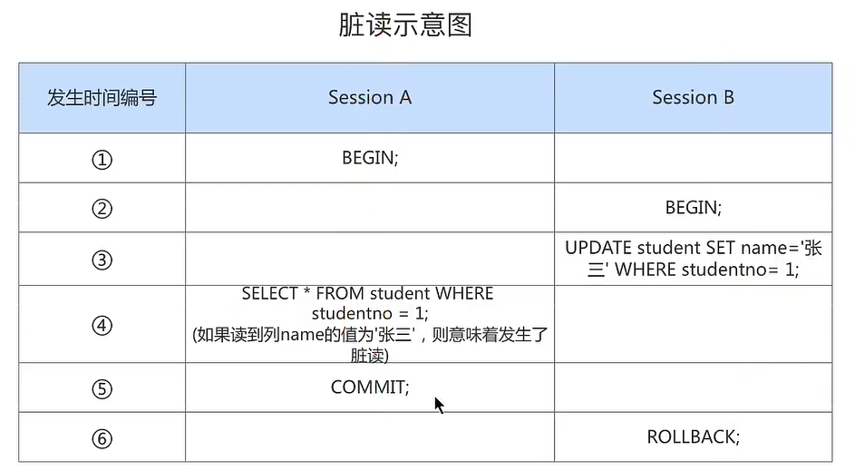
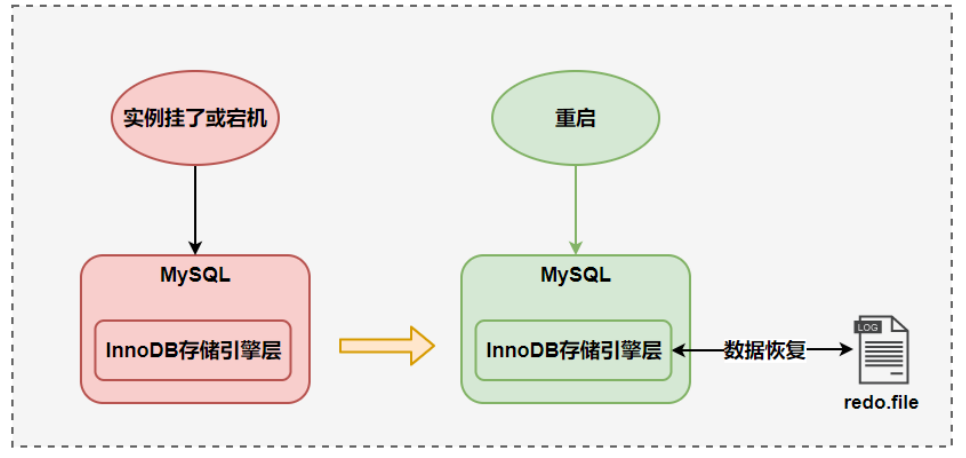
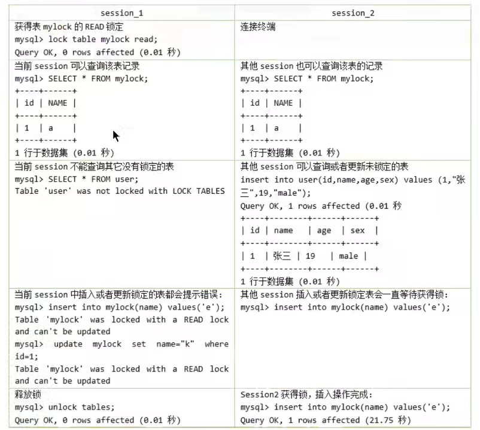
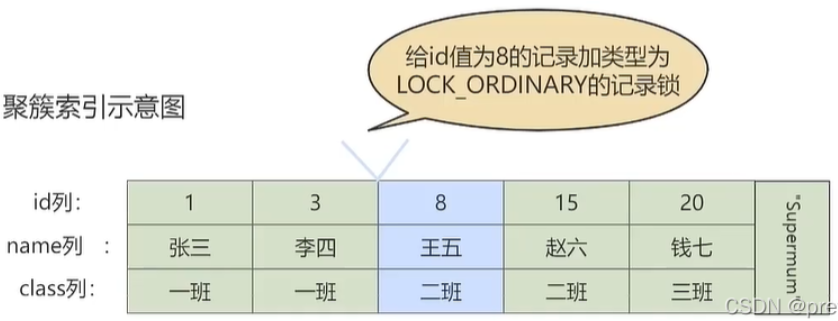
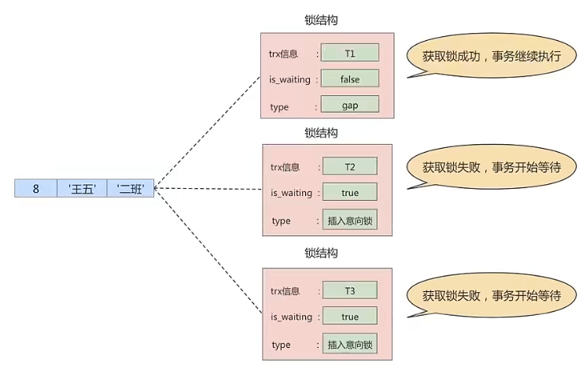
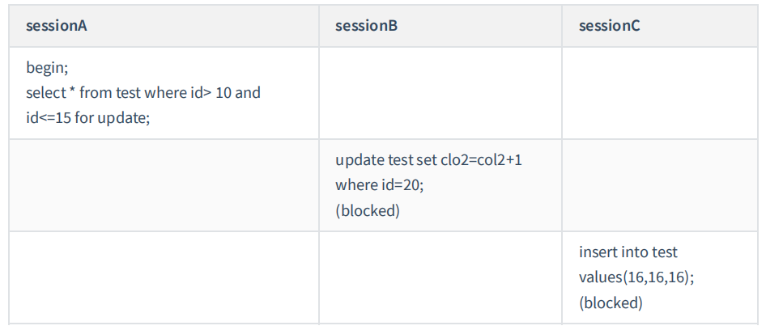

# 三、事务篇

## 第 13 章：事务基础知识

### 1. 数据库事务概述

事务是数据库区别于文件系统的重要特性之一，当我们有了事务就会让数据库始终保持 `一致性`，同时我们还能通过事务的机制 `恢复到某个时间点`，这样可以保证已提交到数据库的修改不会因为系统崩溃而丢失。

#### 1.1 存储引擎支持情况

`SHOW ENGINES` 命令来查看当前 MySQL 支持的存储引擎都有哪些，以及这些存储引擎是否支持事务。


能看出再 MySQL 中，只有 InnoDB 是支持事务的。

#### 1.2 基本概念

**事务：**一组逻辑操作单元，使数据从一种状态变换到另一种状态。

**事务处理的原则：**保证所有事务都作为 `一个工作单元` 来执行，即使出现了故障，都不能改变这种执行方式。当在一个事务中执行多个操作时，要么所有的事务都被提交( `commit` )，那么这些修改就 `永久` 地保存下来；要么数据库管理系统将 `放弃` 所作的所有 `修改` ，整个事务回滚( `rollback` )到最初状态。

```sql
#案例：AA 用户给 BB 用户转账 100
UPDATE ACCOUNT SET money = money - 100 WHERE name = 'AA';
# 服务器宕机
UPDATE ACCOUNT SET money = money + 100 WHERE name = 'BB';
```

#### 1.3 事务的 ACID 特性

- **原子性（atomicity）：**

原子性是指事务是一个不可分割的工作单位，要么全部提交，要么全部失败回滚。即要么转账成功，要么转账失败，是不存在中间的状态。如果无法保证原子性会怎么样？就会出现数据不一致的情形，A 账户减去 100 元，而 B 账户增加 100 元操作失败，系统将无故丢失 100 元。

- **一致性（consistency）：**

（国内很多网站上对一致性的阐述有误，具体你可以参考 Wikipedia 对 **Consistency** 的阐述）

根据定义，一致性是指事务执行前后，数据从一个 `合法性状态` 变换到另外一个 `合法性状态` 。这种状态是 `语义上` 的而不是语法上的，跟具体的业务有关。

那什么是合法的数据状态呢？满足 `预定的约束` 的状态就叫做合法的状态。通俗一点，这状态是由你自己来定义的（比如满足现实世界中的约束）。满足这个状态，数据就是一致的，不满足这个状态，数据就是不一致的！如果事务中的某个操作失败了，系统就会自动撤销当前正在执行的事务，返回到事务操作之前的状态。

**举例1：**A 账户有 200 元，转账 300 元出去，此时 A 账户余额为 -100 元。你自然就发现此时数据是不一致的，为什么呢？因为你定义了一个状态，余额这列必须 >= 0。

**举例2：**A 账户有 200 元，转账 50 元给 B 账户，A 账户的钱扣了，但是 B 账户因为各种以外，余额并没有增加，你也知道此时数据是不一致的，为什么呢？因为你定义了一个状态，要求 A+B 的总余额必须不变。

**举例3：**在数据表中我们将 `姓名` 字段设置为 `唯一性约束`，这时当事务进行提交或者事务发生回滚的时候，如果数据表中的姓名不唯一，就破坏了事务的一致性要求。

- **隔离型（isolation）：**

事务的隔离性是指一个事务的执行 `不能被其他事务干扰` ，即一个事务内部的操作及使用的数据对 `并发` 的其他事务是隔离的，并发执行的各个事务之间不能互相干扰。

如果无法保证隔离性会怎么样？假设 A 账户有 20 0元，B 账户 0 元。A 账户往 B 账户转账两次，每次金额为 50 元，分别在两个事务中执行。如果无法保证隔离性，会出现下面的情形：

```sql
UPDATE accounts SET money = money - 50 WHERE NAME = 'AA'; 

UPDATE accounts SET money = money + 50 WHERE NAME = 'BB';
```


- **持久性（durability）：**

持久性是指一个事务一旦被提交，它对数据库中数据的改变就是 `永久性的` ，接下来的其他操作和数据库故障不应该对其有任何影响。

持久性是通过 `事务日志` 来保证的。日志包括了 `重做日志` 和 `回滚日志` 。当我们通过事务对数据进行修改的时候，首先会将数据库的变化信息记录到重做日志中，然后再对数据库中对应的行进行修改。这样做的好处是，即使数据库系统崩溃，数据库重启后也能找到没有更新到数据库系统中的重做日志，重新执行，从而使事务具有持久性。

> 总结
>
> ACID 是事务的四大特性，在这四个特性中，原子性是基础，隔离性是手段，一致性是约束条件，而持久性是我们的目的。
>
> 数据库事务，其实就是数据库设计者为了方便起见，把需要保证 `原子性`、`隔离性`、`一致性` 和 `约束性` 的一个或多个数据库操作称为一个事务。

#### 1.4 事务的状态

我们现在知道 `事务` 是一个抽象的概念，它其实对应着一个或多个数据库操作，MySQL 根据这些操作所执行的不同阶段把 `事务` 大致划分成几个状态：

- **活动的（active）**

  事务对应的数据库操作正在执行过程中时，我们就说该事务处在 `活动的` 状态。

- **部分提交的（partially committed）**

  当事务中的最后一个操作执行完成，但由于操作都在内存中执行，所造成的影响并 `没有刷新到磁盘` 时，我们就说该事务处在 `部分提交的` 状态。

- **失败的（failed）**

  当事务处在 `活动的` 或者 `部分提交的` 状态时，可能遇到了某些错误（数据库自身的错误、操作系统错误或者直接断电等）而无法继续执行，或者人为的停止当前事务的执行，我们就说该事务处在 `失败的` 状态。

- **中止的（aborted）**

  如果事务执行了一部分而变为 `失败的` 状态，那么就需要把已经修改的事务中的操作还原到事务执行前的状态。换句话说，就是要撤销失败事务对当前数据库造成的影响。我们把这个撤销的过程称之为 `回滚` 。当 `回滚` 操作执行完毕时，也就是数据库恢复到了执行事务之前的状态，我们就说该事务处在了 `中止的` 状态。

  举例：

  ```sql
  UPDATE accounts SET money = money - 50 WHERE NAME = 'AA'; 
  
  UPDATE accounts SET money = money + 50 WHERE NAME = 'BB';
  ```

- **提交的（committed）**

  当一个处在 `部分提交的` 状态的事务将修改过的数据都 `同步到磁盘` 上之后，我们就可以说该事务处在了 `提交的` 状态。

一个基本的状态转换图如下所示：


图中可见，只有当事务处于 `提交的` 或者 `中止的` 状态时，一个事务的生命周期才算是结束了。对于已经提交的事务来说，该事物对数据库所做的修改将永久生效，对于处于中止状态的事务，该事物对数据库所做的所有修改都会被回滚到没执行该事物之前的状态。

### 2. 如何使用事务

使用事务有两种方式，分别为 `显式事务` 和 `隐式事务`。 

#### 2.1 显式事务

**步骤1：**`START TRANSACTION` 或者 `BEGIN`，作用是显式开启一个事务。

```sql
mysql> BEGIN; 
#或者 
mysql> START TRANSACTION;
```

`START TRANSACTION` 语句相较于 `BEGIN` 特别之处在于，后边能跟随几个 `修饰符`：

①`READ ONLY`：标识当前事务是一个 `只读事务` ，也就是属于该事务的数据库操作只能读取数据，而不能修改数据。

> 补充：只读事务中只是不允许修改那些其他事务也能访问到的表中的数据，对于临时表来说（我们使用 CREATE TMEPORARY TABLE 创建的表），由于他们只能在当前会话中可见，所以只读事务其实可是可以对临时表进行增、删、该操作的。

②`READ WRITE`：标识当前事务是一个 `读写事务` ，也就是属于该事务的数据库操作既可以读取数据，也可以修改数据。

③`WITH CONSISTENT SNAPSHOT`：启动一致性读。 

比如：

```sql
START TRANSACTION READ ONLY;  # 开启一个只读事务
```

```sql
START TRANSACTION READ ONLY, WITH CONSISTENT SNAPSHOT;  # 开启只读事务和一致性读
```

注意：

- `READ ONLY` 和 `READ WRITE` 是用来设置所谓的事务 `访问模式` 的，就是以只读还是读写的方式来访问数据库中的数据，一个事务的访问模式不能同时既设置为 `只读` 的也设置为 `读写` 的，所以不能同时把 `READ ONLY` 和 `READ WRITE` 放到 `START TARNSACTION` 语句后边。
- 如果我们不显式指定事务的访问模式，那么该事务的访问模式就是 `读写` 模式。

**步骤2：**一系列事务中的操作（主要是 DML，不含 DDL）

**步骤3：**提交事务 或 中止事务（即回滚事务）

```sql
# 提交事务。当提交事务后，对数据库的修改是永久性的。 
mysql> COMMIT;
```

```sql
# 回滚事务。即撤销正在进行的所有没有提交的修改 
mysql> ROLLBACK; 

# 将事务回滚到某个保存点。 
mysql> ROLLBACK TO [SAVEPOINT]
```

其中关于 SAVEPOINT 相关操作有：

```sql
# 在事务中创建保存点，方便后续针对保存点进行回滚，一个事务中可以存在多个保存点。
SAVEPOINT 保存点名称;
```

```sql
# 删除某个保存点
RELEASE SAVEPOINT 保存点名称;
```

#### 2.2 隐式事务

MySQL中有一个系统变量 `autocommit`：

```sql
mysql> SHOW VARIABLES LIKE 'autocommit';
+---------------+-------+
| Variable_name | Value |
+---------------+-------+
| autocommit    | ON    |
+---------------+-------+
1 row in set (0.01 sec)
```

当然，如果我们想关闭这种 `自动提交` 的功能，可以使用下边两种方法之一：

- 显式的的使用 `START TRANSACTION` 或者 `BEGIN` 语句开启一个事务。这样在本次事务提交或者回滚前会暂时关闭掉自动提交的功能。

- 把系统变量 `autocommit` 的值设置为 `OFF` ，就像这样：

  ```sql
  SET autocommit = OFF; 
  #或
  SET autocommit = 0;
  ```

  这样的话，我们写入的多条语句就算是属于同一个事务了，直到我们显式的写出 `COMMIT` 语句来把这个事务提交掉，或者显式的写出 `ROLLBACK` 语句来把这个事务回滚掉。

> 补充：Oracle 默认不自动提交，需要手写 COMMIT 命令，而 MySQL 默认自动提交。

#### 2.3 隐式提交数据的情况

- **数据定义语言（Data definition language，缩写为：DDL）**

  数据库对象，指的就是 `数据库`、`表`、`视图`、`存储过程` 等结构。当我们使用 `CREATE`、`ALTER`、`DROP` 等语句去修改数据库对象时，就会隐式的提交前边语句所属于的事务。即：

  ```sql
  BEGIN
  
  SELECT ... # 事务中的一条语句
  UPDATE ... # 事务中的一条语句
  ... $ 事务中的其它语句
  
  CREATE TABLE ... # 此语句会隐式的提交前边语句所属于的事务
  ```

- **隐式使用或修改 MySQL 数据库中的表**

  当我们使用 `ALTER USER`、`CREATE USER`、`DROP USER`、`GRANT`、`RENAME USER`、`REVOKE`、`SET PASSWORD` 等语句时也会隐式的提交前边语句所属于的事务。

- **事务控制或关于锁定的语句**

  ①当我们在一个事务还没提交或者回滚时就又使用`START TRANSACTION`或者`BEGIN`语句开启了另一个事务时，会`隐式的提交`上一个事务。即：

  ```sql
  BEGIN
  
  SELECT ... # 事务中的一条语句
  UPDATE ... # 事务中的一条语句
  ... $ 事务中的其它语句
  
  BEGIN; # 此语句会隐式的提交前边语句所属于的事务
  ```

  ②当前的`autocommit`系统变量的值为`OFF`，我们手动把它调为`ON`时，也会`隐式的提交`前边语句所属的事务。

  ③使用`LOCK TABLES`、`UNLOCK TABLES`等关于锁定的语句也会`隐式的提交`前边语句所属的事务。

- **加载数据的语句**

  使用 `LOAD DATA` 语句来批量往数据库中导入数据时，也会 `隐式的提交` 前达语句所属的事务。

- **关于 MySQL 复制的一些语句**

  使用 `START SLAVE`、`STOP SLAVE`、`RESET SLAVE`、`CHANGE MASTER TO` 等语句时会 `隐式的提交` 前边语句所属的事务。

- **其它的一些语句**

  使用 `ANALYZE TABLE`、`CACHE INDEX`、`CHECK TABLE`、`FLUSH`、`LOAD INDEX INTO CACHE`、`OPTIMIZE TABLE`、`REPAIR TABLE`、`RESET` 等语句也会隐式的提交前边语句所属的事务。

#### 2.4 使用举例1：提交与回归

我们看下在 MySQL 的默认状态下，下面这个事务最后的处理结果是什么。

**情况1：**

```sql
CREATE TABLE user3(
    NAME VARCHAR(15) 
    PRIMARY KEY
);

SELECT * FROM user3;

BEGIN;
INSERT INTO user3 VALUES('张三'); #此时不会自动提交数据
COMMIT;

BEGIN; #开启一个新的事务
INSERT INTO user3 VALUES('李四'); #此时不会自动提交数据
INSERT INTO user3 VALUES('李四'); #受主键的影响，不能添加成功
ROLLBACK;

SELECT * FROM user3;
```

运行结果：1 行数据

**情况2：**

```sql
TRUNCATE TABLE user3;  #DDL操作会自动提交数据，不受autocommit变量的影响。

SELECT * FROM user3;

BEGIN;
INSERT INTO user3 VALUES('张三'); #此时不会自动提交数据
COMMIT;

INSERT INTO user3 VALUES('李四');# 默认情况下(即autocommit为true)，DML操作也会自动提交数据。
INSERT INTO user3 VALUES('李四'); #事务的失败的状态

ROLLBACK;

SELECT * FROM user3;
```

运行结果：2 行数据

**情况3：**

```sql
TRUNCATE TABLE user3;  #DDL操作会自动提交数据，不受autocommit变量的影响。

SELECT * FROM user3;

BEGIN;
INSERT INTO user3 VALUES('张三'); #此时不会自动提交数据
COMMIT;

INSERT INTO user3 VALUES('李四');# 默认情况下(即autocommit为true)，DML操作也会自动提交数据。
INSERT INTO user3 VALUES('李四'); #事务的失败的状态

ROLLBACK;

SELECT * FROM user3;
```

运行结果：1 行数据

你能看到相同的 SQL 代码，只是在事务之前设置了 `SET @@completion_type = 1`，结果就和我们第一次处理的一样，只有一个“张三”。这是为什么呢？

这里我讲解下 MySQL 中 completion_type 参数的作用，实际上这个参数有 3 种可能：

1. `completion=0`，这是 `默认情况`。当我们执行 COMMIT 的时候会提交事务，在执行下一个事务时，还需要使用 `START TRANSACTION` 或者 `BEGIN` 来开启。
2. `completion=1`，这种情况下，当我们提交事务后，相当于执行了 `COMMIT AND CHAIN`，也就是开启一个链式事务，即当我们提交事务之后会开启一个相同隔离级别的事务。
3. `completion=2`，这种情况下 `COMMIT=COMMIT AND RELEASE`，也就是当我们提交后，会自动与服务器断开连接。

> 当我们设置 autocommit=0 时，不论是否采用 START TRANSACTION 或者 BEGIN 的方式来开启事务，都需要用 COMMIT 进行提交，让事务生效，使用 ROLLBACK 对事务进行回滚。
>
> 当我们设置 autocommit=1 时，每条 SQL 语句都会自动进行提交。 不过这时，如果你采用 START TRANSACTION 或者 BEGIN 的方式来显式地开启事务，那么这个事务只有在 COMMIT 时才会生效，在 ROLLBACK 时才会回滚。

#### 2.5 使用举例2：测试不支持事务的 engine

```sql
#举例2：体会INNODB 和 MyISAM

CREATE TABLE test1(i INT) ENGINE = INNODB;

CREATE TABLE test2(i INT) ENGINE = MYISAM;

#针对于innodb表
BEGIN
INSERT INTO test1 VALUES (1);
ROLLBACK;

SELECT * FROM test1;


#针对于myisam表:不支持事务
BEGIN
INSERT INTO test2 VALUES (1);
ROLLBACK;

SELECT * FROM test2;
```

test1 表中数据回滚后，表中数据为 0 条，回滚成功。

test2 表中数据回滚后，表中数据为 1 条，并没有回滚。

只有 InnoDB 支持事务操作。

#### 2.6 使用举例3：SAVEPOINT

创建表并添加数据：

```sql
CREATE TABLE user4(
    NAME VARCHAR(15),
    balance DECIMAL(10,2)
);

BEGIN
INSERT INTO user4(NAME,balance) VALUES('张三',1000);
COMMIT;
```

用户张三花费两次 100 元，在执行完扣除用户张三的钱后设置一个 `保存点`，之后在往张三的账户中添加 1 元，之后回滚到设定的保存点，最后执行回滚操作：

```sql
BEGIN;
UPDATE user4 SET balance = balance - 100 WHERE NAME = '张三';

UPDATE user4 SET balance = balance - 100 WHERE NAME = '张三';

SAVEPOINT s1;#设置保存点

UPDATE user4 SET balance = balance + 1 WHERE NAME = '张三';

ROLLBACK TO s1; #回滚到保存点


SELECT * FROM user4;

ROLLBACK; #回滚操作
```

第一次回滚到保存点后，张三用户的金额为 800，成功回到设定保存点位置，最后进行回滚操作，张三用户的金额为 1000，回到最初位置。

### 3. 事务隔离级别

MySQL 是一个 `客户端／服务器` 架构的软件，对于同一个服务器来说，可以有若干个客户端与之连接，每个客户端与服务器连接上之后，就可以称为一个会话（ `Session` ）。每个客户端都可以在自己的会话中向服务器发出请求语句，一个请求语句可能是某个事务的一部分，也就是对于服务器来说可能同时处理多个事务。事务有 `隔离性` 的特性，理论上在某个事务 `对某个数据进行访问` 时，其他事务应该进行 `排队` ，当该事务提交之后，其他事务才可以继续访问这个数据。但是这样对 `性能影响太大` ，我们既想保持事务的隔离性，又想让服务器在处理访问同一数据的多个事务时 `性能尽量高些` ，那就看二者如何权衡取舍了。

#### 3.1 数据准备

我们需要创建一个表：

```sql
CREATE TABLE student1 ( 
    studentno INT, 
    name VARCHAR(20), 
    class varchar(20), 
    PRIMARY KEY (studentno) 
) Engine=InnoDB CHARSET=utf8;
```

然后向这个表里插入一条数据：

```sql
INSERT INTO student1 VALUES(1, '小谷', '1班');
```

现在表里的数据就是这样的：

```sql
mysql> SELECT * FROM student1;
+-----------+--------+-------+
| studentno | name   | class |
+-----------+--------+-------+
|         1 | 小谷   | 1班   |
+-----------+--------+-------+
1 row in set (0.00 sec)
```

#### 3.2 数据并发问题

针对事务的隔离性和并发性，我们怎么做取舍呢？先看一下访问相同数据的事务在 `不保证串行执行`（也就是执行完一个再执行另一个）的情况下可能会出现哪些问题：

**1. 脏写（`Dirty Write`）**

对于两个事务 Session A、Session B，如果事务 Session A `修改了` 另一个 `未提交` 事务 Session B `修改过` 的数据，那就意味着发生了 `脏写`，示意图如下：


 Session A 和 Session B 各开启一个事务，Session B 中的事务先将 studentno 列为 1 的记录的 name 列更新为“李四”，然后 Seesion A 的事务接着又把这条 studentno 列为 1 的记录的 name 列更新为“张三”，如果之后 Seesion B 中的事务进行了回滚，那么 Session A 中的更新也将不复存在，这种现象就称之为脏写。这时 Session A 中的事务就没有效果了，明明把数据更新了，最后也提交事务了，最后看到的数据什么变化也没有。这里大家对事务的隔离级别比较了解的话，会发现默认隔离级别下，上面 Session A 中的更新语句会处于等待状态，这里只是跟大家说明一下会出现这样现象。

**2. 脏读（`Dirty Read`）**

对于两个事务 Session A、Session B，Session A `读取`了已经被 Session B `更新` 但还 `没有被提交` 的字段。之后若 Session B `回滚` ，Session A `读取` 的内容就是 `临时且无效` 的。



Session A 和 Session B 各开启了一个事务，Session B 中的事务先将 studentno 列为 1 的记录的 name 列更新为'张三'，然后 Session A 中的事务再去查询这条 studentno 为 1 的记录，如果读到列 name 的值为“张三”，而 Session B 中的事务稍后进行了回滚，那么 Session A 中的事务相当于读到了一个不存在的数据，这种现象就称之为 `脏读` 。

**3. 不可重复读（`Non-Repeatable Read`）**

对于两个事务 Session A、Session B，Session A `读取` 了一个字段，然后 Session B `更新` 了该字段。 之后 Session A `再次读取` 同一个字段， `值就不同` 了。那就意味着发生了不可重复读。


我们在 Session B 中提交了几个 `隐式事务`（注意是隐式事务，意味着语句结束事务就提交了），这些事务都修改了 studentno 列为 1 的记录的列 name 的值，每次事务提交之后，如果 Session A 中的事务都可以查看到最新的值，这种现象也被称之为 `不可重复读`。

**4. 幻读（` Phantom`）**

对于两个事务 Session A、Session B，Session A 从一个表中 `读取` 了一个字段, 然后 Session B 在该表中 `插入` 了一些新的行。 之后, 如果 Session A `再次读取` 同一个表, 就会多出几行。那就意味着发生了幻读。


Session A 中的事务先根据条件 studentno > 0 这个条件查询表 student，得到了 name 列值为“张三”的记录；之后 Session B 中提交了一个 `隐式事务` ，该事务向表 student 中插入了一条新记录；之后 Session A 中的事务再根据相同的条件 studentno > 0 查询表 student，得到的结果集中包含 Session B 中的事务新插入的那条记录，这种现象也被称之为 `幻读` 。我们把新插入的那些记录称之为 `幻影记录`。

**注意1：**

那如果 Session B 中 `删除了` 一些符合 `studentno>0` 的记录而不是插入新纪录，那 Session A 之后在根据 `studentno>0` 的条件读取的 `记录变少了`，这种现象算不算 `幻读` 呢？这种现象 `不属于幻读`，幻读强调的是一个事务按照某个 `相同条件多次读取` 记录时，后读取时读到了之前 `没有读到的记录` 。

**注意2：**

那对于先前读到的记录，之后有读取不到这种情况，算什么呢？这相当于对每一条记录都发生了 `不可重复读` 的现象。幻读只是重点强调了读取到了之前没有获取到的记录。

#### 3.3 SQL 中的四种隔离级别

上面介绍了几种并发事务执行过程中可能遇到的一些问题，这些问题有轻重缓急之分，我们给这些问题按照严重性来排一下序：

```
脏写 > 脏读 > 不可重复读 > 幻读
```

我们愿意舍弃一部分隔离性来换取一部分性能在这里就体现在：设立一些隔离级别，隔离级别越低，并发问题发生的就越多。 `SQL 标准` 中设立了 4 个 `隔离级别` ： 

- `READ UNCOMMITTED`：读未提交，在该隔离级别，所有事务都可以看到其他未提交事务的执行结果。不能避免脏读、不可重复读、幻读。

- `READ COMMITTED`：读已提交，它满足了隔离的简单定义：一个事务只能看见已经提交事务所做的改变。这是大多数数据库系统的默认隔离级别（但不是 MySQL 默认的）。可以避免脏读，但不可重复读、幻读问题仍然存在。

- `REPEATABLE READ`：可重复读，事务 A 在读到一条数据之后，此时事务 B 对该数据进行了修改并提交，那么事务 A 再读该数据，读到的还是原来的内容。可以避免脏读、不可重复读，但幻读问题仍然存在。这是 MySQL 的默认隔离级别。

- `SERIALIZABLE`：可串行化，确保事务可以从一个表中读取相同的行。在这个事务持续期间，禁止其他事务对该表执行插入、更新和删除操作。所有的并发问题都可以避免，但性能十分低下。能避免脏读、不可重复读和幻读。

`SQL 标准` 中规定，针对不同的隔离级别，并发事务可以发生不同严重程度的问题，具体情况如下：


`脏写` 怎么没涉及到？因为脏写这个问题太严重了，不论是哪种隔离级别，都不允许脏写的情况发生。

不同的隔离级别有不同的现象，并有不同的锁和并发机制，隔离级别越高，数据库的并发性能就越差，4 种事务隔离级别与并发性能的关系如下：


#### 3.4 MySQL 支持的四种隔离级别

不同的数据库厂商对 SQL 标准中规定的四种隔离级别支持不一样，比如，`Oracle` 就只支持 `READ COMMITED(默认隔离级别)` 和 `SERIALIZED 隔离级别`。MySQL 虽然支持 4 种隔离级别，但与 SQL 标准中所规定的各级隔离级别允许发生的问题却有些出入，MySQL 在 REPEATABLE READ 隔离级别下，是可以禁止幻读问题的发生的，禁止幻读的原因在第 16 章讲解。

MySQL 的默认隔离级别为 REPEATABLE READ，我们可以手动修改一下事务的隔离级别。

```sql
# 查看隔离级别，MySQL 5.7.20的版本之前： 
mysql> SHOW VARIABLES LIKE 'tx_isolation'; 
+---------------+-----------------+
| Variable_name | Value 		  | 
+---------------+-----------------+
| tx_isolation  | REPEATABLE-READ | 
+---------------+-----------------+
1 row in set (0.00 sec) 

# MySQL 5.7.20版本之后，引入transaction_isolation来替换tx_isolation 

# 查看隔离级别，MySQL 5.7.20的版本及之后： 
mysql> SHOW VARIABLES LIKE 'transaction_isolation'; 
+-----------------------+-----------------+
| Variable_name         | Value 		  | 
+-----------------------+-----------------+
| transaction_isolation | REPEATABLE-READ | 
+-----------------------+-----------------+
1 row in set (0.02 sec) 

#或者不同MySQL版本中都可以使用的： 
SELECT @@transaction_isolation;
```

#### 3.5 如何设置事务的隔离级别

**通过下面的语句修改事务的隔离级别：**

```sql
SET [GLOBAL|SESSION] TRANSACTION ISOLATION LEVEL 隔离级别; 
#其中，隔离级别格式： 
> READ UNCOMMITTED 
> READ COMMITTED 
> REPEATABLE READ 
> SERIALIZABLE
```

或者：

```sql
SET [GLOBAL|SESSION] TRANSACTION_ISOLATION = '隔离级别' 
#其中，隔离级别格式： 
> READ-UNCOMMITTED 
> READ-COMMITTED 
> REPEATABLE-READ 
> SERIALIZABLE
```

**关于设置时使用 GLOBAL 或 SESSION 的影响：**

- 使用 `GLOBAL` 关键字（在全局范围影响）：

  ```sql
  SET GLOBAL TRANSACTION ISOLATION LEVEL SERIALIZABLE; 
  #或
  SET GLOBAL TRANSACTION_ISOLATION = 'SERIALIZABLE';
  ```

  则：

  - 当前已经存在的会话无效
  - 只对执行完该语句之后产生的会话起作用

- 使用 `SESSION` 关键字（在会话范围影响）：

  ```sql
  SET SESSION TRANSACTION ISOLATION LEVEL SERIALIZABLE; 
  #或
  SET SESSION TRANSACTION_ISOLATION = 'SERIALIZABLE';
  ```

  则：

  - 对当前会话的所有后续的事务有效
  - 如果在事务之间执行，则对后续的事务有效
  - 该语句可以在已经开启的事务中间执行，但不会影响当前正在执行的事务

> 小结：
>
> 数据库规定了多种事务隔离级别，不同隔离级别对应不同的干扰程度，隔离级别越高，数据一致性就越好，但并发性越弱。

#### 3.6 不同隔离级别举例

初始化数据：

```sql
CREATE TABLE account(
	id INT PRIMARY KEY AUTO_INCREMENT,
	NAME VARCHAR(15),
	balance DECIMAL(10,2)
);

TRUNCATE TABLE account;

INSERT INTO account VALUES (1, '张三', '100'), (2, '李四', '0');
```

表中的数据如下：

```sql
mysql> SELECT * FROM account;
+----+--------+---------+
| id | NAME   | balance |
+----+--------+---------+
|  1 | 张三   |  100.00 |
|  2 | 李四   |    0.00 |
+----+--------+---------+
2 rows in set (0.00 sec)
```

**演示1：读未提交之脏读**

设置隔离级别为未提交读：


脏读就是指当一个事务正在访问数据，并且对数据进行了修改，而这种修改还没有提交到数据库中，这是，另外一个事务也访问了这个数据，然后使用了这个数据。

再举一个严重的例子，证明一下危害。表中的数据如下：

```sql
mysql> SELECT * FROM account;
+----+--------+---------+
| id | NAME   | balance |
+----+--------+---------+
|  1 | 张三   |  100.00 |
|  2 | 李四   |    0.00 |
+----+--------+---------+
2 rows in set (0.00 sec)
```

事务1和事务2的执行流程如下：


执行完成，数据库中数据如下：

```
mysql> SELECT * FROM account;
+----+--------+---------+
| id | NAME   | balance |
+----+--------+---------+
|  1 | 张三   |  100.00 |
|  2 | 李四   |  -100.00|
+----+--------+---------+
2 rows in set (0.00 sec)
```

**演示2：读已提交**

表中数据如下：

```sql
mysql> SELECT * FROM account;
+----+--------+---------+
| id | NAME   | balance |
+----+--------+---------+
|  1 | 张三   |  100.00 |
|  2 | 李四   |    0.00 |
+----+--------+---------+
2 rows in set (0.00 sec)
```

设计隔离级别为读已提交，事务的执行流程如下：


不可重复是指在事务 1 内，读取了一个数据，事务 1 还没有结束时，事务 2 也访问了这个数据，修改了这个数据，并提交，紧接着，事务 1 又读了这个数据，由于事务 2 的修改，那么事务 1 两次读到的数据可能是不一样的，因此称为不可重复读。

可以看到在 T2 时间段事务 2 修改完 id=2 的账户余额但没有 commit 的时候，在事务 1 查询 id=2 的账户余额，发现余额为 0，可以证明提交读这个隔离级别不会发生脏读。

**演示3：可重复读**

表中数据如下：

```sql
mysql> SELECT * FROM account;
+----+--------+---------+
| id | NAME   | balance |
+----+--------+---------+
|  1 | 张三   |  100.00 |
|  2 | 李四   |    0.00 |
+----+--------+---------+
2 rows in set (0.00 sec)
```

设置隔离级别为可重复读，事务的执行流程如下：


当我们将当前会话的隔离级别设置为可重复读的时候，当前会话可以重复读，就是每次读取的结果集都相同，而不管其他事务有没有提交，但是在可重复读的隔离级别上，会产生幻读的问题。

**演示4：幻读**

表中数据如下：

```sql
mysql> SELECT * FROM account;
+----+--------+---------+
| id | NAME   | balance |
+----+--------+---------+
|  1 | 张三   |  100.00 |
|  2 | 李四   |    0.00 |
+----+--------+---------+
2 rows in set (0.00 sec)
```

设置隔离级别为可重复读，事务执行流程如下：


这里要灵活的 `理解读取` 的意思，第一次 select 是读取，第二次的 insert 其实也属于隐式的读取，只不过是在 mysql 的机制中读取的，插入数据也是要先读取一下有没有主键冲突才能决定是否执行插入。

幻读，并不说两次读取获取的结果是不同，幻读侧重的方面是某一次 select 操作得到的结果表征的数据状态无法支撑后续的业务操作。更为具体一些，select 某记录是否存在，不存在，准备插入此记录，但指向 insert 是发现此记录已存在，无法插入，此时就发生了幻读。

在 RR 隔离级别下，step1，step2 是会正常执行的，step3 则会报错主键冲突，对于事务 1 的业务来说是执行失败的，这里事务 1 就发生了幻读，因为事务 1 在 step1 中读取的数据状态并不能支撑后续的业务操作。事务 1 发现插入失败后，又执行了 step4，发现 select 读取的结果是一样的（RR 下的 MVCC 机制）。此时，幻读无疑已经发生，事务 1 无论读取多少次，都查不到 id=3 的记录，但它的确无法插入这条它通过读取来认定不存在的记录（此记录已被事务 2 插入），对于事务 1 来说，它幻读了。

其实 RR 也是可以避免幻读的，通过对 select 操作手动加上 `行(X)锁(独占锁)`(SELECT ... FOR UPDATE 这也正是 SERIALIZABLE 隔离级别下回隐式为你做的事情)。同时，即便当前记录不存在，比如 id=3 是不存在的，当前事务也会获得一把记录锁（因为 InnoDB 的行锁锁定的是索引，故记录实体存在与否没关系。存在就加 `行(X)锁`，不能再就加 `间隔锁`），其他事务则无法插入此索引的记录，故杜绝了幻读。

在 `SERIALIZABLE 隔离级别` 下，step1 执行时是会隐式的添加 `行(X)锁/gap(X)锁`的， 从而 step2 会被阻塞，step3 会正常执行，待事务 1 提交后，事务 2 才能继续执行（主键冲突执行失败），对于事务 1 来说业务是正确的，成功的阻塞扼杀了扰乱业务的事务 2，对于事务 1 来说他提取读取的结果是可以支撑后续业务的。

索引 MySQL 的幻读并非什么读取两次返回结果集不同，而是事务在插入事先检测不存在的记录时，惊奇的发现这些数据已经存在了，之前的检测读获取到的数据如果鬼影一般。

### 4. 事务的常见分类

从事务理论的角度来看，可以把事务分为以下几种类型:

- 扁平事务 (Flat Transactions)
- 带有保存点的扁平事务(Flat Transactions with Savepoints)
- 链事务(Chained Transactions)
- 嵌套事务(Nested Transactions)
- 分布式事务（Distributed Transactions)

下面分别介绍这几种类型:

1）`扁平事务` 是事务类型中最简单的一种，但是在实际生产环境中，这可能是使用最频繁的事务，在扁平事务中，所有操作都处于同一层次，其由 BEGIN WORK 开始，由 COMMIT WORK 或 ROLLBACK WORK 结束，其间的操作是原子的，要么都执行，要么都回滚，因此，扁平事务是应用程序成为原子操作的基本组成模块。扁平事务虽然简单，但是在实际环境中使用最为频繁，也正因为其简单，使用频繁，故每个数据库系统都实现了对扁平事务的支持。扁平事务的主要限制是不能提交或者回滚事务的某一部分，或分几个步骤提交。

扁平事务一般有三种不同的结果:

①事务成功完成。在平常应用中约占所有事务的 96%。

②应用程序要求停止事务。比如应用程序在捕获到异常时会回滚事务，约占事务的 3%。

③外界因素强制终止事务。如连接超时或连接断开，约占所有事务的 1%。

2）`带有保存点的扁平事务` 除了支持扁平事务支持的操作外，还允许在事务执行过程中回滚到同一事务中较早的一个状态。这是因为某些事务可能在执行过程中出现的错误并不会导致所有的操作都无效，放弃整个事务不合乎要求,开销太大。

`保存点(Savepoint)`用来通知事务系统应该记住事务当前的状态，以便当之后发生错误时，事务能回到保存点当时的状态。对于扁平的事务来说，隐式的设置了一个保存点，然而在整个事务中，只有这一个保存点，因此，回滚只能会滚到事务开始时的状态。

3）`链事务` 是指一个事务由多个子事务链式组成，它可以被视为保存点模式的一个变种。带有保存点的扁平事务，当发生系统崩溃时，所有的保存点都将消失，这意味着当进行恢复时，事务需要从开始处重新执行，而不能从最近的一个保存点继续执行。`链事务的思想是`：在提交一个事务时，释放不需要的数据对象，将必要的处理上下文隐式地传给下一个要开始的事务，前一个子事务的提交操作和下一个子事务的开始操作合并成一个原子操作，这意味着下一个事务将看到上一个事务的结果，就好像在一个事务中进行一样。这样，**在提交子事务时就可以释放不需要的数据对象，而不必等到整个事务完成后才释放**。其工作方式如下：


链事务与带有保存点的扁平事务的不同之处体现在:

- 带有保存点的扁平事务能回滚到任意正确的保存点，而链事务中的回滚仅限于当前事务，即只能恢复到最近的一个保存点。
- 对于锁的处理，两者也不相同，链事务在执行 COMMIT 后即释放了当前所持有的锁，而带有保存点的扁平事务不影响迄今为止所持有的锁。

4）`嵌套事务`是一个层次结构框架，由一个顶层事务（Top-Level Transaction）控制着各个层次的事务，顶层事务之下嵌套的事务被称为子事务(Subtransaction)，其控制着每一个局部的变换，子事务本身也可以是嵌套事务。因此，嵌套事务的层次结构可以看成是一棵树。

5）`分布式事务`通常是在一个分布式环境下运行的扁平事务，因此，需要根据数据所在位置访问网络中不同节点的数据库资源。例如，一个银行用户从招商银行的账户向工商银行的账户转账 10000 元，这里需要用到分布式事务，因为不能仅调用某一家银行的数据库就完成任务。

## 第 14 章：MySQL 事务日志

事务有 4 种特性：原子性、一致性、隔离性和持久性。那么事务的四种特性到底是基于什么机制实现呢？

- 事务的隔离性由 `锁机制` 实现。
- 而事务的原子性、一致性和持久性由事务的 redo 日志和undo 日志来保证。
  - REDO LOG 称为 `重做日志`，提供再写入操作，恢复提交事务修改的页操作，用来保证事务的持久性。
  - UNDO LOG 称为 `回滚日志`，回滚行记录到某个特定版本，用来保证事务的原子性、一致性。

有的 DBA 或许会认为 UNDO 是 REDO 的逆过程，其实不然。REDO 和 UNDO 都可以视为是一种 `恢复操作`，但是:

- redo log：是存储引擎层(innodb)生成的日志，记录的是"`物理级别`"上的页修改操作，比如页号 xxx、偏移量 yyy 写入了 ’zzz’ 数据。主要为了保证数据的可靠性;
- undo log：是存储引擎层(innodb)生成的日志，记录的是 `逻辑操作` 日志，比如对某一行数据进行了 INSERT 语句操作，那么 undo log 就记录一条与之相反的 DELETE 操作。主要用于 `事务的回滚`(undo log 记录的是每个修改操作的 `逆操作`)和 `一致性非锁定读`(undo log 回滚行记录到某种特定的版本—MVCC，即多版本并发控制)。

### 1. redo 日志

InnoDB 存储引擎是以 `页为单位` 来管理存储空间的。在真正访问页面之前，需要把在 `磁盘上` 的页缓存到内存中的 `Buffer Pool` 之后才可以访问。所有的变更都必须 `先更新缓冲池` 中的数据，然后缓冲池中的 `脏页` 会以一定的频率被刷入磁盘（`checkPoint机制`)，通过缓冲池来优化 CPU 和磁盘之间的鸿沟，这样就可以保证整体的性能不会下降太快。

#### 1.1 为什么需要 REDO 日志

一方面，缓冲池可以帮助我们消除 CPU 和磁盘之间的鸿沟，checkpoint 机制可以保证数据的最终落盘，然而由于 checkpoint `并不是每次变更的时候就触发` 的，而是 master 线程隔一段时间去处理的。所以最坏的情况就是事务提交后，刚写完缓冲池，数据库宕机了，那么这段数据就是丢失的，无法恢复。

另一方面，事务包含 `持久性` 的特性，就是说对于一个已经提交的事务，在事务提交后即使系统发生了崩溃，这个事务对数据库中所做的更改也不能丢失。

那么如何保证这个持久性呢？`一个简单的做法`：在事务提交完成之前把该事务所修改的所有页面都刷新到磁盘，但是这个简单粗暴的做法有些问题:

- **修改量与刷新磁盘工作量严重不成比例**

  有时候我们仅仅修改了某个页面中的一个字节，但是我们知道在 InnoDB 中是以页为单位来进行磁盘 lO 的，也就是说我们在该事务提交时不得不将一个完整的页面从内存中刷新到磁盘，我们又知道一个页面默认是 16KB 大小，只修改一个字节就要刷新 16KB 的数据到磁盘上显然是太小题大做了。

- **随机 IO 刷新较慢**

  一个事务可能包含很多语句，即使是一条语句也可能修改许多页面，假如该事务修改的这些页面可能并不相邻，这就意味着在将某个事务修改的 Buffer Pool 中的页面 `刷新到磁盘` 时，需要进行很多的 `随机 IO`，随机 IO 比顺序 IO 要慢，尤其对于传统的机械硬盘来说。

`另一个解决的思路`：我们只是想让已经提交了的事务对数据库中数据所做的修改永久生效，即使后来系统崩溃，在重启后也能把这种修改恢复出来。所以我们其实没有必要在每次事务提交时就把该事务在内存中修改过的全部页面刷新到磁盘，只需要把 `修改` 了哪些东西 `记录一下` 就好。比如，某个事务将系统表空间中 `第 10 号` 页面中偏移量为 `100` 处的那个字节的值 `1` 改成 `2`。我们只需要记录一下：将第 0 号表空间的 10 号页面的偏移量为 100 处的值更新为 2 。

InnoDB 引擎的事务采用了 WAL 技术（`Write-Ahead Logging`)，这种技术的思想就是先写日志，再写磁盘，只有日志写入成功，才算事务提交成功，这里的日志就是 redo log。当发生宕机且数据未刷到磁盘的时候，可以通过 redo log 来恢复，保证 ACID 中的 D，这就是 redo log 的作用。



#### 1.2 REDO 日志的好处、特点

##### ①好处

- **redo 日志降低了刷盘频率**
- **redo 日志占用的空间非常小**

存储表空间 ID、页号、偏移量以及需要更新的值，所需的存储空间是很小的，刷盘快。

##### ②特点

- **redo 日志是顺序写入磁盘的**

在执行事务的过程中，每执行一条语句，就可能产生若干条 redo 日志，这些日志是按照 `产生的顺序写入磁盘的`，也就是使用顺序 IO，效率比随机 IO 快。

- **事务执行过程中，redo log 不断记录**

redo log 跟 bin log 的区别，redo log 是存储引擎层产生的，而 bin log 是数据库层产生的。假设一个事务，对表做 10 万行的记录插入，在这个过程中，一直不断的往 redo log 顺序记录，而 bin log 不会记录，直到这个事务提交，才会一次写入到 bin log 文件中。

#### 1.3 redo 的组成

Redo log 可以简单分为以下两个部分：

- `重做日志的缓冲 (redo log buffer)`，保存在内存中，是易失的。

在服务器启动时就向操作系统申请了一大片称之为 redo log buffer 的 `连续内存` 空间，翻译成中文就是 redo 日志缓冲区。这片内存空间被划分成若干个连续的 `redo log block`。一个 redo log block 占用 `512 字节` 大小


**参数设置：innodb_log_buffer_size：**

redo log buffer 大小，默认 `16M`，最大值是 4096M，最小值为 1M。

```sql
mysql> show variables like '%innodb_log_buffer_size%';
+------------------------+----------+
| Variable_name          | Value    |
+------------------------+----------+
| innodb_log_buffer_size | 16777216 |
+------------------------+----------+
1 row in set (0.00 sec)
```

- `重做日志文件 (redo log file)`，保存在硬盘中，是持久的。

REDO 日志文件如图所示，其中的 `ib_logfile0` 和 `ib_logfile1` 即为 REDO 日志。


#### 1.4 redo 的整体流程


```
第1步：先将原始数据从磁盘中读入内存中来，修改数据的内存拷贝 
第2步：生成一条重做日志并写入 redo log buffer，记录的是数据被修改后的值 
第3步：当事务 commit 时，将 redo log buffer 中的内容刷新到 redo log file，对 redo log file 采用追加写的方式 
第4步：定期将内存中修改的数据刷新到磁盘中
```

> 体会：
>
> Write-Ahead Log(预先日志持久化)：在持久化一个数据页之前，先将内存中相应的日志页持久化。

#### 1.5 redo log 的刷盘策略

redo log 的写入并不是直接写入磁盘的，InnoDB 引擎会在写 redo log 的时候先写 redo log buffer，之后以 `一定的频率` 刷入到真正的 redo log file 中。这里的一定频率指的就是我们要说的刷盘策略。


注意，redo log buffer 刷盘到 redo log file 的过程并不是真正的刷到磁盘中去，只是刷入到 `文件系统缓存`（page cache）中去（这是现代操作系统为了提高文件写入效率做的一个优化），真正的写入会交给系统自己来决定（比如 page cache 足够大了）。那么对于 InnoDB 来说就存在一个问题，如果交给系统来同步，同样如果系统宕机，那么数据也丢失了（虽然整个系统宕机的概率还是比较小的）。

针对这种情况，InnoDB 给出 `innodb_flush_log_at_trx_commit` 参数，该参数控制 commit 提交事务时，如何将 redo log buffer 中的日志刷新到 redo log file 中。它支持三种策略：

- `设置为0`：表示每次事务提交时不进行刷盘操作。（系统默认 master thread 每隔 1s 进行一次重做日志的同步）
- `设置为1`：表示每次事务提交时都将进行同步，刷盘操作（ `默认值` ） 
- `设置为2`：表示每次事务提交时都只把 redo log buffer 内容写入 page cache，不进行同步。由 os 自己决定什么时候同步到磁盘文件。

```sql
mysql> SHOW VARIABLES LIKE 'innodb_flush_log_at_trx_commit';
+--------------------------------+----------+
| Variable_name                  | Value    |
+--------------------------------+----------+
| innodb_flush_log_at_trx_commit | 1        |
+--------------------------------+----------+
1 row in set (0.00 sec)
```

另外，InnoDB 存储引擎有一个后台线程，每隔 `1 秒`，就会把 `redo log buffer` 中的内容写到文件系统缓存( `page cache` ) ，然后调用刷盘操作。


也就是说，一个没有提交事务的 `redo log` 记录，也可能会刷盘。因为在事务执行过程 redo log 记录是会写入 `redo log buffer` 中，这些 redo log 记录会被 `后台线程` 刷盘。


除了后台线程每秒 `1 次` 的轮询操作，还有一种情况，当 `redo log buffer` 占用的空间即将达到 `innodb_log_buffer_size` (这个参数默认是 16M)的一半的时候，后台线程会主动刷盘。

#### 1.6 不同刷盘策略演示

##### ①流程图


> 小结：innodb_flush_log_at_trx_commit=1
>
> 为 `1` 是，只要事务提交成功，`redo log` 记录就一定在硬盘中，不会有任何数据损失。
>
> 如果事务执行期间 `MySQL` 挂了或宕机，这部分日志丢了，但是事务并没有提交，所以日志丢了也不会有损失。可以保证 ACID 的 D，数据绝对不会丢失，但是 `效率最差` 的。
>
> 建议使用默认值，虽然操作系统宕机的概率理论小于数据库宕机的概率，但是一般既然使用了事务，那么数据的安全相对来说更重要些。


> 小结：innodb_flush_log_at_trx_commit=2
>
> 为 `2` 时，只要事务提交成功，`redo log buffer` 中的内容只写入文件系统缓存（`page cache`）。
>
> 如果仅仅只是 `MySQL` 挂了不会有任何数据丢失，但是操作系统宕机可能会有 `1` 秒数据的丢失，这种情况下无法满足 ACID 的 D。但是数组 2 肯定是效率最高的。


> 小结：innodb_flush_log_at_trx_commit=3
>
> 为 `0` 时，master thread 中每 1 秒进行一次重做日志的 fsync 操作，因此实例 crash 最多丢失 1 秒钟内的事务。（master thread 是负责将缓冲池中的数据异步刷新到磁盘，保证数据的一致性）
>
> 数值 0 的话，是一种折中的做法，它的 IO 效率理论是高于 1 的，低于 2 的吗，这种策略也有丢失数据的风险，也无法保证 D。

##### ②举例

比较 innodb_flush_log_at_trx_commit 对事务的影响。

```sql
CREATE TABLE test_load(
	a INT,
	b CHAR(80)
)ENGINE=INNODB;
```

```sql
#创建存储过程，用于向test_load中添加数据
DELIMITER//
CREATE PROCEDURE p_load(COUNT INT UNSIGNED)
BEGIN
	DECLARE s INT UNSIGNED DEFAULT 1;
	DECLARE c CHAR(80)DEFAULT REPEAT('a',80);
	WHILE s<=COUNT DO
		INSERT INTO test_load SELECT NULL,c;
		COMMIT;
		SET s=s+1;
	END WHILE;
END //
DELIMITER;
```

存储过程代码中，每插入一条数据就进行一次显式的 COMMIT 操作。在默认的设置下，即参数 innodb_flush_log_at_trx_commit 为 1 的情况下，InnoDB 存储引擎会将重做日志缓冲中的日志写入文件，并调用一次 fsync 操作。

执行命令 CALL p_load(30000)，向表中插入 3 万次的 fsync 操作。在默认情况下所需的时间为：

```sql
mysql> CALL p_load(30000);
Query OK,0 rows affected(14.50 sec)
```

`14.50 sec` 的时间显然是不能接受的。而造成时间比较长的原因就在于 fsync 操作所需的时间。

修改参数 innodb_flush_log_at_trx_commit，设置为 0；

```sql
mysql> SET GLOBAL innodb_flush_log_at_trx_commit = 0;
Query OK, 0 rows affected (0.00 sec)

mysql> SHOW VARIABLES LIKE 'innodb_flush_log_at_trx_commit';
+--------------------------------+-------+
| Variable_name                  | Value |
+--------------------------------+-------+
| innodb_flush_log_at_trx_commit | 0     |
+--------------------------------+-------+
1 row in set (0.00 sec)
```

```sql
mysql> CALL p_load(30000);
Query OK,0 rows affected(8.14 sec)
```

此时，插入 3 万行记录的时间缩短为 `8.14 sec`。

而形成这个现象的主要原因是：后者大大减少了 fsync 的次数，从而提高了数据库执行的性能。

下表显示了在 innodb_flush_log_at_trx_commit 的不同设置下，调用存储过程 p_load 插入 3 万行记录所需的时间：

| innodb_flush_log_at_trx_commit | 执行所用的时间 |
| ------------------------------ | -------------- |
| 0                              | 8.14 秒        |
| 1                              | 14.50 秒       |
| 2                              | 9.68 秒        |

而针对上述存储过程，为了提高事务的提交性能，应该将 3 万行记录插入表后进行一次的 COMMIT 操作，而不是每插入一条记录后进行一次 COMMIT 操作，这样做的好处是可以使事务方法在 rollback 时回滚到事务最开始的确定状态。

> 虽然用户可以通过设置参数 innodb_flush_log_at_trx_commit 为 0 或 2 挺高事务提交的性能，但需清楚，这种设置方法丧失了事务的 ACID 特性。

#### 1.7 写入 redo log buffer 过程

##### ①补充概念：Mini-Transaction

MySQL 把对底层页面中的一次原子访问的过程称之为一个 `Mini-Transaction`，简称 `mtr`，比如向某个索引对应的 B+ 树中插入一条记录的过程就是一个 `Mini-Transaction`。一个所谓的 `mtr` 可以包含一组 redo 日志，在进行崩溃恢复时这一组 `redo` 日志作为一个不可分割的整体。

一个事务可以包含若干条语句，每一条语句其实是由若干个 `mtr` 组成，每一个 `mtr` 又可以包含若干条 redo 日志，画个图表示它们的关系就是这样：


##### ②redo 日志写入 log buffer

向 `log buffer` 中写入 redo 日志的过程是顺序的，也就是先往前边的 block 中写，当该 block 的空闲空间用完之后再往下一个 block 中写。当我们想往 `log buffer` 中写入 redo 日志时，第一个遇到的问题就是应该写在哪个 `block` 的哪个偏移量处，所以 `InnoDB` 的设计者特意提供了一个称之为 `buf_free` 的全局变量，该变量指明后续写入的 redo 日志应该写入到 `log buffer` 中的哪个位置，如图所示:


一个 mtr 执行过程中可能产生若干条 redo 日志，`这些 redo 日志是一个不可分割的组`，所以其实并不是每生成一条 redo 日志，就将其插入到 log buffer 中，而是每个 mtr 运行过程中产生的日志先暂时存到一个地方，当该 mtr 结束的时候，将过程中产生的一组 redo 日志再全部复制到 log buffer 中。我们现在假设有两个名为 `T1`、`T2` 的事务，每个事务都包含 2 个 mtr，我们给这几个 mtr 命名一下：

- 事务 `T1` 的两个 `mtr` 分别称为 `mtr_T1_1` 和 `mtr_T1_2`。
- 事务 `T2` 的两个 `mtr` 分别称为 `mtr_T2_1` 和 `mtr_T2_2`。

每个 mtr 都会产生一组 redo 日志，用示意图来描述一下这些 mtr 产生的日志情况：


不同的事务可能是 `并发执行` 的，所以 `T1`、`T2` 之间的 `mtr` 可能是 `交替执行` 的。每当一个 mtr 执行完成时，伴随该 mtr 生成的一组 redo 日志就需要被复制到 log buffer 中，也就是说不同事务的 mtr 可能是交替写入 log buffer 的，我们画个示意图(为了美观，我们把一个 mtr 中产生的所有的 redo 日志当作一个整体来画)︰


有的 mtr 产生的 redo 日志量非常大，比如 `mtr_t1_2` 产生的 redo 日志占用空间比较大，占用了 3 个 block 来存储。

##### ③redo log block 的结构图

一个 redo log block 是由`日志头`、`日志体`、`日志尾`组成。`日志头`占用`12`字节，`日志尾`占用`8`字节，所以一个 block 真正能存储的数据就是 512-12-8=`492`字节。

> **为什么一个 block 设计出 512 字节？**
>
> 这个和磁盘的扇区有关，机械磁盘默认的扇区就是 512 字节，如果你要写入的数据大于 512 字节，那么要写入的扇区肯定不止一个，这时就要涉及到盘片的转动，找到下一个扇区，假设现在需要写入两个扇区 A 和 B，如果扇区 A 写入成功，而扇区 B 写入失败，那么机会出现 `非原子性` 的写入，而如果每次只写入和扇区大小一样的 512 字节，那么每次的写入都是原子性的。


真正的 redo 日志都是存储到占用 `496` 字节大小的 `log block body` 中，图中的 `log block header` 和 `log block trailer` 存储的是一些管理信息。我们来看看这些所谓的 `管理信息` 都有什么。


- `log block header` 的属性分别如下:
  - `LOG_BLOCK_HDR_NO`：log buffer 是由 log block 组成，在内部 log buffer 就好似一个数组，因此 LOG_BLOCK_HDR_NO 用来标记这个数组中的位置。其是递增并且循环使用的，占用 4 个字节但是由于第一位用来判断是否是 flush bit，所以最大的值为 2G。
  - `LOG_BLOCK_HDR_DATA_LEN`：表示 block 中已经使用了多少字节，初始值为 `12`(因为 `log block body` 从第 12 个字节处开始)。随着往 block 中写入的 redo 日志越来也多，本属性值也跟着增长。如果 `log block body` 已经被全部写满，那么本属性的值被设置为 `512`。
  - `LOG_BLOCK_FIRST_REC_GROUP`：一条 redo 日志也可以称之为一条 redo 日志记录(redo log record)，一个 mtr 会生产多条 redo 日志记录，这些 redo 日志记录被称之为一个 redo 日志记录组(redo log recordgroup)。LOG_BLOCK_FIRST_REC_GROUP 就代表该 block 中第一个 mtr 生成的 redo 日志记录组的偏移量(其实也就是这个 block 里第一个 mtr 生成的第一条 redo 日志的偏移量)。如果该值的大小和 LOG_BLOCK_HDR_DATA_LEN 相同，则表示当前 log block 不包含新的日志。
  - `LOG_BLOCK_CHECKPOINT_NO`：占用 4 字节，表示该 log block 最后被写入时的 `checkpoint`。
- `log block trailer` 中属性的意思如下:
  - `LOG_BLOCK_CHECKSUN`：表示 block 的校验值，用于正确性校验（其值和 LOG_BLOCK_HDR_NO 相同)，我们暂时不关心它。

#### 1.8 redo log file

##### ①相关参数设置

- `innodb_log_group_home_dir`：指定 redo log 文件组所在的路径，默认值为 `./`，表示在数据库的数据目录下。MySQL 的默认数据目录（`var/lib/mysql`）下默认有两个名为 `ib_logfile0` 和 `ib_logfile1` 的文件，log buffer 中的日志默认情况下就是刷新到这两个磁盘文件中。此 redo 日志文件位置还可以修改。
- **innodb_log_files_in_group**：指明 redo log file 的个数，命名方式如：ib_logfile0，ib_logfile1…ib_logfilen。默认 2 个，最大 100 个。

```sql
mysql> SHOW VARIABLES LIKE 'innodb_log_files_in_group';
+---------------------------+-------+
| Variable_name             | Value |
+---------------------------+-------+
| innodb_log_files_in_group | 2     |
+---------------------------+-------+
1 row in set (0.00 sec)
#ib_logfile0
#ib_logfile1
```

- **innodb_flush_log_at_trx_commit**：控制 redo log 刷新到磁盘的策略，默认为 1。
- **innodb_log_file_size**：单个 redo log 文件设置大小，默认值为 `48M`。最大值为 512G，注意最大值指的是整个 redo log 系列文件之和，即（innodb_log_files_in_group * innodb_log_file_size ）不能大于最大值 512G。

```sql
mysql> SHOW VARIABLES LIKE 'innodb_log_file_size';
+----------------------+----------+
| Variable_name        | Value    |
+----------------------+----------+
| innodb_log_file_size | 50331648 |
+----------------------+----------+
1 row in set (0.00 sec)
```

根据业务修改其大小，以便容纳较大的事务。编辑 my.cnf 文件并重启数据库生效，如下所示

```shell
[root@hy01 ~]# vim /etc/my.cnf
innodb_log_file_size=200M
```

##### ②日志文件组

从上边的描述中可以看到，磁盘上的 `redo` 日志文件不只一个，而是以一个 `日志文件组` 的形式出现的。这些文件以 `ib_logfile[数字]`（`数字` 可以是 `0`、`1`、`2`...）的形式进行命名，每个的 redo 日志文件大小都是一样的。

在将 redo 日志写入日志文件组时，是从 `ib_logfile0` 开始写，如果 `ib_logfile0` 写满了，就接着 `ib_logfile1` 写。同理， `ib_logfile1` 写满了就去写 `ib_logfile2`，依此类推。如果写到最后一个文件该咋办?那就重新转到 `ib_logfile0` 继续写，所以整个过程如下图所示：


总共的 redo 日志文件大小其实就是：`innodb_log_file_size × innodb_log_files_in_group`。

采用循环使用的方式向 redo 日志文件组里写数据的话，会导致后写入的 redo 日志覆盖掉前边写的 redo 日志？当然！所以 InnoDB 的设计者提出了 checkpoint 的概念。

##### ③checkpoint

在整个日志文件组中还有两个重要的属性，分别是 write pos、checkpoint

- `write pos` 是当前记录的位置，一边写一边后移
- `checkpoint` 是当前要擦除的位置，也是往后推移

每次刷盘 redo log 记录到日志文件组中，write pos 位置就会后移更新。每次 MySQL 加载日志文件组恢复数据时，会清空加载过的 redo log 记录，并把 checkpoint 后移更新。write pos 和 checkpoint 之间的还空着的部分可以用来写入新的 redo log 记录。


如果 write pos 追上 checkpoint ，表示**日志文件**组满了，这时候不能再写入新的 redo log记录，MySQL 得停下来，清空一些记录，把 checkpoint 推进一下。


#### 1.9 redo log 小结

相信大家都知道 redo log 的作用和它的刷盘时机、存储形式：

**InnoDB 的更新操作采用的是 Write Ahead Log (预先日志持久化)策略，即先写日志，再写入磁盘。**


### 2. undo 日志

redo log 是事务持久性的保证，undo log 是事务原子性的保证。在事务中`更新数据`的`前置操作`其实是要先写入一个 `undo log`。

#### 2.1 如何理解 undo 日志

事务需要保证 `原子性`，也就是事务中的操作要么全部完成，要么什么也不做。但有时候事务执行到一半会出现一些情况，比如：

- 情况一：事务执行过程中可能遇到各种错误，比如 `服务器本身的错误`，`操作系统错误`，甚至是突然 `断电` 导致的错误。
- 情况二：程序员可以在事务执行过程中手动输入 `ROLLBACK` 语句结束当前事务的执行。

以上情况出现，我们需要把数据改回原先的样子，这个过程称之为 `回滚`，这样就可以造成一个假象：这个事务看起来什么都没做，所以符合 `原子性` 要求。

每当我们要对一条记录做改动时(这里的 `改动` 可以指 `INSERT`、`DELETE`、`UPDATE`)，都需要“留一手”——把回滚时所需的东西记下来。比如:

- 你 `插入一条记录` 时，至少要把这条记录的主键值记下来，之后回滚的时候只需要把这个主键值对应的 `记录删掉` 就好了。(对于每个 INSERT，InnoDB 存储引擎会完成一个 DELETE)
- 你 `删除了一条记录`，至少要把这条记录中的内容都记下来，这样之后回滚时再把由这些内容组成的记录 `插入` 到表中就好了。(对于每个 DELETE，InnoDB 存储引擎会执行一个 INSERT)
- 你 `修改了一条记录`，至少要把修改这条记录前的旧值都记录下来，这样之后回滚时再把这条记录 `更新为旧值` 就好了。(对于每个 UPDATE，InnoDB 存储引擎会执行一个相反的 UPDATE，将修改前的行放回去)

MySQL 把这些为了回滚而记录的这些内容称之为 `撤销日志` 或者 `回滚日志`(即 `undo log`)。注意，由于查询操作(`SELECT`)并不会修改任何用户记录，所以在查询操作执行时，并 `不需要记录` 相应的 undo 日志。

此外，undo log `会产生 redo log`，也就是 undo log 的产生会伴随着 redo log 的产生，这是因为 undo log 也需要持久性的保护。

#### 2.2 undo 日志的作用

- **作用1：回滚数据**

用户对 undo 日志可能 `有误解`：undo log 用于将数据库物理地恢复到执行语句或事务之前的样子。但事实并非如此。undo 是 `逻辑日志`，因此只是将数据库逻辑地恢复到原来的样子。所有修改都被逻辑地取消了，但是数据结构和页本身在回滚之后可能大不相同。

这是因为在多用户并发系统中，可能会有数十、数百甚至数千个并发事务。数据库的主要任务就是协调对数据记录的并发访问。比如，一个事务在修改当前一个页中某几条记录，同时还有别的事务在对同一个页中另几条记录进行修改。因此，不能将一个页回滚到事务开始的样子，因为这样会影响其他事务正在进行的工作。

- **作用2：MVCC**

undo 的另一个作用是 MVCC，即在 InnoDB 存储引擎中 MVCC 的实现是通过 undo 来完成。当用户读取一行记录时，若该记录已经被其他事务占用，当前事务可以通过 undo 读取之前的行版本信息，以此实现非锁定读取。

#### 2.3 undo 的存储结构

##### ①回滚段与 undo 页

InnoDB 对 undo log 的管理采用段的方式，也就是 `回滚段（rollback segment）`。每个回滚段记录了 `1024` 个 `undo log segment`，而在每个 undo log segment 段中进行 `undo 页` 的申请。

- 在 `InnoDB1.1 版本` 之前(不包括 1.1 版本)，只有一个 rollback segment，因此支持同时在线的事务限制为 `1024`。虽然对绝大多数的应用来说都已经够用。
- 从 1.1 版本开始 InnoDB 支持最大 `128 个 rollback segment`，故其支持同时在线的事务限制提高到了 `128*1024`。

```sql
SHOW VARIABLES LIKE 'innodb_undo_logs';
```

虽然 InnoDB1.1 版本支持了 128 个 rollback segment，但是这些 rollback segment 都存储于共享表空间 ibdata 中。从 InnoDB1.2 版本开始，可通过参数对 rollback segment 做进一步的设置。这些参数包括:

- `innodb_undo_directory`：设置 rollback segment 文件所在的路径。这意味着 rollback segment 可以存放在共享表空间以外的位置，即可以设置为独立表空间。该参数的默认值为 “./”，表示当前 InnoDB 存储引擎的目录。
- `innodb_undb_logs`：设置 rollback segment 的个数，默认值为 128。在 lnnoDB1.2 版本中，该参数用来替换之前版本的参数 innodb_rollback_segments。
- `innodb_undo_tablespaces`：设置构成 rollback segment 文件的数量，这样 rollback segment 可以较为平均地分布在多个文件中。设置该参数后，会在路径 innodb_undo_directory 看到 undo 为前缀的文件，该文件就代表 rollback segment 文件。

undo log相关参数—船很少改动。

**undo 页的重用**

当我们开启一个事务需要写 undo log 的时候，就得先去 undo log segment 中去找到一个空闲的位置，当有空位的时候，就去申请 undo 页，在这个申请到的 undo 页中进行 undo log 的写入。我们知道 mysql 默认一页的大小是 16k。

为每一个事务分配一个页，是非常浪费的（除非你的事务非常长)，假设你的应用的 TPS (每秒处理的事务数目)为 1000，那么 1s 就需要 1000 个页，大概需要 16M 的存储，1 分钟大概需要 1G 的存储。如果照这样下去除非 MySQL 清理的非常勤快，否则随着时间的推移，磁盘空间会增长的非常快，而且很多空间都是浪费的。

于是 undo 页就被设计的可以 `重用` 了，当事务提交时，并不会立刻删除 undo 页。因为重用，所以这个 undo 页可能混杂着其他事务的 undo log。undo log 在 commit 后，会被放到一个 `链表` 中，然后判断 undo 页的使用空间是否 `小于 3/4`，如果小于 3/4 的话，则表示当前的 undo 页可以被重用，那么它就不会被回收，其他事务的 undo log 可以记录在当前 undo 页的后面。由于 undo log 是 `离散的`，所以清理对应的磁盘空间时，效率不高。

##### ②回滚段与事务

1. 每个事务只会使用一个回滚段，一个回滚段在同一时刻可能会服务于多个事务。

2. 当一个事务开始的时候，会制定一个回滚段，在事务进行的过程中，当数据被修改时，原始的数据会被复制到回滚段。

3. 在回滚段中，事务会不断填充盘区，直到事务结束或所有的空间被用完。如果当前的盘区不够用，事务会在段中请求扩展下一个盘区，如果所有已分配的盘区都被用完，事务会覆盖最初的盘区或者在回滚段允许的情况下扩展新的盘区来使用。

4. 回滚段存在于 undo 表空间中，在数据库中可以存在多个 undo 表空间，但同一时刻只能使用一个 undo 表空间。

   ```sql
   mysql> SHOW VARIABLES LIKE 'innodb_undo_tablespaces';
   +-------------------------+-------+
   | Variable_name           | Value |
   +-------------------------+-------+
   | innodb_undo_tablespaces | 2     |
   +-------------------------+-------+
   1 row in set (0.00 sec)
   
   #undo log 的数量，最少为 2，undo log 的 truncate 操作有 purge 协调线程发起。在 truncate 某个 undo log 表空间的过程中，保证有一个可用的 undo log 可用。
   ```

5. 当事务提交时，InnoDB 存储引擎会做以下两件事情：
   - 将 undo log 放入列表中，以供之后的 purge 操作
   - 判断 undo log 所在的页是否可以重用，若可以分配给下个事务使用

##### ③回滚段中的数据分类

1. `未提交的回滚数据(uncommitted undo information)`：该数据所关联的事务并未提交，用于实现读一致性，所以该数据不能被其他事务的数据覆盖。
2. `已经提交但未过期的回滚数据(committed undo information)`：该数据关联的事务已经提交，但是仍受到 undo retention 参数的保持时间的影响。
3. `事务已经提交并过期的数据(expired undo information)`：事务已经提交，而且数据保存时间已经超过 undo retention 参数指定的时间，属于已经过期的数据。当回滚段满了之后，会优先覆盖"事务已经提交并过期的数据"。

事务提交后并不能马上删除 undo log 及 undo log 所在的页。这是因为可能还有其他事务需要通过 undo log 来得到行记录之前的版本。故事务提交时将 undo log 放入一个链表中，是否可以最终删除 undo log 及 undo log 所在页由 purge 线程来判断。

#### 2.4 undo 的类型

在 InnoDB 存储引擎中，undo log 分为：

- insert undo log

  insert undo log 是指在 insert 操作中产生的 undo log。因为 insert 操作的记录，只对事务本身可见，对其他事务不可见(这是事务隔离性的要求)，故该 undo log 可以在事务提交后直接删除。不需要进行 purge 操作。

- update undo log

  update undo log 记录的是对 delete 和 update 操作产生的 undo log。该 undo log 可能需要提供 MVCC 机制，因此不能在事务提交时就进行删除。提交时放入undo log 链表，等待 purge 线程进行最后的删除。

#### 2.5 undo log 的生命周期

##### ①简要生成过程

以下是 undo+redo 事务的简化过程

假设有 2 个数值，分别为 A=1 和 B=2，然后将 A 修改为 3，B 修改为 4

```
1. start transaction;
2. 记录 A=1 到 undo log;
3. update A = 3;
4. 记录 A=3 到 redo log;
5. 记录 B=2 到 undo log;
6. update B = 4;
7. 记录 B=4 到 redo log;
8. 将 redo log 刷新到磁盘
9. commit
```

- 在 1-8 步骤的任意一步系统宕机，事务未提交，该事务就不会对磁盘上的数据做任何影响。
- 如果在 8-9 之间宕机，恢复之后可以选择回滚，也可以选择继续完成事务提交，因为此时 redo log 已经持久化。
- 若在 9 之后系统宕机，内存映射中变更的数据还来不及刷回磁盘，那么系统恢复之后，可以根据 redo log 把数据刷回磁盘。

**只有 Buffer Pool 的流程：**


**有了 Redo Log 和 Undo Log 之后：**


在更新 Buffer Pool 中的数据之前，我们需要先将该数据事务开始之前的状态写入 Undo Log 中。假设更新到一半出错了，我们就可以通过 Undo Log 来回滚到事务开始前。

##### ②详细生成过程

对于 InnoDB 引擎来说，每个行记录除了记录本身的数据之外，还有几个隐藏的列：

- `DB_ROW_ID`：如果没有为表显式的定义主键，并且表中也没有定义唯一索引，那么 InnoDB 会自动为表添加一个 row_id 的隐藏列作为主键。
- `DB_TRX_ID`：每个事务都会分配一个事务 ID，当对某条记录发生变更时，就会将这个事务的事务 ID 写入 trx_id 中。
- `DB_ROLL_PTR`：回滚指针，本质上就是指向 undo log 的指针


**当我们执行 INSERT 时：**

```sql
begin; 
INSERT INTO user (name) VALUES ("tom");
```

插入的数据都会生成一条 insert undo log，并且数据的回滚指针会指向它。undo log 会记录 undo log 的序号、插入主键的列和值…，那么在进行 rollback 的时候，通过主键直接把对应的数据删除即可。|


**当我们执行 UPDATE 时：**

对于更新的操作会产生 update undo log，并且会分更新主键的和不更新主键的，假设现在执行:

```sql
UPDATE user SET name="Sun" WHERE id=1 ;
```


这时会把老的数据记录写入新的 undo log，让回滚指针指向新的 undo log，它的 undo no 是 1，并且新的 undo log 会指向老的 undo log (undo no=0) 。

假如现在执行：

```sql
UPDATE user SET id=2 WHERE id=1;
```


对于更新主键的操作，会先把原来的数据 deletemark 标识打开，这时并没有真正的删除数据，真正的删除会交给清理线程去判断，然后在后面插入一条新的数据，新的数据也会产生 undo log，并且 undo log 的序号会递增。

可以发现每次对数据的变更都会产生一个 undo log，当一条记录被变更多次时，那么就会产生多条 undo log，undo log 记录的是变更前的日志，并且每个 undo log 的序号是递增的，那么当要回滚的时候，按照序号 `依次向前推`，就可以找到我们的原始数据了。

##### ③undo log 是如何回滚的

以上面的例子来说，假设执行 rollback，那么对应的流程应该是这样：

1. 通过 undo no=3 的日志把 id=2 的数据删除
2. 通过 undo no=2 的日志把 id=1 的数据的 deletemark 还原成 0
3. 通过 undo no=1 的日志把 id=1 的数据的 name 还原成 Tom
4. 通过 undo no=0 的日志把 id=1 的数据删除

##### ④undo log 的删除

- 针对于 insert undo log

因为 insert 操作的记录，只对事务本身可见，对其他事务不可见。故该 undo log 可以在事务提交后直接删除，不需要进行 purge 操作。

- 针对于 update undo log

该 undo log 可能需要提供 MVCC 机制，因此不能在事务提交时就进行删除。提交时放入 undo log 链表，等待 purge 线程进行最后的删除。

> 补充:
>
> purge 线程两个主要作用是：`清理 undo 页` 和 `清除 page 里面带有 Delete_Bit 标识的数据行`。在 InnoDB 中，事务中的 Delete 操作实际上并不是真正的删除掉数据行，而是一种 Delete Mark 操作，在记录上标识 Delete_Bit，而不删除记录。是一种"假删除"；只是做了个标记，真正的删除工作需要后台 purge 线程去完成。

#### 2.6 小结


undo log 是逻辑日志，对事务回滚时，只是将数据库逻辑地恢复到原来的样子。

redo log 是物理日志，记录的是数据页的物理变化，undo log 不是 redo log 的逆过程。

## 第 15 章：锁

事务的 `隔离性` 由这章讲述的 `锁` 来实现。

### 1. 概述

`锁` 是计算机协调多个进程或线程 `并发访问某一资源` 的机制。在程序开发中会存在多线程同步的问题，当多个线程并发访问某个数据的时候，尤其是针对一些敏感的数据(比如订单、金额等)，我们就需要保证这个数据在任何时刻 `最多只有一个线程` 在访问，保证数据的完整性和一致性。在开发过程中加锁是为了保证数据的 `完整性` 和 `一致性`，这个思想在数据库领域中同样很重要。

在数据库中，除传统的计算资源（如 CPU、RAM、I/O 等）的争用以外，数据也是一种供许多用户共享的资源。为保证数据的一致性，需要对 `并发操作进行控制` ，因此产生了锁 。同时 `锁机制` 也为实现 MySQL 的各个隔离级别提供了保证。`锁冲突` 也是影响数据库 `并发访问性能` 的一个重要因素。所以锁对数据库而言显得尤其重要，也更加复杂。

### 2. MySQL 并发事务访问相同记录

并发事务访问相同记录的情况大致可以划分为 3 种：

#### 2.1 读-读情况

`读-读`情况，即并发事务相继`读取相同的记录`。读取操作本身不会对记录有任何影响，并不会引起什么问题，所以允许这种情况的发生。

#### 2.2 写-写情况

`写-写`情况，即并发事务相继对相同的记录做出改动。
在这种情况下会发生`脏写`的问题，任何一种隔离级别都不允许这种问题的发生。所以在多个未提交事务相继对一条记录做改动时，需要让它们`排队执行`，这个排队的过程其实是通过`锁`来实现的。这个所谓的锁其实是一个 `内存中的结构`，在事务执行前本来是没有锁的，也就是说一开始是没有 `锁结构` 和记录进行关联的，如图所示：


当一个事务想对这条记录做改动时，首先会看看内存中有没有与这条记录关联的 `锁结构`，当没有的时候就会在内存中生成一个 `锁结构` 与之关联。比如，事务 `T1` 要对这条记录做改动，就需要生成一个 `锁结构` 与之关联：


在 `锁结构` 里有很多信息，为了简化理解，只把两个比较重要的属性拿了出来:

- `trx 信息`：代表这个锁结构是哪个事务生成的。
- `is_waiting`：代表当前事务是否在等待。

当事务 `T1` 改动了这条记录后，就生成了一个 `锁结构` 与该记录关联，因为之前没有别的事务为这条记录加锁，所以 `is_waiting` 属性就是 `false`，我们把这个场景就称之为 `获取锁成功`，或者 `加锁成功`，然后就可以继续执行操作了。

在事务 `T1` 提交之前，另一个事务 `T2` 也想对该记录做改动，那么先看看有没有 `锁结构` 与这条记录关联，发现有一个 `锁结构` 与之关联后，然后也生成了一个锁结构与这条记录关联，不过锁结构的 `is_waiting` 属性值为 `true`，表示当前事务需要等待，我们把这个场景就称之为 `获取锁失败`，或者 `加锁失败`，图示：


在事务 T1 提交之后，就会把该事务生成的 `锁结构释放` 掉，然后看看还有没有别的事务在等待获取锁，发现了事务 T2 还在等待获取锁，所以把事务 `T2` 对应的锁结构的 `is_waiting` 属性设置为 `false`，然后把该事务对应的线程唤醒，让它继续执行，此时事务 T2 就算获取到锁了。效果图就是这样：


小结几种说法：

- 不加锁

  意思就是不需要在内存中生成对应的 `锁结构` ，可以直接执行操作。

- 获取锁成功，或者加锁成功

  意思就是在内存中生成了对应的 `锁结构` ，而且锁结构的 `is_waiting` 属性为 `false` ，也就是事务可以继续执行操作。

- 获取锁失败，或者加锁失败，或者没有获取到锁

  意思就是在内存中生成了对应的 `锁结构` ，不过锁结构的 `is_waiting` 属性为 `true` ，也就是事务需要等待，不可以继续执行操作。

#### 2.3 读-写或写-读情况

`读-写`或`写-读`，即一个事务进行读取操作，另一个进行改动操作。这种情况下可能发生`脏读`、`不可重复读`、`幻读`的问题。

各个数据库厂商对 `SQL 标准` 的支持都可能不一样。比如 MySQL 在 `REPEATABLE READ` 隔离级别上就已经解决了 `幻读` 问题。

#### 2.4 并发问题的解决方案

怎么解决`脏读`、`不可重复读`、`幻读`这些问题呢？其实有两种可选的解决方案：

- 方案一：读操作利用多版本并发控制（`MVCC`，下章讲解），写操作进行 `加锁`。

所谓的 `MVCC`，就是生成一个 `ReadView`，通过 ReadView 找到符合条件的记录版本（历史版本由 `undo 日志` 构建）。查询语句只能 `读` 到在生成 ReadView 之前 `已提交事务所做的更改`，在生成 ReadView 之前未提交的事务或者之后才开启的事务所做的更改是看不到的。而 `写操作` 肯定针对的是 `最新版本的记录`，读记录的历史版本和改动记录的最新版本本身并不冲突，也就是采用 MVCC 时，`读-写` 操作并不冲突。

>普通的 SELECT 语句在 READ COMMITTED 和 REPEATABLE READ 隔离级别下会使用到 MVCC 读取记录。
>
>- 在 `READ COMMITTED` 隔离级别下，一个事务在执行过程中每次执行 SELECT 操作时都会生成一个 ReadView，ReadView 的存在本身就保证了 `事务不可以读取到未提交的事务所做的更改`，也就是避免了脏读现象；
>- 在 `REPEATABLE READ` 隔离级别下，一个事务在执行过程中只有 `第一次执行 SELECT 操作` 才会生成一个 ReadView，之后的 SELECT 操作都 `复用` 这 ReadView，这样也就避免了不可重复读和幻读的问题。

- 方案二：读、写操作都采用 `加锁` 的方式。

如果我们的一些业务场景不允许读取记录的旧版本，而是每次都必须去 `读取记录的最新版本`。比如，在银行存款的事务中，你需要先把账户的余额读出来，然后将其加上本次存款的数额，最后再写到数据库中。在将账户余额读取出来后，就不想让别的事务再访问该余额，直到本次存款事务执行完成，其他事务才可以访问账户的余额。这样在读取记录的时候就需要对其进行 `加锁` 操作，这样也就意味着 `读` 操作和 `写` 操作也像 `写-写` 操作那样 `排队` 执行。

`脏读` 的产生是因为当前事务读取了另一个未提交事务写的一条记录，如果另一个事务在写记录的时候就给这条记录加锁，那么当前事务就无法继续读取该记录了，所以也就不会有脏读问题的产生了。

`不可重复读` 的产生是因为当前事务先读取一条记录，另外一个事务对该记录做了改动之后并提交之后，当前事务再次读取时会获得不同的值，如果在当前事务读取记录时就给该记录加锁，那么另一个事务就无法修改该记录，自然也不会发生不可重复读了。

`幻读` 问题的产生是因为当前事务读取了一个范围的记录，然后另外的事务向该范围内插入了新记录当前事务再次读取该范围的记录时发现了新插入的新记录。采用加锁的方式解决幻读问题就有一些麻烦，因为当前事务在第一次读取记录时幻影记录并不存在，所以读取的时候加锁就有点尴尬（因为你并不知道给谁加锁)。

- 小结对比发现：

  - 采用 `MVCC` 方式的话，`读-写` 操作彼此并不冲突，`性能更高`。
  - 采用 `加锁` 方式的话，`读-写` 操作彼此需要 `排队执行`，影响性能。

  一般情况下我们当然愿意采用 `MVCC` 来解决 `读-写` 操作并发执行的问题，但是业务在某些特殊情况下，要求必须采用 `加锁` 的方式执行。下面就讲解下 MySQL 中不同类别的锁。

### 3. 锁的不同角度分类

锁的分类图，如下：


#### 3.1 从数据操作的类型划分：读锁、写锁

对于数据库中并发事务的 `读-读` 情况并不会引起什么问题。对于 `写-写`、`读-写` 或 `写-读` 这些情况可能会引起一些问题，需要使用 `MVCC` 或者 `加锁` 的方式来解决它们。在使用 `加锁` 的方式解决问题时，由于既要允许 `读-读` 情况不受影响，又要使 `写-写`、`读-写` 或 `写-读` 情况中的操作 `相互阻塞`，所以 MySQL 实现一个由两种类型的锁组成的锁系统来解决。这两种类型的锁通常被称为 **共享锁(Shared Lock，S Lock)**和 **排他锁(Exclusive Lock, X Lock)** ,也叫**读锁(read lock)**和**写锁(write lock)**。

- `读锁`：也称为`共享锁`、英文用`S`表示。针对同一份数据，多个事务的读操作可以同时进行而不会互相影响，相互不阻塞的。
- `写锁`：也称为`排他锁`、英文用`X`表示。当前写操作没有完成前，它会阻断其他写锁和读锁。这样就能确保在给定的时间里，只有一个事务能执行写入，并防止其他用户读取正在写入的同一资源。

 **需要注意的是对于 InnoDB 引擎来说，读锁和写锁可以加在表上，也可以加在行上。**

**举例(行级读写锁)**︰如果一个事务 T1 已经获得了某个行 r 的读锁，那么此时另外的一个事务 T2 是可以去获得这个行 r 的读锁的，因为读取操作并没有改变行 r 的数据;但是，如果某个事务 T3 想获得行 r 的写锁，则它必须等待事务 T1、T2 释放掉行 r 上的读锁才行。

总结：这里的兼容是指对同一张表或记录的锁的兼容性情况。

|      |  X 锁  |   S 锁   |
| :--: | :----: | :------: |
| X 锁 | 不兼容 |  不兼容  |
| S 锁 | 不兼容 | **兼容** |

##### ①锁定锁

在采用`加锁`方式解决`脏读`、`不可重复读`、`幻读`这些问题时，读取一条记录时需要获取该记录的`S锁`，其实是不严谨的，有时候需要在读取记录时就获取记录的`X锁`，来禁止别的事务读写该记录，为此 MySQL提出了两种比较特殊的`SELECT`语句格式：

- 对读取的记录加`S锁`：

```sql
SELECT ... LOCK IN SHARE MODE;
# 或
SELECT ... FOR SHARE; #(8.0新增语法)
```

在普通的 SELECT 语句后边加 `LOCK IN SHARE MODE`，如果当前事务执行了该语句，那么它会为读取到的记录加 `S 锁`，这样允许别的事务继续获取这些记录的 `S 锁`(比方说别的事务也使用 `SELECT … LOCK IN SHARE MODE` 语句来读取这些记录)，但是不能获取这些记录的 `X 锁`(比如使用 `SELECT … FOR UPDATE` 语句来读取这些记录，或者直接修改这些记录)。如果别的事务想要获取这些记录的 `X 锁`，那么它们会阻塞，直到当前事务提交之后将这些记录上的 `S 锁` 释放掉。

- 对读取的记录加`X锁`：

```sql
SELECT ... FOR UPDATE;
```

在普通的 SELECT 语句后边加 `FOR UPDATE`，如果当前事务执行了该语句，那么它会为读取到的记录加 `X 锁`，这样既不允许别的事务获取这些记录的 `S 锁`(比方说别的事务使用 `SELECT … LOCK IN SHARE MODE` 语句来读取这些记录)，也不允许获取这些记录的 `X 锁`(比如使用 `SELECT … FOR UPDATE` 语句来读取这些记录，或者直接修改这些记录)。如果别的事务想要获取这些记录的 `S 锁` 或者 `X 锁`，那么它们会阻塞，直到当前事务提交之后将这些记录上的 `X 锁` 释放掉。

**MySQL8.0 新特性：**

在 5.7 及之前的版本，SELECT … FOR UPDATE，如果获取不到锁，会一直等待，直到 `innodb_lock_wait_timeout` 超时。在 8.0 版本中，SELECT … FOR UPDATE，SELECT … FOR SHARE 添加 `NOWAIT`、`SKIP LOCKED` 语法，跳过锁等待，或者跳过锁定。

- 通过添加 NOWAIT、SKIP LOCKED 语法，能够立即返回。如果查询的行已经加锁：

  - NOWAIT：如果查询的行已经加锁，会立即报错返回

  - SKIP LOCKED：如果查询的行已经加锁，只返回结果中不包含被锁定的行

```sql
# seeion1:
mysql> BEGIN;
Query OK, 0 rows affected (0.00 sec)
mysql> SELECT * FROM account FOR UPDATE;
+----+--------+---------+
| id | NAME   | balance |
+----+--------+---------+
|  1 | 张三   |   40.00 |
|  2 | 李四   |    0.00 |
+----+--------+---------+
2 rows in set (0.00 sec)

# session2:
mysql> BEGIN;
Query OK, 0 rows affected (0.00 sec)
mysql> SELECT * FROM account FOR UPDATE NOWAIT;
ERROR 3572 (HY000): Statement aborted because lock(s) could not be acquired immediately and NOWAIT is set.
mysql> SELECT * FROM account FOR UPDATE SKIP LOCKED;
Empty set (0.00 sec)
```

##### ②写操作

平常所用到的 `写操作` 无非是 `DELETE`、`UPDATE`、`INSERT` 这三种:

- `DELETE`：

  对一条记录做 DELETE 操作的过程其实是先在 `B+` 树中定位到这条记录的位置，然后获取这条记录的 `X 锁`，再执行 `delete mark` 操作。我们也可以把这个定位待删除记录在 B+ 树中位置的过程看成是一个获取 `X 锁` 的 `锁定读`。

- `UPDATE`：在对一条记录做 UPDATE 操作时分为三种情况：

  - 情况1：未修改该记录的键值，并且被更新的列占用的存储空间在修改前后未发生变化。

    则先在`B+`树中定位到这条记录的位置，然后再获取一下记录的`X 锁`，最后在原记录的位置进行修改操作。我们也可以把这个定位待修改记录在 `B+` 树中位置的过程看成一个获取 `X 锁` 的 `锁定读`。

  - 情况2：未修改该记录的键值，并且至少有一个被更新的列占用的存储空间在修改前后发生变化。

    则先在 `B+` 树中定位到这条记录的位置，然后获取一下记录的 `X 锁`，将该记录彻底删除掉（就是把记录彻底移入垃圾链表），最后再插入一条新记录。新插入的记录由 `INSERT` 操作提供的 `隐式锁` 进行保护。

  - 情况3：修改该记录的键值，则相当于在原记录上做 `DELECT` 操作之后再来一次 `INSERT` 操作，加锁操作就需要按照 `DELETE` 和 `INSERT` 的规则讲行了。

- `INSERT`：

  一般情况下，新插入一条记录的操作并不加锁，通过一种称之为`隐式锁`的结构来保护这条新插入的记录在本事务提交前不被别的事务访问。

#### 3.2 从数据操作的粒度划分：表级锁、页级锁、行锁

为了尽可能提高数据库的并发度，每次锁定的数据范围越小越好，理论上每次只锁定当前操作的数据的方案会得到最大的并发度，但是管理锁是很 `耗资源` 的事情(涉及获取、检查、释放锁等动作)。因此数据库系统需要在 `高并发响应` 和 `系统性能` 两方面进行平衡，这样就产生了“`锁粒度(Lock granularity)`”的概念。

对一条记录加锁影响的也只是这条记录而已，我们就说这个锁的粒度比较细；其实一个事务也可以在 `表级别` 进行加锁，自然就被称之为 `表级锁` 或者 `表锁`，对一个表加锁影响整个表中的记录，我们就说这个锁的粒度比较粗。锁的粒度主要分为表级锁、页级锁和行锁。

##### ①表锁（Table Lock）

该锁会锁定整张表，它是 MySQL 中最基本的锁策略，并 `不依赖于存储引擎`(不管你是 MySQL 的什么存储引擎，对于表锁的策略都是一样的)，并且表锁是 `开销最少` 的策略(因为粒度比较大)。由于表级锁一次会将整个表锁定，所以可以很好的 `避免死锁` 的问题。当然，锁的粒度大所带来最大的负面影响就是出现锁资源争用的概率也会最高，导致 `并发率大打折扣`。

###### Ⅰ.表级别的 S 锁、X 锁

在对某个表执行 SELECT、INSERT、DELETE、UPDATE 语句时，InnoDB 存储引擎是不会为这个表添加表级别的 `S 锁` 或者 `X 锁` 的。在对某个表执行一些诸如 `ALTER TABLE`、`DROP TABLE` 这类的 `DDL` 语句时，其他事务对这个表并发执行诸如 SELECT、INSERT、DELETE、UPDATE 的语句会发生阻塞。同理，某个事务中对某个表执行 SELECT、INSERT、DELETE、UPDATE 语句时，在其他会话中对这个表执行 `DDL` 语句也会发生阻塞。这个过程其实是通过在 `server 层` 使用一种称之为 `元数据锁`（英文名：`Metadata Locks`，简称 `MDL`）结构来实现的。

一般情况下，不会使用 InnoDB 存储引擎提供的表级别的`S锁`和`X锁`。只会在一些特殊情况下，比方说`崩溃恢复`过程中用到。比如，在系统变量`autocommit=0，innodb_table_locks = 1`时，`手动`获取 InnoDB 存储引擎提供的表 t 的`S锁`或者`X锁`可以这么写：

- `LOCK TABLES t READ`：InnoDB 存储引擎会对表`t`加表级别的`S锁`。
- `LOCK TABLES t WRITE`：InnoDB 存储引擎会对表`t`加表级别的`X锁`。

不过尽量避免在使用 InnoDB 存储引擎的表上使用 `LOCK TABLES` 这样的手动锁表语句，它们并不会提供什么额外的保护，只是会降低并发能力而已。InnoDB 的厉害之处还是实现了更细粒度的 `行锁` ，关于 InnoDB 表级别的 `S 锁` 和 `X 锁` 大家了解一下就可以了。

**举例：**下面我们讲解 MyISAM 引擎下的表锁。

步骤1：创建表并添加数据

```sql
CREATE TABLE mylock(
	id INT NOT NULL PRIMARY KEY AUTO_INCREMENT,
	NAME VARCHAR(20)
)ENGINE myisam;  # 存储引擎使用 InnoDB 也可以，只是不建议

# 插入一条数据
INSERT INTO mylock(NAME) VALUES('a');

# 查询表中所有的数据
SELECT * FROM mylock;
+----+------+
| id | NAME |
+----+------+
|  1 | a    |
+----+------+
1 row in set (0.00 sec)
```

步骤2：查看表上加过的锁

```sql
SHOW OPEN TABLES;  #主要关注 In_use 字段的值
#或者
SHOW OPEN TABLES WHERE In_use > 0;
```

```sql
mysql> SHOW OPEN TABLES;
+--------------------+---------------------------+--------+-------------+
| Database           | Table                     | In_use | Name_locked |
+--------------------+---------------------------+--------+-------------+
| atguigudb2         | mylock                    |      0 |           0 |
| atguigudb2         | student1                  |      0 |           0 |
| atguigudb2         | test2                     |      0 |           0 |
| atguigudb2         | test1                     |      0 |           0 |
| atguigudb2         | user3                     |      0 |           0 |
| atguigudb1         | s1                        |      0 |           0 |
| atguigudb3         | user1                     |      0 |           0 |
| performance_schema | global_status             |      0 |           0 |
| atguigudb3         | class_comment1            |      0 |           0 |
| atguigudb3         | class_comment             |      0 |           0 |
| atguigudb2         | account                   |      0 |           0 |
| atguigudb2         | student                   |      0 |           0 |
| atguigudb2         | a                         |      0 |           0 |
| atguigudb2         | type                      |      0 |           0 |
| mysql              | index_stats               |      0 |           0 |
| sys                | x$schema_flattened_keys   |      0 |           0 |
| sys                | schema_redundant_indexes  |      0 |           0 |
| mysql              | routines                  |      0 |           0 |
| mysql              | parameter_type_elements   |      0 |           0 |
| mysql              | tablespace_files          |      0 |           0 |
| atguigudb1         | course                    |      0 |           0 |
| information_schema | ROUTINES                  |      0 |           0 |
| atguigudb1         | student_info              |      0 |           0 |
| mysql              | table_stats               |      0 |           0 |
| mysql              | check_constraints         |      0 |           0 |
| information_schema | STATISTICS                |      0 |           0 |
| mysql              | view_table_usage          |      0 |           0 |
| mysql              | tables_priv               |      0 |           0 |
| mysql              | column_type_elements      |      0 |           0 |
| atguigudb1         | t_without_index           |      0 |           0 |
| atguigudb2         | b                         |      0 |           0 |
| mysql              | parameters                |      0 |           0 |
| mysql              | foreign_key_column_usage  |      0 |           0 |
| mysql              | time_zone_name            |      0 |           0 |
| mysql              | foreign_keys              |      0 |           0 |
| mysql              | db                        |      0 |           0 |
| performance_schema | session_status            |      0 |           0 |
| information_schema | SCHEMATA                  |      0 |           0 |
| mysql              | index_column_usage        |      0 |           0 |
| atguigudb2         | book                      |      0 |           0 |
| mysql              | schemata                  |      0 |           0 |
| information_schema | TABLES                    |      0 |           0 |
| mysql              | table_partitions          |      0 |           0 |
| mysql              | index_partitions          |      0 |           0 |
| mysql              | indexes                   |      0 |           0 |
| mysql              | user                      |      0 |           0 |
| mysql              | func                      |      0 |           0 |
| mysql              | table_partition_values    |      0 |           0 |
| atguigudb1         | people                    |      0 |           0 |
| mysql              | server_cost               |      0 |           0 |
| atguigudb3         | test_load                 |      0 |           0 |
| mysql              | time_zone_transition      |      0 |           0 |
| atguigudb1         | t_with_index              |      0 |           0 |
| mysql              | triggers                  |      0 |           0 |
| atguigudb1         | s2                        |      0 |           0 |
| mysql              | slave_worker_info         |      0 |           0 |
| mysql              | tables                    |      0 |           0 |
| mysql              | view_routine_usage        |      0 |           0 |
| mysql              | gtid_executed             |      0 |           0 |
| atguigudb1         | user_partitions           |      0 |           0 |
| information_schema | SHOW_STATISTICS           |      0 |           0 |
| mysql              | engine_cost               |      0 |           0 |
| mysql              | columns_priv              |      0 |           0 |
| mysql              | columns                   |      0 |           0 |
| mysql              | component                 |      0 |           0 |
| atguigudb1         | student                   |      0 |           0 |
| mysql              | slave_relay_log_info      |      0 |           0 |
| mysql              | procs_priv                |      0 |           0 |
| mysql              | proxies_priv              |      0 |           0 |
| mysql              | role_edges                |      0 |           0 |
| mysql              | default_roles             |      0 |           0 |
| mysql              | global_grants             |      0 |           0 |
| mysql              | password_history          |      0 |           0 |
| mysql              | character_sets            |      0 |           0 |
| mysql              | time_zone_leap_second     |      0 |           0 |
| information_schema | PARAMETERS                |      0 |           0 |
| mysql              | time_zone                 |      0 |           0 |
| atguigudb2         | user4                     |      0 |           0 |
| atguigudb2         | class                     |      0 |           0 |
| mysql              | slave_master_info         |      0 |           0 |
| mysql              | tablespaces               |      0 |           0 |
| mysql              | time_zone_transition_type |      0 |           0 |
| mysql              | servers                   |      0 |           0 |
| performance_schema | session_variables         |      0 |           0 |
| atguigudb3         | student                   |      0 |           0 |
| information_schema | COLUMNS                   |      0 |           0 |
| mysql              | events                    |      0 |           0 |
| mysql              | column_statistics         |      0 |           0 |
| mysql              | catalogs                  |      0 |           0 |
| mysql              | collations                |      0 |           0 |
+--------------------+---------------------------+--------+-------------+
90 rows in set (0.00 sec)
```

下面的结果表明，当前数据库中没有被锁定的表。

步骤3：手动增加表锁命令

```sql
LOCK TABLES t READ;  #存储引擎会对表 t 加表级别的共享锁，共享锁也叫读锁或 S 锁(share 的缩写)
LOCK TABLES t WRITE;  #存储引擎会对表 t 加表级别的排他锁，排他锁也叫独占锁、写锁或 X 锁(eXclusive 的缩写)
```

比如：

```SQL
mysql> LOCK TABLES mylock WRITE;
Query OK, 0 rows affected (0.00 sec)
mysql> SHOW OPEN TABLES WHERE in_use>0;
+------------+--------+--------+-------------+
| Database   | Table  | In_use | Name_locked |
+------------+--------+--------+-------------+
| atguigudb2 | mylock |      1 |           0 |
+------------+--------+--------+-------------+
1 row in set (0.00 sec)
```

步骤4：释放表锁

```sql
mysql> UNLOCK TABLES;
```

比如：

```sql
mysql> UNLOCK TABLES;
Query OK, 0 rows affected (0.00 sec)

#可以看到已经没有 In_use>0 的数据了
mysql> SHOW OPEN TABLES WHERE in_use>0;
Empty set (0.00 sec)
```

步骤5：加读锁

我们为 mylock 表加 read 锁(读阻塞写)，观察阻塞的情况，流程如下：



步骤6：加写锁

为 mylock 表加 write 锁，观察阻塞的情况，流程如下：


总结：

MyISAM 在执行查询语句（SELECT）前，会给涉及的所有表加读锁，在执行增删改操作前，会给涉及的表加写锁。`InnoDB` 存储引擎是不会为这个表添加表级别的`读锁`或者`写锁`的。

MySQL 的表级锁有两种模式：(以 MyISAM 表进行操作的演示)

- 表共享读锁(Table Read Lock)
- 表独占写锁(Table Write Lock)

| 锁类型 | 自己可读 | 自己可写 | 自己可操作其他表 | 他人可读 | 他人可写 |
| ------ | -------- | -------- | ---------------- | -------- | -------- |
| 读锁   | 是       | 否       | 否               | 是       | 否，等   |
| 写锁   | 是       | 是       | 否               | 否，等   | 否，等   |

###### Ⅱ.意向锁（intention lock）

InnoDB 支持`多粒度锁（multiple granularity locking）`，它允许`行级锁`与`表级锁`共存，而**意向锁**就是其中的一种`表锁`。

- 意向锁的存在是为了协调行锁和表锁的关系，支持多粒度（表锁与行锁）的锁并存。
- 意向锁是一种`不与行级锁冲突的表级锁`，这一点非常重要。
- 表明“某个事务正在某些行持有了锁或该事务准备去持有锁”

意向锁分为两种：

- **意向共享锁**（intention shared lock, IS）：事务有意向对表中的某些行加**共享锁**（S锁）

  ```sql
  -- 事务要获取某些行的 S 锁，必须先获得表的 IS 锁。 
  SELECT column FROM table ... LOCK IN SHARE MODE;
  ```

- **意向排他锁**（intention exclusive lock, IX）：事务有意向对表中的某些行加**排他锁**（X锁）

  ```sql
  -- 事务要获取某些行的 X 锁，必须先获得表的 IX 锁。 
  SELECT column FROM table ... FOR UPDATE;
  ```

即：意向锁是由存储引擎`自己维护的`，用户无法手动操作意向锁，在为数据行加共享 / 排他锁之前，InooDB 会先获取该数据行`所在数据表的对应意向锁`。

**1. 意向锁要解决的问题**

现在有两个事务，分别是 T1 和 T2，其中 T2 试图在该表级别上应用共享或排它锁，如果没有意向锁存在，那么 T2 就需要去检查各个页或行是否存在锁；如果存在意向锁，那么此时就会受到由 T1 控制的 `表级别意向锁的阻塞`。T2在 锁定该表前不必检查各个页或行锁，而只需检查表上的意向锁。简单来说就是给更大一级级别的空间示意里面是否已经上过锁。

在数据表的场景中，**如果我们给某一行数据加上了排它锁，数据库会自动给更大一级的空间，比如数据页或数据表加上意向锁，告诉其他人这个数据页或数据表已经有人上过排它锁了**，这样当其他人想要获取数据表排它锁的时候，只需要了解是否有人已经获取了这个数据表的意向排它锁即可。

- 如果事务想要获取数据表中某些记录的共享锁，就需要在数据表上`添加意向共享锁`
- 如果事务想要获取数据表中某些记录的排它锁，就需要在数据表上`添加意向排他锁`

这时，意向锁会告诉其他事务已经有人锁定了表中的某些记录。

**举例：**创建表 teacher，插入 6 条数据，事物的隔离级别默认为 `Repeatable-Read`，如下所示。

```sql
CREATE TABLE `teacher` (
	`id` INT NOT NULL,
    `name` VARCHAR(255) NOT NULL,
    PRIMARY KEY (`id`)
) ENGINE=InnoDB DEFAULT CHARSET=utf8mb4 COLLATE=utf8mb4_0900_ai_ci;

INSERT INTO `teacher` VALUES
('1', 'zhangsan').
('2', 'lisi').
('3', 'wangwu').
('4', 'zhaoliu').
('5', 'songhongkang').
('6', 'leifengyang');

mysql> SELECT @@transaction_isolation;
+-------------------------+
| @@transaction_isolation |
+-------------------------+
| REPEATABLE-READ         |
+-------------------------+
1 row in set (0.00 sec)
```

假设事务 A 获取了某一行的排它锁，并未提交，语句如下所示。

```sql
BEGIN;
SELECT * FROM teacher WHERE id=6 FOR UPDATE;
```

 事务 B 想要获取 teacher 表的表读锁，语句如下。

```sql
BEGIN;

LOCK TABLES teacher READ;
```

因为共享锁与排它锁互斥，所以事务 B 在试图对 teacher 表加共享锁的时候，必须保证两个条件。

1. 当前没有其它事务持有 teacher 表的排它锁
2. 当前没有其它事务持有 teacher 表中任意一行的排它锁。

为了检测是否满足第二个条件，事务 B 必须在确保 teacher 表不存在任何排它锁的前提下，去检测表中每一行是否存在排它锁。很明显这是一个效率很差的做法，但是有了意向锁之后，情况就不一样了。

意向锁是怎么解决这个问题的呢？首先，我们需要知道意向锁之间的兼容互斥性，如下所示。

|                  | 意向共享锁（IS） | 意向排它锁（IX） |
| ---------------- | ---------------- | ---------------- |
| 意向共享锁（IS） | 兼容             | 兼容             |
| 意向排它锁（IX） | 兼容             | 兼容             |

即意向锁之间是互相兼容的，虽然意向锁和自家兄弟互相兼容，但是它会与普通的排他/共享锁互斥。

|             | 意向共享锁（IS） | 意向排它锁（IX） |
| ----------- | ---------------- | ---------------- |
| 共享锁（S） | 兼容             | 互斥             |
| 排它锁（X） | 互斥             | 互斥             |

注意这里的排他/共享锁指的都是表锁，意向锁不会与行级的共享/排他锁互斥。回到刚才 teacher 表的例子。

事务 A 获取了某一行的排它锁，并未提交：

```sql
BEGIN;

SELECT * FROM teacher WHERE id=6 FOR UPDATE;
```

 此时 teacher 表存在两把锁：teacher 表上的意向排它锁与 id 为 6 的数据行上的排它锁。事务 B 想要获取 teacher 表的共享锁。

```sql
BEGIN;

LOCK TABLES teacher READ;
```

此时事务 B 检查事务 A 持有 teacher 表的意向排它锁，就可以得知事务 A 必然持有该表中某些数据行的排他锁，那么事务 B 对 teacher 表的加锁请求就会被排斥（阻塞），而无需去检测表中的每一行数据是否存在排他锁。

**意向锁并发性**

意向锁不会与行级的共享 / 排他锁互斥！正因为如此，意向锁并不会影响到多个事务对不同数据行加排他锁时的并发性。（不然我们直接用普通的表锁就行了） 

我们扩展一下上面 teacher 表的例子来概括一下意向锁的作用（一条数据从被锁定到被释放的过程中，可能存在多种不同锁，但是这里我们只着重表现意向锁）。

事务 A 先获取了某一行的排它锁，并未提交：

```sql
BEGIN;

SELECT * FROM teacher WHERE id=6 FOR UPDATE;
```

事务 A 获得了 teacher 表上的意向排它锁，事务 A 获取了 id 为 6 的数据行上的排它锁。之后事务 B 想要获取 teacher 表的共享锁。

```sql
BEGIN;

LOCK TABLES teacher READ;
```

事务 B 检测检测到事务 A 持有 teacher 表的意向排它锁。事务 B 对 teacher 表的加锁请求被阻塞（排斥）。最后事务 C 也想获取 teacher 表中某一行的排它锁。

```sql
BEGIN;

SELECT * FROM teacher WHERE id=5 FOR UPDATE;
```

事务 C 申请 teacher 表的意向排它锁。事务 C 检测到事务 A 持有 teacher 表的意向排它锁。因为意向锁之间并不互斥，所以事务 C 获取到了 teacher 表的意向排他锁。因为 id 为 5 的数据行上不存在任何排它锁，最终事务 C 成功获取到了该数据行上的排它锁。

**从上面的案例可以得到如下结论：**

1. InnoDB 支持 `多粒度锁`，特定场景下，行级锁可以与表级锁共存。
2. 意向锁之间互不排斥，但除了 IS（意向共享锁）与 S（共享锁）兼容外，意向锁会与共享锁/排他锁互斥。
3. IX（意向独占锁），IS（意向共享锁）是表级锁，不会和行级的 X，S 锁发生冲突。只会和表级的 X，S 发生冲突。
4. 意向锁在保证并发性的前提下，实现了行锁和表锁共存且满足事务隔离性的要求。

###### Ⅲ. 自增锁（AUTO-INC 锁）

在使用 MySQL 过程中，我们可以为表的某个列添加 `AUTO_INCREMENT` 属性。举例：

```sql
CREATE TABLE `teacher` (
	`id` int NOT NULL AUTO_INCREMENT,
	`name` varchar(255) NOT NULL,
	PRIMARY KEY (`id`)
) ENGINE=InnoDB DEFAULT CHARSET=utf8mb4 COLLATE=utf8mb4_0900_ai_ci;
```

由于这个表的 id 字段声明了 AUTO_INCREMENT，意味着在书写插入语句时不需要为其赋值，SQL 语句修改如下所示。

```sql
INSERT INTO `teacher` (name) VALUES ('zhangsan'), ('lisi');
```

上边的插入语句并没有为 id 列显式赋值，所以系统会自动为它赋上递增的值，结果如下所示。

```sql
mysql> select * from teacher;
+----+----------+
| id | name     |
+----+----------+
| 1 | zhangsan  |
| 2 | lisi      |
+----+----------+
2 rows in set (0.00 sec)
```

现在我们看到的上面插入数据只是一种简单的插入模式，所有插入数据的方式总共分为三类，分别是 “`Simple inserts`”，“`Bulk inserts`” 和 “`Mixed-mode inserts`”。

**1. “Simple inserts” （简单插入）**

可以`预先确定要插入的行数`（当语句被初始处理时）的语句。包括没有嵌套子查询的单行和多行`INSERT...VALUES()`和`REPLACE`语句。比如我们上面举的例子就属于该类插入，已经确定要插入的行数。

**2. “Bulk inserts”（批量插入）**

`事先不知道要插入的行数`（和所需自动递增值的数量）的语句。比如`INSERT ... SELECT`，`REPLACE ... SELECT`和`LOAD DATA`语句，但不包括纯 INSERT。 InnoDB 在每处理一行，为 AUTO_INCREMENT 列分配一个新值。

**3. “Mixed-mode inserts”（混合模式插入）**

这些是“Simple inserts”语句但是指定部分新行的自动递增值。例如 `INSERT INTO teacher (id,name) VALUES (1,'a'), (NULL,'b'), (5,'c'), (NULL,'d');`只是指定了部分 id 的值。另一种类型的“混合模式插入”是`INSERT ... ON DUPLICATE KEY UPDATE`。

对于上面数据插入的案例，MySQL 采用了 `自增锁` 的方式来实现，**AUTO-INT 锁是当向使用含有 AUTO_INCREMENT 列的表中插入数据时需要获取的一种特殊的表级锁**，在执行插入语句时就在表级别加一个 AUTO-INT 锁，然后为每条待插入记录的 AUTO_INCREMENT 修饰的列分配递增的值，在该语句执行结束后，再把 AUTO-INT 锁释放掉。**一个事务在持有 AUTO-INC 锁的过程中，其他事务的插入语句都要被阻塞**，可以保证一个语句中分配的递增值是连续的。也正因为此，其并发性显然并不高，**当我们向一个有 AUTO_INCREMENT 关键字的主键插入值的时候，每条语句都要对这个表锁进行竞争**，这样的并发潜力其实是很低下的，所以 innodb 通过 `innodb_autoinc_lock_mode` 的不同取值来提供不同的锁定机制，来显著提高 SQL 语句的可伸缩性和性能。

innodb_autoinc_lock_mode 有三种取值，分别对应与不同锁定模式：

`（1）innodb_autoinc_lock_mode = 0(“传统”锁定模式)`

在此锁定模式下，所有类型的 insert 语句都会获得一个特殊的表级 AUTO-INC 锁，用于插入具有 AUTO_INCREMENT 列的表。这种模式其实就如我们上面的例子，即每当执行 insert 的时候，都会得到一个表级锁(AUTO-INC 锁)，使得语句中生成的 auto_increment 为顺序，且在 binlog 中重放的时候，可以保证 master 与 slave 中数据的 auto_increment 是相同的。因为是表级锁，当在同一时间多个事务中执行 insert 的时候，对于 AUTO-INC 锁的争夺会 `限制并发` 能力。

`（2）innodb_autoinc_lock_mode = 1(“连续”锁定模式)`

在 MySQL 8.0 之前，连续锁定模式是`默认`的。

在这个模式下，“bulk inserts” 仍然使用 AUTO-INC 表级锁，并保持到语句结束。这适用于所有 INSERT … SELECT，REPLACE … SELECT 和 LOAD DATA 语句。同一时刻只有一个语句可以持有 AUTO-INC 锁。

对于 “Simple inserts”（要插入的行数事先已知），则通过在 mutex（轻量锁）的控制下获得所需数量的自动递增值来避免表级 AUTO-INC 锁， 它只在分配过程的持续时间内保持，而不是直到语句完成。不使用表级 AUTO-INC 锁，除非 AUTO-INC 锁由另一个事务保持。如果另一个事务保持 AUTO-INC 锁，则 “Simple inserts” 等待 AUTO-INC 锁，如同它是一个“bulk inserts”。

`（3）innodb_autoinc_lock_mode = 2(“交错”锁定模式)`

从 MySQL 8.0 开始，交错锁模式是`默认`设置。

在这种锁定模式下，所有类 INSERT 语句都不会使用表级 AUTO-INC 锁，并且可以同时执行多个语句。这是最快和最可拓展的锁定模式，但是当使用基于语句的复制或恢复方案时，**从二进制日志重播 SQL 语句时，这是不安全的。**

在此锁定模式下，自动递增值`保证`在所有并发执行的所有类型的 insert 语句中是`唯一`且`单调递增`的。但是，由于多个语句可以同时生成数字（即，跨语句交叉编号），**为任何给定语句插入的行生成的值可能不是连续的。**

如执行的语句是 “simple inserts”，其中要插入的行数已提前知道，除了 “Mixed-mode inserts” 之外，为单个语句生成的数字不会有间隙。然而，当执行 “bulk inserts” 时，在由任何给定语句分配的自动递增值中可能存在间隙。

###### Ⅳ. 元数据锁（MDL 锁）

MySQL5.5 引入了 meta data lock，简称 MDL 锁，属于表锁范畴。MDL 的作用是，保证读写的正确性。比如，如果一个查询正在遍历一个表中的数据，而执行期间另一个线程对这个`表结构做变更`，增加了一列，那么查询线程拿到的结果跟表结构对不上，肯定是不行的。

因此，**当对一个表做增删改查操作的时候，加 MDL 读锁；当要对表做结构变更操作的时候，加 MDL 写锁。**

读锁之间不互斥，因此你可以有多个线程同时对一张表增删改查。读写锁之间、写锁之间是互斥的，用来保证变更表结构操作的安全性，解决了 DML 和 DDL 操作之间的一致性问题。`不需要显式使用`，在访问一个表的时候会被自动加上。

**举例：元数据锁的使用场景模拟**

**会话A：**从表中查询数据

```sql
mysql> BEGIN;
Query OK, 0 rows affected (0.00 sec)
mysql> SELECT COUNT(1) FROM teacher;
+----------+
| COUNT(1) |
+----------+
| 2        |
+----------+
1 rows in set (0.00 sec)
```

**会话B：**修改表结构，增加新列

```sql
mysql> BEGIN;
Query OK, 0 rows affected (0.00 sec)
mysql> ALTER TABLE teacher ADD age INT NOT NULL;
```

**会话C：**查看当前 MySQL 的进程

```SQL
mysql> SHOW PROCESSLIST;
```


通过会话 C 可以看出会话 B 被阻塞，这是由于会话 A 拿到了 teacher 表的元数据读锁，会话 B 想申请 teacher 表的元数据写锁，由于读写锁互斥，会话 B 需要等待会话 A 释放元数据锁才能执行。

**元数据锁可能带来的问题**

| Session A                    | Session B                        | Session C              |
| ---------------------------- | -------------------------------- | ---------------------- |
| begin;select * from teacher; |                                  |                        |
|                              | alter table teacher add age int; |                        |
|                              |                                  | select * from teacher; |

我们可以看到 session A 会对表 teacher 加一个 MDL 读锁，之后 session B 要加 MDL 写锁会被 blocked，因为 session A 的 MDL 读锁还没有释放，而 session C 要在表 teacher 上新申请 MDL 读锁也会被 session B 阻塞。前面我们说了，所有对表的增删改查操作都需要先申请 MDL 读锁，就都被阻塞，等于这个表现在完全不可读写了。

##### ②InnoDB 中的行锁

行锁（Row Lock）也称为记录锁，顾名思义，就是锁住某一行（某条记录 row）。需要注意的是，MySQL 服务器层并没有实现行锁机制，**行级锁只在存储引擎层实现。**、

**优点：** 锁定力度小，发生`锁冲突概率低`，可以实现的`并发度高`

**缺点：** 对于`锁的开销比较大`，加锁会比较慢，容易出现`死锁`情况

InnoDB 与 MyISAM 的最大不同有两点：一是支持事务；二是采用了行级锁。

首先我们创建表如下：

```SQL
CREATE TABLE student (
	id INT,
    name VARCHAR(20),
    class VARCHAR(20),
    PRIMARY KEY (id)
) ENGINE=InnoDB CHARSET=utf8;
```

向这个表插入几条记录：

```SQL
INSERT INTO student VALUES
(1, '张三', '一班'),
(3, '李四', '一班'),
(8, '王五', '二班'),
(15, '赵六', '二班'),
(20, '钱七', '三班');

mysql> select * from student;
+-----+----------+---------+
| id  | name     | country |
+-----+----------+---------+
|  1  | 张三      | 一班     |
|  3  | 李四      | 一班     |
|  8  | 王五      | 二班     |
| 15  | 赵六      | 二班     |
| 20  | 钱七      | 三班     |
+-----+----------+----------+
5 rows in set (0.01 sec)
```

student 表中的聚簇索引的简图如下所示。


这里把 B+ 树的索引结构做了一个超级简化，只把索引中的记录给哪了出来，下面看看都有哪些常用的行锁类型。

###### Ⅰ. 记录锁（Record Locks）

记录锁也就是仅仅把一条记录锁上，官方的类型名称为：`LOCK_REC_NOT_GAP`。比如我们把 id 值为 8 的那条记录加一个记录锁的示意图如图所示。仅仅是锁住了 id 值为 8 的记录，对周围的数据没有影响。


举例如下：


记录锁是有 S 锁和 X 锁之分的，称之为`S 型记录锁`和`X 型记录锁`。

- 当一个事务获取了一条记录的 S 型记录锁后，其他事务也可以继续获取该记录的 S 型记录锁，但不可以继续获取 X 型记录锁；
- 当一个事务获取了一条记录的 X 型记录锁后，其他事务既不可以继续获取该记录的 S 型记录锁，也不可以继续获取 X 型记录锁。

###### Ⅱ. 间隙锁（Gap Locks）

`MySQL` 在 `REPEATABLE READ` 隔离级别下是可以解决幻读问题的，解决方案有两种，可以使用 `MVCC` 方案解决，也可以采用 `加锁` 方案解决。但是在使用加锁方案解决时有个大问题，就是事务在第一次执行读取操作时，那些幻影记录尚不存在，我们无法给这些 `幻影记录` 加上 `记录锁`。InnoDB 提出了一种称之为 `Gap Locks` 的锁，官方的类型名称为：`LOCK_GAP`，我们可以简称为 `gap 锁`。比如，把 id 值为 8 的那条记录加一个 gap 锁的示意图如下。


图中 id 值为 8 的记录加了 gap 锁，意味着 `不允许别的事务在 id 值为 8 的记录前边的间隙插入新记录`，其实就是 id 列的值 (3, 8) 这个区间的新记录是不允许立即插入的。比如，有另外一个事务再想插入一条 id 值为 4 的新记录，它定位到该条新记录的下一条记录的 id 值为 8，而这条记录上又有一个 gap 锁，所以就会阻塞插入操作，直到拥有这个 gap 锁的事务提交了之后，id 列的值在区间 (3, 8) 中的新记录才可以被插入。

**gap 锁的提出仅仅是为了防止插入幻影记录而提出的**。虽然有`共享 gap 锁`和`独占 gap 锁`这样的说法，但是它们起到的作用是相同的。而且如果对一条记录加了 gap 锁（不论是共享gap锁还是独占 gap 锁），并不会限制其他事务对这条记录加记录锁或者继续加 gap 锁。

**举例：**

| Session 1                                              | Session 2                                      |
| ------------------------------------------------------ | ---------------------------------------------- |
| select * from student where id = 5 lock in share mode; |                                                |
|                                                        | select * from student where id = 5 for update; |

这里 session 2 并不会堵住。因为表里并没有 id = 5 这个记录，因此 session 1 加的是间隙锁（3,8）。而 session 2 也是在这个间隙加的间隙锁。它们有共同的目标，即：保护这个间隙，不允许插入值，但，它们之间是不冲突的。

注意，给一条记录加了 `gap 锁` 只是 `不允许` 其他事务往这条记录前边的间隙 `插入新纪录`，那对于最后一条记录之后的间隙，也就是 student 表中 id 值为 `20` 的记录之后的间隙该咋办？也就是说给哪条记录加 `gap 锁` 才能阻止其他事务插入 `id` 值在 `(20, +∞)` 这个区间的新纪录呢？这时候我们在讲数据也时介绍的两条伪记录派上用场了：

- `Infimum` 记录：表示该页面中最小的记录。
- `Supremun` 记录：表示该页面中最大的记录。

为了实现阻止其他事务插入 id 值在 (20, +∞) 这个区间的新纪录，我们可以给索引中的最后一条记录，也就是 id 值为 20 的那条记录所在页面的 Supremum 记录加上一个 gap 锁，如图所示：


```sql
mysql> SELECT * FROM student WHERE id > 20 LOCK IN SHARE MODE;
Empty set (0.00 sec)
```

检测：

```sql
mysql> SELECT * FROM performance_schema.data_locks\G;
*************************** 1. row ***************************
...
*************************** 2. row ***************************
               ENGINE: INNODB
       ENGINE_LOCK_ID: 140473128852888:119:4:1:140473012394240
ENGINE_TRANSACTION_ID: 421948105563544
            THREAD_ID: 105
             EVENT_ID: 114
        OBJECT_SCHEMA: atguigudb3
          OBJECT_NAME: student
       PARTITION_NAME: NULL
    SUBPARTITION_NAME: NULL
           INDEX_NAME: PRIMARY
OBJECT_INSTANCE_BEGIN: 140473012394240
            LOCK_TYPE: RECORD
            LOCK_MODE: S
          LOCK_STATUS: GRANTED
            LOCK_DATA: supremum pseudo-record
2 rows in set (0.01 sec)
```

这样就可以阻止其他事务插入 id 值在 (20, +∞) 这个区间的新纪录。

间隙锁的引入，可能会导致同样的语句锁住更大的范围，这其实是影响了并发度的。下面的例子会产生 `死锁`。

| Session1                                                     | Session2                                            |
| ------------------------------------------------------------ | --------------------------------------------------- |
| begin; select * from student where id=5 for update;          | begin; select * from student where id=5 for update; |
|                                                              | insert into student values(5,'宋红康','二班');堵塞  |
| insert into student values(5,'宋红康','二班');(ERROR 1213 (40001):Deadlock found when trying to get lock; try restarting transaction) |                                                     |

（1）session 1 执行 select … for update 语句，由于 id = 5 这一行并不存在，因此会加上间隙锁（3，8);

（2）session 2 执行 select … for update 语句，同样会加上间隙锁（3，8)，间隙锁之间不会冲突，因此这个语句可以执行成功;

（3）session 2 试图插入一行 (5, ‘宋红康’‘二班’)，被 session 1 的间隙锁挡住了，只好进入等待;

（4）session 1 试图插入一行 (5 宋红康’ ‘二班’)，被 session 2 的间隙锁挡住了。至此，两个 session 进入互相等待状态，形成死锁。当然 InnoDB 的死锁检测马上就发现了这对死锁关系，让 session 1 的 insert 语句报错返回。

###### Ⅲ. 临键锁（Next-Key Locks）

有时候我们既想 `锁住某条记录`，又想 `阻止` 其他事务在该记录前边的间隙插入新记录，所以 InnoDB 就提出了一种称之为 `Next-Key Locks` 的锁，官方的类型名称为：`LOCK_ORDINARY`，我们也可以简称为 `next-key 锁`。Next-Key Locks 是在存储引擎 `innodb`、事务级别在 `可重复读` 的情况下使用的数据库锁，innodb 默认的锁就是 Next-Key locks。



`next-key 锁` 的本质就是一个 `记录锁` 和一个 `gap 锁` 的合体，它既能保护该条记录，又能阻止别的事务将新记录插入被保护记录前边的 `间隙`。

```sql
begin; 
select * from student where id <=8 and id > 3 for update;
```

###### Ⅳ. 插入意向锁（Insert Intention Locks）

我们说一个事务在 `插入` 一条记录时需要判断一下插入位置是不是被别的事务加了 `gap 锁`（`next-key 锁` 也包含 `gap 锁`），如果有的话，插入操作需要等待，直到拥有 `gap 锁` 的那个事务提交。但是 **InnoDB 规定事务在等待的时候也需要在内存中生成一个锁结构**，表明有事务想在某个 `间隙` 中 `插入` 新记录，但是现在在等待。InnoDB 就把这种类型的锁命名为 `Insert Intention Locks`，官方的类型名称为：`LOCK_INSERT_INTENTION`，我们称为 `插入意向锁`。插入意向锁是一种 `Gap 锁`，不是意向锁，在 insert 操作时产生。

插入意向锁是在插入一条记录行前，由`INSERT 操作产生的一种间隙锁`。该锁用以表示插入意向，当多个事务在同一区间（gap）插入位置不同的多条记录时，事物之间不需要相互等待。假设存在两条值分别为 4 和 7 的记录，两个不同的事务分别视图插入值为 5 和 6 的两条记录，每个事务在获取插入行上独占的（排他）锁前，都会获取（4,7）之间的间隙锁，但是因为数据行之间并 `不冲突`，所以两个事务之间并不会产生冲突（阻塞等待）。总结来说，插入意向锁的特性可以分成两部分。

（1）插入意向锁是一种 `特殊的间隙锁`——间隙锁可以锁定开区间内的部分记录。

（2）插入意向锁之间 `互不排斥`，所以即使多个事务在同一区间插入多条记录，只要记录本身（主键、唯一索引）不冲突，那么事务之间就不会出现冲突等待。

注意，虽然插入意向锁含有意向锁三个字，但是它并不属于意向锁而属于间隙锁，因为意向锁是表锁而插入意向锁是 `行锁`。

比如，把 id 值为 8 的那条记录加一个插入意向锁的示意图如下：


比如，现在 T1 为 id 值为 8 的记录加了一个 gap 锁，然后 T2 和 T3 分别想向 student 表中插入 id 值分别为 4、5 的两条记录，所以现在为 id 值为 8 的记录加的锁的示意图就如下所示：



从图中可以看到，由于 T1 锁持有 gap 锁，所以 T2 和 T3 需要生成一个插入意向锁的锁结构并且处于等待状态。当 T1 提交后会把它获取到的锁都释放掉，这样 T2 和 T3 就能获取对应的插入意向锁了（本质上就是插入意向锁对应锁结构的 is_waiting 属性改为 false），T2 和 T3 之间也并不会相互阻塞，它们可以同时获取到 id 值为 8 的插入意向锁，然后执行插入操作。事实上**插入意向锁并不会阻止别的事务继续获取该记录上任何类型的锁。**

##### ③页锁

页锁就是在`页的粒度`上进行锁定，锁定的数据资源比行锁要多，因为一个页中可以有多个行记录。当我们使用页锁的时候，会出现数据浪费的现象，但这样的浪费最多也就是一个页上的数据行。**页锁的开销介于表锁和行锁之间，会出现死锁。锁定粒度介于表锁和行锁之间，并发度一般。**

每个层级的锁数量是有限制的，因为锁会占用内存空间，`锁空间的大小是有限的`。当某个层级的锁数量超过了这个层级的阈值时，就会进行`锁升级`。锁升级就是用更大粒度的锁替代多个更小粒度的锁，比如 InnoDB 中行锁升级为表锁，这样做的好处是占用的锁空间降低了，但同时数据的并发度也下降了。

#### 3.3 从对待锁的态度划分：乐观锁、悲观锁

从对待锁的态度来看锁的话，可以将锁分成乐观锁和悲观锁，从名字中也可以看出这两种锁是两种看待`数据并发的思维方式`。需要注意的是，乐观锁和悲观锁并不是锁，而是锁的`设计思想`。

##### ①悲观锁（Pessimistic Locking）

悲观锁是一种思想，顾名思义，就是很悲观，对数据被其他事务的修改持保守态度，会通过数据库自身的锁机制来实现，从而保证数据操作的排它性。

悲观锁总是假设最坏的情况，每次去拿数据的时候都认为别人会修改，所以每次在拿数据的时候都会上锁，这样别人想拿这个数据就会 `阻塞` 直到它拿到锁（**共享资源每次只给一个线程使用，其它线程阻塞，用完后再把资源转让给其它线程**）。比如行锁，表锁等，读锁，写锁等，都是在做操作之前先上锁，当其他线程想要访问数据时，都需要阻塞挂起。Java 中 `synchronized` 和 `ReentrantLock` 等独占锁就是悲观锁思想的实现。

**秒杀案例1：**

商品秒杀过程中，库存数量的减少，避免出现 `超卖` 的情况。比如，商品表中有一个字段为 quantity 表示当前该商品的库存量。假设商品为华为 mate40，id 为 1001，quantity=100 个。如果不使用锁的情况下，操作方法如下所示：

```sql
# 第1步：查出商品库存
SELECT quantity FROM items WHERE id = 1001;
# 第2步：如果库存大于0，则根据商品信息生产订单
INSERT INTO orders(item_id) VALUES(1001);
# 第3步：修改商品的库存，num 表示购买数量
UPDATE items SET quantity = quantity - num WHERE id = 1001;
```

这样写的话，在并发量小的公司没有大的问题，但是如果在 `高并发环境` 下可能出现以下问题

|      | 线程A                        | 线程B                        |
| ---- | ---------------------------- | ---------------------------- |
| 1    | step1（查询还有 100 部手机） | step1（查询还要 100 部手机） |
| 2    |                              | step2（生产订单）            |
| 3    | step1（生产订单）            |                              |
| 4    |                              | step3（减库存1）             |
| 5    | step3（减库存2）             |                              |

其中，线程 B 此时已经下单并且减完库存，这个时候线程 A 依然去执行 step3，就造成了超卖。

我们使用悲观锁可以解决这个问题，商品信息从查询出来到修改，之间有一个生成订单的过程，使用悲观锁的原理就是，当我们在查询 items 信息后就把当前的数据锁定，直到我们修改完毕后再解锁。那么整个过程中，因为数据被锁定了，就不会出现有第三者来对其进行修改了，而这样做的前提是**需要将要执行的 SQL 语句放在同一个事务中，否则达不到锁定数据行的目的。**

修改如下：

```sql
# 第1步：查出商品库存
SELECT quantity FROM items WHERE id = 1001 FOR UPDATE;
# 第2步：如果库存大于0，则根据商品信息生产订单
INSERT INTO orders(item_id) VALUES(1001);
# 第3步：修改商品的库存，num 表示购买数量
UPDATE items SET quantity = quantity - num WHERE id = 1001;
```

`SELECT ... FOR UPDATE` 是 MySQL 中的悲观锁。此时在 items 表中，id 为 1001 的那条数据就被我们锁定了，其他的要执行 SELECT quantity FROM items WHERE id = 1001 FRO UPDATE; 语句的事务必须等本次事务提交之后才能执行。这样我们可以保证当前的数据不会被其它事务修改。

注意，当执行 SELECT quantity FROM items WHERE id = 1001 FOR UPDATE; 语句之后，如果在其他事务中执行 SELECT quantity FROM items WHERE id = 1001; 语句的事务必须等本次事务提交之后才能执行。这样我们可以保证当前的数据不会被其它事务修改。

注意：**select … for update 语句执行过程中所有扫描的行都会被锁上，因此在 MySQL 中用悲观锁必须确定使用了索引，而不是全表扫描，否则将会把整个表锁住。**

悲观锁不适用的场景较多，它存在一些不足，因为悲观锁大多数情况下依靠数据库的锁机制来实现，以保证程序的并发访问性，同时这样对数据库性能开销影响也很大，特别是 `长事务` 而言，这样的 `开销往往无法承受`，这时就需要乐观锁。

##### ②乐观锁（Optimistic Locking）

乐观锁认为对同一数据的并发操作不会总发生，属于小概率事件，不用每次都对数据上锁，但是在更新的时候会判断一下在此期间别人有没有去更新这个数据，也就是**不采用数据库自身的锁机制，而是通过程序来实现**。在程序上，我们可以采用 `版本号机制` 或者 `CAS 机制` 实现。**乐观锁适用于多读的应用类型，这样可以提高吞吐量**。在 Java 中 `java.util.concurrent.atomic` 包下的原子变量类就是使用了乐观锁的一种实现方式：CAS 实现的。

**1. 乐观锁的版本号机制**

在表中设计一个 `版本字段 version`，第一次读的时候，会获取 version 字段的取值。然后对数据进行更新或删除操作时，会执行`UPDATE ... SET version=version+1 WHERE version=version`。此时如果已经有事务对这条数据进行了更改，修改就不会成功。

这类方法类似我们熟悉的 SVN、CSV 版本管理系统，当我们修改了代码进行提交时，首先会检查当前版本号与服务器上的版本号是否一致，如果一致就可以直接提交，如果不一致就需要更新服务器上的最新代码，然后再进行提交。

**2. 乐观锁的时间戳机制**

时间戳和版本号机制一样，也是在更新提交的时候，将当前数据的时间戳和更新之前取得的时间戳进行比较，如果两者一致则更新成功，否则就是版本冲突。

你能看到乐观锁就是程序员自己控制数据并发操作的权限，基本是通过给数据行增加一个戳（版本号或者时间戳），从而证明当前拿到的数据是否最新。

**秒杀案例2**

依然使用上面秒杀的案例，执行流程如下

```sql
# 第1步：查出商品库存
SELECT quantity FROM items WHERE id = 1001;

# 第2步：如果库存大于0，则根据商品信息生产订单
INSERT INTO orders(item_id) VALUES(1001);

# 第3步：修改商品的库存，num 表示购买数量
UPDATE items SET quantity = quantity - num, version = version + 1 WHERE id = 1001 AND version = #{version};
```

注意，如果数据表是 `读写分离` 的表，当 master 表中写入的数据没有及时同步到 slave 表中时，会造成更新一直失败的问题。此时需要 `强制读取 master 表` 中的数据（即将 select 语句放到事务中即可，这时候查询的就是 master 主库了。）

如果我们对同一数据进行 `频繁的修改` 的话，那么就会出现这么一种场景，每次修改都只有一个事务能更新成功，在业务感知上面就有大量的失败操作。我们把代码修改如下：

```sql
# 第1步：查出商品库存
SELECT quantity FROM items WHERE id = 1001;

# 第2步：如果库存大于0，则根据商品信息生产订单
INSERT INTO orders(item_id) VALUES(1001);

# 第3步：修改商品的库存，num 表示购买数量
UPDATE items SET quantity = quantity - num, version = version + 1 WHERE id = 1001 AND quantity - num > 0;
```

这样就会使每次修改都能修改成功，而且不会出现超卖的现象。（感觉这里其实不能解决，同时两个线程拿到最后一个商品，每个线程买一个，那么 quantity - num > 0 都成功，修改商品库存后，商品库存变为 -1。）

##### ③两种锁的适用场景

从这两种锁的设计思想中，我们总结一下乐观锁和悲观锁的适用场景：

1. `乐观锁`适合`读操作多`的场景，相对来说写的操作比较少。它的优点在于`程序实现`，`不存在死锁`问题，不过适用场景也会相对乐观，因为它阻止不了除了程序以外的数据库操作。
2. `悲观锁`适合`写操作多`的场景，因为写的操作具有`排它性`。采用悲观锁的方式，可以在数据库层面阻止其他事务对该数据的操作权限，防止`读 - 写`和`写 - 写`的冲突。

我们把乐观锁和悲观锁总结如下图所示。


#### 3.4 按加锁的方式划分：显式锁、隐式锁

##### ①隐式锁

一个事务在执行 `INSERT` 操作时，如果即将插入的 `间隙` 已经被其他事务加了 `gap 锁`，那么本次 `INSERT` 操作会阻塞，并且当前事务会在该间隙加一个 `插入意向锁`，否则一般情况下 `INSERT` 操作时候不加锁的。那如果一个事务首先插入了一条记录（此时并没有在内存生产与该记录关联的锁结构），然后另一个事务：

- 立即使用 `SELECT ... LOCK IN SHARE MODE` 语句读取这条记录，也就是要获取这条记录的 `S 锁`，或者使用 `SELECT ... FOR UPDATE` 语句读取这条记录，也就是要获取这条记录的 `X 锁`，怎么办？

  如果允许这种情况的发生，那么可能产生 `脏读` 问题。

- 立即修改这条记录，也就是要获取这条记录的 `X 锁`，怎么办？

  如果允许这种情况的发生，那么可能产生 `脏写` 问题。

这时候我们前边提过的 `事务 id` 又要起作用了。我们把聚簇索引和二级索引中的记录分开看一下：

- **情景一：**对于聚簇索引记录来说，有一个 `trx_id` 隐藏列，该隐藏列记录着最后改动该记录的 `事务 id`。那么如果在当前事务中新插入一条聚簇索引记录后，该记录的 `trx_id` 隐藏列代表的的就是当前事务的 `事务 id`，如果其他事务此时想对该记录添加 `S 锁` 或者 `X 锁` 时，首先会看一下该记录的 `trx_id` 隐藏列代表的事务是否是当前的活跃事务，如果是的话，那么就帮助当前事务创建一个 `X 锁`（也就是为当前事务创建一个锁结构，`is_waiting` 属性是 `false`），然后自己进入等待状态（也就是为自己也创建一个锁结构，`is_waiting` 属性是 `true`）。
- **情景二：**对于二级索引记录来说，本身并没有 `trx_id` 隐藏列，但是在二级索引页面的 `Page Header` 部分有一个`PAGE_MAX_TRX_ID` 属性，该属性代表对该页面做改动的最大的 `事务 id`，如果 `PAGE_MAX_TRX_ID` 属性值小于当前最小的活跃 `事务 id`，那么说明对该页面做修改的事务都已经提交了，否则就需要在页面中定位到对应的二级索引记录，然后回表找到它对应的聚簇索引记录，然后再重复 `情景一` 的做法。

即：一个事务对新插入的记录可以不显示的加锁（生成一个锁结构），但是由于 `事务 id` 的存在，相当于加了一个 `隐式锁`。别的事务在对这条记录加 `S 锁` 或者 `X 锁` 时，由于 `隐式锁` 的存在，会先帮助当前事务生成一个锁结构，然后自己再生成一个锁结构后进入等待状态。隐式锁是一种 `延迟加锁` 的机制，从而来减少加锁的数量。

隐式锁在实际内存对象中并不含有这个锁信息。只有当产生锁等待时，隐式锁转化为显示锁。

InnoDB 的 insert 操作，对插入的记录不加锁，但是此时如果另一个线程进行当前读，类似以下的用例，session 2 会等待 session 1，那么这是如何实现的呢？

**session 1：**

```sql
mysql> BEGIN;
Query OK, 0 rows affected (0.00 sec)

mysql> INSERT INTO student VALUES(34, "周八", "二班");
Query OK, 1 row affected (0.00 sec)
```

**session 2：**

```sql
mysql> BEGIN;
Query OK, 0 rows affected (0.00 sec)

mysql> SELECT * FROM student LOCK IN SHARE MODE;  # 执行完，当前事务被阻塞
```

执行下述语句，输出结果：

```sql
mysql> SELECT * FROM performance_schema.data_lock_waits\G;
*************************** 1. row ***************************
                          ENGINE: INNODB
       REQUESTING_ENGINE_LOCK_ID: 140473128852888:119:4:7:140473012394584
REQUESTING_ENGINE_TRANSACTION_ID: 421948105563544
            REQUESTING_THREAD_ID: 110
             REQUESTING_EVENT_ID: 37
REQUESTING_OBJECT_INSTANCE_BEGIN: 140473012394584
         BLOCKING_ENGINE_LOCK_ID: 140473128853744:119:4:7:140473012400400
  BLOCKING_ENGINE_TRANSACTION_ID: 295438
              BLOCKING_THREAD_ID: 110
               BLOCKING_EVENT_ID: 37
  BLOCKING_OBJECT_INSTANCE_BEGIN: 140473012400400
1 row in set (0.01 sec)
```

隐式锁的逻辑过程如下：

A. InnoDB 的每条记录中都一个隐含的 trx_id 字段，这个字段存在于聚簇索引的 B+Tree 中。

B. 在操作一条记录前，首先根据记录中的 trx_id 检查该事务是否是活动的事务（未提交或回滚）。如果是活动的事务，首先将 `隐式锁` 转换为 `显示锁`（就是为该事务添加一个锁）。

C. 检查是否有锁冲突，如果有冲突，创建锁，并设置为 waiting 状态。如果没有冲突不加锁，跳到 E。

D. 等待加锁成功，被唤醒，或者超时。

E. 写数据，并将自己的 trx_id 写入 trx_id 字段。

##### ②显式锁

通过特定的语句进行加锁，我们一般称之为显示加锁，例如。

显示加共享锁：

```sql
select .... lock in share mode
```

显示加排它锁：

```sql
select .... for update
```

#### 3.5 其它锁之：全局锁

全局锁就是对`整个数据库实例`加锁。当你需要让整个库处于`只读状态`的时候，可以使用这个命令，之后其他线程的以下语句会被阻塞：数据更新语句（数据的增删改）、数据定义语句（包括建表、修改表结构等）和更新类事务的提交语句。全局锁的典型使用`场景`是：做`全库逻辑备份`。

全局锁的命令：

```sql
Flush tables with read lock
```

#### 3.6 其它锁之：死锁

##### ①概念

两个事务都持有对方需要的锁，并且在等待对方释放，并且双方都不会释放自己的锁。

**举例1：**

|      | 事务1                                                        | 事务2                                     |
| ---- | ------------------------------------------------------------ | ----------------------------------------- |
| 1    | start transaction;<br>update account set money=10 where id = 1; | start transaction;                        |
| 2    |                                                              | update account set money=10 where id = 2; |
| 3    | update account set money=20 where id = 2;                    |                                           |
| 4    |                                                              | update account set money=20 where id = 1; |

**举例2：**

用户 A 给用户 B 转账 100，在此同时，用户 B 也给用户 A 转账 100。这个过程，可能导致死锁。

```SQL
#事务1
UPDATE account SET balance = balance - 100 WHERE name = 'A';  # 操作1
UPDATE account SET balance = balance + 100 WHERE name = 'B';  # 操作3

#事务2
UPDATE account SET balance = balance - 100 WHERE name = 'B';  # 操作2
UPDATE account SET balance = balance + 100 WHERE name = 'A';  # 操作4
```


##### ②产生死锁的必要条件

1. 两个或者两个以上事务
2. 每个事务都已经持有锁并且申请新的锁
3. 锁资源同时只能被同一个事务持有或者不兼容
4. 事务之间因为持有锁和申请锁导致彼此循环等待

> 死锁的关键在于:两个(或以上)的 Session 加锁的顺序不一致。

##### ③如何处理死锁

**方式1：** 等待，直到超时（innodb_lock_wait_timeout=50s）

即当两个事务互相等待时，当一个事务等待时间超过设置的阈值时，就将其 `回滚`，另外事务继续进行。这种方法简单有效，在 innodb 中，参数 `innodb_lock_wait_timeout` 用来设置超时时间。

缺点：对于在线服务来说，这个等待时间往往是无法接受的。

那将此值修改短，比如 1s，0.1s 是否合适？不合适，容易误伤到普通的锁等待。

**方式2：** 使用死锁检测进行死锁处理

发起死锁检测，发现死锁后，主动回滚死锁链条中的某一个事务（将持有最少行级排他锁的事务进行回滚），让其他事务得以继续执行。

方式 1 检测死锁太过被动，innodb 还提供了 `wait-for graph` 算法来主动进行死锁检测，每当加锁请求无法立即满足需要并进入等待时，wait-for graph 算法都会被触发。

这是一种较为 `主动的死锁检测机制`，要求数据库保存 `锁的信息链表` 和 `事务等待链表` 两部分信息。


基于这两个信息，可以绘制 wait-for graph（等待图）


> 死锁检测的原理是构建一个以事务为顶点、锁为边的有向图，判断有向图是否存在环，存在即有死锁。

一旦检测到回路、有死锁，这时候 InnoDB 存储引擎会选择 `回滚 undo 量最小的事务`，让其他事务继续执行( `innodb_deadlock_detect=on` 表示开启这个逻辑)。

缺点：每个新的被阻塞的线程，都要判断是不是由于自己的加入导致了死锁，这个操作时间复杂度是 O(n)，如果 100 个并发线程同时更新同一行，意味着要检测 100*100 = 1万次，1 万个线程就会有 1 千万次检测。

**如何解决?**

- 方式1：关闭死锁检测，但意味着可能会出现大量的超时，会导致业务有损。
- 方式2：控制并发访问的数量。比如在中间件中实现对于相同行的更新，在进入引擎之前排队，这样在 InnoDB 内部就不会有大量的死锁检测工作。

**进一步的思路：**

可以考虑通过将一行改成逻辑上的多行来减少 `锁冲突`。比如，连锁超市账户总额的记录，可以考虑放到多条记录上。账户总额等于这多个记录的值的总和。

##### ④如何避免死锁

- 合理设计索引，使业务 SQL 尽可能通过索引定位更少的行，减少锁竞争。
- 调整业务逻辑 SQL 执行顺序，避免 update/delete 长时间持有锁的 SQL 在事务前面。
- 避免大事务，尽量将大事务拆成多个小事务来处理，小事务缩短锁定资源的时间，发生锁冲突的几率也更小。
- 在并发比较高的系统中，不要显式加锁，特别是是在事务里显式加锁。如 select …for update 语句，如果是在事务里运行了 start transaction 或设置了 autocommit 等于 0，那么就会锁定所查找到的记录。
- 降低隔离级别。如果业务允许，将隔离级别调低也是较好的选择，比如将隔离级别从 RR 调整为 RC，可以避免掉很多因为 gap 锁造成的死锁。

### 4. 锁的内存结构

我们前边说对一条记录加锁的本质就是在内存中创建一个 `锁结构` 与之关联，那么是不是一个事务对多条记录加锁,就要创建多个 `锁结构` 呢？比如：

```sql
# 事务T1
SELECT * FROM user LOCK IN SHARE MODE;
```

理论上创建多个 `锁结构` 没问题，但是如果一个事务要获取 10000 条记录的锁，生成 10000 个锁结构也太崩溃了！所以决定在对不同记录加锁时，如果符合下边这些条件的记录会放到一个 `锁结构` 中。

- 在同一个事务中进行加锁操作。
- 被加锁的记录在同一个页面中。
- 加锁的类型是一样的。
- 等待状态是一样的。

`InnoDB` 存储引擎中的 `锁结构` 如下：


结构解析：

`1. 锁所在的事务信息`：

不论是`表锁`还是`行锁`，都是在事务执行过程中生成的，哪个事务生成了这个 `锁结构` ，这里就记录这个事务的信息。

此`锁所在的事务信息`在内存结构中只是一个指针，通过指针可以找到内存中关于该事务的更多信息，比方说事务id等。

`2. 索引信息`：

对于`行锁`来说，需要记录一下加锁的记录是属于哪个索引的。这里也是一个指针。

`3. 表锁／行锁信息`：

`表锁结构`和`行锁结构`在这个位置的内容是不同的：

- 表锁：记载着是对哪个表加的锁，还有其他的一些信息。

- 行锁：记载了三个重要的信息：

  - `Space ID` ：记录所在表空间。
  - `Page Number` ：记录所在页号。

  - `n_bits` ：对于行锁来说，一条记录就对应着一个比特位，一个页面中包含很多记录，用不同的比特位来区分到底是哪一条记录加了锁。为此在行锁结构的末尾放置了一堆比特位，这个 `n_bits` 属性代表使用了多少比特位。

    > n_bits 的值一般都比页面中记录条数多一些。主要是为了之后在页面中插入了新记录后也不至于重新分配锁结构

 `4. type_mode`：

这是一个 32 位的数，被分成了`lock_mode`、`lock_type`和`rec_lock_type`三个部分，如图所示：


- 锁的模式（`lock_mode`），占用低 4 位，可选的值如下：

  - `LOCK_IS`（十进制的`0`）：表示共享意向锁，也就是`IS锁`。
  - `LOCK_IX`（十进制的`1`）：表示独占意向锁，也就是`IX锁`。
  - `LOCK_S`（十进制的`2`）：表示共享锁，也就是`S锁`。
  - `LOCK_X`（十进制的`3`）：表示独占锁，也就是`X锁`。

  - `LOCK_AUTO_INC`（十进制的`4`）：表示`AUTO-INC锁`。

  在InnoDB存储引擎中，LOCK_IS，LOCK_IX，LOCK_AUTO_INC都算是表级锁的模式，LOCK_S和 LOCK_X既可以算是表级锁的模式，也可以是行级锁的模式。

- 锁的类型（`lock_type`），占用第 5～8 位，不过现阶段只有第 5 位和第 6 位被使用：
  - `LOCK_TABLE`（十进制的`16`），也就是当第 5 个比特位置为 1 时，表示表级锁。
  - `LOCK_REC`（十进制的`32`），也就是当第 6 个比特位置为 1 时，表示行级锁。
- 行锁的具体类型（`rec_lock_type`），使用其余的位来表示。只有在 `lock_type`的值为`LOCK_REC`时，也就是只有在该锁为行级锁时，才会被细分为更多的类型：
  - `LOCK_ORDINARY`（十进制的`0`）：表示`next-key 锁`。
  - `LOCK_GAP`（十进制的`512`）：也就是当第 10 个比特位置为 1 时，表示`gap 锁`。、
  - `LOCK_REC_NOT_GAP`（十进制的`1024`）：也就是当第 11 个比特位置为 1 时，表示正经`记录锁`。
  - `LOCK_INSERT_INTENTION`（十进制的`2048`）：也就是当第 12 个比特位置为 1 时，表示插入意向锁。其他的类型：还有一些不常用的类型我们就不多说了。
- `is_waiting`属性呢？基于内存空间的节省，所以把 is_waiting 属性放到了 type_mode 这个 32 位的数字中：
  - `LOCK_WAIT`（十进制的`256`） ：当第 9 个比特位置为`1`时，表示`is_waiting`为`true`，也就是当前事务尚未获取到锁，处在等待状态；当这个比特位为`0`时，表示`is_waiting`为`false`，也就是当前事务获取锁成功。

`5. 其他信息`：

为了更好的管理系统运行过程中生成的各种锁结构而设计了各种哈希表和链表。

`6. 一堆比特位`：

如果是 `行锁结构` 的话，在该结构末尾还放置了一堆比特位，比特位的数量是由上边提到的 `n_bits` 属性表示的。InnoDB 数据页中的每条记录在 `记录头信息` 中都包含一个 `heap_no` 属性，伪记录 `Infimum` 的 `heap_no` 值为 `0`，`Supremum` 的 `heap_no` 值为 `1`，之后每插入一条记录，`heap_no` 值就增 1。`锁结构` 最后的一堆比特位就对应着一个页面中的记录，一个比特位映射一个 `heap_no`，即一个比特位映射到页内的一条记录。

### 5. 锁监控

关于 MySQL 锁的监控，我们一般可以通过检查 `InnoDB_row_lock` 等状态变量来分析系统上的行锁的争夺情况。

```sql
mysql> SHOW STATUS LIKE 'innodb_row_lock%';
+-------------------------------+--------+
| Variable_name                 | Value  |
+-------------------------------+--------+
| Innodb_row_lock_current_waits | 0      |
| Innodb_row_lock_time          | 131611 |
| Innodb_row_lock_time_avg      | 32902  |
| Innodb_row_lock_time_max      | 51019  |
| Innodb_row_lock_waits         | 4      |
+-------------------------------+--------+
5 rows in set (0.00 sec)
```

对各个状态量的说明如下：

- Innodb_row_lock_current_waits：当前正在等待锁定的数量；
- `Innodb_row_lock_time`：从系统启动到现在锁定总时间长度；（等待总时长）
- `Innodb_row_lock_time_avg`：每次等待所花平均时间；（等待平均时长）
- Innodb_row_lock_time_max：从系统启动到现在等待最常的一次所花的时间；
- `Innodb_row_lock_waits`：系统启动后到现在总共等待的次数；（等待总次数）

对于这 5 个状态变量，比较重要的 3 个见上面（橙色）。

尤其是当等待次数很高，而且每次等待时长也不小的时候，我们就需要分析系统中为什么会有这么多的等待，然后根据分析结果着手指定优化计划。

**其他监控方法：**

MySQL 把事务和锁的信息记录在了`information_schema`库中，涉及到的三张表分别是`INNODB_TRX`、`INNODB_LOCKS`和`INNODB_LOCK_WAITS`。

`MySQL5.7及之前`，可以通过 information_schema.INNODB_LOCKS 查看事务的锁情况，但只能看到阻塞事务的锁；如果事务并未被阻塞，则在该表中看不到该事务的锁情况。

MySQL8.0 删除了 information_schema.INNODB_LOCKS，添加了 `performance_schema.data_locks`，可以通过 performance_schema.data_locks 查看事务的锁情况，和 MySQL5.7 及之前不同，performance_schema.data_locks 不但可以看到阻塞该事务的锁，还可以看到该事务所持有的锁。

同时，information_schema.INNODB_LOCK_WAITS 也被 `performance_schema.data_lock_waits` 所代替。

我们模拟一个锁等待的场景，以下是从这三张表收集的信息

锁等待场景，我们依然使用记录锁中的案例，当事务 2 进行等待时，查询情况如下：

（1）查询正在被锁阻塞的 sql 语句。

```sql
SELECT * FROM information_schema.INNODB_TRX\G;
```

重要属性代表含义已在上述中标注。

（2）查询锁等待情况

```sql
mysql> SELECT * FROM information_schema.INNODB_TRX\G;
*************************** 1. row ***************************
                    trx_id: 295474
                 trx_state: LOCK WAIT
               trx_started: 2022-06-24 17:19:46
     trx_requested_lock_id: 140473128852888:119:4:2:140473012394240
          trx_wait_started: 2022-06-24 17:19:46
                trx_weight: 2
       trx_mysql_thread_id: 53
                 trx_query: SELECT * FROM student FOR UPDATE
       trx_operation_state: starting index read
         trx_tables_in_use: 1
         trx_tables_locked: 1
          trx_lock_structs: 2
     trx_lock_memory_bytes: 1136
           trx_rows_locked: 1
         trx_rows_modified: 0
   trx_concurrency_tickets: 0
       trx_isolation_level: REPEATABLE READ
         trx_unique_checks: 1
    trx_foreign_key_checks: 1
trx_last_foreign_key_error: NULL
 trx_adaptive_hash_latched: 0
 trx_adaptive_hash_timeout: 0
          trx_is_read_only: 0
trx_autocommit_non_locking: 0
       trx_schedule_weight: 1
*************************** 2. row ***************************
                    trx_id: 295473
                 trx_state: RUNNING
               trx_started: 2022-06-24 17:19:27
     trx_requested_lock_id: NULL
          trx_wait_started: NULL
                trx_weight: 2
       trx_mysql_thread_id: 54
                 trx_query: NULL
       trx_operation_state: NULL
         trx_tables_in_use: 0
         trx_tables_locked: 1
          trx_lock_structs: 2
     trx_lock_memory_bytes: 1136
           trx_rows_locked: 6
         trx_rows_modified: 0
   trx_concurrency_tickets: 0
       trx_isolation_level: REPEATABLE READ
         trx_unique_checks: 1
    trx_foreign_key_checks: 1
trx_last_foreign_key_error: NULL
 trx_adaptive_hash_latched: 0
 trx_adaptive_hash_timeout: 0
          trx_is_read_only: 0
trx_autocommit_non_locking: 0
       trx_schedule_weight: NULL
2 rows in set (0.00 sec)
```

（3）查询锁的情况

```sql
mysql> SELECT * from performance_schema.data_locks\G;
*************************** 1. row ***************************
               ENGINE: INNODB
       ENGINE_LOCK_ID: 140473128852888:1178:140473012397344
ENGINE_TRANSACTION_ID: 295474
            THREAD_ID: 110
             EVENT_ID: 41
        OBJECT_SCHEMA: atguigudb3
          OBJECT_NAME: student
       PARTITION_NAME: NULL
    SUBPARTITION_NAME: NULL
           INDEX_NAME: NULL
OBJECT_INSTANCE_BEGIN: 140473012397344
            LOCK_TYPE: TABLE
            LOCK_MODE: IX
          LOCK_STATUS: GRANTED
            LOCK_DATA: NULL
*************************** 2. row ***************************
               ENGINE: INNODB
       ENGINE_LOCK_ID: 140473128852888:119:4:2:140473012394584
ENGINE_TRANSACTION_ID: 295474
            THREAD_ID: 110
             EVENT_ID: 42
        OBJECT_SCHEMA: atguigudb3
          OBJECT_NAME: student
       PARTITION_NAME: NULL
    SUBPARTITION_NAME: NULL
           INDEX_NAME: PRIMARY
OBJECT_INSTANCE_BEGIN: 140473012394584
            LOCK_TYPE: RECORD
            LOCK_MODE: X
          LOCK_STATUS: WAITING
            LOCK_DATA: 1
*************************** 3. row ***************************
               ENGINE: INNODB
       ENGINE_LOCK_ID: 140473128853744:1178:140473012403504
ENGINE_TRANSACTION_ID: 295473
            THREAD_ID: 111
             EVENT_ID: 19
        OBJECT_SCHEMA: atguigudb3
          OBJECT_NAME: student
       PARTITION_NAME: NULL
    SUBPARTITION_NAME: NULL
           INDEX_NAME: NULL
OBJECT_INSTANCE_BEGIN: 140473012403504
            LOCK_TYPE: TABLE
            LOCK_MODE: IX
          LOCK_STATUS: GRANTED
            LOCK_DATA: NULL
*************************** 4. row ***************************
               ENGINE: INNODB
       ENGINE_LOCK_ID: 140473128853744:119:4:1:140473012400400
ENGINE_TRANSACTION_ID: 295473
            THREAD_ID: 111
             EVENT_ID: 19
        OBJECT_SCHEMA: atguigudb3
          OBJECT_NAME: student
       PARTITION_NAME: NULL
    SUBPARTITION_NAME: NULL
           INDEX_NAME: PRIMARY
OBJECT_INSTANCE_BEGIN: 140473012400400
            LOCK_TYPE: RECORD
            LOCK_MODE: X
          LOCK_STATUS: GRANTED
            LOCK_DATA: supremum pseudo-record
*************************** 5. row ***************************
               ENGINE: INNODB
       ENGINE_LOCK_ID: 140473128853744:119:4:2:140473012400400
ENGINE_TRANSACTION_ID: 295473
            THREAD_ID: 111
             EVENT_ID: 19
        OBJECT_SCHEMA: atguigudb3
          OBJECT_NAME: student
       PARTITION_NAME: NULL
    SUBPARTITION_NAME: NULL
           INDEX_NAME: PRIMARY
OBJECT_INSTANCE_BEGIN: 140473012400400
            LOCK_TYPE: RECORD
            LOCK_MODE: X
          LOCK_STATUS: GRANTED
            LOCK_DATA: 1
*************************** 6. row ***************************
               ENGINE: INNODB
       ENGINE_LOCK_ID: 140473128853744:119:4:3:140473012400400
ENGINE_TRANSACTION_ID: 295473
            THREAD_ID: 111
             EVENT_ID: 19
        OBJECT_SCHEMA: atguigudb3
          OBJECT_NAME: student
       PARTITION_NAME: NULL
    SUBPARTITION_NAME: NULL
           INDEX_NAME: PRIMARY
OBJECT_INSTANCE_BEGIN: 140473012400400
            LOCK_TYPE: RECORD
            LOCK_MODE: X
          LOCK_STATUS: GRANTED
            LOCK_DATA: 3
*************************** 7. row ***************************
               ENGINE: INNODB
       ENGINE_LOCK_ID: 140473128853744:119:4:4:140473012400400
ENGINE_TRANSACTION_ID: 295473
            THREAD_ID: 111
             EVENT_ID: 19
        OBJECT_SCHEMA: atguigudb3
          OBJECT_NAME: student
       PARTITION_NAME: NULL
    SUBPARTITION_NAME: NULL
           INDEX_NAME: PRIMARY
OBJECT_INSTANCE_BEGIN: 140473012400400
            LOCK_TYPE: RECORD
            LOCK_MODE: X
          LOCK_STATUS: GRANTED
            LOCK_DATA: 8
*************************** 8. row ***************************
               ENGINE: INNODB
       ENGINE_LOCK_ID: 140473128853744:119:4:5:140473012400400
ENGINE_TRANSACTION_ID: 295473
            THREAD_ID: 111
             EVENT_ID: 19
        OBJECT_SCHEMA: atguigudb3
          OBJECT_NAME: student
       PARTITION_NAME: NULL
    SUBPARTITION_NAME: NULL
           INDEX_NAME: PRIMARY
OBJECT_INSTANCE_BEGIN: 140473012400400
            LOCK_TYPE: RECORD
            LOCK_MODE: X
          LOCK_STATUS: GRANTED
            LOCK_DATA: 15
*************************** 9. row ***************************
               ENGINE: INNODB
       ENGINE_LOCK_ID: 140473128853744:119:4:6:140473012400400
ENGINE_TRANSACTION_ID: 295473
            THREAD_ID: 111
             EVENT_ID: 19
        OBJECT_SCHEMA: atguigudb3
          OBJECT_NAME: student
       PARTITION_NAME: NULL
    SUBPARTITION_NAME: NULL
           INDEX_NAME: PRIMARY
OBJECT_INSTANCE_BEGIN: 140473012400400
            LOCK_TYPE: RECORD
            LOCK_MODE: X
          LOCK_STATUS: GRANTED
            LOCK_DATA: 20
9 rows in set (0.00 sec)
```

从锁的情况可以看出来，两个事务分别获取了 IX 锁，我们从意向锁章节可以知道，IX 锁互相时兼容的。所以这里不会等待，但是事务 1 同样持有 X 锁，此时事务 2 也要去同一行记录获取 X 锁，他们之间不兼容，导致等待的情况发生。

### 6. 附录

**间隙锁加锁规则（共 11 个案例）**

间隙锁是在可重复读隔离级别下才会生效的： next-key lock 实际上是由间隙锁加行锁实现的，如果切换到读提交隔离级别 (read-committed) 的话，就好理解了，过程中去掉间隙锁的部分，也就是只剩下行锁的部分。而在读提交隔离级别下间隙锁就没有了，为了解决可能出现的数据和日志不一致问题，需要把binlog 格式设置为 row 。也就是说，许多公司的配置为：读提交隔离级别加 binlog_format=row。业务不需要可重复读的保证，这样考虑到读提交下操作数据的锁范围更小（没有间隙锁），这个选择是合理的。

next-key lock的加锁规则

总结的加锁规则里面，包含了两个 “ “ 原则 ” ” 、两个 “ “ 优化 ” ” 和一个 “bug” 。 

1. 原则 1 ：加锁的基本单位是 next-key lock 。 next-key lock 是前开后闭区间。

2. 原则 2 ：查找过程中访问到的对象才会加锁。任何辅助索引上的锁，或者非索引列上的锁，最终都要回溯到主键上，在主键上也要加一把锁。

3. 优化 1 ：索引上的等值查询，给唯一索引加锁的时候， next-key lock 退化为行锁。也就是说如果InnoDB扫描的是一个主键、或是一个唯一索引的话，那InnoDB只会采用行锁方式来加锁

4. 优化 2 ：索引上（不一定是唯一索引）的等值查询，向右遍历时且最后一个值不满足等值条件的时候， next-keylock 退化为间隙锁。

5. 一个 bug ：唯一索引上的范围查询会访问到不满足条件的第一个值为止。

我们以表test作为例子，建表语句和初始化语句如下：其中id为主键索引

```sql
CREATE TABLE `test` ( 
	`id` int(11) NOT NULL, `col1` int(11) DEFAULT NULL, 
    `col2` int(11) DEFAULT NULL, 
    PRIMARY KEY (`id`), KEY `c` (`c`) 
) ENGINE=InnoDB; 

insert into test values(0,0,0),(5,5,5), (10,10,10),(15,15,15),(20,20,20),(25,25,25);
```

**案例一：唯一索引等值查询间隙锁**


由于表 test 中没有 id=7 的记录

根据原则 1 ，加锁单位是 next-key lock ， session A 加锁范围就是 (5,10] ； 同时根据优化 2 ，这是一个等值查询 (id=7) ，而 id=10 不满足查询条件， next-key lock 退化成间隙锁，因此最终加锁的范围是 (5,10)

**案例二：非唯一索引等值查询锁**


这里 session A 要给索引 col1 上 col1=5 的这一行加上读锁。

1. 根据原则 1 ，加锁单位是 next-key lock ，左开右闭，5是闭上的，因此会给 (0,5] 加上 next-key lock 。 

2. 要注意 c 是普通索引，因此仅访问 c=5 这一条记录是不能马上停下来的（可能有col1=5的其他记录），需要向右遍历，查到c=10 才放弃。根据原则 2 ，访问到的都要加锁，因此要给 (5,10] 加 next-key lock 。 

3. 但是同时这个符合优化 2 ：等值判断，向右遍历，最后一个值不满足 col1=5 这个等值条件，因此退化成间隙锁 (5,10) 。

4. 根据原则 2 ， 只有访问到的对象才会加锁，这个查询使用覆盖索引，并不需要访问主键索引，所以主键索引上没有加任何锁，这就是为什么 session B 的 update 语句可以执行完成。

但 session C 要插入一个 (7,7,7) 的记录，就会被 session A 的间隙锁 (5,10) 锁住 这个例子说明，锁是加在索引上的。

执行 for update 时，系统会认为你接下来要更新数据，因此会顺便给主键索引上满足条件的行加上行锁。

如果你要用 lock in share mode来给行加读锁避免数据被更新的话，就必须得绕过覆盖索引的优化，因为覆盖索引不会访问主键索引，不会给主键索引上加锁

**案例三：主键索引范围查询锁**

上面两个例子是等值查询的，这个例子是关于范围查询的，也就是说下面的语句

```sql
select * from test where id=10 for update 

select * from tets where id>=10 and id<11 for update;
```

这两条查语句肯定是等价的，但是它们的加锁规则不太一样


1. 开始执行的时候，要找到第一个 id=10 的行，因此本该是 next-key lock(5,10] 。 根据优化 1 ，主键id 上的等值条件，退化成行锁，只加了 id=10 这一行的行锁。

2. 它是范围查询， 范围查找就往后继续找，找到 id=15 这一行停下来，不满足条件，因此需要加next-key lock(10,15] 。 

session A 这时候锁的范围就是主键索引上，行锁 id=10 和 next-key lock(10,15] 。**首次 session A 定位查找 id=10 的行的时候，是当做等值查询来判断的，而向右扫描到 id=15 的时候，用的是范围查询判断。**

**案例四：非唯一索引范围查询锁**

与案例三不同的是，案例四中查询语句的 where 部分用的是字段 c ，它是普通索引

这两条查语句肯定是等价的，但是它们的加锁规则不太一样


在第一次用 col1=10 定位记录的时候，索引 c 上加了 (5,10] 这个 next-key lock 后，由于索引 col1 是非唯一索引，没有优化规则，也就是 说不会蜕变为行锁，因此最终 sesion A 加的锁是，索引 c 上的 (5,10] 和 (10,15] 这两个 next-keylock 。

这里需要扫描到 col1=15 才停止扫描，是合理的，因为 InnoDB 要扫到 col1=15 ，才知道不需要继续往后找了。

**案例五：唯一索引范围查询锁** **bug** 



session A 是一个范围查询，按照原则 1 的话，应该是索引 id 上只加 (10,15] 这个 next-key lock ，并且因为 id 是唯一键，所以循环判断到 id=15 这一行就应该停止了。

但是实现上， InnoDB 会往前扫描到第一个不满足条件的行为止，也就是 id=20 。而且由于这是个范围扫描，因此索引 id 上的 (15,20] 这个 next-key lock 也会被锁上。照理说，这里锁住 id=20 这一行的行为，其实是没有必要的。因为扫描到 id=15 ，就可以确定不用往后再找了。

**案例六：非唯一索引上存在** **" "** **等值** **" "** **的例子**

这里，我给表 t 插入一条新记录：insert into t values(30,10,30);也就是说，现在表里面有两个c=10的行

**但是它们的主键值 id 是不同的（分别是 10 和 30 ），因此这两个 c=10 的记录之间，也是有间隙的。**


这次我们用 delete 语句来验证。注意， delete 语句加锁的逻辑，其实跟 select ... for update 是类似的，也就是我在文章开始总结的两个 “ 原则 ” 、两个 “ 优化 ” 和一个 “bug” 。

这时， session A 在遍历的时候，先访问第一个 col1=10 的记录。同样地，根据原则 1 ，这里加的是(col1=5,id=5) 到 (col1=10,id=10) 这个 next-key lock 。

由于c是普通索引，所以继续向右查找，直到碰到 (col1=15,id=15) 这一行循环才结束。根据优化 2 ，这是一个等值查询，向右查找到了不满足条件的行，所以会退化成 (col1=10,id=10) 到 (col1=15,id=15) 的间隙锁。


这个 delete 语句在索引 c 上的加锁范围，就是上面图中蓝色区域覆盖的部分。这个蓝色区域左右两边都是虚线，表示开区间，即 (col1=5,id=5) 和 (col1=15,id=15) 这两行上都没有锁

**案例七：** **limit** **语句加锁**

例子 6 也有一个对照案例，场景如下所示：


session A 的 delete 语句加了 limit 2 。你知道表 t 里 c=10 的记录其实只有两条，因此加不加 limit 2 ，删除的效果都是一样的。但是加锁效果却不一样

这是因为，案例七里的 delete 语句明确加了 limit 2 的限制，因此在遍历到 (col1=10, id=30) 这一行之后，满足条件的语句已经有两条，循环就结束了。因此，索引 col1 上的加锁范围就变成了从（ col1=5,id=5)到（ col1=10,id=30) 这个前开后闭区间，如下图所示：


这个例子对我们实践的指导意义就是， 在删除数据的时候尽量加 limit 。

这样不仅可以**控制删除数据的条数，让操作更安全，还可以减小加锁的范围。**

**案例八：一个死锁的例子**


1. session A 启动事务后执行查询语句加 lock in share mode ，在索引 col1 上加了 next-keylock(5,10] 和间隙锁 (10,15) （索引向右遍历退化为间隙锁）；

2. session B 的 update 语句也要在索引 c 上加 next-key lock(5,10] ，进入锁等待； 实际上分成了两步，先是加 (5,10) 的间隙锁，加锁成功；然后加 col1=10 的行锁，因为sessionA上已经给这行加上了读锁，此时申请死锁时会被阻塞

3. 然后 session A 要再插入 (8,8,8) 这一行，被 session B 的间隙锁锁住。由于出现了死锁， InnoDB 让 session B 回滚

**案例九：order by 索引排序的间隙锁 1**

如下面一条语句

```sql
begin; 
select * from test where id>9 and id<12 order by id desc for update;
```

下图为这个表的索引id的示意图。


1. 首先这个查询语句的语义是 order by id desc ，要拿到满足条件的所有行，优化器必须先找到 “ 第一个 id<12 的值 ” 。 

2. 这个过程是通过索引树的搜索过程得到的，在引擎内部，其实是要找到 id=12 的这个值，只是最终没找到，但找到了 (10,15) 这个间隙。（ id=15 不满足条件，所以 next-key lock 退化为了间隙锁 (10, 15) 。）

3. 然后向左遍历，在遍历过程中，就不是等值查询了，会扫描到 id=5 这一行，又因为区间是左开右闭的，所以会加一个next-key lock (0,5] 。 也就是说，在执行过程中，通过树搜索的方式定位记录的时候，用的是 “ 等值查询 ” 的方法。

**案例十：order by 索引排序的间隙锁2**


1. 由于是 order by col1 desc ，第一个要定位的是索引 col1 上 “ 最右边的 ”col1=20 的行。这是一个非唯一索引的等值查询：

左开右闭区间，首先加上 next-key lock (15,20] 。 向右遍历，col1=25不满足条件，退化为间隙锁 所以会加上间隙锁(20,25) 和 next-key lock (15,20] 。 

2. 在索引 col1 上向左遍历，要扫描到 col1=10 才停下来。同时又因为左开右闭区间，所以 next-key lock 会加到 (5,10] ，这正是阻塞session B 的 insert 语句的原因。

3. 在扫描过程中， col1=20 、 col1=15 、 col1=10 这三行都存在值，由于是 select * ，所以会在主键id 上加三个行锁。 因此， session A 的 select 语句锁的范围就是：

   1. 索引 col1 上 (5, 25) ； 

   2. 主键索引上 id=15 、 20 两个行锁。

**案例十一：update 修改数据的例子-先插入后删除** 


注意：根据 col1>5 查到的第一个记录是 col1=10 ，因此不会加 (0,5] 这个 next-key lock 。 

session A 的加锁范围是索引 col1 上的 (5,10] 、 (10,15] 、 (15,20] 、 (20,25] 和(25,supremum] 。

之后 session B 的第一个 update 语句，要把 col1=5 改成 col1=1 ，你可以理解为两步：

1. 插入 (col1=1, id=5) 这个记录；

2. 删除 (col1=5, id=5) 这个记录。

通过这个操作， session A 的加锁范围变成了图 7 所示的样子：


好，接下来 session B 要执行 update t set col1 = 5 where col1 = 1 这个语句了，一样地可以拆成两步：

1. 插入 (col1=5, id=5) 这个记录；

2. 删除 (col1=1, id=5) 这个记录。 第一步试图在已经加了间隙锁的 (1,10) 中插入数据，所以就被堵住了。

## 第 16 章：多版本开发控制

### 1. 什么是 MVCC

MVCC （Multiversion Concurrency Control），多版本并发控制。顾名思义，MVCC 是通过数据行的多个版本管理来实现数据库的 `并发控制`。这项技术使得在 InnoDB 的事务隔离级别下执行 `一致性` 读操作有了保证。换言之，就是为了查询一些正在被另一个事务更新的行，并且可以看到它们被更新之前的值，这样在做查询的时候就不用等待另一个事务释放锁。

MVCC 没有正式的标准，在不同的 DBMS 中 MVCC 的实现方式可能是不同的，也不是普遍适用的（大家可以参考相关的 DBMS 文档）。这里讲解 InnoDB 中 MVCC 的实现机制（MySQL 其它的存储引擎并不支持它）。

### 2. 快照读与当前读

MVCC 在 MySQL InnoDB 中的实现主要是为了提高数据库并发性能，用更好的方式去处理 `读-写冲突`，做到即使有读写冲突时，也能做到 `不加锁`，`非阻塞并发读`，而这个读指的就是 `快照读`，而非 `当前读`。当前读实际上是一种加锁的操作，是悲观锁的实现。而 MVCC 本质是采用乐观锁思想的一种方式。

#### 2.1 快照读

快照读又叫一致性读，读取的是快照数据。**不加锁的简单的** **SELECT** **都属于快照读**，即不加锁的非阻塞读。比如这样：

```sql
SELECT * FROM player WHERE ...
```

之所以出现快照读的情况，是基于提高并发性能的考虑，快照读的实现是基于MVCC，它在很多情况下，避免了加锁操作，降低了开销。

既然是基于多版本，那么快照读可能读到的并不一定是数据的最新版本，而有可能是之前的历史版本。

快照读的前提是隔离级别不是串行级别，串行级别下的快照读会退化成当前读。

#### 2.2 当前读

当前读读取的是记录的最新版本（最新数据，而不是历史版本的数据），读取时还要保证其他并发事务不能修改当前记录，会对读取的记录进行加锁。加锁的 SELECT，或者对数据进行增删改都会进行当前读。比如：

```sql
SELECT * FROM student LOCK IN SHARE LOCK;  #共享锁
```

```SQL
SELECT * FROM student LOCK FOR UPDATE;  #排他锁
```

```sql
INSERT INTO student VALUES...;  #排他锁
```

```sql
DELETE FROM student WHERE ... # 排他锁
```

```sql
UPDATE student SET ... # 排他锁
```

### 3. 复习

#### 3.1 再谈隔离级别

我们知道事务有 4 个隔离级别，可能存在三种并发问题：


在 MySQL 中，默认的隔离级别是可重复读，可以解决脏读和不可重复读的问题，如果仅从定义的角度来看，它并不能解决幻读问题。如果我们想要解决幻读问题，就需要采用串行化的方式，也就是将隔离级别提升到最高，但这样一来就会大幅度降低数据库的事务并发能力。

MVCC 可以不采用锁机制，而是通过乐观锁的方式来解决不可重复读和幻读问题！它可以在大多数情况下替代行级锁，降低系统的开销。


#### 3.2 隐藏字段、Undo Log 版本链

回顾一下undo日志的版本链，对于使用`InnoDB`存储引擎的表来说，它的聚簇索引记录中都包含两个必要的隐藏列。

- `trx_id`：每次一个事务对某条聚簇索引记录进行改动时，都会把该事务的`事务id`赋值给trx_id 隐藏列。
- `roll_pointer`：每次对某条聚簇索引记录进行改动时，都会把旧的版本写入到 undo日志 中，然后这个隐藏列就相当于一个指针，可以通过它来找到该记录修改前的信息。

**举例：**student 表数据如下

```sql
mysql> SELECT * FROM student FOR UPDATE;
+----+--------+--------+
| id | name   | class  |
+----+--------+--------+
|  1 | 张三   | 一班   |
+----+--------+--------+
1 rows in set (0.00 sec)
```

假设插入该记录的 `事务id` 为 `8`，那么此刻该条记录的示意图如下所示：


> insert undo只在事务回滚时起作用，当事务提交后，该类型的 undo 日志就没用了，它占用的 Undo Log Segment 也会被系统回收（也就是该 undo 日志占用的 Undo 页面链表要么被重用，要么被释放）。

假设之后两个事务 id 分别为 `10`、`20` 的事务对这条记录进行 `UPDATE` 操作，操作流程如下：

| 发送时间顺序 | 事务10                                     | 事务20                                     |
| ------------ | ------------------------------------------ | ------------------------------------------ |
| 1            | BEGIN;                                     |                                            |
| 2            |                                            | BEGIN;                                     |
| 3            | UPDATE student SET name="李四" WHERE id=1; |                                            |
| 4            | UPDATE student SET name="王五" WHERE id=1; |                                            |
| 5            | COMMIT;                                    |                                            |
| 6            |                                            | UPDATE student SET name="钱七" WHERE id=1; |
| 7            |                                            | UPDATE student SET name="宋八" WHERE id=1; |
| 8            |                                            | COMMIT;                                    |

> 能不能在两个事务中交叉更新同一条记录呢？不能！这不就是一个事务修改了另一个未提交事务修改过的数据，脏写。
>
> InnoDB 使用锁来保证不会有脏写情况的发生，也就是在第一个事务更新了某条记录后，就会给这条记录加锁，另一个事务再次更新时就需要等待第一个事务提交了，把锁释放之后才可以继续更新。

每次对记录进行改动，都会记录一条 undo 日志，每条 undo 日志也都有一个 `roll_pointer` 属性（ `INSERT` 操作对应的 undo 日志没有该属性，因为该记录并没有更早的版本），可以将这些 `undo日志` 都连起来，串成一个链表：


对该记录每次更新后，都会将旧值放到一条 `undo 日志` 中，就算是该记录的一个旧版本，随着更新次数的增多，所有的版本都会被  `roll_pointer` 属性连接成一个链表，我们把这个链表称之为 `版本链` ，版本链的头节点就是当前记录最新的值。

每个版本中还包含生成该版本时对应的 `事务 id` 。

### 4. MVCC 实现原理之 ReadView

MVCC 的实现依赖于：**隐藏字段、Undo Log、Read View**。

#### 4.1 什么是 ReadView

在 MVCC 机制中，多个事务对同一个行记录进行更新会产生多个历史快照，这些历史快照保存在 Undo Log 里。如果一个事务想要查询这个行记录，需要读取哪个版本的行记录呢?这时就需要用到 ReadView 了，它帮我们解决了行的可见性问题。

ReadView 就是事务在使用 MVCC 机制进行快照读操作时产生的读视图。当事务启动时，会生成数据库系统当前的一个快照，InnoDB 为每个事务构造了一个数组，用来记录并维护系统当前`活跃事务`的 ID（“活跃”指的就是，启动了但还没提交）。

#### 4.2 设计思路

使用 `READ UNCOMMITTED` 隔离级别的事务，由于可以读到未提交事务修改过的记录，所以直接读取记录的最新版本就好了。

使用 `SERIALIZABLE` 隔离级别的事务，InnoDB 规定使用加锁的方式来访问记录。

使用 `READ COMMITTED` 和 `REPEATABLE READ` 隔离级别的事务，都必须保证读到 `已经提交了` 的事务修改过的记录。假如另一个事务已经修改了记录但是尚未提交，是不能直接读取最新版本的记录的，核心问题就是需要判断一下版本链中的哪个版本是当前事务可见的，这是 ReadView 要解决的主要问题。

这个 ReadView 中主要包含4个比较重要的内容，分别如下：

1. `creator_trx_id`，创建这个 ReadView 的事务 ID。

   > 说明：只有在对表中的记录做改动时（执行 INSERT、DELETE、UPDATE 这些语句时）才会为事务分配事务 id，否则在一个只读事务中的事务 id 值都默认为 0。

2. `trx_ids`，表示在生成 ReadView 时当前系统中活跃的读写事务的`事务 id 列表`。
3. `up_limit_id`，活跃的事务中最小的事务 ID。
4. `low_limit_id`，表示生成 ReadView 时系统中应该分配给下一个事务的`id`值。low_limit_id 是系统最大的事务 id 值，这里要注意是系统中的事务 id，需要区别于正在活跃的事务 ID。

> 注意：low_limit_id 并不是 trx_ids 中的最大值，事务 id 是递增分配的。比如，现在有 id 为 1， 2，3 这三个事务，之后 id 为 3 的事务提交了。那么一个新的读事务在生成 ReadView 时，trx_ids 就包括 1 和 2，up_limit_id 的值就是 1，low_limit_id 的值就是 4。
>

**举例：**

trx_ids 为 trx2、trx3、trx5 和 trx8 的集合，系统的最大事务 ID（low_limit_id）为 trx8+1（如果之前没有其他的新增事务），活跃的最小事务 ID（up_limit_id）为 trx2。


#### 4.3 ReadView 的规则

有了这个 ReadView，这样在访问某条记录时，只需要按照下边的步骤判断记录的某个版本是否可见。

- 如果被访问版本的 trx_id 属性值与 ReadView 中的`creator_trx_id`值相同，意味着当前事务在访问它自己修改过的记录，所以该版本可以被当前事务访问。
- 如果被访问版本的 trx_id 属性值小于 ReadView 中的`up_limit_id`值，表明生成该版本的事务在当前事务生成 ReadView 前已经提交，所以该版本可以被当前事务访问。
- 如果被访问版本的 trx_id 属性值大于或等于 ReadView 中的`low_limit_id`值，表明生成该版本的事务在当前事务生成 ReadView 后才开启，所以该版本不可以被当前事务访问。
- 如果被访问版本的 trx_id 属性值在 ReadView 的`up_limit_id`和`low_limit_id`之间，那就需要判断一下 trx_id 属性值是不是在 `trx_ids` 列表中。
  - 如果在，说明创建 ReadView 时生成该版本的事务还是活跃的，该版本不可以被访问。
  - 如果不在，说明创建 ReadView 时生成该版本的事务已经被提交，该版本可以被访问。

#### 4.4 MVCC 整体操作流程

了解了这些概念之后，我们来看下当查询一条记录的时候，系统如何通过 MVCC 找到它：

1. 首先获取事务自己的版本号，也就是事务 ID；
2. 获取 ReadView；
3. 查询得到的数据，然后与 ReadView 中的事务版本号进行比较；
4. 如果不符合 ReadView 规则，就需要从 Undo Log 中获取历史快照；
5. 最后返回符合规则的数据。

如果某个版本的数据对当前事务不可见的话，那就顺着版本链找到下一个版本的数据，继续按照上边的步骤判断可见性，依次类推，直到版本链中的最后一个版本。如果最后一个版本也不可见的话，那么就意味着该条记录堆事务完全不可见，查询结果就不包含该记录。

> InnoDB 中，MVCC 是通过 Undo Log + Read View 进行数据读取，Undo Log 保存了历史快照，而 Read View 规格帮我们判断当前版本的数据是否可见。

在隔离级别为读已提交（Read Committed）时，一个事务中的每一次 SELECT 查询都会重新获取一次 Read View。

如表所示：

|                事务                |       说明        |
| :--------------------------------: | :---------------: |
|               begin;               |                   |
| select * from student where id >2; | 获取一次Read View |
|             .........              |                   |
| select * from student where id >2; | 获取一次Read View |
|              commit;               |                   |

> 注意，此时同样的查询语句都会重新获取一次 Read View，这时如果 Read View 不同，就可能产生不可重复读或者幻读的情况。

当隔离级别为可重复读的时候，就避免了不可重复读，这是因为一个事务只在第一次 SELECT 的时候会获取一次 Read View，而后面所有的 SELECT 都会复用这个 Read View，如下表所示：


### 5. 举例说明

假设现在 student 表中只有一条有 `事务 id` 为 `8` 的事务插入的一条记录：

```sql
mysql> SELECT * FROM student FOR UPDATE;
+----+--------+--------+
| id | name   | class  |
+----+--------+--------+
|  1 | 张三   | 一班   |
+----+--------+--------+
1 rows in set (0.00 sec)
```

MVCC 只能在 READ COMMITTED 和 REPEATABLE READ 两个隔离级别下工作。接下来看一下 `READ COMMITTED` 和 `REPEATED READ` 所谓的生成 ReadView 的时机不同到底不同在哪里。

#### 5.1 READ COMMITTED 隔离级别下

**READ COMMITTED** **：每次读取数据前都生成一个 ReadView**。	

现在有两个 `事务 id` 分别为 `10` 、 `20` 的事务在执行：

```sql
# Transaction 10 
BEGIN; 
UPDATE student SET name="李四" WHERE id=1; 
UPDATE student SET name="王五" WHERE id=1; 

# Transaction 20 
BEGIN; # 更新了一些别的表的记录 
...
```

> 说明：事务执行过程中，只有在第一次真正修改记录时（比如使用 INSERT、DELETE、UPDATE  语句），才会被分配一个单独的事务 id，这个事务 id 是递增的。所以我们才在事务 2 中更新一些别的表的记录，目的是让它分配事务 id。

此刻，表 student 中 `id` 为 `1` 的记录得到的版本链表如下所示：


假设现在有一个使用 `READ COMMITTED` 隔离级别的事务开始执行：

```sql
# 使用READ COMMITTED隔离级别的事务 
BEGIN; 

# SELECT1：Transaction 10、20未提交 
SELECT * FROM student WHERE id = 1;  # 得到的列name的值为'张三'
```

这个 `SELECT1` 的执行过程如下：

步骤1：在执行 `SELECT` 语句时会先生成一个 `ReadView`，ReadView 的 `trx_ids` 列表的内容就是 `[10, 20]`，`up_limit_id` 为 `10`，`low_limit_id` 为 `21`，`creator_trx_id` 为 `0`。

步骤2：从版本链中挑选可见的记录，从图中看出，最新版本的列 `name` 的内容是 `'王五'`，该版本的 `trx_id` 值为 `10`，在 `trx_ids` 列表内，所以不符合可见性要求，根据 `roll_pointer` 跳到下一个版本。

步骤3：下一个版本的列 `name` 的内容是 `'李四'`，该版本的 `trx_id` 值也为 `10`，也在 `trx_ids` 列表内，所以页不符合要求，继续跳到下一个版本。

步骤4：下一个版本的列 `name` 的内容是 `'张三'`，该版本的 `trx_id` 值为 `8`，小于 `ReadView` 中的 `up_limit_id` 值 `10`，所以这个版本是符合要求的，最好返回给用户的版本就是这条列 `name` 为 `'张三'` 的记录。

之后，我们把 `事务 id` 为 `10` 的事务提交一下：

```sql
# Transaction 10 
BEGIN; 

UPDATE student SET name="李四" WHERE id=1; 
UPDATE student SET name="王五" WHERE id=1; 

COMMIT;
```

然后再到 `事务id` 为 `20` 的事务中更新一下表 student 中 `id` 为 `1` 的记录：

```sql
# Transaction 20 
BEGIN; 

# 更新了一些别的表的记录 
... 
UPDATE student SET name="钱七" WHERE id=1; 
UPDATE student SET name="宋八" WHERE id=1;
```

此刻，表 student 中 `id` 为 `1` 的记录的版本链就长这样：


然后再到刚才使用 `READ COMMITTED` 隔离级别的事务中继续查找这个 `id` 为 `1` 的记录，如下： 

```sql
# 使用READ COMMITTED隔离级别的事务 
BEGIN; 

# SELECT1：Transaction 10、20均未提交 
SELECT * FROM student WHERE id = 1; # 得到的列name的值为'张三' 

# SELECT2：Transaction 10提交，Transaction 20未提交 
SELECT * FROM student WHERE id = 1; # 得到的列name的值为'王五'
```

这个 `SELECT2` 的执行过程如下：

步骤1：在执行 `SELECT` 语句时会又会单独生成一个 `ReadView`，该 ReadView 的 `trx_ids` 列表的内容就是 `[20]`，`up_limit_id` 为 `20`，`low_limit_id` 为 `21`，`creator_trx_id` 为 `0`。

步骤2：从版本链中挑选可见的记录，从图中看出，最新版本的列 `name` 的内容是 `'宋八'`，该版本的 `trx_id` 值为 `20`，在 `trx_ids` 列表内，所以不符合可见性要求，根据 `roll_pointer` 跳到下一个版本。

步骤3：下一个版本的列 `name` 的内容是 `'钱七'`，该版本的 `trx_id` 值为 `20`，也在 `trx_ids` 列表内，所以也不符合要求，继续跳到下一个版本。

步骤4：下一个版本的列 `name` 的内容是 `'王五'`，该版本的 `trx_id` 值为 `10`，小于 `ReadView` 中的 `up_limit_id` 值 `20`，所以这个版本是符合要求的，最后返回给用户的版本就是这条列 `name` 为 `'王五'` 的记录。

以此类推，如果之后 `事务 id` 为 `20` 的记录也提交了，再次使用 `READ COMMITTED` 隔离级别的事务中查询表 `student` 中 `id` 值为 `1` 的记录时，得到的结果就是 `'宋八'` 了，具体流程我们就不分析了。

> 强调：使用 READ COMMITTED 隔离级别的事务在每次查询开始时都会生成一个独立的 ReadView。

#### 5.2 REPEATABLE READ 隔离基本下

使用`REPEATABLE READ`隔离级别的事务来说，只会在第一次执行查询语句时生成一个 `ReadView` ，之后的查询就不会重复生成了。

比如，系统里有两个 `事务 id` 分别为 `10`、`20` 的事务在执行：

```sql
# Transaction 10 
BEGIN; 
UPDATE student SET name="李四" WHERE id=1; 
UPDATE student SET name="王五" WHERE id=1; 

# Transaction 20 
BEGIN; # 更新了一些别的表的记录 
...
```

此刻，表 student 中 `id` 为 `1` 的记录得到的版本链表如下所示：


假设现在有一个使用 `REPEATABLE READ` 隔离级别的事务开始执行：

```sql
# 使用READ COMMITTED隔离级别的事务 
BEGIN; 

# SELECT1：Transaction 10、20未提交 
SELECT * FROM student WHERE id = 1;  # 得到的列name的值为'张三'
```

这个 `SELECT1` 的执行过程如下：

步骤1：在执行 `SELECT` 语句时会又会单独生成一个 `ReadView`，该 ReadView 的 `trx_ids` 列表的内容就是 `[10, 20]`，`up_limit_id` 为 `10`，`low_limit_id` 为 `21`，`creator_trx_id` 为 `0`。

步骤2：从版本链中挑选可见的记录，从图中看出，最新版本的列 `name` 的内容是 `'王五'`，该版本的 `trx_id` 值为 `10`，在 `trx_ids` 列表内，所以不符合可见性要求，根据 `roll_pointer` 跳到下一个版本。

步骤3：下一个版本的列 `name` 的内容是 `'李四'`，该版本的 `trx_id` 值为 `20`，也在 `trx_ids` 列表内，所以也不符合要求，继续跳到下一个版本。

步骤4：下一个版本的列 `name` 的内容是 `'张三'`，该版本的 `trx_id` 值为 `8`，小于 `ReadView` 中的 `up_limit_id` 值 `10`，所以这个版本是符合要求的，最后返回给用户的版本就是这条列 `name` 为 `'张三'` 的记录。

之后，我们把 `事务 id` 为 `10` 的事务提交一下，就像这样：

```sql
# Transaction 10 
BEGIN; 

UPDATE student SET name="李四" WHERE id=1; 
UPDATE student SET name="王五" WHERE id=1; 

COMMIT;
```

然后再到 `事务 id` 为 `20` 的事务中更新一下表 `student` 中 id 为 `1` 的记录：

```sql
# Transaction 20 
BEGIN; 

# 更新了一些别的表的记录 
... 
UPDATE student SET name="钱七" WHERE id=1; 
UPDATE student SET name="宋八" WHERE id=1;
```

此刻，表 student 中 `id` 为 `1` 的记录的版本链长这样：


然后再到刚才使用 `REPEATABLE READ` 隔离级别的事务中继续查找这个 `id` 为 `1` 的记录，如下：

```sql
# 使用REPEATABLE READ隔离级别的事务 
BEGIN; 

# SELECT1：Transaction 10、20均未提交 
SELECT * FROM student WHERE id = 1; # 得到的列name的值为'张三' 

# SELECT2：Transaction 10提交，Transaction 20未提交 
SELECT * FROM student WHERE id = 1; # 得到的列name的值为'张三'
```

这个 `SELECT2` 的执行过程如下：

步骤1：因为当前事务的隔离级别为 `REPEATABLE READ` ，而之前在在执行 `SELECT1` 时已经生成过 `ReadView` 了，所以直接复用之前的 `ReadView`，之前的 `ReadView` 的 `trx_ids` 列表的内容就是 `[10, 20]`，`up_limit_id` 为 `10`，`low_limit_id` 为 `21`，`creator_trx_id` 为 `0`。

步骤2：从版本链中挑选可见的记录，从图中看出，最新版本的列 `name` 的内容是 `'宋八'`，该版本的 `trx_id` 值为 `20`，在 `trx_ids` 列表内，所以不符合可见性要求，根据 `roll_pointer` 跳到下一个版本。

步骤3：下一个版本的列 `name` 的内容是 `'钱七'`，该版本的 `trx_id` 值为 `20`，也在 `trx_ids` 列表内，所以也不符合要求，继续跳到下一个版本。

步骤4：下一个版本的列 `name` 的内容是 `'王五'`，该版本的 `trx_id` 值为 `10`，而 `trx_ids` 列表中是包含值为 `10` 的 `事务 id` 的，所以该版本也不符合要求，同理下一个列 `name` 的内容是 `'李四'`的版本也不符合要求，继续调到下一个版本。

步骤5：下一个版本的列 `name` 的内容是 `'张三'`，该版本的 `trx_id` 值为 `8`，小于 `ReadView` 中的 `up_limit_id` 的值 `10`，所以这个版本是符合要求的，最后返回给用户的版本就是这条列 `c` 为 `'张三'` 的记录。

两次 `SELECT` 查询得到结果是重复的，记录的列 `c` 值都是 `'张三'`，这就是 `可重复读` 的含义。如果我们之后再把 `事务 id` 为 `20` 的记录提交了，然后再到刚才使用 `REPEATABLE READ` 隔离级别的事务中继续查找这个 `id` 为 `1` 的记录，得到的结果还是 `张三`，具体执行过程可以自己分析一下。

#### 5.3 如何解决幻读

接下来说明 InnoDB 是如何解决幻读的。

假设现在表 student 中只有一条数据，数据内容中，主键 id=1，隐藏的 trx_id=10，它的 undo log 如下图所示。


假设现在有事务 A 和事务 B 并发执行， `事务 A` 的事务 `id` 为 `20` ， `事务 B` 的事务 id 为 `30` 。 

步骤1：事务 A 开始第一次查询数据，查询的 SQL 语句如下。

```sql
select * from student where id >= 1;
```

在开始查询之前，MySQL 会为事务 A 产生一个 ReadView，此时 ReadView 的内容如下： `trx_ids= [20,30]` ， `up_limit_id=20` ， `low_limit_id=31` ， `creator_trx_id=20`。 

由于此时表 student 中只有一条数据，且符合 where id>=1 条件，因此会查询出来。然后根据 ReadView 机制，发现该行数据的trx_id=10，小于事务 A 的 ReadView 里 up_limit_id，这表示这条数据是事务 A 开 启之前，其他事务就已经提交了的数据，因此事务 A 可以读取到。 

结论：事务 A 的第一次查询，能读取到一条数据，id=1。 

步骤2：接着事务 B(trx_id=30)，往表 student 中新插入两条数据，并提交事务。

```sql
insert into student(id,name) values(2,'李四');
insert into student(id,name) values(3,'王五');
```

此时表student 中就有三条数据了，对应的 undo 如下图所示：


步骤3：接着事务 A 开启第二次查询，根据可重复读隔离级别的规则，此时事务 A 并不会再重新生成 ReadView。此时表 student 中的 3 条数据都满足 where id>=1 的条件，因此会先查出来。然后根据 ReadView 机制，判断每条数据是不是都可以被事务 A 看到。 

1）首先 id=1 的这条数据，前面已经说过了，可以被事务 A 看到。 

2）然后是 id=2 的数据，它的 trx_id=30，此时事务 A 发现，这个值处于 up_limit_id 和 low_limit_id 之 间，因此还需要再判断 30 是否处于 trx_ids 数组内。由于事务 A 的 trx_ids=[20,30]，因此在数组内，这表 示 id=2 的这条数据是与事务 A 在同一时刻启动的其他事务提交的，所以这条数据不能让事务 A 看到。 

3）同理，id=3 的这条数据，trx_id 也为 30，因此也不能被事务 A 看见。


结论：最终事务 A 的第二次查询，只能查询出 id=1 的这条数据。这和事务 A 的第一次查询的结果是一样 的，因此没有出现幻读现象，所以说在 MySQL 的可重复读隔离级别下，不存在幻读问题。

### 6. 总结

这里介绍了 `MVCC` 在 `READ COMMITTD` 、 `REPEATABLE READ` 这两种隔离级别的事务在执行快照读操作时访问记录的版本链的过程。这样使不同事务的 `读-写` 、 `写-读` 操作并发执行，从而提升系统性能。 

核心点在于 ReadView 的原理， `READ COMMITTD` 、 `REPEATABLE READ` 这两个隔离级别的一个很大不同就是生成 ReadView 的时机不同： 

- `READ COMMITTD` 在每一次进行普通 SELECT 操作前都会生成一个ReadView 
- `REPEATABLE READ` 只在第一次进行普通SELECT操作前生成一个ReadView，之后的查询操作都重复 使用这个ReadView就好了。

> 说明:我们之前说执行DELETE语句或者更新主键的UPDATE语句并不会立即把对应的记录完全从页面中删除，而是执行一个所谓的 delete mark 操作，相当于只是对记录打上了一个删除标志位，这主要就是为MVCC服务的。

通过MVCC 我们可以解决:

1. `读写之间阻塞的问题`。通过 Mycc可以让读写互相不阻塞，即读不阻塞写，写不阻塞读，这样就可以提升事务并发处理能力。
2. `降低了死锁的概率`。这是因为MVCC采用了乐观锁的方式，读取数据时并不需要加锁，对于写操作，也只锁
   定必要的行。
3. `解决快照读的问题`。当我们查询数据库在某个时间点的快照时，只能看到这个时间点之前事务提交更新的结果，而不能看到这个时间点之后事务提交的更新结果。
