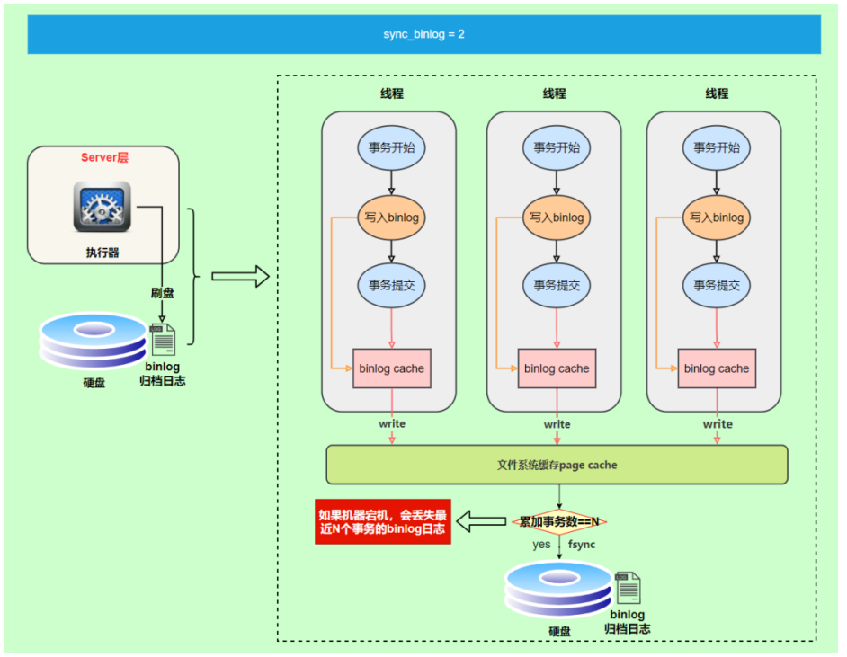
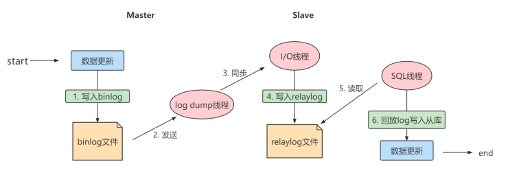
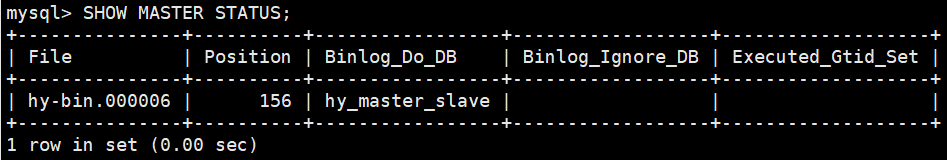

# 四、日志与备份篇

## 第 17 章：其它数据库日志

我们在讲解数据库事务时，讲过两种日志：重做日志、回滚日志。

对于线上数据库应用系统，突然遭遇 `数据库宕机` 怎么办？在这种情况下，`定位宕机的原因` 就非常关键。我们可以查看数据库的 `错误日志`。因为日志中记录了数据库运行中的诊断信息，包括了错误、警告和注释等信息。比如：从日志中发现某个连接中的 SQL 操作发生了死循环，导致内存不足，被系统强行终止了。明确了原因，处理起来也就轻松了，系统很快就恢复了运行。

除了发现错误，日志在数据复制、数据恢复、操作审计，以及确保数据的永久性和一致性等方面，都有着不可替代的作用。

**千万不要小看日志**。很多看似奇怪的问题，答案往往就藏在日志里。很多情况下，只有通过查看日志才 能发现问题的原因，真正解决问题。所以，一定要学会查看日志，养成检查日志的习惯，对提升你的数 据库应用开发能力至关重要。 

MySQL8.0 官网日志地址：“ https://dev.mysql.com/doc/refman/8.0/en/server-logs.html ”

### 1. MySQL 支持的日志

#### 1.1 日志类型

MySQL有不同类型的日志文件，用来存储不同类型的日志，分为`二进制日志`、`错误日志`、`通用查询日志`和`慢查询日志`，这也是常用的4种。MySQL 8又新增两种支持的日志：`中继日志`和`数据定义语句日志`。使用这些日志文件，可以查看MySQL内部发生的事情。

**这 6 类日志分别为：**

- **慢查询日志：** 记录所有执行时间超过long_query_time的所有查询，方便我们对查询进行优化。
- **通用查询日志：** 记录所有连接的起始时间和终止时间，以及连接发送给数据库服务器的所有指令，对我们复原操作的实际场景、发现问题，甚至是对数据库操作的审计都有很大的帮助。
- **错误日志：** 记录MySQL服务的启动、运行或停止MySQL服务时出现的问题，方便我们了解服务器的状态，从而对服务器进行维护。
- **二进制日志：** 记录所有更改数据的语句，可以用于主从服务器之间的数据同步，以及服务器遇到故障时数据的无损失恢复。
- **中继日志：** 用于主从服务器架构中，从服务器用来存放主服务器二进制日志内容的一个中间文件。从服务器通过读取中继日志的内容，来同步主服务器上的操作。
- **数据定义语句日志：** 记录数据定义语句执行的元数据操作。

除二进制日志外，其他日志都是`文本文件`。默认情况下，所有日志创建于`MySQL数据目录`中。

#### 1.2 日志的弊端

- 日志功能会`降低MySQL数据库的性能`。例如，在查询非常频繁的 MySQL 数据库系统中，如果开启了通用查询日志和慢查询日志，MySQL 数据库会花费很多时间记录日志。
- 日志会`占用大量的磁盘空间`。对于用户量非常大、操作非常频繁的数据库，日志文件需要的存储空间设置比数据库文件需要的存储空间还要大。

### 2. 慢查询日志(slow query log)

前面章节《第 09 章：性能分析工具的使用》已经详细讲述。

### 3. 通用查询日志(general query log)

通用查询日志用来`记录用户的所有操作`，包括启动和关闭 MySQL 服务、所有用户的连接开始时间和截止时间、发给 MySQL 数据库服务器的所有 SQL 指令等。当我们的数据发生异常时，**查看通用查询日志，还原操作时的具体场景**，可以帮助我们准确定位问题。

#### 3.1 问题场景

在电商系统中，购买商品并且使用微信支付完成以后，却发现支付中心的记录并没有新增，此时用户再次使用支付宝支付，就会出现 `重复支付` 的问题。但是当去数据库中查询数据的时候，会发现只有一条记录存在。那么此时给到的现象就是只有一条支付记录，但是用户却支付了两次。

我们对系统进行了仔细检查，没有发现数据问题，因为用户编号和订单编号以及第三方流水号都是对的。可是用户确实支付了两次，这个时候，我们想到了检查通用查询日志，看看当天到底发生了什么。

查看之后，发现：1 月 1 日下午 2 点，用户使用微信支付完以后，但是由于网络故障，支付中心没有及时收到微信支付的回调通知，导致当时没有写入数据，1 月 1 日下午 2 点 30，用户又使用支付宝支付，此时记录更新到支付中心，1 月 1 日晚上 9 点，微信的回调通知过来了，但是支付中心已经存在了支付宝的记录，所以只能覆盖记录了。

由于网络的原因导致了重复支付，至于解决问题的方案就很多了，这里省略。

可以看到通用查询日志可以帮助我们了解操作发生的具体时间和操作的细节，对找出异常发生的原因极其关键。

#### 3.2 查看当前状态

```sql
mysql> SHOW VARIABLES LIKE '%general%';
+------------------+-------------------------+
| Variable_name    | Value                   |
+------------------+-------------------------+
| general_log      | OFF                     |
| general_log_file | /var/lib/mysql/hy01.log |
+------------------+-------------------------+
2 rows in set (0.00 sec)
```

说明1：系统变量 general_log 的值是 OFF，即通用查询日志处于关闭状态。在 MySQL 中，这个参数的 `默认值是关闭的`。因为一旦开启记录通用查询日志，MySQL 会记录所有的连接起止和相关的 SQL 操作，这样会消耗系统资源并且占用磁盘空间。我们可以通过手动修改变量的值，在 `需要的时候开启日志`。

说明2：通用查询日志文件的名称是 hy01.log。存储路径是 /var/lib/mysql/，默认也是数据路径。这样我们就知道在哪里可以查看通用查询日志的内容了。

#### 3.3 启动日志

**方式1：永久性方式**

修改my.cnf或者my.ini配置文件来设置。在[mysqld]组下加入log选项，并重启MySQL服务。格式如下：

```properties
[mysqld] 
general_log=ON 
general_log_file=[path[filename]] #日志文件所在目录路径，filename为日志文件名
```

如果不指定目录和文件名，通用查询日志将默认存储在MySQL数据目录中的hostname.log文件中，hostname表示主机名。

**方式2：临时性方式**

```sql
SET GLOBAL general_log=on; # 开启通用查询日志
```

```sql
SET GLOBAL general_log_file=’path/filename’; # 设置日志文件保存位置
```

对应的，关闭操作SQL命令如下：

```sql
SET GLOBAL general_log=off; # 关闭通用查询日志
```

查看设置后情况：

```sql
SHOW VARIABLES LIKE 'general_log%';
```

#### 3.4 查看日志

通用查询日志是以 `文本文件` 的形式存储在文件系统中的，可以使用 `文本编辑器` 直接打开日志文件。每台 MySQL 服务器的通用查询日志内容是不同的。 

- 在 Windows 操作系统中，使用文本文件查看器； 
- 在 Linux 系统中，可以使用 vi 工具或者 gedit 工具查看； 
- 在 Mac OSX 系统中，可以使用文本文件查看器或者 vi 等工具查看。 

从 `SHOW VARIABLES LIKE 'general_log%';` 结果中可以看到通用查询日志的位置。

通过通用查询日志，可以了解用户对 MySQL 进行的操作。比如，MySQL 启动信息和用户 root 连接服务器和执行查询表的记录。

```sql
/usr/sbin/mysqld, Version: 8.0.25 (MySQL Community Server - GPL). started with:
Tcp port: 3306  Unix socket: /var/lib/mysql/mysql.sock
Time                 Id Command    Argument
2022-06-26T06:33:34.895487Z        58 Query     SHOW VARIABLES LIKE '%general%'
2022-06-26T06:34:11.890646Z        58 Query     SELECT DATABASE()
2022-06-26T06:34:11.891060Z        58 Init DB   atguigudb3
2022-06-26T06:37:07.930808Z        58 Query     show tables
2022-06-26T06:37:15.267704Z        58 Query     select * from student
2022-06-26T06:37:48.322104Z        58 Query     delete from student where id = 20
```

在通用查询日志里面，我们可以清楚地看到，什么时候开启了新的客户端登录数据库，登录之后做了什么 SQL 操作，针对的是哪个数据表等信息。

#### 3.5 停止日志

**方式1：永久性方式**

修改 `my.cnf` 或者 `my.ini` 文件，把 [mysqld] 组下的 `general_log` 值设置为 `OFF` 或者把 `general_log` 一项注释掉。修改保存后，再 `重启 MySQL 服务`，即可生效。 

举例1：

```properties
[mysqld]
general_log=OFF
```

举例2：

```properties
[mysqld]
#general_log=ON
```

**方式2：临时性方式**

使用SET语句停止MySQL通用查询日志功能：

```sql
SET GLOBAL general_log=off;
```

查询通用日志功能：

```sql
SHOW VARIABLES LIKE 'general_log%';
```

#### 3.6 删除\刷新日志

如果数据的使用非常频繁，那么通用查询日志会占用服务器非常大的磁盘空间。数据管理员可以删除很长时间之前的查询日志，以保证MySQL服务器上的硬盘空间。

**手动删除文件**

```sql
SHOW VARIABLES LIKE 'general_log%';
```

可以看出，通用查询日志的目录默认为MySQL数据目录。在该目录下手动删除通用查询日志 hy01.log。 

使用如下命令重新生成查询日志文件，具体命令如下。刷新MySQL数据目录，发现创建了新的日志文 件。前提一定要开启通用日志。

```shell
mysqladmin -uroot -p flush-logs
```

如果希望备份旧的通用查询日志，就必须先将旧的日志文件复制出来或者改名，然后执行上面的 mysqladmin 命令。正确流程如下

```shell
cd mtsql-data-directory  #输入自己的通用日志文件所在目录
mv mysql.general.log mysql.general.log.old  #指明旧的文件名 以及 新的文件名
mysqladmin -uroot -p flush-logs
```

### 4. 错误日志(error log)

错误日志记录了 MySQL 服务器启动、停止运行的时间，以及系统启动、运行和停止过程中的诊断信息，包括 `错误`、`警告` 和 `提示` 等。

通过错误日志可以查看系统的运行状态，便于及时发现故障、修复故障。如果 MySQL 服务 `出现异常`，错误日志是发现问题、解决故障的 `首选`。

#### 4.1 启动日志

在 MySQL 数据库中，错误日志功能是 `默认开启` 的。而且，错误日志 `无法被禁止`。

默认情况下，错误日志存储在 MySQL 数据库的数据文件夹下，名称默认为 `mysqld.log`（Linux系统）或 `hostname.err`（mac系统）。如果需要制定文件名，则需要在 my.cnf 或者 my.ini 中做如下配置：

```properties
[mysqld]
log-error=[path/[filename]] #path为日志文件所在的目录路径，filename为日志文件名
```

修改配置项后，需要重启 MySQL 服务以生效。

#### 4.2 查看日志

MySQL 错误日志是以文本文件形式存储的，可以使用文本编辑器直接查看。 

查询错误日志的存储路径：

```sql
mysql> SHOW VARIABLES LIKE 'log_err%';
+----------------------------+----------------------------------------+
| Variable_name              | Value                                  |
+----------------------------+----------------------------------------+
| log_error                  | /var/log/mysqld.log                    |
| log_error_services         | log_filter_internal; log_sink_internal |
| log_error_suppression_list |                                        |
| log_error_verbosity        | 2                                      |
+----------------------------+----------------------------------------+
4 rows in set (0.00 sec)
```

执行结果中可以看到错误日志文件是 mysqld.log，位于 MySQL 默认的数据目录下。

下面我们查看一下错误日志的内容。

```shell
2022-05-11T07:20:42.257310Z 0 [System] [MY-013169] [Server] /usr/sbin/mysqld (mysqld 8.0.25) initializing of server in progress as process 3751
2022-05-11T07:20:42.269642Z 1 [System] [MY-013576] [InnoDB] InnoDB initialization has started.
2022-05-11T07:20:42.578552Z 1 [System] [MY-013577] [InnoDB] InnoDB initialization has ended.
2022-05-11T07:20:43.233715Z 6 [Note] [MY-010454] [Server] A temporary password is generated for root@localhost: vsAXualuw8#e
```

可以看到，错误日志文件中记录了服务器启动的时间，以及存储引擎 InnoDB 启动和停止的时间等。我们在做初始化时候生成的数据库初始密码也是记录在 error.log 中。

#### 4.3 删除\刷新日志

对于很久以前的错误日志，数据库管理员查看这些错误日志的可能性不大，可以将这些错误日志删除，以保证 MySQL 服务器上的 `硬盘空间`。MySQL 的错误日志是以文本文件的形式存储在文件系统中的，可以 `直接删除`。

- 第 1 步（方式1）：删除操作

```shell
rm -f /var/lib/mysql/mysqld.log
```

在运行状态下删除错误日志文件后，MySQL 并不会自动创建日志文件。

- 第 1 步（方式2）：重命名文件

```shell
mv /var/log/mysqld.log /var/log/mysqld.log.old
```

- 第 2 步：重建日志

```shell
[root@hy01 log]# mysqladmin -uroot -p flush-logs
```

可能会报错：

```shell
[root@hy01 log]# mysqladmin -uroot -p flush-logs
Enter password: 
mysqladmin: refresh failed; error: 'Could not open file '/var/log/mysqld.log' for error logging.'
```

官网提示：


补充操作：

```shell
install -omysql -gmysql -m0644 /dev/null /var/log/mysqld.log
```

`flush-lgos` 指令操作：

- MySQL 5.5.7 以前的版本，flush-logs 将错误日志文件重命名为 filename.err_old，并创建新的日志文件。
- 从 MySQL 5.5.7 开始，flush-logs 只是重新打开日志文件，并不做日志备份和创建的操作。
- 如果日志文件不存在，MySQL 启动或者执行 flush-logs 时会自动创建新的日志文件。重新创建错误日志，大小为 0 字节。

#### 4.4 MySQL8.0 新特性

MySQL8.0 里对错误日志的改进。MySQL8.0 的错误日志可以理解为一个全新的日志，在这个版本里，接受了来自社区的广泛批评意见，在这些意见和建议的基础上生成了新的日志。

下面这些是来自社区的意见：

- 默认情况下内容过于冗长
- 遗漏了有用的信息
- 难以过滤某些信息
- 没有表示错误信息的子系统源
- 没有表示错误信息的子系统源
- 没有错误代码，解析消息需要识别错误
- 引导消息可能会丢失
- 固定格式

针对这些意见，MySQL 做了如下改变：

- 采用组件架构，通过不同的组件执行日志的写入和过滤功能
- 写入错误日志的全部信息都具有唯一的错误代码从 10000 开始
- 增加了一个新的消息分类 《system》 用于在错误日志中始终可见的非错误但服务器状态更改事件的消息
- 增加了额外的附加信息，例如关机时的版本信息，谁发起的关机等等。
- 两种过滤方式，Internal 和 Dragnet
- 三种写入形式，经典、JSON 和 syseventlog

> 小结：
>
> 通常情况下，管理员不需要查看错误日志。但是，MySQL 服务器发生异常时，管理员可以从错误日志中找到发生异常的时间，原因，然后根据这些信息来解决异常。

### 5. 二进制日志(bin log)

binlog 可以说是 MySQL 中比较 `重要` 的日志了，在日常开发及运维过程中，经常会遇到。

binlog 即 binary log，二进制日志文件，也叫作变更日志(update log)。它记录了数据库所有执行的`DDL`和`DML`等数据库更新事件的语句，但是不包含没有修改任何数据的语句(如数据查询语句 select、show 等)。

它以 `事件形式` 记录并保存在 `二进制文件` 中。通过这些信息，我们可以再现数据更新操作的全过程。

> 如果想要记录所有语句（例如，为了识别有问题的查询)，需要使用通用查询日志。

binlog主要应用场景：

- 一是用于 `数据恢复`，如果 MySQL 数据库意外停止，可以通过二进制日志文件来查看用户执行了哪些操作，对数据库服务器文件做了哪些修改，然后根据二进制日志文件中的记录来恢复数据库服务器。
- 二是用于 `数据复制`，由于日志的延续性和时效性，master 把它的二进制日志传递给 slaves 来达到 master-slave 数据一致的目的。可以说 MySQL 数据库的数据备份、主备、主主、主从都离不开 binlog，需要依靠 binlog 来同步数据，保证数据一致性。

可以说 MySQL 数据库中的**数据备份、主备、主主、主从**都离不开 binlog，需要依靠 binlog 来同步数据，保证数据一致性。


#### 5.1 查看默认情况

查看记录二进制日志是否开启：在 MySQL8 中默认情况下，二进制文件是开启的。

```sql
mysql> SHOW VARIABLES LIKE '%log_bin%';
+---------------------------------+-----------------------------+
| Variable_name                   | Value                       |
+---------------------------------+-----------------------------+
| log_bin                         | ON                          |
| log_bin_basename                | /var/lib/mysql/binlog       |
| log_bin_index                   | /var/lib/mysql/binlog.index |
| log_bin_trust_function_creators | OFF                         |
| log_bin_use_v1_row_events       | OFF                         |
| sql_log_bin                     | ON                          |
+---------------------------------+-----------------------------+
6 rows in set (0.00 sec)
```

- `log_bin_basename`：是 binlog 日志的基本文件名，后面会追加标识来表示每一个文件
- `log_bin_index`：是 binlog 文件的索引文件，这个文件管理了所有的 binlog 文件的目录
- `log_bin_trust_function_creators` ：限制存储过程，前面我们已经讲过了，这是因为二进制日志的一个重要功能是用于主从复制，而存储函数有可能导致主从的数据不一致。所以当开启二进制日志后，需要限制存储函数的创建、修改、调用
- `log_bin_use_v1_row_events`：此只读系统变量已弃用。ON 表示使用版本 1 二进制日志行，OFF 表示使用版本 2 二进制日志行(MySQL 5.6的默认值为 2)。

#### 5.2 日志参数设置

**方式1：永久性方式**

```properties
[mysqld] 
#启用二进制日志 
log-bin=hy-bin 
binlog_expire_logs_seconds=600 
max_binlog_size=100M
```

> 提示：
>
> 1. log-bin=mysql-bin #打开日志(主机需要打开)，这个 mysql-bin 也可以自定义，这里也可以加上路径，如：/home/www/mysql_bin_log/mysql-bin
> 2. binlog_expire_logs_seconds：此参数控制二进制日志文件保留的时长，单位是 `秒`，默认 2592000 30天–14400 4小时；86400 1天；259200 3天;
> 3. max_binlog_size：控制单个二进制日志大小，当前日志文件大小超过此变量时，执行切换动作。此参数的 `最大和默认值是 1GB`，该设置并 `不能严格控制 Binlog 的大小`，尤其是 Binlog 比较靠近最大值而又遇到一个比较大事务时，为了保证事务的完整性，可能不做切换日志的动作，只能将该事务的所有 SQL 都记录进当前日志，直到事务结束。一般情况下可采取默认值。

重新启动 MySQL 服务，查询二进制日志的信息，执行结果：

```sql
mysql> SHOW VARIABLES LIKE '%log_bin%';
+---------------------------------+-----------------------------+
| Variable_name                   | Value                       |
+---------------------------------+-----------------------------+
| log_bin                         | ON                          |
| log_bin_basename                | /var/lib/mysql/hy-bin       |
| log_bin_index                   | /var/lib/mysql/hy-bin.index |
| log_bin_trust_function_creators | OFF                         |
| log_bin_use_v1_row_events       | OFF                         |
| sql_log_bin                     | ON                          |
+---------------------------------+-----------------------------+
6 rows in set (0.00 sec)
```

**设置带文件夹的bin-log日志存放目录**

如果想改变日志文件的目录和名称，可以对my.cnf或my.ini中的log_bin参数修改如下：

```properties
[mysqld]
log-bin="/var/lib/mysql/binlog/hy-bin"
```

注意：新建的文件夹需要使用 mysql 用户，使用下面的命令即可。

```shell
chown -R -v mysql:mysql binlog
```

重启 MySQL 服务器后，新的二进制日志文件将出现在 /var/lib/mysql/binlog/ 文件夹下面：

```sql
mysql> SHOW VARIABLES LIKE '%log_bin%';
+---------------------------------+-----------------------------+
| Variable_name                   | Value                       |
+---------------------------------+-----------------------------+
| log_bin                         | ON                          |
| log_bin_basename                | /var/lib/mysql/hy-bin       |
| log_bin_index                   | /var/lib/mysql/hy-bin.index |
| log_bin_trust_function_creators | OFF                         |
| log_bin_use_v1_row_events       | OFF                         |
| sql_log_bin                     | ON                          |
+---------------------------------+-----------------------------+
6 rows in set (0.00 sec)
```

```shell
[root@hy01 binlog]# ls
hy-bin.000001 hy-bin.index
[root@hy01 binlog]# pwd
/var/lib/mysql/binlog
```

> 提升：
>
> `数据库文件最好不要与日志文件放在同一个磁盘上！`这样，当数据库文件所在的磁盘发生故障时，可以使用日志文件恢复数据。

**方式2：临时性方式**

如果不希望通过修改配置文件并重启的方式设置二进制日志的话，还可以使用如下指令，需要注意的是在 mysql8 中只有 `会话级别` 的设置，没有了 global 级别的设置。

```sql
# global 级别
mysql> set global sql_log_bin=0;
ERROR 1228 (HY000): Variable 'sql_log_bin' is a SESSION variable and can`t be used
with SET GLOBAL

# session级别
mysql> SET sql_log_bin=0;
Query OK, 0 rows affected (0.01 秒)
```

#### 5.3 查看日志

当 MySQL 创建二进制日志文件时，先创建一个以“filename”为名称、以“.index”为后缀的文件，再创建一 个以“filename”为名称、以“.000001”为后缀的文件。 

MySQL服务 `重新启动一次`，以 “.000001” 为后缀的文件就会增加一个，并且后缀名按 1 递增。即日志文件的 个数与 MySQL 服务启动的次数相同；如果日志长度超过了 `max_binlog_size` 的上限（默认是1GB），就会创建一个新的日志文件。 查看当前的二进制日志文件列表及大小。指令如下：

```SQL
mysql> SHOW BINARY LOGS;
+---------------+-----------+-----------+
| Log_name      | File_size | Encrypted |
+---------------+-----------+-----------+
| hy-bin.000001 |       156 | No        |
+---------------+-----------+-----------+
1 row in set (0.00 sec)
```

所有对数据库的修改都会记录在 binglog 中。但 binlog 是二进制文件，无法直接查看，想要更直观的观测它就要借助 `mysqlbinlog` 命令工具了。指令如下：在查看执行，先执行一条 SQL 语句，如下

```sql
mysql> INSERT INTO student(id, name, class) VALUES(18, 'Jerry', '四班');
Query OK, 1 row affected (0.01 sec)

mysql> UPDATE student SET name = 'Tom1' WHERE id = 8;
Query OK, 1 row affected (0.00 sec)
Rows matched: 1  Changed: 1  Warnings: 0
```

开始查看 binlog

```shell
mysqlbinlog -v "/var/lib/mysql/binlog/atguigu-bin.000002"

/*!50530 SET @@SESSION.PSEUDO_SLAVE_MODE=1*/;
/*!50003 SET @OLD_COMPLETION_TYPE=@@COMPLETION_TYPE,COMPLETION_TYPE=0*/;
DELIMITER /*!*/;
# at 4
#220626 16:02:22 server id 1  end_log_pos 125 CRC32 0x550be668 	Start: binlog v 4, server v 8.0.25 created 220626 16:02:22 at startup
# Warning: this binlog is either in use or was not closed properly.
ROLLBACK/*!*/;
BINLOG '
jhK4Yg8BAAAAeQAAAH0AAAABAAQAOC4wLjI1AAAAAAAAAAAAAAAAAAAAAAAAAAAAAAAAAAAAAAAA
AAAAAAAAAAAAAAAAAACOErhiEwANAAgAAAAABAAEAAAAYQAEGggAAAAICAgCAAAACgoKKioAEjQA
CigBaOYLVQ==
'/*!*/;
# at 125
#220626 16:02:22 server id 1  end_log_pos 156 CRC32 0xbf637843 	Previous-GTIDs
# [empty]
# at 156
#220626 16:21:38 server id 1  end_log_pos 235 CRC32 0xae2cfe54 	Anonymous_GTID	last_committed=0	sequence_number=1	rbr_only=yes	original_committed_timestamp=1656231698533007	immediate_commit_timestamp=1656231698533007	transaction_length=312
/*!50718 SET TRANSACTION ISOLATION LEVEL READ COMMITTED*//*!*/;
# original_commit_timestamp=1656231698533007 (2022-06-26 16:21:38.533007 CST)
# immediate_commit_timestamp=1656231698533007 (2022-06-26 16:21:38.533007 CST)
/*!80001 SET @@session.original_commit_timestamp=1656231698533007*//*!*/;
/*!80014 SET @@session.original_server_version=80025*//*!*/;
/*!80014 SET @@session.immediate_server_version=80025*//*!*/;
SET @@SESSION.GTID_NEXT= 'ANONYMOUS'/*!*/;
# at 235
#220626 16:21:38 server id 1  end_log_pos 316 CRC32 0xe874172f 	Query	thread_id=8	exec_time=0	error_code=0
SET TIMESTAMP=1656231698/*!*/;
SET @@session.pseudo_thread_id=8/*!*/;
SET @@session.foreign_key_checks=1, @@session.sql_auto_is_null=0, @@session.unique_checks=1, @@session.autocommit=1/*!*/;
SET @@session.sql_mode=1168113696/*!*/;
SET @@session.auto_increment_increment=1, @@session.auto_increment_offset=1/*!*/;
/*!\C utf8mb4 *//*!*/;
SET @@session.character_set_client=255,@@session.collation_connection=255,@@session.collation_server=255/*!*/;
SET @@session.lc_time_names=0/*!*/;
SET @@session.collation_database=DEFAULT/*!*/;
/*!80011 SET @@session.default_collation_for_utf8mb4=255*//*!*/;
BEGIN
/*!*/;
# at 316
#220626 16:21:38 server id 1  end_log_pos 384 CRC32 0xd64868fc 	Table_map: `atguigudb3`.`student` mapped to number 92
# at 384
#220626 16:21:38 server id 1  end_log_pos 437 CRC32 0x6f54e1d3 	Write_rows: table id 92 flags: STMT_END_F

BINLOG '
Ehe4YhMBAAAARAAAAIABAAAAAFwAAAAAAAEACmF0Z3VpZ3VkYjMAB3N0dWRlbnQAAwMPDwQ8ADwA
BgEBAAIBIfxoSNY=
Ehe4Yh4BAAAANQAAALUBAAAAAFwAAAAAAAEAAgAD/wASAAAABUplcnJ5BuWbm+ePrdPhVG8=
'/*!*/;
# at 437
#220626 16:21:38 server id 1  end_log_pos 468 CRC32 0x9d7bb5e4 	Xid = 17
COMMIT/*!*/;
# at 468
#220626 16:22:14 server id 1  end_log_pos 547 CRC32 0xbb63d650 	Anonymous_GTID	last_committed=1	sequence_number=2	rbr_only=yes	original_committed_timestamp=1656231734625383	immediate_commit_timestamp=1656231734625383	transaction_length=340
/*!50718 SET TRANSACTION ISOLATION LEVEL READ COMMITTED*//*!*/;
# original_commit_timestamp=1656231734625383 (2022-06-26 16:22:14.625383 CST)
# immediate_commit_timestamp=1656231734625383 (2022-06-26 16:22:14.625383 CST)
/*!80001 SET @@session.original_commit_timestamp=1656231734625383*//*!*/;
/*!80014 SET @@session.original_server_version=80025*//*!*/;
/*!80014 SET @@session.immediate_server_version=80025*//*!*/;
SET @@SESSION.GTID_NEXT= 'ANONYMOUS'/*!*/;
# at 547
#220626 16:22:14 server id 1  end_log_pos 637 CRC32 0x9b316417 	Query	thread_id=8	exec_time=0	error_code=0
SET TIMESTAMP=1656231734/*!*/;
BEGIN
/*!*/;
# at 637
#220626 16:22:14 server id 1  end_log_pos 705 CRC32 0xaa6de23d 	Table_map: `atguigudb3`.`student` mapped to number 92
# at 705
#220626 16:22:14 server id 1  end_log_pos 777 CRC32 0x957edd72 	Update_rows: table id 92 flags: STMT_END_F

BINLOG '
Nhe4YhMBAAAARAAAAMECAAAAAFwAAAAAAAEACmF0Z3VpZ3VkYjMAB3N0dWRlbnQAAwMPDwQ8ADwA
BgEBAAIBIT3ibao=
Nhe4Yh8BAAAASAAAAAkDAAAAAFwAAAAAAAEAAgAD//8ACAAAAAbnjovkupQG5LqM54+tAAgAAAAE
VG9tMQbkuoznj61y3X6V
'/*!*/;
# at 777
#220626 16:22:14 server id 1  end_log_pos 808 CRC32 0xede9f729 	Xid = 18
COMMIT/*!*/;
SET @@SESSION.GTID_NEXT= 'AUTOMATIC' /* added by mysqlbinlog */ /*!*/;
DELIMITER ;
# End of log file
/*!50003 SET COMPLETION_TYPE=@OLD_COMPLETION_TYPE*/;
/*!50530 SET @@SESSION.PSEUDO_SLAVE_MODE=0*/;
```

执行结果可以看到，这是一个简单的日志文件，日志中记录了用户的一些操作，这里并没有出现具体的 SQL 语句，这是因为 binlog 关键字后面的内容是经过编码后的 `二进制日志`。

这是一个 update 语句包含如下事件

- Query 事件 负责开始一个事务(BEGIN)
- Table_map 事件 负责映射需要的表
- Update_rows 事件 负责写入数据
- Xid 事件 负责结束事务

下面命令将行事件以 `伪 SQL 的形式` 表现出来

```shell
[root@hy01 mysql]# mysqlbinlog -v "/var/lib/mysql/hy-bin.000001"

/*!50530 SET @@SESSION.PSEUDO_SLAVE_MODE=1*/;
/*!50003 SET @OLD_COMPLETION_TYPE=@@COMPLETION_TYPE,COMPLETION_TYPE=0*/;
DELIMITER /*!*/;
# at 4
#220626 16:02:22 server id 1  end_log_pos 125 CRC32 0x550be668 	Start: binlog v 4, server v 8.0.25 created 220626 16:02:22 at startup
# Warning: this binlog is either in use or was not closed properly.
ROLLBACK/*!*/;
BINLOG '
jhK4Yg8BAAAAeQAAAH0AAAABAAQAOC4wLjI1AAAAAAAAAAAAAAAAAAAAAAAAAAAAAAAAAAAAAAAA
AAAAAAAAAAAAAAAAAACOErhiEwANAAgAAAAABAAEAAAAYQAEGggAAAAICAgCAAAACgoKKioAEjQA
CigBaOYLVQ==
'/*!*/;
# at 125
#220626 16:02:22 server id 1  end_log_pos 156 CRC32 0xbf637843 	Previous-GTIDs
# [empty]
# at 156
#220626 16:21:38 server id 1  end_log_pos 235 CRC32 0xae2cfe54 	Anonymous_GTID	last_committed=0	sequence_number=1	rbr_only=yes	original_committed_timestamp=1656231698533007	immediate_commit_timestamp=1656231698533007	transaction_length=312
/*!50718 SET TRANSACTION ISOLATION LEVEL READ COMMITTED*//*!*/;
# original_commit_timestamp=1656231698533007 (2022-06-26 16:21:38.533007 CST)
# immediate_commit_timestamp=1656231698533007 (2022-06-26 16:21:38.533007 CST)
/*!80001 SET @@session.original_commit_timestamp=1656231698533007*//*!*/;
/*!80014 SET @@session.original_server_version=80025*//*!*/;
/*!80014 SET @@session.immediate_server_version=80025*//*!*/;
SET @@SESSION.GTID_NEXT= 'ANONYMOUS'/*!*/;
# at 235
#220626 16:21:38 server id 1  end_log_pos 316 CRC32 0xe874172f 	Query	thread_id=8	exec_time=0	error_code=0
SET TIMESTAMP=1656231698/*!*/;
SET @@session.pseudo_thread_id=8/*!*/;
SET @@session.foreign_key_checks=1, @@session.sql_auto_is_null=0, @@session.unique_checks=1, @@session.autocommit=1/*!*/;
SET @@session.sql_mode=1168113696/*!*/;
SET @@session.auto_increment_increment=1, @@session.auto_increment_offset=1/*!*/;
/*!\C utf8mb4 *//*!*/;
SET @@session.character_set_client=255,@@session.collation_connection=255,@@session.collation_server=255/*!*/;
SET @@session.lc_time_names=0/*!*/;
SET @@session.collation_database=DEFAULT/*!*/;
/*!80011 SET @@session.default_collation_for_utf8mb4=255*//*!*/;
BEGIN
/*!*/;
# at 316
#220626 16:21:38 server id 1  end_log_pos 384 CRC32 0xd64868fc 	Table_map: `atguigudb3`.`student` mapped to number 92
# at 384
#220626 16:21:38 server id 1  end_log_pos 437 CRC32 0x6f54e1d3 	Write_rows: table id 92 flags: STMT_END_F

BINLOG '
Ehe4YhMBAAAARAAAAIABAAAAAFwAAAAAAAEACmF0Z3VpZ3VkYjMAB3N0dWRlbnQAAwMPDwQ8ADwA
BgEBAAIBIfxoSNY=
Ehe4Yh4BAAAANQAAALUBAAAAAFwAAAAAAAEAAgAD/wASAAAABUplcnJ5BuWbm+ePrdPhVG8=
'/*!*/;
### INSERT INTO `atguigudb3`.`student`
### SET
###   @1=18
###   @2='Jerry'
###   @3='四班'
# at 437
#220626 16:21:38 server id 1  end_log_pos 468 CRC32 0x9d7bb5e4 	Xid = 17
COMMIT/*!*/;
# at 468
#220626 16:22:14 server id 1  end_log_pos 547 CRC32 0xbb63d650 	Anonymous_GTID	last_committed=1	sequence_number=2	rbr_only=yes	original_committed_timestamp=1656231734625383	immediate_commit_timestamp=1656231734625383	transaction_length=340
/*!50718 SET TRANSACTION ISOLATION LEVEL READ COMMITTED*//*!*/;
# original_commit_timestamp=1656231734625383 (2022-06-26 16:22:14.625383 CST)
# immediate_commit_timestamp=1656231734625383 (2022-06-26 16:22:14.625383 CST)
/*!80001 SET @@session.original_commit_timestamp=1656231734625383*//*!*/;
/*!80014 SET @@session.original_server_version=80025*//*!*/;
/*!80014 SET @@session.immediate_server_version=80025*//*!*/;
SET @@SESSION.GTID_NEXT= 'ANONYMOUS'/*!*/;
# at 547
#220626 16:22:14 server id 1  end_log_pos 637 CRC32 0x9b316417 	Query	thread_id=8	exec_time=0	error_code=0
SET TIMESTAMP=1656231734/*!*/;
BEGIN
/*!*/;
# at 637
#220626 16:22:14 server id 1  end_log_pos 705 CRC32 0xaa6de23d 	Table_map: `atguigudb3`.`student` mapped to number 92
# at 705
#220626 16:22:14 server id 1  end_log_pos 777 CRC32 0x957edd72 	Update_rows: table id 92 flags: STMT_END_F

BINLOG '
Nhe4YhMBAAAARAAAAMECAAAAAFwAAAAAAAEACmF0Z3VpZ3VkYjMAB3N0dWRlbnQAAwMPDwQ8ADwA
BgEBAAIBIT3ibao=
Nhe4Yh8BAAAASAAAAAkDAAAAAFwAAAAAAAEAAgAD//8ACAAAAAbnjovkupQG5LqM54+tAAgAAAAE
VG9tMQbkuoznj61y3X6V
'/*!*/;
### UPDATE `atguigudb3`.`student`
### WHERE
###   @1=8
###   @2='王五'
###   @3='二班'
### SET
###   @1=8
###   @2='Tom1'
###   @3='二班'
# at 777
#220626 16:22:14 server id 1  end_log_pos 808 CRC32 0xede9f729 	Xid = 18
COMMIT/*!*/;
SET @@SESSION.GTID_NEXT= 'AUTOMATIC' /* added by mysqlbinlog */ /*!*/;
DELIMITER ;
# End of log file
/*!50003 SET COMPLETION_TYPE=@OLD_COMPLETION_TYPE*/;
/*!50530 SET @@SESSION.PSEUDO_SLAVE_MODE=0*/;
```

关于 mysqlbinlog 工具的使用技巧还有很多，例如只解析对某个库的操作或者某个时间段内的操作等。简 单分享几个常用的语句，更多操作可以参考官方文档。

```shell
# 可查看参数帮助
mysqlbinlog --no-defaults --help

# 查看最后100行
mysqlbinlog --no-defaults --base64-output=decode-rows -vv atguigu-bin.000002 |tail -100

# 根据position查找
mysqlbinlog --no-defaults --base64-output=decode-rows -vv atguigu-bin.000002 |grep -A 20 '4939002'
```

上面这种办法读取出 binlog 日志的全文内容比较多，不容易分辨查看到 pos 点信息，下面介绍一种更为方便的查询命令：

```sql
mysql> show binlog events [IN 'log_name'] [FROM pos] [LIMIT [offset,] row_count];
```

- `IN 'log_name'`：指定要查询的 binlog 文件名（不指定就是第一个 binlog 文件）　 
- `FROM pos`：指定从哪个 pos 起始点开始查起（不指定就是从整个文件首个 pos 点开始算） 
- `LIMIT [offset]`：偏移量(不指定就是0) 
- `row_count`：查询总条数（不指定就是所有行）

```sql
mysql> SHOW BINLOG EVENTS IN 'hy-bin.000001';
+---------------+-----+----------------+-----------+-------------+--------------------------------------+
| Log_name      | Pos | Event_type     | Server_id | End_log_pos | Info                                 |
+---------------+-----+----------------+-----------+-------------+--------------------------------------+
| hy-bin.000001 |   4 | Format_desc    |         1 |         125 | Server ver: 8.0.25, Binlog ver: 4    |
| hy-bin.000001 | 125 | Previous_gtids |         1 |         156 |                                      |
| hy-bin.000001 | 156 | Anonymous_Gtid |         1 |         235 | SET @@SESSION.GTID_NEXT= 'ANONYMOUS' |
| hy-bin.000001 | 235 | Query          |         1 |         316 | BEGIN                                |
| hy-bin.000001 | 316 | Table_map      |         1 |         384 | table_id: 92 (atguigudb3.student)    |
| hy-bin.000001 | 384 | Write_rows     |         1 |         437 | table_id: 92 flags: STMT_END_F       |
| hy-bin.000001 | 437 | Xid            |         1 |         468 | COMMIT /* xid=17 */                  |
| hy-bin.000001 | 468 | Anonymous_Gtid |         1 |         547 | SET @@SESSION.GTID_NEXT= 'ANONYMOUS' |
| hy-bin.000001 | 547 | Query          |         1 |         637 | BEGIN                                |
| hy-bin.000001 | 637 | Table_map      |         1 |         705 | table_id: 92 (atguigudb3.student)    |
| hy-bin.000001 | 705 | Update_rows    |         1 |         777 | table_id: 92 flags: STMT_END_F       |
| hy-bin.000001 | 777 | Xid            |         1 |         808 | COMMIT /* xid=18 */                  |
+---------------+-----+----------------+-----------+-------------+--------------------------------------+
12 rows in set (0.01 sec)
```

上面这条语句还可以指定的 binlog 日志文件，分成有效事件行的方式返回，并可使用 limit 指定 pos 点的起始偏移，查询条数。其它举例：

```sql
#a.查询第一最早的 binlog 日志
SHOW BINLOG EVENTS\G;

#b.指定查询 mysql-bin.000002 这个文件
SHOW BINLOG EVENTS IN 'hy-bin.000001'\G;

#c.指定查询 mysql-bin.000002 这个文件，从 pos 点:391 开始查起：
SHOW BINLOG EVENTS IN 'hy-bin.000001' FROM 391\G;

#d.指定查询 mysql-bin.000002 这个文件，从 pos 点:391 开始查起，查询 5 条（即 5 条语句）：
SHOW BINLOG EVENTS IN 'hy-bin.000001' FROM 391 LIMIT 5\G;

#d.指定查询 mysql-bin.000002 这个文件，从 pos 点:391 开始查起，偏移 2 行（即中间跳过 2 个）查询 5 条（即 5 条语句）：
SHOW BINLOG EVENTS IN 'hy-bin.000001' FROM 391 LIMIT 2, 5\G;
```

上面我们讲了这么多都是基于 binlog 的默认格式，binlog 格式查看

```sql
mysql> SHOW VARIABLES LIKE 'binlog_format';
+---------------+-------+
| Variable_name | Value |
+---------------+-------+
| binlog_format | ROW   |
+---------------+-------+
1 row in set (0.00 sec)
```

除此之外，binlog 还要 2 种格式，分别是**Statement**和**Mixed**

- **Statement** 

每一条会修改数据的 sql 都会记录在 binlog 中。 

优点：不需要记录每一行的变化，减少了 binlog 日志量，节约了 IO，提高性能。 

- **Row** 

5.1.5 版本的 MySQL 才开始支持 row level 的复制，它不记录 sql 语句上下文相关信息，仅保存哪条记录被修改。 

优点：row level 的日志内容会非常清楚的记录下每一行数据修改的细节。而且不会出现某些特定情况下的存储过程，或 function，以及 trigger 的调用和触发无法被正确复制的问题。 

- **Mixed** 

从 5.1.8 版本开始，MySQL 提供了 Mixed 格式，实际上就是 Statement 与 Row 的结合。

详细情况，下章讲解。

#### 5.4 使用日志恢复数据

如果 MySQL 服务器启用了二进制日志，在数据库出现意外丢失数据时，可以使用 MySQLbinlog 工具从指定的时间点开始（例如，最后一次备份）直到现在或另一个指定的时间点的日志中恢复数据。

mysqlbinlog 恢复数据的语法如下：

```shell
mysqlbinlog [option] filename|mysql –uuser -ppass;
```

这个命令可以这样理解：使用 mysqlbinlog 命令来读取 filename 中的内容，然后使用 mysql 命令将这些内容恢复到数据库中。

- `filename`：是日志文件名。

- `option`：可选项，比较重要的两对option参数是–start-date、–stop-date 和 --start-position、-- stop-position。

  - `--start-date 和 --stop-date`：可以指定恢复数据库的起始时间点和结束时间点。

  - `--start-position和--stop-position`：可以指定恢复数据的开始位置和结束位置。

> 注意：使用mysqlbinlog命令进行恢复操作时，必须是编号小的先恢复，例如atguigu-bin.000001必须在atguigu-bin.000002之前恢复。

案例：

现在对 student 表有以下操作

```sql
#查询数据
mysql> SELECT * FROM student;
+----+--------+--------+
| id | name   | class  |
+----+--------+--------+
|  1 | 张三   | 一班   |
|  3 | 李四   | 一班   |
|  8 | Tom1   | 二班   |
| 15 | 赵六   | 二班   |
| 18 | Jerry  | 四班   |
+----+--------+--------+
5 rows in set (0.01 sec)

#插入一批数据
mysql> INSERT INTO student(id,name,class) VALUES(20,'aaa','No.1');
Query OK, 1 row affected (0.00 sec)

mysql> INSERT INTO student(id,name,class) VALUES(21,'aaa','No.1');
Query OK, 1 row affected (0.00 sec)

mysql> INSERT INTO student(id,name,class) VALUES(22,'aaa','No.1');
Query OK, 1 row affected (0.00 sec)

#查询数据
mysql> SELECT * FROM student;
+----+--------+--------+
| id | name   | class  |
+----+--------+--------+
|  1 | 张三   | 一班   |
|  3 | 李四   | 一班   |
|  8 | Tom1   | 二班   |
| 15 | 赵六   | 二班   |
| 18 | Jerry  | 四班   |
| 20 | aaa    | No.1   |
| 21 | aaa    | No.1   |
| 22 | aaa    | No.1   |
+----+--------+--------+
8 rows in set (0.00 sec)

#删除数据
mysql> DELETE FROM student WHERE id=20;
Query OK, 1 row affected (0.01 sec)

#查询数据
mysql> SELECT * FROM student;
+----+--------+--------+
| id | name   | class  |
+----+--------+--------+
|  1 | 张三   | 一班   |
|  3 | 李四   | 一班   |
|  8 | Tom1   | 二班   |
| 15 | 赵六   | 二班   |
| 18 | Jerry  | 四班   |
| 21 | aaa    | No.1   |
| 22 | aaa    | No.1   |
+----+--------+--------+
7 rows in set (0.00 sec)

#更新数据
mysql> UPDATE student SET name='bbb' WHERE id=21;
Query OK, 1 row affected (0.00 sec)
Rows matched: 1  Changed: 1  Warnings: 0

#查询数据
mysql> SELECT * FROM student;
+----+--------+--------+
| id | name   | class  |
+----+--------+--------+
|  1 | 张三   | 一班   |
|  3 | 李四   | 一班   |
|  8 | Tom1   | 二班   |
| 15 | 赵六   | 二班   |
| 18 | Jerry  | 四班   |
| 21 | bbb    | No.1   |
| 22 | aaa    | No.1   |
+----+--------+--------+
7 rows in set (0.00 sec)
```

上面是对 student 表做的插入、更新和删除操作，现在不小心删除了所有新增的数据，现在目标是恢复后面所因新增，更新和删除的数据，当前表中数据如下。

```sql
#查询数据
mysql> SELECT * FROM student;
+----+--------+--------+
| id | name   | class  |
+----+--------+--------+
|  1 | 张三   | 一班   |
|  3 | 李四   | 一班   |
|  8 | Tom1   | 二班   |
| 15 | 赵六   | 二班   |
| 18 | Jerry  | 四班   |
+----+--------+--------+
5 rows in set (0.00 sec)
```

接下来首先查看 binlog，如下所示

```sql
mysql> SHOW BINARY LOGS;
+---------------+-----------+-----------+
| Log_name      | File_size | Encrypted |
+---------------+-----------+-----------+
| hy-bin.000001 |      2694 | No        |
+---------------+-----------+-----------+
1 row in set (0.00 sec)
```

上面所有操作都保存在 hy-bin.000001 日志中，如果工作中可以先备份下这个 hy-bin.000001 日志文件，接着执行 flush logs 刷新日志，重新创建一个 binlog 日志 2。

```sql
mysql> SHOW BINARY LOGS;
+---------------+-----------+-----------+
| Log_name      | File_size | Encrypted |
+---------------+-----------+-----------+
| hy-bin.000001 |      2738 | No        |
| hy-bin.000002 |       156 | No        |
+---------------+-----------+-----------+
2 rows in set (0.00 sec)
```

重新创建一个日志 2 的目的：接下来所有操作的数据都会写入到日志 2 中，日志 1 不会再写入任何数据（方便根据日志 1 的内容恢复数据，因为日志 1 的数据就是备份之后到删库之前的所有操作日志，重建日志 2 不会有过多的数据影响恢复）

登录 mysql 查看日志 1：SHOW BINLOG EVENTS IN 'hy-bin.000001'; 结果如下：

```sql
SHOW BINLOG EVENTS IN 'hy-bin.000001';
```

```sql
mysql> SHOW BINLOG EVENTS IN 'hy-bin.000001';
+---------------+------+----------------+-----------+-------------+--------------------------------------+
| Log_name      | Pos  | Event_type     | Server_id | End_log_pos | Info                                 |
+---------------+------+----------------+-----------+-------------+--------------------------------------+
| hy-bin.000001 |    4 | Format_desc    |         1 |         125 | Server ver: 8.0.25, Binlog ver: 4    |
| hy-bin.000001 |  125 | Previous_gtids |         1 |         156 |                                      |
| hy-bin.000001 |  156 | Anonymous_Gtid |         1 |         235 | SET @@SESSION.GTID_NEXT= 'ANONYMOUS' |
| hy-bin.000001 |  235 | Query          |         1 |         316 | BEGIN                                |
| hy-bin.000001 |  316 | Table_map      |         1 |         384 | table_id: 92 (atguigudb3.student)    |
| hy-bin.000001 |  384 | Write_rows     |         1 |         437 | table_id: 92 flags: STMT_END_F       |
| hy-bin.000001 |  437 | Xid            |         1 |         468 | COMMIT /* xid=17 */                  |
| hy-bin.000001 |  468 | Anonymous_Gtid |         1 |         547 | SET @@SESSION.GTID_NEXT= 'ANONYMOUS' |
| hy-bin.000001 |  547 | Query          |         1 |         637 | BEGIN                                |
| hy-bin.000001 |  637 | Table_map      |         1 |         705 | table_id: 92 (atguigudb3.student)    |
| hy-bin.000001 |  705 | Update_rows    |         1 |         777 | table_id: 92 flags: STMT_END_F       |
| hy-bin.000001 |  777 | Xid            |         1 |         808 | COMMIT /* xid=18 */                  |
| hy-bin.000001 |  808 | Anonymous_Gtid |         1 |         887 | SET @@SESSION.GTID_NEXT= 'ANONYMOUS' |
| hy-bin.000001 |  887 | Query          |         1 |         968 | BEGIN                                |
| hy-bin.000001 |  968 | Table_map      |         1 |        1036 | table_id: 92 (atguigudb3.student)    |
| hy-bin.000001 | 1036 | Write_rows     |         1 |        1085 | table_id: 92 flags: STMT_END_F       |
| hy-bin.000001 | 1085 | Xid            |         1 |        1116 | COMMIT /* xid=28 */                  |
| hy-bin.000001 | 1116 | Anonymous_Gtid |         1 |        1195 | SET @@SESSION.GTID_NEXT= 'ANONYMOUS' |
| hy-bin.000001 | 1195 | Query          |         1 |        1276 | BEGIN                                |
| hy-bin.000001 | 1276 | Table_map      |         1 |        1344 | table_id: 92 (atguigudb3.student)    |
| hy-bin.000001 | 1344 | Write_rows     |         1 |        1393 | table_id: 92 flags: STMT_END_F       |
| hy-bin.000001 | 1393 | Xid            |         1 |        1424 | COMMIT /* xid=29 */                  |
| hy-bin.000001 | 1424 | Anonymous_Gtid |         1 |        1503 | SET @@SESSION.GTID_NEXT= 'ANONYMOUS' |
| hy-bin.000001 | 1503 | Query          |         1 |        1584 | BEGIN                                |
| hy-bin.000001 | 1584 | Table_map      |         1 |        1652 | table_id: 92 (atguigudb3.student)    |
| hy-bin.000001 | 1652 | Write_rows     |         1 |        1701 | table_id: 92 flags: STMT_END_F       |
| hy-bin.000001 | 1701 | Xid            |         1 |        1732 | COMMIT /* xid=30 */                  |
| hy-bin.000001 | 1732 | Anonymous_Gtid |         1 |        1811 | SET @@SESSION.GTID_NEXT= 'ANONYMOUS' |
| hy-bin.000001 | 1811 | Query          |         1 |        1892 | BEGIN                                |
| hy-bin.000001 | 1892 | Table_map      |         1 |        1960 | table_id: 92 (atguigudb3.student)    |
| hy-bin.000001 | 1960 | Delete_rows    |         1 |        2009 | table_id: 92 flags: STMT_END_F       |
| hy-bin.000001 | 2009 | Xid            |         1 |        2040 | COMMIT /* xid=32 */                  |
| hy-bin.000001 | 2040 | Anonymous_Gtid |         1 |        2119 | SET @@SESSION.GTID_NEXT= 'ANONYMOUS' |
| hy-bin.000001 | 2119 | Query          |         1 |        2209 | BEGIN                                |
| hy-bin.000001 | 2209 | Table_map      |         1 |        2277 | table_id: 92 (atguigudb3.student)    |
| hy-bin.000001 | 2277 | Update_rows    |         1 |        2341 | table_id: 92 flags: STMT_END_F       |
| hy-bin.000001 | 2341 | Xid            |         1 |        2372 | COMMIT /* xid=34 */                  |
| hy-bin.000001 | 2372 | Anonymous_Gtid |         1 |        2451 | SET @@SESSION.GTID_NEXT= 'ANONYMOUS' |
| hy-bin.000001 | 2451 | Query          |         1 |        2532 | BEGIN                                |
| hy-bin.000001 | 2532 | Table_map      |         1 |        2600 | table_id: 92 (atguigudb3.student)    |
| hy-bin.000001 | 2600 | Delete_rows    |         1 |        2663 | table_id: 92 flags: STMT_END_F       |
| hy-bin.000001 | 2663 | Xid            |         1 |        2694 | COMMIT /* xid=36 */                  |
| hy-bin.000001 | 2694 | Rotate         |         1 |        2738 | hy-bin.000002;pos=4                  |
+---------------+------+----------------+-----------+-------------+--------------------------------------+
43 rows in set (0.00 sec)
```

查看日志发现，在本费数据后首先执行的插入数据操作，在 info 信息中 xid 的值分别是 887,1195,1503；

**步骤1：恢复插入的数据**

插入的操作在三个事务中，而且三个事务是连在一起的，索引我们可以直接恢复三个事务，开始 pos 是 887，结束 pos 是 1701

```shell
[root@hy01 mysql]# /usr/bin/mysqlbinlog --start-position=887 --stop-position=1732 --database=atguigudb3 /var/lib/mysql/hy-bin.000001 | /usr/bin/mysql -uroot -proot -v atguigudb3
```

结果如下

```sql
mysql> SELECT * FROM student;
+----+--------+--------+
| id | name   | class  |
+----+--------+--------+
|  1 | 张三   | 一班   |
|  3 | 李四   | 一班   |
|  8 | Tom1   | 二班   |
| 15 | 赵六   | 二班   |
| 18 | Jerry  | 四班   |
| 20 | aaa    | No.1   |
| 21 | aaa    | No.1   |
| 22 | aaa    | No.1   |
+----+--------+--------+
8 rows in set (0.00 sec)
```

**步骤2：恢复删除操作**

删除操作的开始 pos 是 1811，结束 pos 是 2040

```shell
[root@hy01 mysql]# /usr/bin/mysqlbinlog --start-position=1811 --stop-position=2040 --database=atguigudb3 /var/lib/mysql/hy-bin.000001 | /usr/bin/mysql -uroot -proot -v atguigudb3
```

执行完结果如下

```sql
mysql> SELECT * FROM student;
+----+--------+--------+
| id | name   | class  |
+----+--------+--------+
|  1 | 张三   | 一班   |
|  3 | 李四   | 一班   |
|  8 | Tom1   | 二班   |
| 15 | 赵六   | 二班   |
| 18 | Jerry  | 四班   |
| 21 | aaa    | No.1   |
| 22 | aaa    | No.1   |
+----+--------+--------+
7 rows in set (0.00 sec)
```

**步骤3：恢复更新操作**

更新操作的开始 pos 是 2119，结束 pos 是 2372

```shell
[root@hy01 mysql]# /usr/bin/mysqlbinlog --start-position=2119 --stop-position=2372 --database=atguigudb3 /var/lib/mysql/hy-bin.000001 | /usr/bin/mysql -uroot -proot -v atguigudb3
```

执行完结果如下

```sql
mysql> SELECT * FROM student;
+----+--------+--------+
| id | name   | class  |
+----+--------+--------+
|  1 | 张三   | 一班   |
|  3 | 李四   | 一班   |
|  8 | Tom1   | 二班   |
| 15 | 赵六   | 二班   |
| 18 | Jerry  | 四班   |
| 21 | bbb    | No.1   |
| 22 | aaa    | No.1   |
+----+--------+--------+
7 rows in set (0.00 sec)
```

可以看到最终结果和删除数据之前的结果一样，利用 binlog 实现了数据恢复。

当然也可以使用日期恢复，命令格式如下：

```shell
[root@hy01 mysql]# /usr/bin/mysqlbinlog --start-datetime="2022-06-26 16:53:32" --stop-datetime="2022-06-26 16:54:00" --database=atguigudb3 /var/lib/mysql/hy-bin.000001 | /usr/bin/mysql -uroot -proot -v atguigudb3
```

日期可以根据 binlog 日志详情查看，如下所示。可能出现一个事务执行时间过短，那么就是同样的时间，一秒内执行完成，此时我们找到下一个事务的开始时间即可，多计算一些时间就可以了。本次事务的开始时间是 220626 16:53:32，结束时间设置为 220626 16:54:00。

```shell
# at 968
#220626 16:53:32 server id 1  end_log_pos 1036 CRC32 0xc18bbd9f 	Table_map: `atguigudb3`.`student` mapped to number 92
# at 1036
#220626 16:53:32 server id 1  end_log_pos 1085 CRC32 0xfdd67b3f 	Write_rows: table id 92 flags: STMT_END_F

BINLOG '
jB64YhMBAAAARAAAAAwEAAAAAFwAAAAAAAEACmF0Z3VpZ3VkYjMAB3N0dWRlbnQAAwMPDwQ8ADwA
BgEBAAIBIZ+9i8E=
jB64Yh4BAAAAMQAAAD0EAAAAAFwAAAAAAAEAAgAD/wAUAAAAA2FhYQROby4xP3vW/Q==
'/*!*/;
# at 1085
#220626 16:53:32 server id 1  end_log_pos 1116 CRC32 0xa7d619aa 	Xid = 28
COMMIT/*!*/;
# at 1116
#220626 16:53:37 server id 1  end_log_pos 1195 CRC32 0xd301cfb9 	Anonymous_GTID	last_committed=3	sequence_number=4	rbr_only=yes	original_committed_timestamp=1656233617380264	immediate_commit_timestamp=1656233617380264	transaction_length=308
/*!50718 SET TRANSACTION ISOLATION LEVEL READ COMMITTED*//*!*/;
# original_commit_timestamp=1656233617380264 (2022-06-26 16:53:37.380264 CST)
# immediate_commit_timestamp=1656233617380264 (2022-06-26 16:53:37.380264 CST)
/*!80001 SET @@session.original_commit_timestamp=1656233617380264*//*!*/;
/*!80014 SET @@session.original_server_version=80025*//*!*/;
/*!80014 SET @@session.immediate_server_version=80025*//*!*/;
SET @@SESSION.GTID_NEXT= 'ANONYMOUS'/*!*/;
# at 1195
#220626 16:53:37 server id 1  end_log_pos 1276 CRC32 0xe41e2da3 	Query	thread_id=8	exec_time=0	error_code=0
SET TIMESTAMP=1656233617/*!*/;
BEGIN
/*!*/;
# at 1276
#220626 16:53:37 server id 1  end_log_pos 1344 CRC32 0x89a3fea0 	Table_map: `atguigudb3`.`student` mapped to number 92
# at 1344
#220626 16:53:37 server id 1  end_log_pos 1393 CRC32 0xac2baee7 	Write_rows: table id 92 flags: STMT_END_F

BINLOG '
kR64YhMBAAAARAAAAEAFAAAAAFwAAAAAAAEACmF0Z3VpZ3VkYjMAB3N0dWRlbnQAAwMPDwQ8ADwA
BgEBAAIBIaD+o4k=
kR64Yh4BAAAAMQAAAHEFAAAAAFwAAAAAAAEAAgAD/wAVAAAAA2FhYQROby4x564rrA==
'/*!*/;
# at 1393
#220626 16:53:37 server id 1  end_log_pos 1424 CRC32 0xcdee4454 	Xid = 29
COMMIT/*!*/;
# at 1424
#220626 16:53:39 server id 1  end_log_pos 1503 CRC32 0xd259234a 	Anonymous_GTID	last_committed=4	sequence_number=5	rbr_only=yes	original_committed_timestamp=1656233619840310	immediate_commit_timestamp=1656233619840310	transaction_length=308
/*!50718 SET TRANSACTION ISOLATION LEVEL READ COMMITTED*//*!*/;
# original_commit_timestamp=1656233619840310 (2022-06-26 16:53:39.840310 CST)
# immediate_commit_timestamp=1656233619840310 (2022-06-26 16:53:39.840310 CST)
/*!80001 SET @@session.original_commit_timestamp=1656233619840310*//*!*/;
/*!80014 SET @@session.original_server_version=80025*//*!*/;
/*!80014 SET @@session.immediate_server_version=80025*//*!*/;
SET @@SESSION.GTID_NEXT= 'ANONYMOUS'/*!*/;
# at 1503
#220626 16:53:39 server id 1  end_log_pos 1584 CRC32 0xd26aea0e 	Query	thread_id=8	exec_time=0	error_code=0
SET TIMESTAMP=1656233619/*!*/;
BEGIN
/*!*/;
# at 1584
#220626 16:53:39 server id 1  end_log_pos 1652 CRC32 0xbb9f4f5a 	Table_map: `atguigudb3`.`student` mapped to number 92
# at 1652
#220626 16:53:39 server id 1  end_log_pos 1701 CRC32 0x6de915ac 	Write_rows: table id 92 flags: STMT_END_F

BINLOG '
kx64YhMBAAAARAAAAHQGAAAAAFwAAAAAAAEACmF0Z3VpZ3VkYjMAB3N0dWRlbnQAAwMPDwQ8ADwA
BgEBAAIBIVpPn7s=
kx64Yh4BAAAAMQAAAKUGAAAAAFwAAAAAAAEAAgAD/wAWAAAAA2FhYQROby4xrBXpbQ==
'/*!*/;
# at 1701
#220626 16:53:39 server id 1  end_log_pos 1732 CRC32 0x1d145d7d 	Xid = 30
COMMIT/*!*/;
# at 1732
#220626 16:54:00 server id 1  end_log_pos 1811 CRC32 0x109df43a 	Anonymous_GTID	last_committed=5	sequence_number=6	rbr_only=yes	original_committed_timestamp=1656233640821587	immediate_commit_timestamp=1656233640821587	transaction_length=308
/*!50718 SET TRANSACTION ISOLATION LEVEL READ COMMITTED*//*!*/;
# original_commit_timestamp=1656233640821587 (2022-06-26 16:54:00.821587 CST)
# immediate_commit_timestamp=1656233640821587 (2022-06-26 16:54:00.821587 CST)
/*!80001 SET @@session.original_commit_timestamp=1656233640821587*//*!*/;
/*!80014 SET @@session.original_server_version=80025*//*!*/;
/*!80014 SET @@session.immediate_server_version=80025*//*!*/;
SET @@SESSION.GTID_NEXT= 'ANONYMOUS'/*!*/;
# at 1811
#220626 16:54:00 server id 1  end_log_pos 1892 CRC32 0x5b104fe9 	Query	thread_id=8	exec_time=0	error_code=0
SET TIMESTAMP=1656233640/*!*/;
BEGIN
/*!*/;
```

mysqlbinlog 命令对于意外操作非常有效，比如因操作不当误删了数据表。

#### 5.5 删除二进制日志

MySQL 的二进制文件可以配置自动删除，同时 MySQL 也提供了安全的手动删除二进制文件的方法。`PURGE MASTER LOGS` 只删除指定部分的二进制日志文件，`RESET MASTER` 删除所有的二进制日志文件。具体如下：

**1. PURGE MASTER LOGS：删除指定日志文件**

PURGE MASTER LOGS 语法如下：

```sql
PURGE {MASTER | BINARY} LOGS TO ‘指定日志文件名’
PURGE {MASTER | BINARY} LOGS BEFORE ‘指定日期’
```

**举例：**使用 PURGE MASTER LOGS 语句删除创建时间比 binlog.000002 早的所有日志。

（1）多次重启 MySQL 服务，便于生成多个日志文件。然后用 SHOW 语句显示二进制日志文件列表

```sql
SHOW BINARY LOGS;
```

（2）执行 PURGE MASTER LOGS 语句删除创建时间比 binlog.000002 早的所有日志

```sql
PURGE MASTER LOGS TO “binlog.000002”;
```

（3）显示二进制日志文件列表

```SQL
SHOW BINARY LOGS;
```

比 binlog.000002 早的所有日志都已经被删除了。

**举例：**使用 PURGE MASTER LOGS 语句删除 2022年10月25日 前创建的所有日志文件。具体步骤如下：

（1）显示二进制日志文件列表

```sql
SHOW BINARY LOGS;
```

（2）执行 mysqlbinlog 命令查看二进制日志文件 binlog.000002 的内容

```shell
mysqlbinlog --no-defaults "/var/lib/mysql/hy-bin.000002"
```

结果可以看出 20220626 为日志创建的实际，即 2022年6月26日

（3）使用 PURGE MASTER LOGS 语句删除 2022年6月26日 前创建的所有日志文件

```sql
PURGE MASTER LOGS BEFORE “20220626”;
```

（4）显示二进制日志文件列表

```sql
SHOW BINARY LOGS;
```

2022年6月26日之前的二进制文件都已经被删除，最后一个没有删除，是因为当前在用，还未记录最后的时间，所以未被删除。

**2. RESET MASTER：删除所有二进制日志文件**

使用 `RESET MASTER` 语句，清空索引的 binlog 日志。MySQL 会重新创建二进制文件，新的日志文件扩展名将重新从 000001 开始编号。`慎用`！

**举例：**使用 RESET MASTER 语句删除所有日志文件。

（1）重启 MySQL 服务若干次，执行 SHOW 语句显示二进制日志文件列表。

```sql
SHOW BINARY LOGS;
```

（2）执行 RESET MASTER 语句，删除所有日志文件

```sql
RESET MASTER;
```

执行完该语句后，原来的所有二进制日志已经全部被删除。

#### 5.6 其它场景

二进制日志可以通过数据库的 `全量备份` 和二进制日志中保存的 `增量信息` ，完成数据库的 `无损失恢复`。但是，如果遇到数据量大、数据库和数据表很多（比如分库分表的应用）的场景，用二进制日志进行数据恢复，是很有挑战性的，因为起止位置不容易管理。 

在这种情况下，一个有效的解决办法是 `配置主从数据库服务器` ，甚至是 `一主多从` 的架构，把二进制日志文件的内容通过中继日志，同步到从数据库服务器中，这样就可以有效避免数据库故障导致的数据异常等问题。

### 6. 再谈二进制日志(bin log)

#### 6.1 写入机制

binlog 的写入时机也非常简单，事务执行过程中，先把日志写到 `binlog cache`，事务提交的时候，再把 binlog cache 写到 binlog 文件中。因为一个事务的 binlog 不能被拆开，无论这个事务多大，也要确保一次性写入，所以系统会给每个线程分配一个块内存作为 binlog cache。

我们可以通过 `binlog_cache_size` 参数控制单个线程 binlog cache 大小，如果存储内容超过了这个参数，就要暂存到磁盘(Swap)。binlog 日志刷盘流程如下：


> - 上图的 write，是指把日志写入到文件系统的 page cache，并没有把数据持久化到磁盘，所以速度比较快
> - 上图的 fsync，才是将数据持久化到磁盘的操作

write 和 fsync 的时机，可以由参数 `sync_binlog` 控制，默认是 `0` 。为 0 的时候，表示每次提交事务都只 write，由系统自行判断什么时候执行 fsync。虽然性能得到提升，但是机器宕机，page cache 里面的 binglog 会丢失。如下图：


为了安全起见，可以设置为 `1`，表示每次提交事务都会执行 fsync，就如同 **redo log 刷盘流程**一样。 

最后还有一种折中方式，可以设置为 N(N>1)，表示每次提交事务都 write，但累积 N 个事务后才 fsync。



在出现 IO 瓶颈的场景里，将 sync_binlog 设置成一个比较大的值，可以提升性能。同样的，如果机器宕机，会丢失最近 N 个事务的 binlog 日志。

#### 6.2 binlog 与 redolog 对比

- redo log 它是`物理日志`，记录内容是“在某个数据页上做了什么修改”，属于 InnoDB 存储引擎层产生的。
- 而 binlog 是`逻辑日志`，记录内容是语句的原始逻辑，类似于“给 ID=2 这一行的 c 字段加 1”，属于 MySQL Server 层。
- 虽然它们都属于持久化的保证，但是侧重点不同。
  - redo log 让 InnoDB 存储引擎拥有了崩溃恢复能力。
  - binlog 保证了 MySQL 集群架构的数据一致性

#### 6.3 两阶段提交

在执行更新语句过程，会记录 redo log 与 binlog 两块日志，以基本的事务为单位，redo log 在事务执行过程中可以不断写入，而 binlog 只有在提交事务时才写入，所以 redo log 与 binlog 的`写入时机`不一样。


**redo log 与 binlog 两份日志之间的逻辑不一致，会出现什么问题？**

以 update 语句为例，假设 `id=2` 的记录，字段 `c` 的值是 `0`，把字段 `c` 值更新成 `1`，SQL 语句为 update T set c=1 where id = 2。

假设执行过程中写完 redo log 日志后，binlog 日志写期间发生了异常，会出现什么情况呢？


由于 binlog 没写完就异常，这时候 binlog 里面没有对应的修改记录。因此，之后用 binlog 日志恢复数据时，就会少这一次的更新，恢复出来的这一行 c 值是 0，而原库因为 redo log 日志恢复，这一行 c 值是 1，最终数据不一致。


为了解决两份日志之间的逻辑一致问题，InnoDB 存储引擎使用**两阶段提交**方案。原理很简单，将 redo log 的写入拆成了两个步骤 prepare 和 commit，这就是**两阶段提交**。


使用**两阶段提交**后，写入 binlog 时发生异常也不会有影响，因为 MySQL 根据 redo log 日志恢复数据时，发现 redo log 还处于 prepare 阶段，并且没有对应 binlog 日志，就会回滚该事务。


另一个场景，redo log 设置 commit 阶段发生异常，那会不会回滚事务呢？


并不会回滚事务，它会执行上图框住的逻辑，虽然 redo lo g是处于 prepare 阶段，但是能通过事务 id 找到对应的 binlog 日志，所以 MySQL 认为是完整的，就会提交事务恢复数据。

### 7. 中继日志(relay log)

#### 7.1 介绍

**中继日志只在主从服务器架构的从服务器上存在**。从服务器为了与主服务器保持一致，要从主服务器读取二进制日志的内容，并且把读取到的信息写入 `本地的日志文件` 中，这个从服务器本地的日志文件就叫 `中继日志`。然后，从服务器读取中继日志，并根据中继日志的内容对从服务器的数据进行更新，完成主从服务器的 `数据同步`。

搭建好主从服务器之后，中继日志默认会保存在从服务器的数据目录下。

文件名的格式是：`从服务器名 –relay-bin.序号`。中继日志还有一个索引文件：`从服务器名 -relay-bin.index`，用来定位当前正在使用的中继日志。

#### 7.2 查看中继日志

中继日志与二进制日志的格式相同，可以用 `mysqlbinlog` 工具进行查看。下面是中继日志的一个片段：

```shell
SET TIMESTAMP=1618558728/*!*/;
BEGIN
/*!*/;
# at 950
#210416 15:38:48 server id 1 end_log_pos 832 CRC32 0xcc16d651 Table_map:
`atguigu`.`test` mapped to number 91
# at 1000
#210416 15:38:48 server id 1 end_log_pos 872 CRC32 0x07e4047c Delete_rows: table id
91 flags: STMT_END_F -- server id 1 是主服务器，意思是主服务器删了一行数据
BINLOG '
CD95YBMBAAAAMgAAAEADAAAAAFsAAAAAAAEABGRlbW8ABHRlc3QAAQMAAQEBAFHWFsw=
CD95YCABAAAAKAAAAGgDAAAAAFsAAAAAAAEAAgAB/wABAAAAfATkBw==
'/*!*/;
# at 1040
```

这一段的意思是，主服务器（“server id 1”）对表 atguigu.test 进行了 2 步操作：

```
定位到表 atguigu.test 编号是 91 的记录，日志位置是 832；

删除编号是 91 的记录，日志位置是 872。
```

#### 7.3 恢复的典型错误

如果从服务器宕机，有的时候为了系统恢复，要重装操作系统，这样就可能会导致你的 `服务器名称` 与之前 `不同` 。而中继日志里是 `包含从服务器名` 的。在这种情况下，就可能导致你恢复从服务器的时候，无法从宕机前的中继日志里读取数据，以为是日志文件损坏了，其实是名称不对了。 

解决的方法也很简单，把从服务器的名称改回之前的名称。

## 第 18 章：主从复制

### 1. 主从复制概述

#### 1.1 如何提升数据库并发能力

在实际工作中，我们常常将 `Redis` 作为缓存与 `MySQL` 配合来使用，当有请求的时候，首先会从缓存中进行查找，如果存在就直接取出。如果不存在再访问数据库，这样就 `提升了读取的效率`，也减少了对后端数据库的 `访问压力`。Redis 的缓存架构是 `高并发架构` 中非常重要的一环。


此外，一般应用对数据库而言都是“`读多写少`”，也就说对数据库读取数据的压力比较大，有一个思路就是采用数据库集群的方案，做`主从架构`、进行`读写分离`，这样同样可以提升数据库的并发处理能力。但并不是所有的应用都需要对数据库进行主从架构的设置，毕竟设置架构本身是有成本的。

如果我们的目的在于提升数据库高并发访问的效率，那么首先考虑的是如何`优化 SQL 和索引`，这种方式简单有效；其次才是采用`缓存的策略`，比如使用 Redis 将热点数据保存在内存数据库中，提升读取的效率；最后才是对数据库采用`主从架构`，进行读写分离。

按照上面的方式进行优化，使用和维护的成本是由低到高的。

#### 1.2 主从复制的作用

主从同步设计不仅可以提高数据库的吞吐量，还有以下 3 个方面的作用。

**第 1 个作用：读写分离。**我们可以通过主从复制的方式来 `同步数据`，然后通过读写分离提高数据库并发处理能力。


其中一个是 Master 主库，负责写入数据，我们称之为：写库。

其它都是 Slave 从库，负责读取数据，我们称之为：读库。

当主库进行更新的时候，会自动将数据复制到从库中，而我们在客户端读取数据的时候，会从从库中进行读取。

面对“`读多写少`”的需求，采用读写分离的方式，可以实现 `更高的并发访问`。同时，我们还能对从服务器进行 `负载均衡`，让不同的读请求按照策略均匀地分发到不同的从服务器上，让 `读取更加顺畅`。读取顺畅的另一个原因，就是 `减少了锁表` 的影响，比如我们让主库负责写，当主库出现写锁的时候，不会影响到从库进行 SELECT 的读取。

**第 2 个作用就是数据备份。**我们通过主从复制将主库上的数据复制到了从库上，相当于是一种 `热备份机制`，也就是在主库正常运行的情况下进行的备份，不会影响到服务。

**第 3 个作用是具有高可用性。**数据备份实际上是一种冗余的机制，通过这种冗余的方式可以换取数据库的高可用性，也就是当服务器出现 `故障` 或 `宕机` 的情况下，可以 `切换` 到从服务器上，保证服务的正常运行。

关于高可用性的程度，我们可以用一个指标衡量，即正常可用时间 / 全年时间。比如要达到全年99.999%的时间都可用，就意味着系统在一年中的不可用时间不得超过`3652460× (1-99.999%) =5.256`分钟〈含系统崩溃的时间、日常维护操作导致的停机时间等)，其他时间都需要保持可用的状态。


实际上，更高的高可用性，意味着需要付出更高的成本代价。在现实中我们需要结合业务需求和成本来进行选择。

### 2. 主从复制的原理

`Slave` 会从 `Master` 读取 `binlog` 来进行数据同步。

#### 2.1 原理剖析

**三个线程**

实际上主从同步的原理就是基于 binlog 进行数据同步的。在主从复制过程中，会基于`3 个线程`来操作，一个主库线程，两个从库线程。



`二进制日志转储线程`（Binlog dump thread）是一个主库线程。当从库线程连接的时候， 主库可以将二进制日志发送给从库，当主库读取事件（Event）的时候，会在 Binlog 上`加锁`，读取完成之后，再将锁释放掉。

`从库 I/O 线程`会连接到主库，向主库发送请求更新 Binlog。这时从库的 I/O 线程就可以读取到主库的二进制日志转储线程发送的 Binlog 更新部分，并且拷贝到本地的中继日志 （Relay log）。

`从库 SQL 线程`会读取从库中的中继日志，并且执行日志中的事件，将从库中的数据与主库保持同步。


> 注意:
>
> 不是所有版本的 MySQL 都默认开启服务器的二进制日志。在进行主从同步的时候，我们需要先检查服务器是否已经开启了二进制日志。
>
> 除非特殊指定，默认情况下从服务器会执行所有主服务器中保存的事件。也可以通过配置，使从服务器执行特定的事件。

**复制三步骤**

步骤1：`Master`将写操作记录到二进制日志（`binlog`）。这些记录叫做**二进制日志事件**(binary log events)；

步骤2：`Slave`将`Master`的 binary log events 拷贝到它的中继日志（`relay log`）；

步骤3：`Slave`重做中继日志中的事件，将改变应用到自己的数据库中。 MySQL 复制是异步的且串行化的，而且重启后从`接入点`开始复制。

**复制的问题**

复制的最大问题：`延时`

#### 2.2 复制的基本原则

- 每个`Slave`只有一个`Master`
- 每个`Slave`只能有一个唯一的服务器ID
- 每个`Master`可以有多个`Slave`

### 3. 一主一从架构创建

一台 `主机` 用于处理所有 `写请求` ，一台 `从机` 负责所有 `读请求` ，架构图如下：


#### 3.1 准备工作

1、准备 `2台` CentOS 虚拟机

2、每天虚拟机需要安装好 MySQL（可以是 MySQL8.0）

说明：前面我们讲过如何克隆一台 CentOS。大家可以在一台 CentOS 上安装好 MySQL，进而通过克隆的方式复制出 1 台包含 MySQL 的虚拟机。

> 注意：克隆的方式需要修改新克隆出来主机的：
>
> - ① MAC地址
> - ② hostname
> - ③ IP 地址
> - ④ UUID 

注意：克隆的方式需要修改新克隆出来主机的：① `MAC地址` ② `hostname` ③ `IP 地址` ④ `UUID` 。

此外，克隆的方式生成的虚拟机（包含 MySQL Server），则克隆的虚拟机 MySQL Server 的 UUID 相同，必须修改，否则在有些场景会报错。比如： `show slave status\G` ，报如下的错误：

```
Last_IO_Error: Fatal error: The slave I/O thread stops because master and slave have
equal MySQL server UUIDs; these UUIDs must be different for replication to work.
```

修改MySQL Server 的UUID方式：

```shell
vim /var/lib/mysql/auto.cnf

systemctl restart mysqld
```

#### 3.2 主机配置文件

建议mysql版本一致且后台以服务运行，主从所有配置项都配置在 [`mysqld`] 节点下，且都是小写字母。

具体参数配置如下：

- 必选

```properties
#[必须]主服务器唯一ID
server-id=1

#[必须]启用二进制日志,指名路径。比如：自己本地的路径/log/mysqlbin
log-bin=atguigu-bin
```

- 可选

```properties
#[可选] 0（默认）表示读写（主机），1表示只读（从机）
read-only=0

#设置日志文件保留的时长，单位是秒
binlog_expire_logs_seconds=6000

#控制单个二进制日志大小。此参数的最大和默认值是1GB
max_binlog_size=200M

#[可选]设置不要复制的数据库
binlog-ignore-db=test

#[可选]设置需要复制的数据库,默认全部记录。比如：binlog-do-db=atguigu_master_slave
binlog-do-db=需要复制的主数据库名字

#[可选]设置binlog格式
binlog_format=STATEMENT
```

重启后台 mysql 服务，使配置生效。

> 注意：
>
> 先搭建完主从复制，再创建数据库。
>
> MySQL 主从复制起始时，从机不继承主机数据。

**binlog格式设置：**

 格式1：`STATEMENT 模式`（基于 SQL 语句的复制(statement-based replication, SBR)）

```properties
binlog_format=STATEMENT
```

每一条会修改数据的 sql 语句会记录到 binlog 中。这是默认的 binlog 格式。

- SBR 的优点：
  - 历史悠久，技术成熟
  - 不需要记录每一行的变化，减少了 binlog 日志量，文件较小
  - binlog 中包含了所有数据库更改信息，可以据此来审核数据库的安全等情况
  - binlog 可以用于实时的还原，而不仅仅用于复制
  - 主从版本可以不一样，从服务器版本可以比主服务器版本高
- SBR 的缺点：
  - 不是所有的 UPDATE 语句都能被复制，尤其是包含不确定操作的时候。
  - 使用以下函数的语句也无法被复制：LOAD_FILE()、UUID()、USER()、FOUND_ROWS()、SYSDATE() (除非启动时启用了 --sysdate-is-now 选项)
    - INSERT … SELECT 会产生比 RBR 更多的行级锁
    - 复制需要进行全表扫描(WHERE 语句中没有使用到索引)的 UPDATE 时，需要比 RBR 请求更多的行级锁
    - 对于有 AUTO_INCREMENT 字段的 InnoDB 表而言，INSERT 语句会阻塞其他 INSERT 语句
    - 对于一些复杂的语句，在从服务器上的耗资源情况会更严重，而 RBR 模式下，只会对那个发生变化的记录产生影响
    - 执行复杂语句如果出错的话，会消耗更多资源
    - 数据表必须几乎和主服务器保持一致才行，否则可能会导致复制出错。

格式2：`ROW 模式`（基于行的复制(row-based replication, RBR)）

```properties
 binlog_format=ROW 
```

5.1.5 版本的 MySQL 才开始支持，不记录每条 sql 语句的上下文信息，仅记录哪条数据被修改了，修改成什么样了。

- RBR 的优点：
  - 任何情况都可以被复制，这对复制来说是最 `安全可靠` 的。（比如：不会出现某些特定情况下的存储过程、function、trigger的调用和触发无法被正确复制的问题）
  - 多数情况下，从服务器上的表如果有主键的话，复制就会快了很多
  - 复制以下几种语句时的行锁更少：INSERT … SELECT、包含 AUTO_INCREMENT 字段的 INSERT、没有附带条件或者并没有修改很多记录的 UPDATE 或 DELETE 语句
  - 执行 INSERT，UPDATE，DELETE 语句时锁更少
  - 从服务器上采用 `多线程` 来执行复制成为可能
- RBR 的缺点：
  - binlog 大了很多
  - 复杂的回滚时 binlog 中会包含大量的数据
  - 主服务器上执行 UPDATE 语句时，所有发生变化的记录都会写到 binlog 中，而 SBR 只会写一次，这会导致频繁发生 binlog 的并发写问题
  - 无法从 binlog 中看到都复制了些什么语句

格式3： `MIXED 模式`（混合模式复制(mixed-based replication, MBR)）

```properties
binlog_format=MIXED 
```

从 5.1.8 版本开始，MySQL 提供了Mixed格式，实际上就是 Statement 与 Row 的结合。

在 Mixed 模式下，一般的语句修改使用 statment 格式保存 binlog。如一些函数，statement 无法完成主从复制的操作，则采用 row 格式保存 binlog。 

MySQL 会根据执行的每一条具体的 sql 语句来区分对待记录的日志形式，也就是在 Statement 和 Row 之间选择一种。

#### 3.3 从机配置文件

要求主从所有配置项都配置在 `my.cnf` 的 [`mysqld`] 栏位下，且都是小写字母。

- 必选

```properties
#[必须]从服务器唯一ID 
server-id=2
```

- 可选

```properties
#[可选]启用中继日志 
relay-log=mysql-relay
```

 重启后台 mysql 服务，使配置生效。

> 注意：主从机都关闭防火墙
>
> service iptables stop #CentOS 6
>
> systemctl stop firewalld.service #CentOS 7

#### 3.4 主机：建立账户并授权

```sql
#在主机MySQL里执行授权主从复制的命令 
GRANT REPLICATION SLAVE ON *.* TO 'slave1'@'从机器数据库IP' IDENTIFIED BY 'abc123';  #5.5,5.7
```

**注意：如果使用的是 MySQL8，需要如下的方式建立账户，并授权 slave：**

```sql
CREATE USER 'slave1'@'%' IDENTIFIED BY '123456'; 

GRANT REPLICATION SLAVE ON *.* TO 'slave1'@'%'; 

#此语句必须执行。否则见下面。
ALTER USER 'slave1'@'%' IDENTIFIED WITH mysql_native_password BY '123456';

flush privileges;
```

> 注意：在从机执行show slave status\G时报错：
>
> Last_IO_Error: error connecting to master ‘slave1@192.168.1.150:3306’ - retry-time: 60 >retries: 1 message: Authentication plugin ‘caching_sha2_password’ reported error: Authentication requires secure connection.

查询Master的状态，并记录下File和Position的值。

```sql
SHOW MASTER STATUS;
```



- 记录下File和Position的值

> 注意：执行完此步骤后**不要再操作主服务器 MySQL**，防止主服务器状态值变化。

#### 3.5 从机：配置需要复制的主机

**步骤1**：从机上复制主机的命令

```sql
CHANGE MASTER TO 
MASTER_HOST='主机的IP地址', 
MASTER_USER='主机用户名', 
MASTER_PASSWORD='主机用户名的密码', 
MASTER_LOG_FILE='mysql-bin.具体数字', 
MASTER_LOG_POS=具体值;
```

举例：

```sql
CHANGE MASTER TO 
MASTER_HOST='192.168.171.110',
MASTER_USER='slave1',
MASTER_PASSWORD='123456',
MASTER_LOG_FILE='hy-bin.000006',
MASTER_LOG_POS=156;
```


**步骤2：**

```sql
#启动slave同步 
START SLAVE;
```

 

如果报错：


可以执行如下操作，删除之前的 relay_log 信息。然后重新执行 CHANGE MASTER TO …语句即可。

```sql
mysql> reset slave; #删除SLAVE数据库的relaylog日志文件，并重新启用新的relaylog文件
```

 接着，查看同步状态：

```sql
SHOW SLAVE STATUS\G;
```

```sql
mysql> SHOW SLAVE STATUS\G;
*************************** 1. row ***************************
               Slave_IO_State: Waiting for master to send event
                  Master_Host: 192.168.171.110
                  Master_User: slave1
                  Master_Port: 3306
                Connect_Retry: 60
              Master_Log_File: hy-bin.000006
          Read_Master_Log_Pos: 156
               Relay_Log_File: mysql-relay.000002
                Relay_Log_Pos: 321
        Relay_Master_Log_File: hy-bin.000006
             Slave_IO_Running: Yes     	#这两个都为 yes，说明同步配置成功了
            Slave_SQL_Running: Yes		#这两个都为 yes，说明同步配置成功了
              Replicate_Do_DB: 
          Replicate_Ignore_DB: 
           Replicate_Do_Table: 
       Replicate_Ignore_Table: 
      Replicate_Wild_Do_Table: 
  Replicate_Wild_Ignore_Table: 
                   Last_Errno: 0
                   Last_Error: 
                 Skip_Counter: 0
          Exec_Master_Log_Pos: 156
              Relay_Log_Space: 526
              Until_Condition: None
               Until_Log_File: 
                Until_Log_Pos: 0
           Master_SSL_Allowed: No
           Master_SSL_CA_File: 
           Master_SSL_CA_Path: 
              Master_SSL_Cert: 
            Master_SSL_Cipher: 
               Master_SSL_Key: 
        Seconds_Behind_Master: 0
Master_SSL_Verify_Server_Cert: No
                Last_IO_Errno: 0
                Last_IO_Error: 
               Last_SQL_Errno: 0
               Last_SQL_Error: 
  Replicate_Ignore_Server_Ids: 
             Master_Server_Id: 1
                  Master_UUID: de27e4c8-d0fa-11ec-bfb6-00505621af32
             Master_Info_File: mysql.slave_master_info
                    SQL_Delay: 0
          SQL_Remaining_Delay: NULL
      Slave_SQL_Running_State: Slave has read all relay log; waiting for more updates
           Master_Retry_Count: 86400
                  Master_Bind: 
      Last_IO_Error_Timestamp: 
     Last_SQL_Error_Timestamp: 
               Master_SSL_Crl: 
           Master_SSL_Crlpath: 
           Retrieved_Gtid_Set: 
            Executed_Gtid_Set: 
                Auto_Position: 0
         Replicate_Rewrite_DB: 
                 Channel_Name: 
           Master_TLS_Version: 
       Master_public_key_path: 
        Get_master_public_key: 0
            Network_Namespace: 
1 row in set, 1 warning (0.00 sec)
```

> 上面两个参数都是Yes，则说明主从配置成功！

显式如下的情况，就是不正确的。可能错误的原因有：

```
1. 网络不通
2. 账户密码错误
3. 防火墙
4. mysql配置文件问题
5. 连接服务器时语法
6. 主服务器mysql权限
```

#### 3.6 测试

主机新建库、新建表、insert记录，从机复制：

```sql
CREATE DATABASE hy_master_slave; 
CREATE TABLE mytbl(id INT,NAME VARCHAR(16)); 
INSERT INTO mytbl VALUES(1, 'zhang3'); 
INSERT INTO mytbl VALUES(2,@@hostname);
```

#### 3.6 停止主从同步

- 停止主从同步命令：

```SQL
stop slave;
```

- 如何重新配置主从

如果停止从服务器复制功能，再使用需要重新配置主从。否则会报错如下：


重新配置主从，需要在从机上执行：

```SQL
stop slave; 

reset master; #删除Master中所有的binglog文件，并将日志索引文件清空，重新开始所有新的日志文件(慎用)
```

#### 3.8 后续

**搭建主从复制：双主双从**

一个主机 m1 用来处理所有写请求，它的从机 s1 和另一台主机 m2 还有它的从机 s2 负责所有读请求。当 m1 主机宕机后，m2 主机复制写请求，m1、m2 互为备机。架构图如下：


### 4. 同步数据一致性问题

**主从同步的要求：**

- 读库和写库的数据一致(最终一致)；
- 写数据必须写到写库；
- 读数据必须到读库(不一定)；

#### 4.1 理解主从延迟问题

进行主从同步的内容是二进制日志，它是一个文件，在进行`网络传输`的过程中就一定会`存在主从延迟`（比如 500ms），这样就可能造成用户在从库上读取的数据不是最新的数据，也就是主从同步中的`数据不一致性`问题。

**举例：**导致主从延迟的时间点主要包括以下三个：

1. 主库 A 执行完成一个事务，写入 binlog，我们把这个时刻记为 T1；
2. 之后传给从库 B，我们把从库 B 接收完这个 binlog 的时刻记为 T2；
3. 从库 B 执行完成这个事务，我们把这个时刻记为 T3；

#### 4.2 主从延迟问题原因

在网络正常的时候，日志从主库传给从库所需的时间是很短的，即T2-T1的值是非常小的。即，网络正常情况下，主备延迟的主要来源是备库接收完binlog和执行完这个事务之间的时间差。

**主备延迟最直接的表现是，从库消费中继日志（relay log）的速度，比主库生产binlog的速度要慢。** 造成原因：

1、从库的机器性能比主库要差

2、从库的压力大

3、大事务的执行

#### 4.3 如何减少主从延迟

若想要减少主从延迟的时间，可以采取下面的办法：

1. 降低多线程大事务并发的概率，优化业务逻辑
2. 优化SQL，避免慢SQL，`减少批量操作`，建议写脚本以update-sleep这样的形式完成。
3. `提高从库机器的配置`，减少主库写binlog和从库读binlog的效率差。
4. 尽量采用`短的链路`，也就是主库和从库服务器的距离尽量要短，提升端口带宽，减少binlog传输的网络延时。
5. 实时性要求的业务读强制走主库，从库只做灾备，备份。

#### 4.4 如何解决一致性问题

如果操作的数据存储在同一个数据库中，那么对数据进行更新的时候，可以对记录加写锁，这样在读取的时候就不会发生数据不一致的情况。但这时从库的作用就是 `备份` ，并没有起到 `读写分离` ，分担主库 `读压力` 的作用。


读写分离情况下，解决主从同步中数据不一致的问题， 就是解决主从之间 `数据复制方式` 的问题，如果按照数据一致性 `从弱到强` 来进行划分，有以下 3 种复制方式。

##### 方法 1：异步复制

异步模式就是客户端提交COMMIT之后不需要等从库返回任何结果，而是直接将结果返回给客户端,这样做的好处是不会影响主库写的效率，但可能会存在主库宕机，而Binlog还没有同步到从库的情况，也就是此时的主库和从库数据不一致。这时候从从库中选择一个作为新主，那么新主则可能缺少原来主服务器中已提交的事务。所以，这种复制模式下的数据一致性是最弱的。|


##### 方法 2：半同步复制

MySQL5.5版本之后开始支持半同步复制的方式。原理是在客户端提交COMMIT之后不直接将结果返回给客户端，而是等待至少有一个从库接收到了Binlog，并且写入到中继日志中，再返回给客户端。

这样做的好处就是提高了数据的一致性，当然相比于异步复制来说，至少多增加了一个网络连接的延迟，降低了主库写的效率。

在MySQL5.7版本中还增加了一个`rpl_semi_sync_master_wait_for_slave_count`参数，可以对应答的从库数量进行设置，默认为`1`，也就是说只要有1个从库进行了响应，就可以返回给客户端。如果将这个参数调大，可以提升数据一致性的强度，但也会增加主库等待从库响应的时间。


##### 方法 3：组复制

异步复制和半同步复制都无法最终保证数据的一致性问题，半同步复制是通过判断从库响应的个数来决定是否返回给客户端，虽然数据一致性相比于异步复制有提升，但仍然无法满足对数据一致性要求高的场景。比如金融领域。MGR很好地弥补了这两种复制模式的不足。

组复制技术，简称MGR (MysQL Group Replication)。是MySQL在5.7.17版本中推出的一种新的数据复制技术，这种复制技术是基于Paxos协议的状态机复制。

**MGR是如何工作的？**

首先我们将多个节点共同组成一个复制组，在 `执行读写（RW）事务` 的时候，需要通过一致性协议层（Consensus 层）的同意，也就是读写事务想要进行提交，必须要经过组里“大多数人”（对应 Node 节点）的同意，大多数指的是同意的节点数量需要大于 （N/2+1），这样才可以进行提交，而不是原发起方一个说了算。而针对 `只读（RO）事务` 则不需要经过组内同意，直接 COMMIT 即可。

在一个复制组内有多个节点组成，它们各自维护了自己的数据副本，并且在一致性协议层实现了原子消息和全局有序消息，从而保证组内数据的一致性。


MGR 将 MySQL 带入了数据强一致性的时代，是一个划时代的创新，其中一个重要的原因就是 MGR 是基于 Paxos 协议的。Paxos 算法是由 2013 年的图灵奖获得者 Leslie Lamport 于 1990 年提出的，有关这个算法的决策机制可以搜一下。事实上，Paxos 算法提出来之后就作为 `分布式一致性算法` 被广泛应用，比如 Apache 的 ZooKeeper 也是基于 Paxos 实现的。

### 5. 知识延伸

在主从架构的配置中，如果想要采取读写分离的策略，我们可以 `自己编写程序` ，也可以通过 `第三方的中间件` 来实现。 

- 自己编写程序的好处就在于比较自主，我们可以自己判断哪些查询在从库上来执行，针对实时性要求高的需求，我们还可以考虑哪些查询可以在主库上执行。同时，程序直接连接数据库，减少了中间件层，相当于减少了性能损耗。 
- 采用中间件的方法有很明显的优势，`功能强大` ，`使用简单`。但因为在客户端和数据库之间增加了中间件层会有一些 `性能损耗`，同时商业中间件也是有使用成本的。我们也可以考虑采取一些优秀的开源工具。


① `Cobar` 属于阿里 B2B 事业群，始于 2008 年，在阿里服役 3 年多，接管 3000+个 MySQL 数据库的 schema,集群日处理在线 SQL 请求 50 亿次以上。由于 Cobar 发起人的离职，Cobar 停止维护。 

② `Mycat` 是开源社区在阿里 cobar 基础上进行二次开发，解决了 cobar 存在的问题，并且加入了许多新的功能在其中。青出于蓝而胜于蓝。

③ `OneProxy` 基于 MySQL 官方的 proxy 思想利用 c 语言进行开发的，OneProxy 是一款商业 `收费` 的中间件。舍弃了一些功能，专注在 `性能和稳定性上`。 

④ `kingshard` 由小团队用 go 语言开发，还需要发展，需要不断完善。 

⑤ `Vitess` 是 Youtube 生产在使用，架构很复杂。不支持 MySQL 原生协议，使用 `需要大量改造成本` 。 

⑥ `Atlas` 是 360 团队基于 mysql proxy 改写，功能还需完善，高并发下不稳定。 

⑦ `MaxScale` 是mariadb（MySQL原作者维护的一个版本） 研发的中间件 

⑧ `MySQLRoute` 是 MySQL 官方 Oracle 公司发布的中间件


主备切换：


- 主动切换 
- 被动切换 
- 如何判断主库出问题了？如何解决过程中的数据不一致性问题？

## 第 19 章：数据库备份与恢复

在任何数据库环境中，总会有 `不确定的意外` 情况发生，比如例外的停电、计算机系统中的各种软硬件故障、人为破坏、管理员误操作等是不可避免的，这些情况可能会导致 `数据的丢失`、`服务器瘫痪` 等严重的后果。存在多个服务器时，会出现主从服务器之间的 `数据同步问题`。

为了有效防止数据丢失，并将损失降到最低，应 `定期` 对 MySQL 数据库服务器做 `备份`。如果数据库中的数据丢失或者出现错误，可以使用备份的数据 `进行恢复`。主从服务器之间的数据同步问题可以通过复制功能实现。

### 1. 物理备份与逻辑备份

**物理备份**：备份数据文件，转储数据库物理文件到某一目录。物理备份恢复速度比较快，但占用空间比较大，MySQL中可以用`xtrabackup`工具来进行物理备份。

**逻辑备份**：对数据库对象利用工具进行导出工作，汇总入备份文件内。逻辑备份恢复速度慢，但占用空间小，更灵活。MySQL 中常用的逻辑备份工具为`mysqldump`。逻辑备份就是`备份sql语句`，在恢复的时候执行备份的sql语句实现数据库数据的重现。

### 2. mysqldump 实现逻辑备份

mysqldump 是 MySQL 提供的一个非常有用的数据库备份工具。

#### 2.1 备份一个数据库

mysqldump 命令执行时，可以将数据库备份成一个 `文本文件`，该文件中实际上包含多个`CREATE`和`INSERT`语句，使用这些语句可以重新创建表和插入数据。

- 查出需要备份的表的结构，在文本文件中生成一个CREATE语句。
- 将表中的所有记录转换成一条INSERT语句。

**基本语法：**

```shell
mysqldump –u 用户名称 –h 主机名称 –p密码 待备份的数据库名称[tbname, [tbname...]]> 备份文件名称.sql
```

> 说明：
>
> 备份的文件并非一定要求后缀名为 .sql，例如后缀名为 .txt 的文件也是可以的。

举例：使用 root 用户备份 atguigudb3 数据库：

```shell
[root@hy01 backup]# mysqldump -uroot -p atguigudb3>atguigudb3.sql #备份文件存储在当前目录下
[root@hy01 backup]# mysqldump -uroot -p atguigudb3>/var/lib/mysql/backup/atguigudb3.sql
```

**备份文件剖析：**

```sql
-- MySQL dump 10.13  Distrib 8.0.25, for Linux (x86_64)
--
-- Host: localhost    Database: atguigudb3
-- ------------------------------------------------------
-- Server version       8.0.25

/*!40101 SET @OLD_CHARACTER_SET_CLIENT=@@CHARACTER_SET_CLIENT */;
/*!40101 SET @OLD_CHARACTER_SET_RESULTS=@@CHARACTER_SET_RESULTS */;
/*!40101 SET @OLD_COLLATION_CONNECTION=@@COLLATION_CONNECTION */;
/*!50503 SET NAMES utf8mb4 */;
/*!40103 SET @OLD_TIME_ZONE=@@TIME_ZONE */;
/*!40103 SET TIME_ZONE='+00:00' */;
/*!40014 SET @OLD_UNIQUE_CHECKS=@@UNIQUE_CHECKS, UNIQUE_CHECKS=0 */;
/*!40014 SET @OLD_FOREIGN_KEY_CHECKS=@@FOREIGN_KEY_CHECKS, FOREIGN_KEY_CHECKS=0 */;
/*!40101 SET @OLD_SQL_MODE=@@SQL_MODE, SQL_MODE='NO_AUTO_VALUE_ON_ZERO' */;
/*!40111 SET @OLD_SQL_NOTES=@@SQL_NOTES, SQL_NOTES=0 */;

--
-- Table structure for table `student`
--

DROP TABLE IF EXISTS `student`;
/*!40101 SET @saved_cs_client     = @@character_set_client */;
/*!50503 SET character_set_client = utf8mb4 */;
CREATE TABLE `student` (
  `id` int NOT NULL,
  `name` varchar(20) DEFAULT NULL,
  `class` varchar(20) DEFAULT NULL,
  PRIMARY KEY (`id`)
) ENGINE=InnoDB DEFAULT CHARSET=utf8mb3;
/*!40101 SET character_set_client = @saved_cs_client */;

--
-- Dumping data for table `student`
--

LOCK TABLES `student` WRITE;
/*!40000 ALTER TABLE `student` DISABLE KEYS */;
INSERT INTO `student` VALUES (1,'张三','一班'),(3,'李四','一班'),(8,'Tom1','二班'),(15,'赵六','二班'),(18,'Jerry','四班'),(21,'bbb','No.1'),(22,'aaa','No.1');
/*!40000 ALTER TABLE `student` ENABLE KEYS */;
UNLOCK TABLES;

--
-- Table structure for table `user1`
--

DROP TABLE IF EXISTS `user1`;
/*!40101 SET @saved_cs_client     = @@character_set_client */;
/*!50503 SET character_set_client = utf8mb4 */;
CREATE TABLE `user1` (
  `id` int NOT NULL AUTO_INCREMENT,
  `name` varchar(255) DEFAULT NULL,
  `age` int DEFAULT NULL,
  `sex` varchar(255) DEFAULT NULL,
  PRIMARY KEY (`id`),
  KEY `idx_name` (`name`) USING BTREE
) ENGINE=InnoDB AUTO_INCREMENT=1001 DEFAULT CHARSET=utf8mb3;
/*!40101 SET character_set_client = @saved_cs_client */;

--
-- Dumping data for table `user1`
--

LOCK TABLES `user1` WRITE;
/*!40000 ALTER TABLE `user1` DISABLE KEYS */;
/*!40000 ALTER TABLE `user1` ENABLE KEYS */;
UNLOCK TABLES;
/*!40103 SET TIME_ZONE=@OLD_TIME_ZONE */;

/*!40101 SET SQL_MODE=@OLD_SQL_MODE */;
/*!40014 SET FOREIGN_KEY_CHECKS=@OLD_FOREIGN_KEY_CHECKS */;
/*!40014 SET UNIQUE_CHECKS=@OLD_UNIQUE_CHECKS */;
/*!40101 SET CHARACTER_SET_CLIENT=@OLD_CHARACTER_SET_CLIENT */;
/*!40101 SET CHARACTER_SET_RESULTS=@OLD_CHARACTER_SET_RESULTS */;
/*!40101 SET COLLATION_CONNECTION=@OLD_COLLATION_CONNECTION */;
/*!40111 SET SQL_NOTES=@OLD_SQL_NOTES */;

-- Dump completed on 2022-06-27 13:56:16
```

- -- 开头的都是 SQL 语句的注释

- 以 `/*!` 开头，`*/` 结尾的语句为可执行的 MySQL 注释，这些语句可以被 MySQL 执行，但是其他数据库管理系统中被作为注释忽略，这可以提高数据库的可移植性；

- 文件开头指明了备份文件使用的 MySQLdump 工具的版本号；接下来是备份账户的名称和主机信息，以及备份的数据库的名称，最后是 MySQL 服务器的版本号，在这里为 8.0.26。

- 备份文件接下来的部分是一些 SET 语句，这些语句将一些系统变量值赋给用户自定义变量，以确保被恢复的数据库的系统变量和原来备份时的变量相同，例如：

  ```sql
  # 该 SET 语句将当前系统变量的 CHARACTER_SET_CLIENT 的值赋给用户定义变量 @OLD_CHARACTER_SET_CLIENT，其他变量与此相似。
  
  /*!40101 SET @OLD_CHARACTER_SET_CLIENT=@@CHARACTER_SET_CLIENT */;
  ```

- 备份文件的最后几行 MySQL 使用 SET 语句恢复服务器系统变量原来的值，例如：

  ```sql
  #该语句将用户定义的变量 @OLD_CHARACTER_SET_CLIENT 中保存的值赋给实际的系统变量 CHARACTER_SET_CLIENT。
  
  /*!40101 SET CHARACTER_SET_CLIENT=@OLD_CHARACTER_SET_CLIENT */;
  ```

- 后面的 DROP 语句、CREATE 语句和 INSERT 语句都是还原时使用的。例如，”DROP TABLE IF EXISTS \`student`;“ 语句用来判断数据库中是否还有名为 student 的表，如果存在，就删除这个表；CREATE 语句用来创建 student 的表；INSERT 语句用来还原数据。
- 备份文件开始的一些语句以数字开头。这些数字代表了 MySQL 版本号，告诉我们这些语句只有在指定的 MySQL 版本或者比该版本高的情况下才能执行。例如，40101 表明这些语句只有在 MySQL 版本号为 4.01.01 或者更高的条件下才可以被执行。文件的最后记录了备份的时间。

#### 2.2 备份全部数据表

若想用mysqldump备份整个实例，可以使用 `--all-databases` 或 `-A` 参数：

```shell
mysqldump -uroot -pxxxxxx --all-databases > all_database.sql 
mysqldump -uroot -pxxxxxx -A > all_database.sql
```

#### 2.3 备份部分数据库

使用 `--databases` 或 `-B` 参数，该参数后面跟数据库名称，多个数据库间用空格隔开。如果指定 databases 参数，备份文件中会存在创建数据库的语句，如果不指定参数，则不存在。语法如下：

```shell
mysqldump –u user –h host –p --databases [数据库的名称1 [数据库的名称2...]] > 备份文件名称.sql
```

举例：

```shell
[root@hy01 backup]# mysqldump -uroot -p --databases atguigudb2 atguigudb3 > part_databases.sql
```

或

```shell
[root@hy01 backup]# mysqldump -uroot -p -B atguigudb2 atguigudb3 > part_databases.sql
```

#### 2.4 备份部分表

比如，在表变更前做个备份。语法如下：

```shell
mysqldump –u user –h host –p 数据库的名称 [表名1 [表名2...]] > 备份文件名称.sql
```

举例：备份 atguigudb3 数据库下的 student 表和 user1 表（备份多张表）

```shell
[root@hy01 backup]# mysqldump -uroot -p atguigudb3 student user1 > part_tables.sql
```

part_tables.sql 文件内容如下

```sql
-- MySQL dump 10.13  Distrib 8.0.25, for Linux (x86_64)
--
-- Host: localhost    Database: atguigudb3
-- ------------------------------------------------------
-- Server version       8.0.25

/*!40101 SET @OLD_CHARACTER_SET_CLIENT=@@CHARACTER_SET_CLIENT */;
/*!40101 SET @OLD_CHARACTER_SET_RESULTS=@@CHARACTER_SET_RESULTS */;
/*!40101 SET @OLD_COLLATION_CONNECTION=@@COLLATION_CONNECTION */;
/*!50503 SET NAMES utf8mb4 */;
/*!40103 SET @OLD_TIME_ZONE=@@TIME_ZONE */;
/*!40103 SET TIME_ZONE='+00:00' */;
/*!40014 SET @OLD_UNIQUE_CHECKS=@@UNIQUE_CHECKS, UNIQUE_CHECKS=0 */;
/*!40014 SET @OLD_FOREIGN_KEY_CHECKS=@@FOREIGN_KEY_CHECKS, FOREIGN_KEY_CHECKS=0 */;
/*!40101 SET @OLD_SQL_MODE=@@SQL_MODE, SQL_MODE='NO_AUTO_VALUE_ON_ZERO' */;
/*!40111 SET @OLD_SQL_NOTES=@@SQL_NOTES, SQL_NOTES=0 */;

--
-- Table structure for table `student`
--

DROP TABLE IF EXISTS `student`;
/*!40101 SET @saved_cs_client     = @@character_set_client */;
/*!50503 SET character_set_client = utf8mb4 */;
CREATE TABLE `student` (
  `id` int NOT NULL,
  `name` varchar(20) DEFAULT NULL,
  `class` varchar(20) DEFAULT NULL,
  PRIMARY KEY (`id`)
) ENGINE=InnoDB DEFAULT CHARSET=utf8mb3;
/*!40101 SET character_set_client = @saved_cs_client */;

--
-- Dumping data for table `student`
--

LOCK TABLES `student` WRITE;
/*!40000 ALTER TABLE `student` DISABLE KEYS */;
INSERT INTO `student` VALUES (1,'张三','一班'),(3,'李四','一班'),(8,'Tom1','二班'),(15,'赵六','二班'),(18,'Jerry','四班'),(21,'bbb','No.1'),(22,'aaa','No.1');
/*!40000 ALTER TABLE `student` ENABLE KEYS */;
UNLOCK TABLES;

--
-- Table structure for table `user1`
--

DROP TABLE IF EXISTS `user1`;
/*!40101 SET @saved_cs_client     = @@character_set_client */;
/*!50503 SET character_set_client = utf8mb4 */;
CREATE TABLE `user1` (
  `id` int NOT NULL AUTO_INCREMENT,
  `name` varchar(255) DEFAULT NULL,
  `age` int DEFAULT NULL,
  `sex` varchar(255) DEFAULT NULL,
  PRIMARY KEY (`id`),
  KEY `idx_name` (`name`) USING BTREE
) ENGINE=InnoDB AUTO_INCREMENT=1001 DEFAULT CHARSET=utf8mb3;
/*!40101 SET character_set_client = @saved_cs_client */;

--
-- Dumping data for table `user1`
--

LOCK TABLES `user1` WRITE;
/*!40000 ALTER TABLE `user1` DISABLE KEYS */;
/*!40000 ALTER TABLE `user1` ENABLE KEYS */;
UNLOCK TABLES;
/*!40103 SET TIME_ZONE=@OLD_TIME_ZONE */;

/*!40101 SET SQL_MODE=@OLD_SQL_MODE */;
/*!40014 SET FOREIGN_KEY_CHECKS=@OLD_FOREIGN_KEY_CHECKS */;
/*!40014 SET UNIQUE_CHECKS=@OLD_UNIQUE_CHECKS */;
/*!40101 SET CHARACTER_SET_CLIENT=@OLD_CHARACTER_SET_CLIENT */;
/*!40101 SET CHARACTER_SET_RESULTS=@OLD_CHARACTER_SET_RESULTS */;
/*!40101 SET COLLATION_CONNECTION=@OLD_COLLATION_CONNECTION */;
/*!40111 SET SQL_NOTES=@OLD_SQL_NOTES */;

-- Dump completed on 2022-06-27 14:18:27
```

可以看到，part_tables.sql 文件和备份的库文件类似。不同的是，part_tables.sql 文件只包含 student 表和 user1 表的 DROP、CREATE 和 INSERT 语句。

#### 2.5 备份单表的部分数据

有些时候一张表的数据量很大，我们只需要部分数据。这时就可以使用 `--where` 选项了。where 后面附带需要满足的条件。

举例：备份 student 表中 id 小于等于 15 的数据：

```shell
[root@hy01 backup]# mysqldump -uroot -p atguigudb3 student --where="id <= 15" > student_part_data.sql
```

内容如下，INSERT 语句只有 id 小于等于 15 的部分

```sql
LOCK TABLES `student` WRITE;
/*!40000 ALTER TABLE `student` DISABLE KEYS */;
INSERT INTO `student` VALUES (1,'张三','一班'),(3,'李四','一班'),(8,'Tom1','二班'),(15,'赵六','二班');
/*!40000 ALTER TABLE `student` ENABLE KEYS */;
UNLOCK TABLES;
```

#### 2.6 排除某些表的备份

如果我们想备份某个库，但是某些表数据量很大或者与业务关联不大，这个时候可以考虑排除掉这些表，同样的，选项 `--ignore-table` 可以完成这个功能。

```shell
[root@hy01 backup]# mysqldump -uroot -p atguigudb3 --ignore-table=atguigudb3.student > atguigudb3_no_student.sql
```

通过如下指定判定文件中没有student表结构：

```shell
[root@hy01 backup]# grep "student" atguigudb3_no_student.sql 
```

#### 2.7 只备份结果或只备份数据

只备份结构的话可以使用 `--no-data` 简写为 `-d` 选项；只备份数据可以使用 `--no-create-info` 简写为 `-t` 选项。

- 只备份结构

```shell
[root@hy01 backup]# mysqldump -uroot -p atguigudb3 --no-data > atguigudb3_no_data.sql
#使用grep命令，没有找到insert相关语句，表示没有数据备份。
[root@hy01 backup]# grep "INSERT" atguigudb3_no_data.sql 
```

- 只备份数据

```shell
[root@hy01 backup]# mysqldump -uroot -p atguigudb3 --no-create-info > atguigudb3_no_create.sql
#使用grep命令，没有找到create相关语句，表示没有数据结构。
[root@hy01 backup]# grep "CREATE" atguigudb3_no_create.sql 
```

#### 2.8 备份中包含存储过程、函数、事件

mysqldump 备份默认是不包含存储过程，自定义函数及事件的。可以使用 `--routines` 或 `-R` 选项来备份存储过程及函数，使用 `--events` 或 `-E` 参数来备份事件。

举例：备份整个 atguigudb3 库，包含存储过程及事件：

- 使用下面的 SQL 可以查看当前库有哪些存储过程或者函数

```sql
mysql> SELECT SPECIFIC_NAME,ROUTINE_TYPE ,ROUTINE_SCHEMA FROM information_schema.Routines WHERE ROUTINE_SCHEMA="atguigudb3";
+-----------------------------+--------------+----------------+
| SPECIFIC_NAME               | ROUTINE_TYPE | ROUTINE_SCHEMA |
+-----------------------------+--------------+----------------+
| rand_num                    | FUNCTION     | atguigudb3     |
| batch_insert_class_comments | PROCEDURE    | atguigudb3     |
| batch_insert_student        | PROCEDURE    | atguigudb3     |
| insert_user                 | PROCEDURE    | atguigudb3     |
| p_load                      | PROCEDURE    | atguigudb3     |
+-----------------------------+--------------+----------------+
5 rows in set (0.00 sec)
```

下面备份 atguigu3 库的数据，如下所示，可以看到确实包含了函数。

```shell
[root@hy01 backup]# mysqldump -uroot -p -R -E --databases atguigudb3 > func_pro.sql
```

查询备份文件中是否存在函数，如下所示，可以看到确实包含了函数。

```sql
[root@hy01 backup]# grep -C 5 "rand_num" func_pro.sql

--

--
-- Dumping routines for database 'atguigudb3'
--
/*!50003 DROP FUNCTION IF EXISTS `rand_num` */;
/*!50003 SET @saved_cs_client      = @@character_set_client */ ;
/*!50003 SET @saved_cs_results     = @@character_set_results */ ;
/*!50003 SET @saved_col_connection = @@collation_connection */ ;
/*!50003 SET character_set_client  = utf8mb4 */ ;
/*!50003 SET character_set_results = utf8mb4 */ ;
/*!50003 SET collation_connection  = utf8mb4_0900_ai_ci */ ;
/*!50003 SET @saved_sql_mode       = @@sql_mode */ ;
/*!50003 SET sql_mode              = 'ONLY_FULL_GROUP_BY,STRICT_TRANS_TABLES,NO_ZERO_IN_DATE,NO_ZERO_DATE,ERROR_FOR_DIVISION_BY_ZERO,NO_ENGINE_SUBSTITUTION' */ ;
DELIMITER ;;
CREATE DEFINER=`root`@`%` FUNCTION `rand_num`(from_num INT ,to_num INT) RETURNS int
BEGIN   
DECLARE i INT DEFAULT 0;  
SET i = FLOOR(from_num +RAND()*(to_num - from_num+1))   ;
RETURN i;  
END ;;
--
DECLARE i INT DEFAULT 0;   
 SET autocommit = 0;    
 REPEAT  
 SET i = i + 1;  
 INSERT INTO `user1` ( NAME,age,sex ) 
 VALUES ("atguigu",rand_num(1,20),"male");  
 UNTIL i = max_num  
 END REPEAT;  
 COMMIT; 
END ;;
DELIMITER ;
```

#### 2.9 mysqldump 常用选项

mysqldump 其他常用选项如下： 

```shell
--add-drop-database：在每个CREATE DATABASE语句前添加DROP DATABASE语句。

--add-drop-tables：在每个CREATE TABLE语句前添加DROP TABLE语句。

--add-locking：用LOCK TABLES和UNLOCK TABLES语句引用每个表转储。重载转储文件时插入得更快。

--all-database, -A：转储所有数据库中的所有表。与使用--database选项相同，在命令行中命名所有数据库。

--comment[=0|1]：如果设置为0，禁止转储文件中的其他信息，例如程序版本、服务器版本和主机。--skipcomments与--comments=0的结果相同。默认值为1，即包括额外信息。

--compact：产生少量输出。该选项禁用注释并启用--skip-add-drop-tables、--no-set-names、--skipdisable-keys和--skip-add-locking选项。

--compatible=name：产生与其他数据库系统或旧的MySQL服务器更兼容的输出，值可以为ansi、MySQL323、
MySQL40、postgresql、oracle、mssql、db2、maxdb、no_key_options、no_table_options或者
no_field_options。

--complete_insert, -c：使用包括列名的完整的INSERT语句。

--debug[=debug_options], -#[debug_options]：写调试日志。

--delete，-D：导入文本文件前清空表。

--default-character-set=charset：使用charsets默认字符集。如果没有指定，就使用utf8。

--delete--master-logs：在主复制服务器上，完成转储操作后删除二进制日志。该选项自动启用-masterdata。

--extended-insert，-e：使用包括几个VALUES列表的多行INSERT语法。这样使得转储文件更小，重载文件时可以加速插入。

--flush-logs，-F：开始转储前刷新MySQL服务器日志文件。该选项要求RELOAD权限。

--force，-f：在表转储过程中，即使出现SQL错误也继续。

--lock-all-tables，-x：对所有数据库中的所有表加锁。在整体转储过程中通过全局锁定来实现。该选项自动关闭--single-transaction和--lock-tables。

--lock-tables，-l：开始转储前锁定所有表。用READ LOCAL锁定表以允许并行插入MyISAM表。对于事务表（例如InnoDB和BDB），--single-transaction是一个更好的选项，因为它根本不需要锁定表。

--no-create-db，-n：该选项禁用CREATE DATABASE /*!32312 IF NOT EXIST*/db_name语句，如果给出--database或--all-database选项，就包含到输出中。

--no-create-info，-t：只导出数据，而不添加CREATE TABLE语句。

--no-data，-d：不写表的任何行信息，只转储表的结构。

--opt：该选项是速记，它可以快速进行转储操作并产生一个能很快装入MySQL服务器的转储文件。该选项默认开启，但可以用--skip-opt禁用。

--password[=password]，-p[password]：当连接服务器时使用的密码。

-port=port_num，-P port_num：用于连接的TCP/IP端口号。

--protocol={TCP|SOCKET|PIPE|MEMORY}：使用的连接协议。

--replace，-r –replace和--ignore：控制替换或复制唯一键值已有记录的输入记录的处理。如果指定--replace，新行替换有相同的唯一键值的已有行；如果指定--ignore，复制已有的唯一键值的输入行被跳过。如果不指定这两个选项，当发现一个复制键值时会出现一个错误，并且忽视文本文件的剩余部分。

--silent，-s：沉默模式。只有出现错误时才输出。

--socket=path，-S path：当连接localhost时使用的套接字文件（为默认主机）。

--user=user_name，-u user_name：当连接服务器时MySQL使用的用户名。

--verbose，-v：冗长模式，打印出程序操作的详细信息。

--xml，-X：产生XML输出。
```

运行帮助命令 `mysqldump --help`，可以获得特定版本的完整选项列表。

> 提示 
>
> 如果运行mysqldump没有--quick或--opt选项，mysqldump在转储结果前将整个结果集装入内存。如果转储大数据库可能会出现问题，该选项默认启用，但可以用--skip-opt禁用。如果使用最新版本的mysqldump程序备份数据，并用于恢复到比较旧版本的 MySQL 服务器中，则不要使用 --opt 或 -e 选项。

### 3. mysql 命令恢复数据

使用 mysqldump 命令将数据库的数据备份成一个文本文件。需要恢复时，可以使用 `mysql命令` 来恢复备份的数据。

mysql 命令可以执行备份文件中的 `CREATE 语句` 和 `INSERT 语句`。通过 CREATE 语句来创建数据库和表。通过 INSERT 语句来插入备份的数据。

基本语法：

```shell
mysql –u root –p [dbname] < backup.sql
```

其中，dbname 参数表示数据库名称。该参数是可选参数，可以指定数据库名，也可以不指定。指定数据库名时，表示还原该数据库下的表。此时需要确保 MySQL 服务器中已经创建了该名的数据库。不指定数据库名时，表示还原文件中所有的数据库。此时 sql 文件中包含有 CREATE DATABASE 语句，不需要 MySQL 服务器中已存在这些数据库。

#### 3.1 单库备份中恢复单库

使用root用户，将之前练习中备份的atguigu.sql文件中的备份导入数据库中，命令如下：

如果备份文件中包含了创建数据库的语句，则恢复的时候不需要指定数据库名称，如下所示

```shell
mysql -uroot -p < atguigu3.sql
```

否则需要指定数据库名称，如下所示

```shell
mysql -uroot -p atguigu4 < atguigu3.sql
```

#### 3.2 全量备份恢复

如果我们现在有昨天的全量备份，现在想整个恢复，则可以这样操作：

```shell
mysql –u root –p < alldatabases.sql
```

```shell
mysql -uroot -pxxxxxx < alldatabases.sql
```

执行完后，MySQL 数据库中就已经恢复了 alldatabases.sql 文件中的所有数据库。

> 补充：
>
> 如果使用 --all-databases 参数备份了所有的数据库，那么恢复时不需要指定数据库。对应的 sql 文件包含有 CREATE DATABASE 语句，可通过该语句创建数据库。创建数据库后，可以执行 sql 文件中的 USE 语句选择数据库，再创建表并插入数据

#### 3.3 从全量备份中恢复单库

可能有这样的需求，比如说我们指向恢复某一个库，但是我们有的是整个实例的备份，这个时候我们可以从全量备份中分离出单个库的备份。

举例：

```shell
[root@hy01 backup]# sed -n '/^-- Current Database: `atguigudb3`/,/^-- Current Database: `/p' alldatabases.sql > atguigu3_1.sql

#分离完成后我们再导入atguigu.sql即可恢复单个库
```

#### 3.4 从单库备份中恢复单表

这个需求还是比较常见的。比如说我们知道哪个表误操作了，那么就可以用单表恢复的方式来恢复

举例：我们有 atguigu 整库的备份，但是由于 class 表误操作，需要单独恢复出这张表。

```sql
[root@hy01 backup]# cat atguigu3_1.sql | sed -e '/./{H;$!d;}' -e 'x;/CREATE TABLE `student`/!d;q' > student_structure.sql
[root@hy01 backup]# cat atguigu3_1.sql | sed -e '/./{H;$!d;}' -e 'x;/CREATE TABLE `student`/!d;q' > student_structure.sql
#用shell语法分离出创建表的语句及插入数据的语句后 再依次导出即可完成恢复 

mysql> USE atguigudb3;
mysql> SOURCE /var/lib/mysql/backup/student_structure.sql
Query OK, 0 rows affected, 1 warning (0.00 sec) 

mysql> SOURCE /var/lib/mysql/backup/student_data.sql
Query OK, 1 row affected (0.01 sec)
```

### 4. 物理备份：直接复制整个数据库

直接将 MySQL 中的数据库文件复制出来。这种方法最简单，速度也最快。MySQL 的数据库目录位置不一定相同:

- 在 Windows 平台下，MySQL 8.0 存放数据库的目录通常默认为 `“C:\ProgramData \MySQL \AySQL Server8.0\Data ”`或者其他用户自定义目录;
- 在 Linux 平台下，数据库目录位置通常为/var/lib/mysql/;
- 在 MAC OSX 平台下，数据库目录位置通常为“/usr/local/mysql/data"

但为了保证备份的一致性。需要保证：

- 方式1：备份前，将服务器停止。
- 方式2：备份前，对相关表执行 `FLUSH TABLES WITH READ LOCK` 操作。这样当复制数据库目录中的文件时，允许其他客户继续查询表。同时，FLUSH TABLES 语句来确保开始备份前将所有激活的索引页写入硬盘。

这种方式方便、快速，但不是最好的备份方法，因为实际情况可能 `不允许停止 MySQL 服务器` 或者 `锁住表`，而且这种方法 `对 InnoDB 存储引擎` 的表不适用。对于 MyISAM 存储引擎的表，这样备份和还原很方便，但是还原时最好是相同版本的 MySQL 数据库，否则可能会存在文件类型不同的情况。

注意，物理备份完毕后，执行 `UNLOCK TABLES` 来结算其他客户对表的修改行为。

> 说明：
>
> 在 MySQL 版本号中，第一个数字表示主版本号，主版本号相同的 MySQL 数据库文件格式相同。

此外，还可以考虑使用相关工具实现备份。比如，`MySQLhotcopy` 工具。MySQLhotcopy 是一个 Perl 脚本，它使用 LOCK TABLES、FLUSH TABLES 和 cp 或 scp 来快速备份数据库。它是备份数据库或单个表最快的途径，但它只能运行在数据库目录所在的机器上，并且只能备份 MylSAM 类型的表。多用于 mysql5.5 之前。

### 5. 物理恢复：直接复制到数据库目录

**步骤：**

1. 演示删除备份的数据库中指定表的数据
2. 将备份的数据库数据拷贝到数据目录下，并重启 MySQL 服务器
3. 查询相关表的数据是否恢复。需要使用下面的 `chown` 操作。

**要求：**

- 必须确保备份数据的数据库和待恢复的数据库服务器的主版本号相同。
  - 因为只有 MySQL 数据库主版本号相同时，才能保证这两个 MySQL 数据库文件类型是相同的。
- 这种方式对 `MyISAM 类型的表比较有效`，对于 InnoDB 类型的表则不可用。因为 InnoDB 表的表空间不能直接复制。
- 在 Linux 操作系统下，复制到数据库目录后，一定要将数据库的用户和组变成 mysql，命令如下：

```shell
chown -R mysql.mysql /var/ lib/mysql/dbname
```

 其中，两个 mysql 分别表示组和用户；“-R" 参数可以改变文件夹下的所有子文件的用户和组；“dbname" 参数表示数据库目录。

> 提示
>
> Linux操作系统下的权限设置非常严格。通常情况下，MySQL数据库只有root用户和mysql用户组下的mysql用户才可以访问，因此将数据库>目录复制到指定文件夹后，一定要使用chown命令将文件夹的用户组变为mysql，将用户变为mysql。

### 6. 表的导入与导出

#### 6.1 表的导出

##### ①使用 SELECT…INTO OUTFILE 导出文本文件

在 MySQL 中，可以使用 SELECT…INTO OUTFILE 语句将表的内容导出成一个文本文件。

**举例**：使用 SELECT…INTO OUTFILE 将 atguigudb3 数据库中 student表中的记录导出到文本文件。 

（1）选择数据库 atguigudb3，并查询 student表，执行结果如下所示

```sql
mysql> USE atguigudb3;
mysql> SELECT * FROM student;
+----+--------+--------+
| id | name   | class  |
+----+--------+--------+
|  1 | 张三   | 一班   |
|  3 | 李四   | 一班   |
|  8 | Tom1   | 二班   |
| 15 | 赵六   | 二班   |
| 18 | Jerry  | 四班   |
| 21 | bbb    | No.1   |
| 22 | aaa    | No.1   |
+----+--------+--------+
7 rows in set (0.00 sec)
```

（2）mysql 默认对导出的目录有权限限制，也就是说使用命令行进行导出的时候，需要指定目录进行操作。 

查询 secure_file_priv 值：

```sql
mysql> SHOW GLOBAL VARIABLES LIKE '%secure%';
+--------------------------+-----------------------+
| Variable_name            | Value                 |
+--------------------------+-----------------------+
| require_secure_transport | OFF                   |
| secure_file_priv         | /var/lib/mysql-files/ |
+--------------------------+-----------------------+
2 rows in set (0.01 sec)
```

参数 secure_file_priv 的可选值和作用分别是：

- 如果设定为 empty，表示不限制文件生成的位置，这是不安全的设置；
- 如果设置为一个表示路径的字符串，就要求生成的文件只能放在这个指定的目录，或者它的子目录；
- 如果设置为 NULL，就表示禁止在这个 MySQL 实例上执行 SELECT ... INTO OUTFILE 操作。

（3）上面结果中显示，secure_file_priv 变量的值为 /var/lib/mysql-files/，导出目录设置为该目录，SQL 语句如下。

```sql
mysql> SELECT * FROM student INTO OUTFILE "/var/lib/mysql-files/student1.txt";
```

（4）查看 /var/lib/mysql-files/account.txt 文件。

```shell
[root@hy01 mysql-files]# cat student1.txt 
1	张三	一班
3	李四	一班
8	Tom1	二班
15	赵六	二班
18	Jerry	四班
21	bbb	No.1
22	aaa	No.1
```

##### ②使用 mysqldump 命令导出文本文件

**举例1**：使用 mysqldump 命令将将 atguigudb3 数据库中 student 表中的记录导出到文本文件：

```shell
[root@hy01 mysql-files]# mysqldump -uroot -p -T "/var/lib/mysql-files/" atguigudb3 student
```

mysqldump 命令执行完毕后，在指定的目录 /var/lib/mysql-files/ 下生成了 student .sql 和 student .txt 文件。

打开 student .sql 文件，其内容包含创建 student 表的 CREATE 语句。

```sql
[root@hy01 mysql-files]# vim student.sql

-- MySQL dump 10.13  Distrib 8.0.25, for Linux (x86_64)
--
-- Host: localhost    Database: atguigudb3
-- ------------------------------------------------------
-- Server version       8.0.25

/*!40101 SET @OLD_CHARACTER_SET_CLIENT=@@CHARACTER_SET_CLIENT */;
/*!40101 SET @OLD_CHARACTER_SET_RESULTS=@@CHARACTER_SET_RESULTS */;
/*!40101 SET @OLD_COLLATION_CONNECTION=@@COLLATION_CONNECTION */;
/*!50503 SET NAMES utf8mb4 */;
/*!40103 SET @OLD_TIME_ZONE=@@TIME_ZONE */;
/*!40103 SET TIME_ZONE='+00:00' */;
/*!40101 SET @OLD_SQL_MODE=@@SQL_MODE, SQL_MODE='' */;
/*!40111 SET @OLD_SQL_NOTES=@@SQL_NOTES, SQL_NOTES=0 */;

--
-- Table structure for table `student`
--

DROP TABLE IF EXISTS `student`;
/*!40101 SET @saved_cs_client     = @@character_set_client */;
/*!50503 SET character_set_client = utf8mb4 */;
CREATE TABLE `student` (
  `id` int NOT NULL,
  `name` varchar(20) DEFAULT NULL,
  `class` varchar(20) DEFAULT NULL,
  PRIMARY KEY (`id`)
) ENGINE=InnoDB DEFAULT CHARSET=utf8mb3;
/*!40101 SET character_set_client = @saved_cs_client */;

/*!40103 SET TIME_ZONE=@OLD_TIME_ZONE */;

/*!40101 SET SQL_MODE=@OLD_SQL_MODE */;
/*!40101 SET CHARACTER_SET_CLIENT=@OLD_CHARACTER_SET_CLIENT */;
/*!40101 SET CHARACTER_SET_RESULTS=@OLD_CHARACTER_SET_RESULTS */;
/*!40101 SET COLLATION_CONNECTION=@OLD_COLLATION_CONNECTION */;
/*!40111 SET SQL_NOTES=@OLD_SQL_NOTES */;

-- Dump completed on 2022-06-27 16:14:09
```

打开 student.txt 文件，其内容只包含 student 表中的数据。

```shell
[root@hy01 mysql-files]# cat student.txt 
1	张三	一班
3	李四	一班
8	Tom1	二班
15	赵六	二班
18	Jerry	四班
21	bbb	No.1
22	aaa	No.1
```

**举例2**：使用 mysqldump 将 atguigudb3 数据库中的 student 表导出到文本文件，使用 FIELDS 选项，要求字段之间使用逗号 “，” 间隔，所有字符类型字段值用双引号括起来：

```shell
[root@hy01 mysql-files]# mysqldump -uroot -p -T "/var/lib/mysql-files/" atguigudb3 student --fields-terminated-by=',' --fields-optionally-enclosed-by='\"'
```

语句 mysqldump 语句执行成功之后，指定目录下会出现两个文件 student.sql 和 student.txt。 

打开 student.sql 文件，其内容包含创建 student 表的 CREATE 语句。

```sql
[root@hy01 mysql-files]# vim student.sql

-- MySQL dump 10.13  Distrib 8.0.25, for Linux (x86_64)
--
-- Host: localhost    Database: atguigudb3
-- ------------------------------------------------------
-- Server version       8.0.25

/*!40101 SET @OLD_CHARACTER_SET_CLIENT=@@CHARACTER_SET_CLIENT */;
/*!40101 SET @OLD_CHARACTER_SET_RESULTS=@@CHARACTER_SET_RESULTS */;
/*!40101 SET @OLD_COLLATION_CONNECTION=@@COLLATION_CONNECTION */;
/*!50503 SET NAMES utf8mb4 */;
/*!40103 SET @OLD_TIME_ZONE=@@TIME_ZONE */;
/*!40103 SET TIME_ZONE='+00:00' */;
/*!40101 SET @OLD_SQL_MODE=@@SQL_MODE, SQL_MODE='' */;
/*!40111 SET @OLD_SQL_NOTES=@@SQL_NOTES, SQL_NOTES=0 */;

--
-- Table structure for table `student`
--

DROP TABLE IF EXISTS `student`;
/*!40101 SET @saved_cs_client     = @@character_set_client */;
/*!50503 SET character_set_client = utf8mb4 */;
CREATE TABLE `student` (
  `id` int NOT NULL,
  `name` varchar(20) DEFAULT NULL,
  `class` varchar(20) DEFAULT NULL,
  PRIMARY KEY (`id`)
) ENGINE=InnoDB DEFAULT CHARSET=utf8mb3;
/*!40101 SET character_set_client = @saved_cs_client */;

/*!40103 SET TIME_ZONE=@OLD_TIME_ZONE */;

/*!40101 SET SQL_MODE=@OLD_SQL_MODE */;
/*!40101 SET CHARACTER_SET_CLIENT=@OLD_CHARACTER_SET_CLIENT */;
/*!40101 SET CHARACTER_SET_RESULTS=@OLD_CHARACTER_SET_RESULTS */;
/*!40101 SET COLLATION_CONNECTION=@OLD_COLLATION_CONNECTION */;
/*!40111 SET SQL_NOTES=@OLD_SQL_NOTES */;

-- Dump completed on 2022-06-27 16:20:32
```

打开 student.txt 文件，其内容包含创建 student 表的数据。从文件中可以看出，字段之间用逗号隔开，字符类型的值被双引号括起来。

```shell
[root@hy01 mysql-files]# cat student.txt 

1,"张三","一班"
3,"李四","一班"
8,"Tom1","二班"
15,"赵六","二班"
18,"Jerry","四班"
21,"bbb","No.1"
22,"aaa","No.1"
```

##### ③使用 mysql 命令导出文本文件

**举例1**：使用 mysql 语句导出 atguigudb3 数据中 student 表中的记录到文本文件：

```shell
[root@hy01 mysql-files]# mysql -uroot -p --execute="SELECT * FROM student;" atguigudb3> "/var/lib/mysql-files/student2.txt"
```

打开 student2.txt 文件，其内容包含创建 student 表的数据。

```shell
[root@hy01 mysql-files]# cat student2.txt 
id	name	class
1	张三	一班
3	李四	一班
8	Tom1	二班
15	赵六	二班
18	Jerry	四班
21	bbb	No.1
22	aaa	No.1
```

**举例2**：将 atguigudb3 数据库 student 表中的记录导出到文本文件，使用 --veritcal 参数将该条件记录分为多行显示：

```shell
[root@hy01 mysql-files]# mysql -uroot -p --vertical --execute="SELECT * FROM student;" atguigudb3 > "/var/lib/mysql-files/student3.txt"
```

打开 student3.txt 文件，其内容包含创建 student 表的数据。

```shell
[root@hy01 mysql-files]# cat student3.txt 
*************************** 1. row ***************************
   id: 1
 name: 张三
class: 一班
*************************** 2. row ***************************
   id: 3
 name: 李四
class: 一班
*************************** 3. row ***************************
   id: 8
 name: Tom1
class: 二班
*************************** 4. row ***************************
   id: 15
 name: 赵六
class: 二班
*************************** 5. row ***************************
   id: 18
 name: Jerry
class: 四班
*************************** 6. row ***************************
   id: 21
 name: bbb
class: No.1
*************************** 7. row ***************************
   id: 22
 name: aaa
class: No.1
```

**举例3**：将 atguigudb3 数据库 student 表中的记录导出到xml文件，使用 --xml 参数，具体语句如下。

```shell
[root@hy01 mysql-files]# mysql -uroot -p --xml --execute="SELECT * FROM student;" atguigudb3 >"/var/lib/mysql-files/student4.xml"
```

```xml
[root@hy01 mysql-files]# cat student4.xml 
<?xml version="1.0"?>

<resultset statement="SELECT * FROM student" xmlns:xsi="http://www.w3.org/2001/XMLSchema-instance">
  <row>
	<field name="id">1</field>
	<field name="name">张三</field>
	<field name="class">一班</field>
  </row>

  <row>
	<field name="id">3</field>
	<field name="name">李四</field>
	<field name="class">一班</field>
  </row>

  <row>
	<field name="id">8</field>
	<field name="name">Tom1</field>
	<field name="class">二班</field>
  </row>

  <row>
	<field name="id">15</field>
	<field name="name">赵六</field>
	<field name="class">二班</field>
  </row>

  <row>
	<field name="id">18</field>
	<field name="name">Jerry</field>
	<field name="class">四班</field>
  </row>

  <row>
	<field name="id">21</field>
	<field name="name">bbb</field>
	<field name="class">No.1</field>
  </row>

  <row>
	<field name="id">22</field>
	<field name="name">aaa</field>
	<field name="class">No.1</field>
  </row>
</resultset>
```

说明：如果要将表数据导出到 html 文件中，可以使用 `--html` 选项。然后可以使用浏览器打开。

#### 6.2 表的导入

##### ①使用 LOAD DATA INFILE 方式导入文本文件

**举例1：**

使用 SELECT...INTO OUTFILE 将 atguigudb3 数据库中 student 表的记录导出到文本文件

```sql
mysql> SELECT * FROM atguigudb3.student INTO OUTFILE '/var/lib/mysql-files/student_0.txt';
```

删除 student 表中的数据：

```sql
DELETE FROM atguigudb3.student;
```

从文本文件 student.txt 中恢复数据：

```sql
LOAD DATA INFILE '/var/lib/mysql-files/student_0.txt' INTO TABLE atguigudb3.student;
```

查询 student 表中的数据：

```sql
mysql> SELECT * FROM student;
+----+--------+--------+
| id | name   | class  |
+----+--------+--------+
|  1 | 张三   | 一班   |
|  3 | 李四   | 一班   |
|  8 | Tom1   | 二班   |
| 15 | 赵六   | 二班   |
| 18 | Jerry  | 四班   |
| 21 | bbb    | No.1   |
| 22 | aaa    | No.1   |
+----+--------+--------+
7 rows in set (0.01 sec)
```

**举例2：**

选择数据库 atguigudb3，使用 SELECT…INTO OUTFILE 将 atguigudb3 数据库 student 表中的记录导出到文本文件，使用 FIELDS 选项和 LINES 选项，要求字段之间使用逗号 "，" 间隔，所有字段值用双引号括起来：

```sql
SELECT * FROM atguigudb3.student INTO OUTFILE '/var/lib/mysql-files/student_1.txt' FIELDS TERMINATED BY ',' ENCLOSED BY '\"';
```

删除 account 表中的数据：

```sql
DELETE FROM atguigudb3.student;
```

从 /var/lib/mysql-files/student_1.txt 中导入数据到 student 表中：

```sql
LOAD DATA INFILE '/var/lib/mysql-files/student_1.txt' INTO TABLE atguigudb3.student FIELDS TERMINATED BY ',' ENCLOSED BY '\"';
```

查询account表中的数据，具体SQL如下：

```sql
mysql> SELECT * FROM student;
+----+--------+--------+
| id | name   | class  |
+----+--------+--------+
|  1 | 张三   | 一班   |
|  3 | 李四   | 一班   |
|  8 | Tom1   | 二班   |
| 15 | 赵六   | 二班   |
| 18 | Jerry  | 四班   |
| 21 | bbb    | No.1   |
| 22 | aaa    | No.1   |
+----+--------+--------+
7 rows in set (0.01 sec)
```

##### ②使用 mysqlimport 方式导入文本文件

**举例：**

导出文件 student.txt，字段之间使用逗号 "，" 间隔，字段值用双引号括起来：

```sql
mysql> SELECT * FROM atguigudb3.student INTO OUTFILE '/var/lib/mysql-files/student.txt' FIELDS TERMINATED BY ',' ENCLOSED BY '\"';
```

删除 student 表中的数据：

```sql
mysql> DELETE FROM student;
```

使用 mysqlimport 命令将 student_4.txt 文件内容导入到数据库 atguigudb3 的 student 表中：

```shell
[root@hy01 mysql-files]# mysqlimport -uroot -p atguigudb3 '/var/lib/mysql-files/student.txt' --fields-terminated-by=',' --fields-optionally-enclosed-by='\"'
```

查询account表中的数据：

```sql
mysql> SELECT * FROM student;
+----+------+---------+
| id | name | class   |
+----+------+---------+
|  1 | Tom  | class 1 |
|  2 | Tom1 | class 2 |
|  4 | Tom3 | class 3 |
+----+------+---------+
3 rows in set (0.00 sec)
```

除了前面介绍的几个选项之外，mysqlimport 支持需要选项，常见的选项有：

- --columns=column_list,-c column_list：该选项采用逗号分隔的列名作为其值。列名的顺序只是如何匹配数据文件列和表列。
- --compress，-C：压缩在客户端和服务器之间发送的所有信息（如果二者均支持压缩）。
- -d，--delete：导入文本文件前清空表。
- --force，-f：忽视错误。例如，如果某个文本文件的表不存在，就继续处理其他文件。不使用 --force，若表不存在，则 mysqlimport 退出。
- --host==host_name，-h host host_name：将数据导入给定主机上的 MySQL 服务器，默认主机是 localhost。
- --ignore-lines=n：忽略数据文件前 n 行。
- --local，-L：从本地客户端读入输入文件。
- --lock-tables，-l：处理文本文件前锁定所有表，以便写入。这样可以确保所有表在服务器上保持同步。
- --password[=password]，-p[password]：当连接服务器时使用的密码。如果使用短选项形式。(-p)，选项和密码之间不能有空格。如果在命令行中--password或-p选项后面没有密码值，就提示输入一个密码。
- --port=port_num，-P port_num：用户连接的 TCP/IP 端口号。
- --protocol={TCP|SOCKET|PIPE|MEMORY}：使用的连接协议。
- --replace，-r --replace 和 --ignore 选项控制复制唯一键值已有记录的输入记录的处理。如果指定 --replace，新行替换有相同唯一键值的已有行；如果指定 --ignore，复制已有唯一键值的输入行被跳过；如果不指定这两个选项，当发现一个复制键值时会出现一个错误，并且忽视文本文件的剩余部分。
- --silent，-s：沉默模式。只有出现错误时才输出信息。
- --user=username，-u user_name：当连接服务器时 MySQL 使用的用户名。
- --verbose，-v：冗长模式。打印出程序操作的详细信息。
- --version，-V：显示版本信息并退出。

### 7. 数据库迁移

#### 7.1 概述

数据迁移（data migration）是指选择、准备、提取和转换数据，并**将数据从一个计算机存储系统永久地传输到另一个计算机存储系统的过程**。此外， `验证迁移数据的完整性` 和 `退役原来旧的数据存储`，也被认为是整个数据迁移过程的一部分。

数据库迁移的原因是多样的，包括服务器或存储设备更换、维护或升级，应用程序迁移，网站集成，灾难恢复和数据中心迁移。

根据不同的需求可能要采取不同的迁移方案，但总体来讲，MySQL 数据迁移方案大致可以分为 `物理迁移` 和 `逻辑迁移` 两类。通常以尽可能 `自动化` 的方式执行，从而将人力资源从繁琐的任务中解放出来。

#### 7.2 迁移方案

- 物理迁移

物理迁移适用于大数据量下的整体迁移。使用物理迁移方案的优点是比较快速，但需要停机迁移并且要求 MySQL 版本及配置必须和原服务器相同，也可能引起未知问题。

物理迁移包括拷贝数据文件和使用 XtraBackup 备份工具两种。

不同服务器之间可以采用物理迁移，我们可以在新的服务器上安装好同版本的数据库软件，创建好相同目录，建议配置文件也要和原数据库相同，然后从原数据库方拷贝来数据文件及日志文件，配置好文件组权限，之后在新服务器这边使用 mysqld 命令启动数据库。

- 逻辑迁移

逻辑迁移适用范围更广，无论是 `部分迁移` 还是 `全量迁移` ，都可以使用逻辑迁移。逻辑迁移中使用最多的就是通过 mysqldump 等备份工具。

#### 7.3 迁移注意点

**1. 相同版本的数据库之间迁移注意点**

指的是在主版本号相同的 MySQL 数据库之间进行数据库移动。

`方式1`：因为迁移前后 MySQL 数据库的 `主版本号相同` ，所以可以通过复制数据库目录来实现数据库迁移，但是物理迁移方式只适用于 MyISAM 引擎的表。对于 InnoDB 表，不能用直接复制文件的方式备份数据库。

`方式2`：最常见和最安全的方式是使用 `mysqldump 命令` 导出数据，然后在目标数据库服务器中使用 MySQL 命令导入。

举例：

```shell
#host1的机器中备份所有数据库,并将数据库迁移到名为host2的机器上 
mysqldump –h host1 –uroot –p –-all-databases| 
mysql –h host2 –uroot –p
```

在上述语句中，“|” 符号表示管道，其作用是将 mysqldump 备份的文件给 mysql 命令；“–all-databases” 表示要迁移所有的数据库。通过这种方式可以直接实现迁移。

**2. 不同版本的数据库之间迁移注意点**

例如，原来很多服务器使用 5.7 版本的 MySQL 数据库，在 8.0 版本推出来以后，改进了 5.7 版本的很多缺陷，因此需要把数据库升级到 8.0 版本。

旧版本与新版本的 MySQL 可能使用不同的默认字符集，例如有的旧版本中使用 latin1 作为默认字符集，而最新版本的 MySQL 默认字符集为 utf8mb4。如果数据库中有中文数据，那么迁移过程中需要对 `默认字符集进行修改` ，不然可能无法正常显示数据。

高版本的 MySQL 数据库通常都会 `兼容低版本` ，因此可以从低版本的 MySQL 数据库迁移到高版本的 MySQL 数据库。

**3. 不同数据库之间迁移注意点**

不同数据库之间迁移是指从其他类型的数据库迁移到 MySQL 数据库，或者从 MySQL 数据库迁移到其他类型的数据库。这种迁移没有普适的解决方法。

迁移之前，需要了解不同数据库的架构， `比较它们之间的差异` 。不同数据库中定义相同类型的数据的 `关键字可能会不同` 。例如，MySQL 中日期字段分为 DATE 和 TIME 两种，而 ORACLE 日期字段只有 DATE；SQL Server 数据库中有 ntext、Image 等数据类型，MySQL 数据库没有这些数据类型；MySQL 支持的 ENUM 和 SET 类型，这些 SQL Server 数据库不支持。

另外，数据库厂商并没有完全按照 SQL 标准来设计数据库系统，导致不同的数据库系统的 `SQL 语句` 有差别。例如，微软的 SQL Server 软件使用的是 T-SQL 语句，T-SQL 中包含了非标准的 SQL 语句，不能和 MySQL 的 SQL 语句兼容。

不同类型数据库之间的差异造成了互相 `迁移的困难`，这些差异其实是商业公司故意造成的技术壁垒。但是不同类型的数据库之间的迁移并 `不是完全不可能`。例如，可以使用 `MyODBC` 实现 MySQL 和 SQL Server 之间的迁移。MySQL 官方提供的工具 `MySQL Migration Toolkit` 也可以在不同数据之间进行数据迁移。MySQL 迁移到 Oracle 时，需要使用 mysqldump 命令导出 sql 文件，然后， `手动更改` sql 文件中的 CREATE 语句。

#### 7.4 迁移小结


### 8. 删库了不敢跑，能干点啥？

传统的高可用架构是不能预防误删数据的，因为主库的一个 drop table 命令，会通过 binlog 传给所有从库和级联从库，进而导致整个集群的实例都会执行这个命令。为了找到解决误删数据的更高效的方法。

我们需要先对和 MySQL 相关的误删数据，做下分类:

1. 使用 delete 语句误删数据行;
2. 使用 drop table 或者 truncate table 语句误删数据表;
3. 使用 drop database 语句误删数据库;
4. 使用 rm 命令误删整个 MySQL 实例。

#### 8.1 delete：误删行

**处理措施1：数据恢复**

使用 `Flashback 工具` 恢复数据。

原理：`修改 binlog` 内容，拿回原库重放。如果误删数据涉及到了多个事务的话，需要将事务的顺序调过来再执行。

使用前提：binlog_format=row 和 binlog_row_image=FULL。

**处理措施2：预防**

- 代码上线前，必须 `SQL 审查、审计`。
- 建议可以打开 `安全模式`，把 `sql_safe_updates` 参数设置为 `on`。强制要求加 where 条件且 where 后需要使索引字段，否则必须使用 limit。否则就会报错。

#### 8.2 truncate/drop：误删库/表

**背景：**

delete 全表时很慢的，需要生成回滚日志、写redo、写binlog。所以，从性能角度考虑，优先考虑使用 truncate table 或者 drop table 命令。

使用 delete 命令删除的数据，你还可以用 Flashback 来恢复。而使用 truncate/drop table 和 drop database 命令删除的数据，就没办法通过 Flashback 来恢复了。因为，即使我们配置了 binlog_format=row，执行这三个命令时，记录的 binlog 还是 statement 格式。binlog 里面就只有一个 truncate/drop 语句，这些信息是恢复不出数据的。

**方案：**

这种情况下，要想恢复数据，就需要使用 `全量备份` 与 `增量日志` 结合的方式。

方案的前提：有定期的全量备份，并且实时备份 binlog。

举例：有人误删了一个库，时间为下午 3 点。步骤如下：

1. 取最近一次 `全量备份`。假设设置数据库时一天一备，最近备份数据是当天 `凌晨 2 点`；
2. 用备份恢复出一个 `临时库`；（注意：这里选择临时库，而不是直接操作主库）
3. 取出凌晨 2 点之后的 binlog 日志；
4. 剔除误删除数据的语句外，其它语句全部应用到临时库。（前面讲过 binlog 的恢复）
5. 最后恢复到主库

#### 8.3 预防使用 truncate/drop 误删库/表

上面我们说了使用 truncate/drop 语句误删库/表的恢复方案，在生产环境中可以通过下面建议的方案来尽量的避免类似的误操作。

**（1）权限分离**

- 限制账号权限，核心的数据库，一般都 `不能随便分配写权限`，想要获取写权限需要 `审批`。比如只给业务开发人员 DML 权限，不给 truncate/drop 权限。即便是 DBA 团队成员，日常也都规定只使用 `只读账号`，必要的时候才使用有更新权限的账户。
- 不同的账户，不同的数据之间要进行 `权限分离`，避免一个账号可以删除所有库。

**（2）指定操作规范**

比如在删除数据表之前，必须先对表做改名操作（比如加 `_to_be_deleted`）。然后，观察一段时间，确保对业务无影响以后再删除 这张表。

**（3）设置延迟复制备库**

简单的说延迟复制就是设置一个固定的延迟时间，比如 1 个小时，让从库落后主库一个小时。出现误删除操作 1 小时内，到这个备库上执行 `stop slave`，再通过之前介绍的方法，跳过误操作命令，就可以恢复出需要的数据。这里通过 `CHANGE MASTER TO MASTER_DELAY = N` 命令，可以指定这个备库持续保持跟主库有 N 秒的延迟。比如把 N 设置为 3600，即代表 1 个小时。

此外，延迟复制还可以用来解决以下问题：

①用来做 `延迟测试`，比如做好的数据库读写分离，把从库作为读库，那么想知道当数据产生延迟的时候到底会发生什么，就可以使用这个特性模拟延迟。

②用于 `老数据的查询等需求`，比如你经常需要查看某天前一个表或者字段的数值，你可能需要把备份恢复后进行查看，如果有延迟从库，比如延迟一周，那么就可以解决类似的需求。

#### 8.4 rm：误删 MySQL 实例

对于一个有高可用机制的 MySQL 集群来说，不用担心 `rm 删除数据` 了。只是删掉了其中某一个节点的数据的话，HA系统就会开始工作，选出一个新的主库，从而保证整个集群的正常工作。我们要做的就是在这个节点上把数据恢复回来，再接入整个集群。

但如果是恶意地把整个集群删除，那就需要考虑跨机房备份，跨城市备份。


 


 
